# 区块链基础

## 第一章 初识区块链

### 1-1 区块链诞生

#### 一：比特币诞生的背景

提到区块链，就不得不讲比特币，比特币不仅仅是区块链的第一个应用，也是将区块链带进大众视野的最大“功臣”，我们甚至可以说比特币的诞生就是区块链的诞生。那么为什么会出现比特币呢？

我们一起来了解一下：2008年，美国次贷危机引发全球金融危机，各国政府加印钞票刺激财政，导致民众对银行的可信任度大幅降低，从而暴露当时金融体系严重失衡的问题。

基于这样一个背景，2008年10月31日，有人以“中本聪”的化名在一个密码学评论组上发表了一篇《比特币：一种点对点的电子现金系统》，由此比特币诞生，它使人们之间建立信任关系，并进行交易，不需要第三方。

#### 二：区块链相关技术的起源

共识机制：1982年，LeslieLamport等人提出拜占庭将军问题(Byzantine Generals Problem)，把军中各地军队彼此取得共识、决定是否出兵的过程，延伸至运算领域，**设法建立具容错性的分散式系统，使得即使部分节点失效仍可确保系统正常运行，可让多个基于零信任基础的节点达成共识，并确保资讯传递的一致性**，这种达成共识的过程后面就演变成了区块链中的共识机制。

加密技术：1997年，AdamBack发明Hashcash技术，AdamBack发明的Hashcash技术为一种工作量证明算法(Proof of Work，POW)，此算法仰赖数学函数的不可逆特性，达到容易被验证，但很难被破解的特性，最早被应用于阻挡垃圾邮件，之后这种技术成功应用在区块链中，实现对区块链中数据的加密。

分布式技术：1998年，B-moneyWeiDai发表匿名的分布式电子现金系统B-money，在本系统中不仅引入工作量证明机制，而且强调点对点交易和不可窜改特性。不过在B-money中，并未采用AdamBack提出的Hashcash算法，但是WeiDai的设计的这种分布式的系统为**区块链去中心化**特性的实现打下了基础。

#### 三：区块链大事件

从2008年到今天区块链经过十多年的发展，主要经历了三次重大的改变：

一：以**比特币区块链网络**为代表的1.0阶段

二：以**太坊区块链网络**为代表的2.0阶段

三：以**应用落地区块链网路**为代表的3.0阶段

**2016年经常被人们称为区块链元年**，因为在这一年区块链技术的价值真正被世界所认可。各国政府开始研究准备发行自己的数字货币，超过50家世界级银行组成联盟研发区块链银行间服务，上千家区块链行业的创业公司如雨后春笋般兴起。

2016年1月，以太坊这个名不见经传的区块链品种，总市值仅有7000万美元。在短短2个月之后，以太坊市值最高上涨到11.5亿美元，涨幅达1600%。而此时，大家才慢慢发觉以太坊这个区块链底层应用平台的真正价值。

以太坊在比特币的区块链技术基础上添加了智能合约功能。**所谓智能合约，其本质是“合同”+“仲裁者”的合体**。传统意义上的合同，仅规定了合同的内容，而合同中所规定的权利义务则由执法机关保护。而由于智能合约使用代码的方式，保证了合同的条款的强制执行力；将智能合约与区块链相结合，使得合约的条款一旦设定，就没有第三方可以篡改。

以太坊的智能合约技术，为现实世界中缺乏信任和仲裁的应用场景提供了便捷的开发工具。基于以太坊平台，当前正在研发的区块链应用超过328种，其中涵盖了金融服务、预测市场、电子竞技、彩票和云算力等多个领域。

2008年10月31日，中本聪发布了比特币白皮书：一种点对点的电子现金系统，标志着第一个区块链应用的诞生。

2009年1月3日，在赫尔辛基的一个小型服务器上诞生了比特币区块链网络的“创世区块”(genesisblock)，也就是开天辟地的block#0，“0号区块”。伴随“创世区块”的诞生，首批50个比特币被挖出。

2010年2月26日，世界上第一个比特币交易所BitcoinMarket创立。

2010年5月22日，一名为LaszloHanyecz的程序员用一万个比特币购买了两个披萨，价格是30美元，当时一枚比特币价值仅为0.003美分。

2010年7月17日，著名比特币交易所Mt.gox成立，一度成为世界最大的比特币交易所，这标志着比特币真正进入了市场。

2011年6月29日，比特币支付处理商BitPay推出了第一个用于智能手机的比特币电子钱包。

2012年11月28日，区块奖励首次减半，从之前的每10分钟50枚比特币减至25枚比特币，区块#210000是首个奖励减半的区块。

2013年10月，比特大陆成立，并迅速成长为全球最大的比特币矿机制造商。

2014年1月23日，以太坊创始人VitalikButerin发布了以太坊初版白皮书《以太坊：下一代智能合约和去中心化应用平台》，以太坊项目开始启动，也预示着区块链2.0时代即将到来。

2015年7月30日，以太坊项目成员StephanTual在官方博客上宣布以太坊网络正式诞生。

2015年9月15日，区块链技术公司R3与多家国际知名金融机构组成R3区块链联盟，旨在深入研究区块链技术。

2015年12月，由Linux基金会牵头的超级账本（Hyperledger）联合项目成立。

2016年6月17日，黑客发起针对TheDAO智能合约多个漏洞的攻击，并向一个匿名地址转移了60万以太币。

2016年7月21日，超过85%的算力支持硬分叉，以太坊发生硬分叉，产生了ETH（以太坊）和ETC（以太经典）两条独立的区块链。

2016年10月18日，工信部发布《中国区块链技术和应用发展白皮书》。

2017年1月3日，浙商银行基于区块链技术的移动数字汇票产品正式上线并完成了首笔交易，标志着区块链技术在银行核心业务的真正落地应用。

2017年3月1日，企业以太坊（EEA）宣布成立。

2017年3月24日，阿里巴巴与普华永道签署了一项跨境食品溯源的互信框架合作，将应用区块链等技术共同打造透明可追溯的跨境食品供应链。

2017年4月24日，腾讯正式发布了区块链方案白皮书，阐述了区块链的底层技术及5大场景解决方案。

2017年6月8日，京东宣布成立“京东品质溯源防伪联盟”，将运用区块链技术搭建“京东区块链防伪溯源开放平台”。

2017年6月25日，EOS项目开始预售代币，为期一年，它计划将使用比以太坊结构更高效的石墨烯结构。

2017年8月1日，比特币发生硬分叉，BCH诞生。

2017年9月4日，央行等七部委联合发布《关于防范代币发行融资风险的公告》，称ICO是未经批准非法融资行为。

2017年10月31日，国内三大比特币交易所均发布公告，宣布停止人民币和比特币交易，中国境内比特币交易所全面谢幕。

2017年12月17日，比特币价格达到有史以来最高价，接近20000美元。

2018年3月，EOS创始人BM发起超级节点竞选。

2018年5月20日，工信部信息中心正式发布《2018年中国区块链产业发展白皮书》，这是国内第一份官方发布的区块链产业白皮书。

2018年8月10日，深圳国贸旋转餐厅开出了全国首张区块链电子发票，宣告深圳成为全国区块链发票试点城市，也是全国首张区块链电子发票。

2019年1月，以太坊即将进行的君士坦丁堡硬分叉。

2019年10月24日，习近平总书记在主持学习时强调，要把区块链作为核心技术自主创新的重要突破口，明确主攻方向，加大投入力度，着力攻克一批关键核心技术，加快推动区块链技术和产业创新发展。

### 1-2 区块链的发展

#### 一：区块链1.0简介

区块链1.0是区块链技术的基本版本，能够实现可编程货币。是与转账、汇款和数字化支付相关的密码学货币应用。通过这一层次的应用，区块链技术首先起到搅动金融市场的作用。大型金融机构诸如纽交所、高盛、芝交所、花旗、纳斯达克等都在过去的一年中进入了区块链领域。

在这一时期，产生了影响力比较大的联盟链R3联盟，目前全球70多家机构已经加入了区块链联盟R3，其核心任务是进行区块链技术的概念验证和相关技术标准的制定。同时，区块链在证券市场的潜力也引起了各大证券交易所的重视。在纳斯达克公布区块链平台Linq以后，欧洲证券市场的机构也纷纷跟进。

2015年11月17日，伦敦证券交易所、伦敦清算所、法国兴业银行、瑞银集团(UBS)，以及欧洲清算中心(Euroclear)等机构联合成立了区块链集团，探索区块链技术如何改变证券交易的清算和结算方式。据世界经济论坛预测，到2027年世界GDP的10%将被存储在区块链网络上。


这一层次应用的另一个影响是构建新型货币体系。数字货币不同于电子货币。数字货币(digitalmoney)尚没有统一定义，反洗钱金融行动特别工作组（FATF）认为数字货币是一种价值的数据表现形式，通过数据交易并发挥交易媒介、记账单位及价值存储的功能，但它并不是任何国家和地区的法定货币，也没有政府当局为它提供担保，只能通过使用者间的协议来发挥上述功能。而电子货币是将法定货币数字化后以支撑法定货币的电子化交易，因此二者并不等同。数字货币的主流是以比特币为代表的去中心化的数字货币。


**区块链1.0的用途**

**基于区块链的数字货币体系可以解决传统货币体系的3大弊端**：

•第一，区块链体系由大家共同维护，**不需专门消耗人力物力**，去中心化结构使成本大幅降低，同时，数据的公开使得在其中做假账几乎不可能。

•第二，区块链以数学算法为背书，其规则是建立在一个公开透明的数学算法之上，能够让不同政治文化背景的人群获得共识，**实现跨区域互信**。

•第三，区块链系统中任一节点的损坏或者失去都会不影响整个系统的运作，**具有极好的健壮性**。

**区块链1.0的应用-门罗币**

门罗币（Monero，代号XMR）是一个创建于2014年4月开源的加密货币，它着重于隐私、分权和可扩展性。与自比特币衍生的许多加密货币不同，Monero基于CryptoNote协议，并在区块链模糊化方面有显著的算法差异。Monero的模块化代码结构得到了比特币核心维护者之一的WladimirJ.vanderLaan的赞赏。


门罗币给自己的定义就是一个**匿名的数字加密货币**，其采用CryptoNote协议，通过“多层可链接自发匿名群签名（M-LSAGS）实现混合。门罗币的发行，为用户提供更强的隐私性，通过使用隐蔽地址(stealthaddress)来隐藏交易数据和关键画像，以防止双花攻击。门罗币在混合协议中使用**环签名**，门罗币中每笔交易都使用环签名方案生成一个关键画像，**关键画像是针对给定用户的私钥执行单向函数的结果**。


在门罗币的区块链浏览器上查阅只提供来源区块，在交易过程中隐藏交易金额、隐藏发送方与接收方。


**双重支付的保护**

①用户在其私钥下只生成一个有效签名的能力

②相同密钥下的两个不同签名（双重花费尝试）可以轻松地链接在一起，只有一个将被存储在块链中

③密钥镜像不能用于导出私钥和公共地址，但是由于每个花费的密钥镜像都存储在块链中，所以网络将阻止任何重复

④创建密钥镜像的任何尝试都不会在交易验证过程中符合数学公式，并且将被拒绝

**CryptoNight的平等的工作量证明**

①CryptoNote的工作量证明机制实际上是一个投票系统，用户投票选择正确的交易顺序，协议中的新功能和诚实的货币供应分配

②在表决过程中，每个参与者都具有相同的投票权


**区块链1.0的应用-莱特币**

莱特币(Litecoin，LTC)是受比特币(BitCoin，BTC)的启发而推出的改进版数字货币，由一名曾任职于谷歌的程序员设计并编程实现,2011年11月9日发布运行。莱特币与比特币在技术上具有相同的实现原理，但莱特币的创造和转让基于一种开源的加密协议，不受到任何中央机构的管理。莱特币是一种基于“点对点”(peer-to-peer)技术的网络货币，也是MIT/X11许可下的一个开源软件项目。它可以帮助用户即时付款给世界上任何一个人。


莱特币的技术原理与比特币相同，也是采用去中心化的架构、无任何中心机构控制、新币发行和交易支付转让都是基于开源的加密算法等等这些都是模仿比特币的设计原理。但是，莱特币尽量改进了比特币之前已经表现出的缺点，如交易确认太慢、总量上限偏少、工作量证明机制导致大矿池的出现等等SHA256算法。

莱特币与比特币参数对比：


按创始人李启威的说法，自己受比特币的启发开发了莱特币，但莱特币旨在改进比特币，与其相比，莱特币具有三种显著差异：


Litecoin的设计目的之一是提供一种挖掘算法，使它能够在挖掘比特币的机器上被同时运行。为挖掘比特币而设计的专用集成电路（ASIC）逐渐兴起的同时，Litecoin也紧跟着技术演变。但在Litecoin货币被广泛应用之前，不太可能会出现专门为Litecoin设计的专用集成电路（ASIC）。

它基于比特币（Bitcoin）协议，但不同于比特币的地方在于，即使在现阶段，通过消费级的硬件也可以高效地“挖矿”。Litecoin提供给您更快速的交易确认（平均2.5分钟），它使用硬内存以及基于scrypt（一种加密算法）的挖矿工作量证明算法，面向大多数人使用的普通计算机及图形处理器（GPU）。Litecoin网络预期将生产8400万个货币单位。

**开发安全性高**

在货币安全方面，莱特币的开发过程和支付过程都具有超过普通货币的安全性。在开发过程中，它不可能被伪造，莱特币是一连串复杂的求解代码，它通过挖矿来获得货币而不是印刷，这从根本上杜绝了“假币”的产生，这是它的优点之一。在支付过程中莱特币使用地址和私钥来交易，这好比密码和钥匙，这些地址和私匙的组合排列有上亿种可能，很难破解，提高了安全性。不过即使是非中心化的支付系统，莱特币系统仍然受到“51%Attack”的威胁，即使用全网的51%以上的算力进行运算构建一个区域链与全网赛跑，一旦成功将能掌控莱特币，这将造成严重的后果。虽然“51%Attack”发生的概率很小，但是对于一个公共虚拟货币系统来说，这样的漏洞是不应该被容忍的。

**工作量证明机制创新**

莱特币除了在三个方面做了改进(工作量证明机制算法、总量上限、区块生成速度)，其他方面都与比特币的特性相同。莱特币工作量证明机制算法采用了scrypt算法，使运算能力难以集中，难以形成像比特币那样的大型矿池，挖矿的矿工比比特币更分散，这也就更有利于防止51%攻击。如果某个山寨币的算法跟比特币相同，那么矿工就可以直接将为比特币定制的芯片矿机拿来挖这些山寨币，或者实施51%攻击；这就会让这些与比特币算法相同的山寨币迅速失去价值。所以，正是因为莱特币的scrypt算法跟比特币的算法不同，比特币芯片矿机无法拿来挖莱特币，这就让莱特币免于攻击，保持了正常发展。

**区块链1.0的应用-大零币**

大零币(ZEC)是基于比特币0.11.2版本代码基础上进行修改的分支，保留了bitcoin原有的模式，于2016年10月28日发布。ZEC总量2100万。

ZEC区别与BTC的地方在于，其自动隐藏了交易信息（发送者、接收者、交易额），且只有拥有私匙的人才有权限查看交易信息。ZEC是建立在区块链上的隐私保密技术。和比特币不同，ZEC交易自动隐藏区块链上所有交易的发送者、接受者和数额。只用那些拥有查看秘钥的人才能看到交易的内容。用户拥有完全的控制权，用户可以自己选择性地向其他人提供查看秘钥。


**类比特币的发行模式**

Zcash的代币供应模式与比特币极其相似——同样拥有一种固定的和已知的的发行模式，大约每4年产量就会产量减半一次。并且，Zcash（ZEC）和比特币（BTC）一样，其最大供应量也是2100万。

**独特属性**

与比特币相比，Zcash的最大特点就是匿名性，交易可自动隐藏区块链交易双方及金额，仅仅持有密钥者可看到具体交易信息。当然，用户可自行选择哪些人拥有该权限。

为什么说Zcash能够实现真正的匿名和隐私保护?简单理解，Zcash使用了两种技术：

①zk-SNARK零知识证明的技术：即使货币的来源与流向信息完全保密，零知识证明技术仍然可以验证花钱的用户确实拥有货币。


**零知识证明的性质**

正确性：•P无法欺骗V。换言之，若P不知道一个定理的证明方法，则P使V相信他会证明定理的概率很低

完备性：•V无法欺骗P。若P知道一个定理的证明方法，则P使V以绝对优势的概率相信他能证明

零知识性：•V无法获取任何额外的知识

**零知识证明的属性**

如果语句为真，诚实的验证者（即：正确遵循协议的验证者）将由诚实的证明者确信这一事实

如果语句为假，不排除有概率欺骗者可以说服诚实的验证者它是真的

如果语句为真，证明者的目的就是向验证者证明并使验证者相信自己知道或拥有某一消息，而在证明过程中不可向验证者泄漏任何有关被证明消息的内容

**零知识证明与Zcash**

转账前，Alice创建一张面额为1个ZEC的“支票

为Bob新建一张“支票”。Bob的支票代号（r2）与Alice的支票代号（r1）不相同。

ZCash采用“备注作废”的手段，在不对原先“支票”作任何处理的前提下，新建一个作废文件列表，录入需要作废的“发票代号”

Alice的支票开始就存在于整个ZCash网络，Bob的支票在生成后也会被广播到全网。每笔交易矿工能接收到的东西只有一个发票代号（作废），和一张新的发票。

**区块链1.0的应用-达世币**

达世币，DASH原名叫做暗黑币，是在比特币的基础上做了技术上的改良，具有良好的匿名性和去中心化特性，是第一个以保护隐私为要旨的数字货币，听名字也能感觉出来被黑市所喜。

DASH在2014年发布白皮书，发行总量为1890万个。DASH问世之后，就被网友们奉为最能实现中本聪梦想的币种。


**达世币的创新点**

实现InstantX：使得交易可以秒级确认

实现DarkSend：在CoinJoin（提供匿名技术的软件）的基础上进行一系列的改进，例如去中心化、使用链接实现强匿名、相同面值和被动先进的混币技术，极大的提升了交易的匿名性

引入次级网络，即主节点网络/Masternode：具有高可用性，它能让客户端同步和通过全网快速广播信息，对网络的健康而言十分重要

**达世币的主要特点**如下：

①双层奖励制网络，或者称为主节点网络技术

②即时支付功能，到账及时，且手续费较低

主节点：

①主节点必须对全网提供一定的服务，并需要一定量的押金才能加入。押金不会丢失，在主节点运行时也是安全的。这可让投资者为全网提供服务的同时，赚取一定的投资收益，减少了价格的波动性即时支付功能，到账及时，且手续费较低

②主节点可以向网络提供任意的额外服务

③主节点使用一系列扩展协议在全网进行广播，包括主节点消息announce机制和主节点消息ping机制。这两类机制用来确认全网节点处于生效状态，除了它们，执行服务量证明机制需求的还有Darksend和InstantX


#### 二：区块链2.0简介

区块链2.0是可编程金融，是经济、市场和金融领域的区块链应用，例如股票、债券、期货、贷款、抵押、产权、智能财产和智能合约。

除了构建货币体系之外，区块链在泛金融领域也有众多应用机会。基于区块链可编程的特点，人们尝试将智能合约添加到区块链系统中，形成可编程金融，其中以智能合约为代表。


智能合约的核心是利用程序算法替代人执行合同。这些合约需要自动化的资产、过程、系统的组合与相互协调。合约包含三个基本要素：要约、承诺、价值交换，并有效定义了新的应用形式，使得区块链从最初的货币体系拓展到金融的其他应用领域，包括在股权众筹、证券交易等领域开始逐渐有应用落地。传统金融机构也在大力研究区块链技术，以期与传统金融应用相结合。

由于区块链2.0是代码，因此新应用程序被称为在一组新协议上运行（“区块链2.0协议”）。与Internet协议及其堆栈层的比较说明了区块链1.0和区块链2.0之间的关系。前者可以被视为TCP/IP传输层，而后者可以被视为HTTP，SMTP和FTP。在这种情况下，区块链2.0应用程序类似于浏览器，社交网络和文件共享服务。

**透明度和隐私**

最初的比特币代码已经在开源许可下发布，所有区块链2.0应用程序也都是开源的。对于一个局外人来说，这可能是革命性的，但是，随着开源模型在计算创新的所有领域占据主导地位，如果有人选择发布区块链或区块链2.0应用程序之类的新平台，它实际上将成为一种范式转变。以太坊在封闭源许可证上。尽管如此，源代码的可访问性为区块链提供了重要的透明度，这增加了对共识驱动的分布式数据库结构所带来的系统及其分类账的信任。区块链的所有用户都可以验证底层代码是否存在任何安全漏洞或包含任何允许篡改的后门。

所有用户都可以访问有关区块链上所有交易的信息。此透明度允许所有用户检查其分类帐副本以与其他用户的副本保持一致。此外，任何连接良好的节点都能够合理确定地确定数据集中是否存在事务。

**守则是法律**

LawrenceLessig着名地说“代码就是法律”。他指出，编码人员和软件架构师通过选择IT网络的工作和结构以及运行在他们身上的应用程序，对制定系统的规则做出了重要而且往往是关键的决策。在这种情况下，编码员取代了传统的立法者。对于软件堆栈中的许多层的结构而言，这仍然是正确的。在区块链层上工作的编码员做出了这样的决定。这同样适用于区块链2.0应用程序，例如以太坊脚本语言。

**裁决和灵活性**

智能合约可以-至少在理论上-完全自动化和自我执行。一旦在计算机代码中设置了条款和条件，合同就会运行，并且计算机将根据代码和外部事件公正地执行这些条款。在许多商业关系中，特别是在金融服务中，这些属性使智能合约非常具有吸引力。自动化与缺乏与区块链分布式性质相关的传统信任建设成本相结合，大大降低了交易成本，使这种交易更有利可图。

智能合约可能被证明非常不灵活，无法适应不断变化的环境和各方修改后的偏好。人工智能（AI）越来越多地应用于智能合约的起草，管理和执行，但AI无法根据嵌入的公平和经济效率原则提供必要的代码更新。也许，在不久的将来，人工智能将能够在最初的起草和随后的智能合约执行中接受这些原则。

#### 三：区块链3.0简介

**1.简介**

**区块链3.0是价值互联网的内核（核心）**。区块链能够对于每一个互联网中代表价值的信息和字节进行产权确认、计量和存储，从而实现资产在区块链上可被追踪、控制和交易。

**价值互联网的核心是由区块链构造一个全球性的分布式记账系统**，它不仅仅能够记录金融业的交易，而是几乎可以记录任何有价值的能以代码形式进行表达的事物：对共享汽车的使用权、信号灯的状态、出生和死亡证明、结婚证、教育程度、财务账目、医疗过程、保险理赔、投票、能源。

因此，随着区块链技术的发展，其应用能够扩展到任何有需求的领域，包括审计公证、医疗、投票、物流等领域，进而到整个社会。

**2.应用**

区块链会超越金融领域，进入社会公证、智能化领域（区块链3.0）。区块链3.0主要应用在社会治理领域，包括了身份认证、公证、仲裁、审计、域名、物流、医疗、邮件、签证、投票等领域，应用范围扩大到了整个社会，区块链技术有可能成为“万物互联”的一种最底层的协议。

区块链技术不仅可以成功应用于数字加密货币领域，同时在经济、金融和社会系统中也存在广泛的应用场景。根据区块链技术可能的应用场景，将区块链的主要应用笼统地归纳为数字货币、数据存储、数据鉴证、金融交易、资产管理和选举投票共六个场景：

* 数字货币：以比特币为代表，本质上是由分布式网络系统生成的数字货币，其发行过程不依赖特定的中心化机构。

* 数据存储：区块链的高冗余存储、去中心化、高安全性和隐私保护等特点使其特别适合存储和保护重要隐私数据，以避免因中心化机构遭受攻击或权限管理不当而造成的大规模数据丢失或泄露。

* 数据鉴证：区块链数据带有时间戳、由共识节点共同验证和记录、不可篡改和伪造，这些特点使得区块链可广泛应用于各类数据公证和审计场景。例如，区块链可以永久地安全存储由政府机构核发的各类许可证、登记表、执照、证明、认证和记录等。

* 金融交易： 区块链技术与金融市场应用有非常高的契合度。区块链可以在去中心化系统中自发地产生信用，能够建立无我国区块链市场发展及区域布局中心机构信用背书的金融市场，从而在很大程度上实现了“金融脱媒”；同时利用区块链自动化智能合约和可编程的特点，能够极大地降低成本和提高效率。

* 资产管理：区块链能够实现有形和无形资产的确权、授权和实时监控。无形资产管理方面可广泛应用于知识产权保护、域名管理、积分管理等领域；有形资产管理方面则可结合物联网技术形成“数字智能资产”，实现基于区块链的分布式授权与控制。

* 选举投票：区块链可以低成本高效地实现政治选举、企业股东投票等应用，同时基于投票可广泛应用于博彩、预测市场和社会制造等领域。

**区块链3.0架构**

《区块链：新经济蓝图及导读》一书的作者MelanieSwan把超越货币、金融范围的区块链应用归为区块链3.0，特别是在政府、健康、科学、工业、文化和艺术领域的应用。它支持广义资产、广义交换，支持行业应用。

支持行业应用意味着区块链平台必须具备企业级属性。具体说来就是安全性的考虑会更为突出，在很多企业级应用场景需要有授权才能访问区块链，也就是权限控制链（PermissionedChain），一般来说企业级的区块链的部署模式是联盟链或私有链。另外区块链3.0也需要图灵完备的智能合约平台，同时对网络和共识算法的性能、每秒交易数（TPS）都有比较高的要求。

因此，区块链3.0架构是分布式架构，但可以不是完全去中心化的架构，最有可能是在不同场景下的混合架构，也就是在部分场景，特别需要消费者参与共识过程的环境下可能用去中心化架构；而在很多企业使用场景，可能半中心化（例如联盟链场景）或部分中心化（私有链场景）更合适。

目前业界还没有一个成熟的区块链3.0平台。如图所示是根据区块链3.0应用的一些通用需求而设计的一个初步的通用架构：


### 1-3 区块链结构与特性

#### 一：区块链是什么

区块链不是一门具体技术，而是一个系统框架的设计，通过一系列技术组合从而实现的一个去中心化存储数据库。

区块链是加密货币底层的技术，无需中心服务器，可实现对各类存储数据的公开、透明与可追溯。

当大家单独说到区块链的时候，就是指的区块链技术，是实现了数据公开、透明、可追溯的产品的架构设计方法，算作广义的区块链。而当在具体产品中谈到区块链的时候，则是特指一种数据存储方式或数据库设计，算作狭义的区块链。

广义区块链一般包含点对点网络、加密技术、分布式算法与数据存储技术四个方面。

#### 二：区块链的特点

**去中心化**：区块链技术通过p2p网络实现了分布式数据存储，网络中所有的节点都有相同的区块数据，每个加入网络中的账户都能成为一个节点，都有记账权利，理论上都处于平等地位。

**不可篡改性**：由于区块在存储过程中是通过链式结构存储的，而且**每个区块都是通过存储前一个区块节点的hash值来实现链式存储**。而区块链的hash是和交易有关，根据交易和其他数据通过hash算法计算出来的，当交易数据发生篡改时，它的hash值也会跟着发生改变，因此链式结构也会发生破坏。所以区块链具有不可篡改的特性。

#### 三：什么是去中心化

去中心化是相对于中心化而言的，我们以淘宝买东西为例:


网购夹克的整个流程依托于支付宝展开，因此，这个买卖过程是中心化的。无论是PG.TWO还是卖家，在这点上只能完全信任支付宝和它背后的企业。往大了说，中心化系统由资金雄厚和技术实力强大的机构、企业做信任背书，银行正是因为国家信任进行背书。

中心化体系具备管理高效的优势，但它的不足也比较明显。仍以支付宝为例，全部交易记录和账本都存储在支付宝服务器上，假设某天所有相关的服务器不幸被坏蛋捣毁，那么PG.TWO付的款（或卖家还没有到手的夹克钱），还有其他买家、卖家的资金，甚至你我存在余额宝的钱，都会消失在这个互联网世界里，连灰都不剩。

而去中心化的处理方式就要显得简单很多，你只需要和卖家交换钱和手机，然后双方都声称完成了这笔交易，就OK了。

可以看出在某些特定情况下，去中心化的处理方式会更便捷，同时也无须担心自己的与交易无关的信息泄漏。

去中心化是区块链技术的颠覆性特点，它无需中心化代理，实现了一种点对点的直接交互，使得高效率、大规模、无中心化代理的信息交互方式成为了现实。

一个简单的例子：A借给B100块钱，这个时候，A在人群中大喊“我是A，我借给了B100块钱！”，B也在人群中大喊“我是B，A借给了我100块钱！”，此时路人甲乙丙丁都听到了这些消息，因此所有人都在心中默默记下了“A借给了B100块钱”。这个时候一个去中心化的模型就建立起来，每个人都是一个账本。


#### 四：区块链的层次结构

一般区块链都可以分为六层结构：数据层、网络层、共识层、合约层、激励层、应用层。其架构如图所示：


也可分为存储层、基础区块链层、缓存层、API层、链上代码层、应用层，其架构如图所示：


### 1-4 区块与区块链(区块头与区块体)

#### 一：区块头与区块体

区块链是由一个个区块组成的链，每个区块分为区块头和区块体两部分。**区块体只负责记录前一段时间内的所有交易信息**，区块链的大部分功能都由区块头实现。


区块头由三组区块元数据组成，首先是一组引用父区块哈希值的数据,这组元数据用于将该区块与区块链中前一区块相连接。第二组元数据即难度、时间戳和nonce,与挖矿竞争相关。第三组元数据是merkle树根(一种用来有效地总结区块中所有交易的数据结构)


区块头的大小为80字节，而平均每个交易至少是250字节，并且平均每个区块至少包含超过500个交易信息。因而，一个包含所有交易的完整区块比区块头大1000倍不止，如下表：


每一个区块都有自己独有的标识符，而每个区块的标识符就是一种通过加密算法对区块头进行加密后得到的字符串，这个字符串被称为区块哈希值，或者说是区块头哈希值，因为只有区块头被用于计算。例如：


区块哈希值可以唯一、明确地标识一个区块，并且任何节点通过简单地对区块头进行哈希计算都可以独立地获取该区块哈希值。

请注意，**区块哈希值实际上并不包含在区块的数据结构里**，不管是该区块在网络传输时，或者是它作为区块链的一部分被存储在某个节点的永久性设备上时。相反区块哈希值是当该区块从网络被接受时由每个节点计算出来的。区块的哈希值可能会作为区块元数据的一部分被储存在一个独立的数据库表中，以便于索引和更快地从磁盘检索区块。

区块体中记录了该区块存储的交易数量以及交易数据。


为了节约区块的存储空间，区块内的交易数量字段采用了压缩存储。在读取交易数量之前，会先读取numTransactionsBytes字段值。

-如果该值小于253，则用直接将该值作为交易数量

-如果该值等于253，则读取之后的两个字节作为交易数量

-如果该值等于254，则读取之后的4个字节作为交易数量

-否则，读取之后的8个字节作为交易数量

**比特币区块如下**:


#### 二：区块如何连接成区块链

让我们假设：当前区块链有277,314个区块，最后一个区块为第277,314个区块,这个区块的区块头哈希值为:00000000000000027e7ba6fe7bad39faf3b5a83daed765f05f7d1b71a1632249。然后从网络上接收到一个新的区块,该区块描述如下:


对于这一新的区块,接收者会在“父区块哈希值”字段里找出包含它的父区块的哈希值。这是接收者已知的哈希值,也就是第277314块区块的哈希值，所以这个区块是这个链条里的最后一个区块的子区块,因此现有的区块链得以扩展。接收者将新的区块添加至链条的尾端,使区块链变长到一个新的高度277,315，结构如图所示:


#### 三：什么是创世区块

区块链里的第一个区块创建于2009年，被称为创始区块。它是区块链里所有区块的共同祖先，这意味着你从任意区块，循链向后回溯，最终都将到达创世区块。因为创世区块被编入到比特币客户端软件里，所以每一个节点都始于至少包含一个区块的区块链，这能确保创世区块不会被改变。每一个节点都“知道”创世区块的哈希值、结构、被创建的时间和里面的一个交易。因此，每个节点都把该区块作为区块链的首区块，从而构建了一个安全的、可信的区块链的根。

创始区块的哈希值：

> 000000000019d6689c085ae165831e934ff763ae46a2a6c172b3f1b60a8ce26f

------


## 第二章 区块链原理

### 2-1 数据存储: 分布式记账

#### 一：分布式记账的定义

分布式记账技术是分布在多个计算机节点上的数据库，每个节点都可以复制并保存一个帐本，且每个计算机都可以进行独立更新。它的特征是账本不由任何中央机构维护，而是由每个计算机节点独立构建和记录的。

节点可以对这些更新进行投票，以确保其符合大多数人的意见。这种投票又被称为共识，共识会通过算法自动达成。共识一旦达成，分布式账本就会自行更新，账本最新的商定版本将分别保存在每个节点上。

区块链就是通过使用分布记账技术实现对数据库的集体维护，以达到对数据安全的提升。

#### 二：分布式记账的优势

区块链就是一个大账本，那么谁来记这个账本就变得很重要。当前环境中是谁的系统谁来记账，各个银行的账本就是各个银行在记，支付宝的账本就是阿里在记。但现在区块链系统中，系统中的每个人都可以有机会参与记账。在一定时间段内如果有新的交易数据变化，系统中每个人都可以来进行记账，系统会评判这段时间内记账最快最好的人，将其记录的内容写到账本，并将这段时间内账本内容发给系统内所有的其他人进行备份。这样系统中的每个人都了一本完整的账本。

因此，这些数据就会变得非常安全。篡改者需要同时修改超过半数的系统节点数据才能真正的篡改数据。这种篡改的代价极高，导致几乎不可能。因此，比特币运行已经超10年，全球无数的黑客尝试攻击比特币，但是至今为止没有出现过交易错误。

#### 三：分布式记账的应用意义

我们还是使用从淘宝买件衣服例子来分析一下分布式记账的应用意义。

我们在选好衣服后付款，这时钱其实并没有到了商家手里，而是到了支付宝系统里，支付宝收到我们付款的消息后通知卖家发货，卖家收到通知后发货，等我们收到货，认为货没问题并确认收货后，账款才会从支付宝系统划给卖家。

整个交易过程，看似是买家和卖家在做交易，但是实际上是支付宝在起重要的作用，如果没有支付宝做担保，我们也不会很信任卖家，会把钱直接打给卖家，等待卖家给我们发货。这中间的信任成本非常高。

**分布式记账的应用方式**

如果哪天支付宝被攻击或者倒闭不存在了，买卖双方就无法自证是否存在某一笔交易。

而在分布式记账的情况下，每个个体都记账、各有各的账本，当有一个个体完成记账后，就把自己记录的所有内容打包成块并同步发送给其它个体，其它个体确认核对信息无误后，就会把这个区块记录在自己的账本上，当超过50%的人将自己的账本更新后，就可以认为本次交易完成了。

通过这种形式，我们就不再依赖于某一固定机构，就能和陌生人之间建立信任，也能够确保自己的利益不被侵犯。

#### 四：分布式记账下记账人的动机是什么

分布式记账下，人人都可以记账，那人们记账的动机是什么呢？

在区块链中，为了吸引人们来记账，设置的相应的激励机制，即第一个把数据打包成块的个体会获得系统送的丰厚奖励。以比特币为例：**在2013年以前，打包成功一次就会获得50个BTC**；2013年—2016年奖励是25个BTC，每四年递减一半；2017年到现在，奖励12.5个BTC。

那如果有人自己只记录自己的账本会怎么样呢？**比特币系统规定一笔交易要有6个个体确认才算交易完成**，如果自个记录自个的账本是不会获得多个个体确认的，系统也不会给予奖励。

比特币系统中不停记账的过程也是在传递价值信息的过程。比特币系统通过数学原理创造性地解决了交易中的所有权确认问题，确保了每笔交易都是可信的。比特币系统用代码代替了传统的第三方担保，实现了交易过程中用户间的信任问题，保证了每一笔交易即使不需要知道对方是谁也可以正常进行。比特币系统不存在倒闭之说，除非全球都断电，这个系统才无法运行下去。

### 2-2 公链记账: 挖矿与奖励

#### 一：什么是挖矿-挖矿的概念

一提到挖矿，脑海中会浮现黝黑的矿工在煤场里拿着铁锹辛勤劳作的场景，或者想起童年的记忆——黄金矿工，如今，区块链和数字货币赋予了“挖矿”和“矿工”新的意义。一个芯片，一台矿机，坐落在电费便宜的地区，伴随着机器的嗡鸣，挖矿就开始了......

**区块链时代的挖矿**

以比特币挖矿为例，挖矿是将一段时间内比特币系统中发生的交易进行确认，并记录在区块链上形成新区块的过程，挖矿的人叫做矿工。简单说来，挖矿就是记账的过程，矿工是记账员，区块链就是账本。

在比特币的世界里，大约平均每10分钟会产生一个区块，这个区块包含了这10分钟内全球的所有比特币交易，打包这个区块就相当于是给系统记账，记账的这个过程就是挖矿，用来记账的计算机叫矿机。

简单说，挖矿就是猜数字的过程，不停的猜一个数字，没有捷径，谁先猜对了，给比特币系统新增一页账本的记账权就是这个人的，他就能获得最新生成的比特币，并对所有参与猜数字的人发公告说某某已经猜到了，然后生成一个新的随机数字继续让所有人猜，一直循环下去。

#### 二：挖矿的目的-奖励

**挖矿奖励**

比特币的挖矿奖励来自于两方面：新产生的比特币奖励和交易产生的手续费。最初，大约每10分钟就可以产生50个比特币的报酬，但是这个报酬每21万个区块减半，也就是大概每4年减半，由之前的50个变成了25个再变成12.5个，以此类推，大概在2140年左右，2100万枚比特币将会全部挖完。到时候挖矿不能获得新的比特币奖励，只能获得每个区块里的交易手续费。

#### 三：挖矿的操作流程与获取奖励步骤

挖矿过程可分为以下六步：

1、以最后一个区块为输入，计算一个散列值；

2、接收交易单并检验，记录新交易，成为一个新区块；

3、随机创造一个随机数，其大小和长度没有限制；

4、将随机数与第一步中的散列值和第二步中记录的新交易内容作为输入，一起放到SHA256函数中，计算出一个256位的二进制数；

5、检查这个二进制数的前N位是否符合要求；

6、符合要求则结束，并全网广播；不符合要求，则重复第二至第六步，直至符合。

#### 四：与挖矿相关的区块链术语-算力与矿机

**算力**

在通过“挖矿”得到数字货币的过程中，需要找到其相应的解，而要找到其解，并没有固定算法，只能靠计算机随机的哈希碰撞。一台矿机每秒钟能做多少次哈希碰撞，就是其“算力”的代表，单位写成Hash/s。算力可以简单的理解为计算能力。

**矿机**

矿机就是用来挖矿的硬件设备，以比特币举例，比特币矿机就是通过计算哈希值争夺记账权从而获得新出块比特币奖励的专业设备，一般由挖矿芯片、散热片和风扇组成，只执行单一的计算程序，耗电量较大。

#### 五：矿机的种类

**矿机的品种**

最开始的主流矿工都是以ASIC矿机挖比特币为主，莱特币为辅，随着ETH、ZEC、SC等其他数字货币的出现，也有一部分矿工开始选择使用显卡矿机挖ETH等币种。矿工追逐最大的利润。

**矿机分两种**

ASIC矿机与显卡矿机；

ASIC矿机：比特大陆生产的蚂蚁S9是现在市面上最主流的矿机，以功耗小产出大著称。

#### 六：挖矿成本与挖矿收益

挖矿成本分为三类：

* 矿机成本：矿机成本属于固定的一次性支出，矿机的选择取决需要挖那种货币，从硬件性能看一台机器至少可以正常工作3~5年。

* 电价成本：电价成本属于长期固定输出，所以找一个电价低的产地十分重要。

* 其他成本：场地成本、人力成本都属于其他成本，还包括了机器的故障维护成本。

**挖矿收益**

挖矿收益来源分两部分，即新区块奖励和手续费奖励挖矿的奖励。

在比特币最开始的阶段绝大部分是由新区块奖励构成的，手续费只占极小的一部分。伴随着比特币的挖矿机制。产量减半且交易数据量增加，手续费在收益中会慢慢上升，等到比特币产量挖矿殆尽的时候，将全部由手续费构成。

#### 七：了解几种挖矿模式

**POW挖矿**

是中本聪在创造比特币时设定的初始挖矿模式，通过工作量证明，将BTC奖励给参加劳动的人，多劳多得。这一模式先后经历了CPU挖矿->GPU挖矿->FPGA挖矿->ASIC挖矿->大规模集群挖矿等阶段。

**POS挖矿**

POS权益证明改进了POW高能耗，低效率等多数缺点，受到像ETH等多种代币的追捧。POS根据持有代币的数量和时间，等比例降低挖矿难度，以此进行新代币分配，即挖矿。

**存储挖矿**

这种挖矿模式是通过贡献存储空间和带宽获得系统的代币奖励。

**路由挖矿**

路由挖矿是通过分享闲置的带宽资源获得收益。这一模式最初是从迅雷的链克（即玩客云）开始。这种所谓的“挖矿”与实际意义上的挖矿相去甚远，其收益情况也达不到宣传的效果，后期多数项目暴雷，甚至被认定非法。

**交易挖矿**

2018年5月底，FCoin创造性推出交易挖矿模式，即交易=挖矿=获得代币分红。这模式在迅速蹿红之后也在短时间内衰落。

#### 八：了解比特币挖矿几率

**比特币挖矿机率**

目前主流的比特币矿机为14T左右的计算量级，即一台矿机就能每秒做至少4*10的13次方次哈希碰撞，这一台14T规格的矿机就有14T的算力。矿工所掌握的所有矿机占比特币全网总算力的百分比是多少，就代表TA在这10分钟竞争中能够获胜的概率就是多少。

举个例子，如果比特币现在全网的算力是100，而某个矿工拥有10的算力，那么TA每次竞争记账成功的概率就是1/10。随着比特币价格上涨，为了获得比特币，越来越多人参与竞争比特币记账权，全网算力难度呈指数级上升。

#### 九：挖矿的类型

**个人挖矿**

个人购买矿机设备后，通过对机器进行安装调试后，直接在家进行挖矿。个人挖矿又区分显卡挖矿和硬盘挖矿，目前来看，由于显卡挖矿普及早，收益恢复较硬盘挖矿快，但随之电费和噪音问题也比硬盘挖矿要让人头疼。

**矿场托管**

所谓矿场，就是新建或依托已有的机房，将几十台、几百台甚至几千台的矿机放在一起进行数学运算。矿场一般会选址在性价比较高的地方，除了能够解决电费和噪音问题以外，还能使得网络带宽和设备环境的需求得到满足。仅需支付一定的托管费即可，挖矿产生的收益基本归个人所有。

**矿池**

随着参与挖矿的人数越来越多，比特币全网的算力不断上涨，单个设备或少量的算力都很难再挖到比特币。这时候，矿池诞生了。

矿池突破地理位置的限制，将分散在全球的矿工及矿场的算力进行联结，一起挖矿。矿池负责信息打包，接入进来的矿场负责竞争记账权。由于集合了很多矿工的算力，所以矿池的算力占比大，挖到比特币的概率更高。

矿池挖矿所产生的比特币奖励会按照每个矿工贡献算力的占比进行分配。相较单独挖矿，加入矿池可以获得更加稳定的收益。

#### 十：哪些币可以挖矿-矿池与币的匹配

挖矿的第一步就是选币，下面就目前各大矿池支持的币种：


### 2-3 交易支付: 代币交易

#### 一：一个交易的生命周期

一共６个步骤，简化来说就是：

①某人发出交易请求

②广播交易请求到P2P网络

③验证，矿工验证交易正确性

④多个交易组成一个区块

⑤新的区块加入到一个已经存在区块链中

⑥交易完成


#### 二：在区块链时代如何证明你有钱(以比特币账户为例)

如何证明你有钱？

根据过往的交易记录，看是否有UTXO的公钥与交易发起人的公钥是一致的。如果遍历整个区块链来判断你是否有钱，那么效率将会及其低下。

在比特币系统中并没有账户的概念，有的是遍布全网区块链的UTXO。所谓UTXO是指关联比特币地址的比特币金额的集合，是一个包含数据和可执行代码的数据结构。一个UTXO的基本单位是“聪”，“聪”是比特币的最小计量单位，一个比特币等于10^8聪。一个UTXO一旦被创建则不可分割，只能当做交易的输入被花费掉，花费后产生新的UTXO，花费后产生新的UTXO，这样周而复始地实现货币的价值转移。因此我们使用的比特币钱包看到的账户余额实际上时UTXO聚合计算的产物。

#### 三：比特币交易的基本组成单元-UTXO

比特币的交易由交易输入和交易输出组成，UTXO是交易输入和输出的一部分，所以说UTXO是交易最基本的组成单元。

一个交易输入指向特定的UTXO，并且包含签名脚本，这个签名脚本用来满足UTXO的花费条件，为真则宣布自己对这笔资金拥有所有权。实际上节点在构造交易时会根据一定的算法选择一定数量的UTXO，同时生成相应的脚本签名作为输入的一部分加入到交易中。

每一个交易输出都伴随着资金的转移，交易输出包含一定数量的比特币和锁定脚本。锁定脚本作为资产指向一个比特币地址而设置的花费条件，只有满足这个花费条件的人才可以花费这笔资金。

总得来说，交易的输入和输出总是在大都数交易中都会同时出现，这样就实现比特币资金的价值转移，当然还有一种交易模型有些特殊，它只有输出，这就是比特币区块中第一笔交易称为Coinbase交易，也称这为创币交易，它没有输入，是系统用于对矿工工作量证明的奖励，稳定增加相应的货币供应。

UTXO作为比特币独创的价值转移基本单元。比特币网络安全运行多年证明UTXO模型经受住考验，是与账户差异化的一种金融交易模式，对整个金融行业具有重大的积极影响！UTXO和Account各有各的优劣，在区块链项目和落地场景中选择合适的模型是极为关键的。目前比特币采用UTXO，以太坊选用的是Account，其它绝大多数区块链项目都基于这两种模型或变种。

#### 四：UTXO交易模型和账户模型的区别

UTXO和Account的特点总结如下：

> UTXO:原理简单、易于扩展、高度并行、隐匿性强
>
> Account:易于理解、节省空间、易于实现、模式成熟

UTXO还是Account模型是原链就需要确定的重要数据结构，团队的选择还是聚焦在两种典型的模型系统中，Account模型和UTXO模型，和其他大多数区块链设计一样，选择了模型就决定了协议层的重要实现，两种模型各有利弊，不同区块链针对想聚焦的场景自身会有判断。

#### 五：在区块链上如何证明钱包中的资产是你的？

如何证明你是你？

这么说有点像个哲学问题，不如换个说法，如何防止别人冒用你的钱包？或者说如何防止别人仿冒你的签名。

这就涉及一个密码学问题了。先需要弄清楚私钥，公钥，钱包地址之间的关系。

简单地来说，私钥可以生成公钥，公钥可以生成公钥哈希，公钥哈希又可以生成钱包地址．整个过程中除了公钥哈希生成钱包地址是可逆的，其他都是不可逆的。

#### 六：钱包地址的详细过程

详细的钱包地址生成过程如下：


#### 七：利用钱包地址进行区块链交易

在发起交易时，交易发起人需要**使用［私钥］对交易进行签名**，生成交易的过程如下：


所以，为了防止别人冒用你的钱包，你需要在每笔交易下进行签名。也就是说，转出签名证明了你是你！其实每个TX就像一个转账支票，转出公钥就是出票人账号，转入钱包地址就是收款人，而转出签名就是出票人签章！

#### 八：如何防止你的钱被使用两次？

如何防止你的钱被使用两次？

这个就涉及到比较复杂的共识算法了，比特币是使用的PoW(ProofofWork)算法。每个交易都需要广播请求到P2P网络。经过大家验证，大家验证就需要验证你是否有钱，验证你是不是真正钱包的主人。


#### 九：代币交易的完整过程

交易主要包含两类数据：交易输入和交易输出。

-交易输入用来指明钱的来源

-交易输出用来指明钱的去向

除了交易输入和交易输出外，交易中还包含版本号和锁定时间。交易对象中的各个字段含义如下：


**交易输入**

交易输入指明了交易的金钱来源。在比特币系统中，交易的金钱来源，并不来自于某一特定账户，而来自于其他人的输出。比如A和B分别转给C一笔金钱，则当C向D支付时，需要用A和B的输出作为输入。

交易输入中，存储了其关联的交易输出指针，同时还存储了该输出的解锁脚本。交易输入中，各个字段的含义如下：


**交易输出**

交易输出指明了钱的去向，拥有该输出，并用私钥解密后，方可作为其他交易的输入，进行消费。

交易输出中，存储了支付的金额以及锁定脚本。交易输出中，各个字段含义如下：


### 2-4 系统奖励: 交易币基

分析交易信息：

```tex
0201000000010000000000000000000000000000000000000000000000000000000000000000ffffffff0704ffff001d0102ffffffff0100f2052a01000000434104d46c4968bde02899d2aa0963367c7a6ce34eec332b32e42e5f3407e052d64ac625da6f0718e7b302140434bd725706957c092db53805b821a85b23a7ac61725bac000000000100000001c997a5e56e104102fa209c6a852dd90660a20b2d9c352423edce25857fcd3704000000004847304402204e45e16932b8af514961a1d3a1a25fdf3f4f7732e9d624c6c61548ab5fb8cd410220181522ec8eca07de4860a4acdd12909d831cc56cbbac4622082221a8768d1d0901ffffffff0200ca9a3b00000000434104ae1a62fe09c5f51b13905f07f06b99a2f7159b2225f374cd378d71302fa28414e7aab37397f554a7df5f142c21c1b7303b8a0626f1baded5c72a704f7e6cd84cac00286bee0000000043410411db93e1dcdb8a016b49840f8c53bc1eb68a382e97b1482ecad7b148a6909a5cb2e0eaddfb84ccf9744464f82e160bfa9b8b64f9d4c03f999b8643f656b412a3ac00000000
```

交易信息前面几个字节表示的是该区块包含的交易数量，coinbase交易也计入在内。交易数量类型采用的是一种压缩尺寸的变长整型。可以看出第一个字节是0x02，这就说明本区块只有2个交易：一个coinbase交易和一个普通交易。每个区块第一个交易规定为coinbase交易。

Coinbase交易的交易哈希值为：b1fea52486ce0c62bb442b530a3f0132b826c74e473d1f2c220bfa78111c5082

普通交易的交易哈希值为：f4184fc596403b9d638783cf57adfe4c75c605f6356fbc91338530e9831e9e16

接下来将对这两个交易进行逐字段分析。

**Coinbase交易结构**：

每个区块的第一个交易叫做Coinbase交易，它的结构如下：


**Coinbase的交易输入结构**为：


Coinbase交易的输入格式经过数次改变，**在高度227836之前遵从的区块版本号为1**。因为本文分析的区块实例高度为170，则coinbase交易遵从版本1的规定。之后的区块版本中规定coinbase数据中需要添加区块高度值，版本2、3、4更详细的说明可以查看比特币官网的开发文档，在此不再赘述。

**Coinbase的交易输出结构**为:


**Coinbase交易数据分析json格式**

交易数据：


Coinbase交易的原始数据为：

```tex
01000000010000000000000000000000000000000000000000000000000000000000000000ffffffff0704ffff001d0102ffffffff0100f2052a01000000434104d46c4968bde02899d2aa0963367c7a6ce34eec332b32e42e5f3407e052d64ac625da6f0718e7b302140434bd725706957c092db53805b821a85b23a7ac61725bac00000000
```

首先4个字节表示交易版本号：

json格式ver字段：1

hex格式4个字节数据：01000000

将小端格式数据0x01000000转化为大端格式数据为0x00000001，转化为十进制数值为1。表示Coinbase交易的数据格式遵循的格式版本号为1。

其次1个字节表示交易输入的个数：

•json格式vin_sz字段：1

•hex格式1个字节数据：01

表示coinbase交易输入只有一个。

其次32个字节表示引用的UTXO交易哈希值：

•json格式字段：无对应

•hex格式32个字节数据：0000000000000000000000000000000000000000000000000000000000000000

32字节全0为固定值。

其次4个字节表示引用的UTXO所对应的输出索引：

•json格式output_index字段：-1

•hex格式4个字节数据：ffffffff

4个字节全1为固定值。

其次1个字节表示coinbase脚本数据的长度：

•json格式字段：无对应

•hex格式4个字节数据：07

0x07表示之后的coinbase脚本数据长度为7字节。

其次7个字节表示Coinbase脚本：

•json格式script字段：04ffff001d0102

•hex格式4个字节数据：04ffff001d0102

Coinbase脚本数据和普通交易的解锁脚本不同，因为Coinbase是创币交易，则Coinbase的脚本不需要对其它UTXO进行解锁，故可以填充任意数据。

其次4个字节序列号为固定值0xffffffff：

•json格式sequence字段：4294967295

•hex格式4个字节数据：ffffffff

十六进制0xffffffff转化为十进制值为4294967295。

其次1个字节表示交易输出的个数：

•json格式vout_sz字段：1

•hex格式1个字节数据：01

表明该交易有1个交易输出。

其次8个字节表示挖出新比特币的数量，单位为聪：

•json格式value字段：5000000000

•hex格式8个字节数据：00f2052a01000000

小端格式十六进制值0x00f2052a01000000转化为大端格式十六进制值0x000000012a05f200，之后转化为十进制值为5000000000，表示该交易输出转出比特币的值为50亿聪，表明该区块新挖出50个比特币。

其次1个字节表示锁定脚本的字节长度：

•json格式字段：无对应

•hex格式8个字节数据：43

表明接下来的锁定脚本字节长度为67个字节，转化为十六进制值为0x43。

其次67个字节表示锁定脚本：

•json格式script字段：4104d46c4968bde02899d2aa0963367c7a6ce34eec332b32e42e5f3407e052d64ac625da6f0718e7b302140434bd725706957c092db53805b821a85b23a7ac61725bac

•hex格式67个字节数据：4104d46c4968bde02899d2aa0963367c7a6ce34eec332b32e42e5f3407e052d64ac625da6f0718e7b302140434bd725706957c092db53805b821a85b23a7ac61725bac

锁定脚本开头的0x41表示将后面的65个字节压入堆栈。

其次4个字节表示锁定时间：

•json格式字段：无对应

•hex格式4个字节数据：00000000

锁定时间为0，表示立即执行。

### 2-5 溯源的基础: Merkle树结构

#### 一：什么是Merkle树

MerkleTree，通常也被称作HashTree，顾名思义，就是存储hash值的一棵树。Merkle树的叶子是数据块(例如，文件或者文件的集合)的hash值。非叶节点是其对应子节点串联字符串的hash。


#### 二：Merkle树结构

**1、Hash（哈希）**

**Hash是一个把任意长度的数据映射成固定长度数据的函数**。例如，对于数据完整性校验，最简单的方法是对整个数据做Hash运算得到固定长度的Hash值，然后把得到的Hash值公布在网上，这样用户下载到数据之后，对数据再次进行Hash运算，比较运算结果和网上公布的Hash值进行比较，如果两个Hash值相等，说明下载的数据没有损坏。可以这样做是因为输入数据的稍微改变就会引起Hash运算结果的面目全非，而且根据Hash值反推原始输入数据的特征是困难的。


**2、HashList（哈希列表）**

在点对点网络中作数据传输的时候，会同时从多个机器上下载数据，而且很多机器可以认为是不稳定或者不可信的。为了校验数据的完整性，更好的办法是把大的文件分割成小的数据块。这样的好处是，如果小块数据在传输过程中损坏了，那么只要重新下载这一快数据就行了，不用重新下载整个文件。怎么确定小的数据块没有损坏哪？只需要为每个数据块做Hash。BT下载的时候，在下载到真正数据之前，我们会先下载一个Hash列表。那么问题又来了，怎么确定这个Hash列表本事是正确的哪？答案是把每个小块数据的Hash值拼到一起，然后对这个长字符串在作一次Hash运算，这样就得到Hash列表的根Hash(TopHashorRootHash)。下载数据的时候，首先从可信的数据源得到正确的根Hash，就可以用它来校验Hash列表了，然后通过校验后的Hash列表校验数据块。

**3、MerkleTree（梅克尔树）**

MerkleTree可以看做HashList的泛化（HashList可以看作一种特殊的MerkleTree，即树高为2的多叉MerkleTree）。在最底层，和哈希列表一样，我们把数据分成小的数据块，有相应地哈希和它对应。但是往上走，并不是直接去运算根哈希，而是把相邻的两个哈希合并成一个字符串，然后运算这个字符串的哈希，这样每两个哈希就结婚生子，得到了一个”子哈希“。如果最底层的哈希总数是单数，那到最后必然出现一个单身哈希，这种情况就直接对它进行哈希运算，所以也能得到它的子哈希。于是往上推，依然是一样的方式，可以得到数目更少的新一级哈希，最终必然形成一棵倒挂的树，到了树根的这个位置，这一代就剩下一个根哈希了，我们把它叫做MerkleRoot

在p2p网络下载网络之前，先从可信的源获得文件的MerkleTree树根。一旦获得了树根，就可以从其他从不可信的源获取Merkletree。通过可信的树根来检查接受到的MerkleTree。如果MerkleTree是损坏的或者虚假的，就从其他源获得另一个MerkleTree，直到获得一个与可信树根匹配的MerkleTree。

MerkleTree和HashList的主要区别是，可以直接下载并立即验证MerkleTree的一个分支。因为可以将文件切分成小的数据块，这样如果有一块数据损坏，仅仅重新下载这个数据块就行了。如果文件非常大，那么Merkletree和Hashlist都很难得到，但是Merkletree可以一次下载一个分支，然后立即验证这个分支，如果分支验证通过，就可以下载数据了。而Hashlist只有下载整个hashlist才能验证。

#### 三：Merkle树的特点

①MT是一种树，大多数是二叉树，也可以多叉树，无论是几叉树，它都具有树结构的所有特点；

②MerkleTree的叶子节点的value是数据集合的单元数据或者单元数据HASH。

③非叶子节点的value是根据它下面所有的叶子节点值，然后按照Hash算法计算而得出的。

通常，加密的hash方法像SHA-2和MD5用来做hash。但如果仅仅防止数据不是蓄意的损坏或篡改，可以改用一些安全性低但效率高的校验和算法，如CRC。Merkletree的树根并不表示树的深度，这可能会导致second-preimageattack，即攻击者创建一个具有相同Merkle树根的虚假文档。一个简单的解决方法在CertificateTransparency中定义：当计算叶节点的hash时，在hash数据前加0x00。当计算内部节点是，在前面加0x01。另外一些实现限制hashtree的根，通过在hash值前面加深度前缀。因此，前缀每一步会减少，只有当到达叶子时前缀依然为正，提取的hash链才被定义为有效。

#### 四：Merkle树的应用

**数字签名**

最初MerkleTree目的是高效的处理Lamportone-timesignatures。每一个Lamportkey只能被用来签名一个消息，但是与Merkletree结合可以来签名多条Merkle。这种方法成为了一种高效的数字签名框架，即MerkleSignatureScheme。

**P2P网络**

在P2P网络中，MerkleTree用来确保从其他节点接受的数据块没有损坏且没有被替换，甚至检查其他节点不会欺骗或者发布虚假的块。

**比特币**

梅克尔树最早的应用是比特币，它是由中本聪在2009年描述并创建的。Bitcoin的Blockchain利用Merkleproofs来存储每个区块的交易。

#### 五：Merkle树的创建操作

**创建MerckleTree**

加入最底层有9个数据块。

step1：（红色线）对数据块做hash运算，Node0i=hash(Data0i),i=1,2,...,9

step2:（橙色线）相邻两个hash块串联，然后做hash运算，Node1((i+1)/2)=hash(Node0i+Node0(i+1)),i=1,3,5,7;对于i=9,Node1((i+1)/2)=hash(Node0i)

step3:（黄色线）重复step2

step4：（绿色线）重复step2

step5：（蓝色线）重复step2，生成MerkleTreeRoot


#### 六：Merkle树的哈希运算操作

易得，创建MerkleTree是O(n)复杂度(这里指O(n)次hash运算)，n是数据块的大小。得到MerkleTree的树高是log(n)+1。

#### 七：Merkle树的检索操作

**检索数据块**

为了更好理解，我们假设有A和B两台机器，A需要与B相同目录下有8个文件，文件分别是f1f2f3....f8。这个时候我们就可以通过MerkleTree来进行快速比较。假设我们在文件创建的时候每个机器都构建了一个MerkleTree。具体如下图:


从上图可得知，叶子节点node7的value=hash(f1),是f1文件的HASH;而其父亲节点node3的value=hash(v7,v8)，也就是其子节点node7node8的值得HASH。就是这样表示一个层级运算关系。root节点的value其实是所有叶子节点的value的唯一特征。

假如A上的文件5与B上的不一样。我们怎么通过两个机器的merkletreee信息找到不相同的文件?这个比较检索过程如下:

Step1.首先比较v0是否相同,如果不同，检索其孩子node1和node2.

Step2.v1相同，v2不同。检索node2的孩子node5node6;

Step3.v5不同，v6相同，检索比较node5的孩子node11和node12

Step4.v11不同，v12相同。node11为叶子节点，获取其目录信息。

Step5.检索比较完毕。

以上过程的理论复杂度是Log(N)。过程描述图如下:


#### 八：Merkle树的更新删除插入操作

**更新，插入和删除**

虽然网上有很多关于MerkleTree的资料，但大部分没有涉及MerkleTree的更新、插入和删除操作，讨论MerkleTree的检索和遍历的比较多。我也是非常困惑，一种树结构的操作肯定不仅包括查找，也包括更新、插入和删除的啊。

对于MerkleTree数据块的更新操作其实是很简单的，更新完数据块，然后接着更新其到树根路径上的Hash值就可以了，这样不会改变MerkleTree的结构。但是，插入和删除操作肯定会改变MerkleTree的结构，如下图，一种插入操作是这样的：


插入数据块0后(考虑数据块的位置)，MerkleTree的结构是这样的：


在考虑一种插入的算法，满足下面条件：

-re-hashing操作的次数控制在log(n)以内

-数据块的校验在log(n)+1以内

-除非原始树的n是偶数，插入数据后的树没有孤儿，并且如果有孤儿，那么孤儿是最后一个数据块

-数据块的顺序保持一致

-插入后的MerkleTree保持平衡

然后上面的插入结果就会变成这样：


MerkleTree的插入和删除操作其实是一个工程上的问题，不同问题会有不同的插入方法。如果要确保树是平衡的或者是树高是log(n)的，可以用任何的标准的平衡二叉树的模式，如AVL树，红黑树，伸展树，2-3树等。这些平衡二叉树的更新模式可以在O(lgn)时间内完成插入操作，并且能保证树高是O(lgn)的。那么很容易可以看出更新所有的MerkleHash可以在O((lgn)2)时间内完成（对于每个节点如要更新从它到树根O(lgn)个节点，而为了满足树高的要求需要更新O(lgn)个节点）。如果仔细分析的话，更新所有的hash实际上可以在O(lgn)时间内完成，因为要改变的所有节点都是相关联的，即他们要不是都在从某个叶节点到树根的一条路径上，或者这种情况相近。

### 2-6 Merkle树与区块链

#### 一：区块链分布式记账存在的问题

“区块链是实现无中心分布式总账的一种技术。除了采用块、链结构的典型区块链以外，还有其他的方式实现分布式总账这个需求。总账技术的基本单元是‘交易’，整个账本是由一条条的交易构成。‘块’类似于账本中的页，每页都记录了若干条交易，把一页一页的账页按照时间顺序装订起来，就形成了一个完整的账本——‘区块链’。‘块’是交易的容器，‘块’通过密码学算法相连接，形成了按照时间序列的‘链’。这种组织账本的好处是由密码学算法保证了无法篡改链上的单独交易，除非整体性的篡改。

根据描述，我们可以看出来，“块”是交易的容器。每个交易都要放到容器里面，然后把整个容器用密码学算法进行连接，形成了一个完整的链。

这种数据的组织方式最大的好处就是数据易于保持完整，并且从密码学角度看安全性较高。然而，这个好处是有代价的——数据一直不停的增长。

对于比特币系统来说，这个问题并不大，因为截止目前为止，比特币仍然是每10分钟一个区块，每个区块1MB，即便到了100年后，总的数据量也不会大到单机无法处理。但是对于某些企业级应用的区块链系统来说，情况就完全不一样了。每个区块可能会非常大，生成区块的速度也会非常快。这种情况下，区块链的数据量增长是飞快的。

#### 二：怎么解决数据量过大的问题

怎么解决数据量过大的问题呢？

在我们传统的数据系统中，也存在数据不断增长，数据量过大的问题。以传统的交易型系统为例，由于系统中的核心设计理念是保存账户的最终状态，只需要把历史的交易过程数据移到其他专门的存储设备上，主机数据库保存账户的最新状态和最近一段时间的交易记录即可。（因此，我们在网银中查阅历史交易时，通常是有时间限制的。）

但是在区块链系统中，尤其是使用UTXO方式存储交易的区块链系统中，保存的都是交易的过程。如果一个账户一直没有交易，它则不会出现在最新的区块中。

那么按照传统数据库删除历史数据的方式，只要一个区块中有一个交易一直没有后续交易（就是没有人使用这个交易的输出账户），为了维护整个区块链系统的密码学完整性和安全性，这个区块就必须保留，同时这个区块之后的所有区块也必须保留。

怎么解决这个问题？

其实有很多种办法能够解决，起初，在中本聪设计比特币系统的时候，已经预留了一个最佳的解决方案：默克尔树（MerkleTree）算法。在比特币区块链系统中，区块的结构如下图所示：


每个区块中的Hash1就是本区块中所有交易的哈希值。但这个哈希值不是把所有交易连成一个长字符串后计算HASH值，而是使用了默克尔树（MerkleTree）算法来计算获得这个HASH值，我们称之为Merkle根。


默克尔树算法并不是直接计算整个字符串的Hash值，而是每个交易都计算一个Hash值，然后两两连接再次计算Hash，一直到最顶层的Merkle根。

默克尔树（MerkleTree）算法的最大好处就是，每个交易都可以单独直接删除，只保留这个交易的Hash值即可。这样，对整个区块来说，并没有改变他的密码学安全性和完整性，但是数据量可以大大减小。（Hash值32个字节，而一笔交易一般要400多个字节）。如果一个区块中只有一个交易没有后续交易，那么删除其他所有交易，整个区块的数据量会大大减小。

因此，在UTXO的记账模式中，使用默克尔树结构，通常就无需担心数据量一直增长导致数据过大的问题了。

#### 三：区块链如何运用Merkle树验证交易真实性

通过上面的分析，我们知道了Merkle树的数据结构在区块链中的运用能很好的解决区块容量过大的问题。既然区块链采用了Merkle树的数据结构，怎么能快速的找到该笔交易和验证交易的真实性呢？为什么要搞这么复杂？直接把所有交易数据保存起来了，要验证交易是否存在还不简单吗？之所以要这么干，是因为比特币发明之初，中本聪想到有一种轻钱包的设计，这就是SPV（简化支付验证，SimplifiedPaymentVerification）。

轻钱包并不保存完整的区块链，而是只保存每一个区块的区块头。区块体保存了完整的交易信息，而交易信息需要的存储量大部分都是交易头的千倍以上。所以，如果只保存交易头，就可以极大的减少本地客户端存储的区块链信息。

但是，不能因此让区块链无法工作啊。如果这个时候轻钱包要对某一个交易进行验证，而本地又没有这个交易的信息，那怎么验证呢？这时，区块头里面的merkleroot就要起作用了。

在讲述轻钱包的验证过程之前，我们需要知道如何在merkletree里面做验证。我们已知merkletree里面父节点和子节点的运算关系，因此，当我们要证明一个叶子节点存在于这棵树时，只需要得到从该叶子节点到根的运算过程里面需要的那些hash即可，并不需要所有叶子节点参与计算。


你可能觉得有点奇怪，为什么不直接把所有的叶子节点告诉它就行了，你用所有叶子节点能算出roothash就验证通过了。但事实就是这样，因为每一个父节点hash一定是由两个子节点hash运算得到，所以，我们只需要挑选出所有参与运算的节点，就可以证明这个叶子节点存在于树中。这样可以减少hash运算的次数。而这些被挑选出来的节点，以及它们之间的层级关系，就是验证路径，即上图中merkleroot那个盒子下面的所有盒子。

如何证明交易的真实性？

比特币网络中的交易，只有已经被记录到区块链，并且已经得到6个确认的，才被认为是真实的，只有基于这些真实交易发起的新交易（输入与输出的概念），才是合法的。

我们询问一个交易是否真实，往往基于以下前提：

* 我们在问一个交易是否已被记录到区块链中

* 而且这个交易所在的区块链是最长的哪一条，没有在分叉链上

* 当每个节点接收到一条交易广播时，我们要查询作为一笔新交易的输入的真实性

* 矿工对交易进行打包之前，对所有的输入进行真实性验证（在矿工接收到交易信息时就已经验证过了，打包的时候验证2000条交易信息不可能）

那么对于SPV轻钱包而言，怎么知道一个交易是否真实的呢？

SPV拿到一个交易信息之后（比如接收到一笔钱），并不能确认这个交易是否合法，因此要对这个交易的输入进行验证。但是它只拿到了单个交易的信息，而没有本地的完整区块链数据，因此，SPV要拿着这个交易的信息向网络发起查询请求，这个请求被称为merkleblockmessage。当其他有完整区块链数据的客户端收到这个请求之后，利用传过来的交易信息在自己的区块链数据库中进行查询，并把验证路径返回给请求源，SPV拿到验证路径之后，再做一次merkle校验，确认无误之后，就认为这个交易是可信的。

现在的问题是：

•怎么从区块链里面查一个交易？

•怎么获取merkle验证路径？

•怎么确保网络上这个返回的验证路径不是伪造的？

**从区块链查交易**

区块链的数据结构是离散的，比特币里面一个区块被保存在一个文件里面，要得到一个交易的验证路径，必须得到这个交易所在的区块链。这是一个复制的查询过程，可能需要把所有的区块都遍历一遍才能找到。

因此，blockchain.info这样的网站孕育而生，帮助你通过一个信息查这个信息在区块链上的所有相关记录。但是对于客户端而言，可没那么容易，它不能信任blockchain.info这个网站，只能信任自己本地存储的区块链。所以，只能用比较合理的算法，去优化交易查询。

一种设计是，把每一个区块的数据结构修改为关系型数据库，通过关系型数据库，可以用sql语句快速查询。但是，要遍历查询所有区块链，是比较浪费的。还有一种想法是，利用交易的时间戳来快速定位区块位置，在临近的几个区块中快速找到它。

如何获取merkle验证路径？

实际上，merkle的验证路径生成的前提是已经存在一棵完整的merkle树。市面上有很多merkle树的实现包，有的包直接给出来getProof的方法来获取某个叶子节点的验证路径。

在客户端收到merkleblockmessage之后，要执行下面的步骤：

①通过上述方法找到包含该交易的区块

②检查该区块是否是整个网络中最长链条里面的

③取出所有交易生成merkletree，利用getProof方法得到该交易的验证路径

④将该验证路径发送回请求源

SPV得到响应之后，要做如下验证：

1.同步区块链，确保是整个网络中最长的一条

2.先拿到merkleroot去区块链中查找，确保该merkleroothash是在链条中

3.利用拿到的验证路径，再进行一次merkle校验，确保验证路径全部合法

为什么SPV还要再做一次merkle校验呢？主要是为了确保响应方发送的验证路径的有效性。

#### 四：小结

merkletree被广泛运用于区块链中，但并不是只有区块链使用它来进行校验。比如一些p2p下载，如迅雷，就需要把文件分割为小块文件，每块都有一个hash，每块从不同的网络节点下载，最后组成一个完整的文件，但是也需要进行hash验证，它也可以使用merkle来进行验证。merkletree也不一定是二叉树，可以是任意树结构。而在以太坊中，merkle验证还不够用，增加了PatriciaTree验证，合起来称为“MerklePatriciaTree”。

questions:

Q#1：无论区块中有一个交易或者有十万个交易,Merkle根总会把所有交易归纳为**32个字节**

Q#2：在比特币的Merkle树中**两次**使用到了SHA256算法

------


## 第三章: 区块链关键技术

### 3-1 数据链上ID：哈希

#### 什么是哈希算法

Hash是什么？

Hash 哈希算法。密码哈希函数是一类数学函数，可以在有限合理的时间内，**将任意长度的消息压缩为固定长度的二进制串，其输出值称为哈希值，也称为散列值**。以哈希函数为基础构造的哈希算法，在现代密码学中扮演着重要的角色，常用于实现数据完整性和实体认证，同时也构成多种密码体制和协议的安全保障。碰撞是与哈希函数相关的重要概念，体现着哈希函数的安全性，所谓碰撞是指两个不同的消息在同一个哈希函数作用下，具有相同的哈希值。哈希函数的安全性是指在现有的计算资源（包括时间、空间、资金等）下，找到一个碰撞是不可行的。

解析：


**Hash的特点**:

区块链也依赖于哈希值。哈希值是一种可以将任何类型的数据转换成字符串的加密方法。除了通过加密提供安全性，哈希值还创建了一个更高效的数据存储，因为哈希值的大小是固定的。

加密哈希值算法的特点：

1.加密哈希值算法必须满足特定的标准才能有效

2.哈希算法是单向的，只能加密不能解密

3.相同的输入必须总是产生相同的输出。无论您将数据放入哈希值算法中多少次，它都必须始终如一地在字符串中使用相同的字符产生相同的哈希值。

Hash是如何工作的?

区块链对每一笔交易都进行了处理，然后将它们组合成块。哈希值指针将每个区块连接到它的前身，方法是在前一个区块中持有数据的哈希值。因为每个块都会链接到它的前身，所以区块链中的数据是不可变的。哈希函数意味着任何事务的变更都会产生完全不同的哈希值，这将改变所有后续块的哈希值。


不同的区块链使用不同的加密算法。比特币区块链使用的是SHA256算法，该算法生成一个32字节的哈希值。Dogecoin和Litecoin都使用了Scrypt算法，这是一种更快、更轻的加密算法。


#### 哈希算法的应用

**安全加密**:

最常用于加密的哈希算法：

①MD5（Message-Digest Algorithm,MD5消息摘要算法)是Rivest于1991年对MD4的改进版本。它对输入仍以512位分组，其输出是4个32位字的级联，与MD4 相同。MD5比MD4来得复杂，并且速度较之要慢一点，但更安全，在抗分析和抗差分方面表现更好。

②SHA1及其他（Secure Hash Algorithm.安全散列算法）是由NIST NSA设计为同DSA一起使用的，它对长度小于264的输入，产生长度为160bit的散列值，因此抗穷举性更好。SHA-1 设计时基于和MD4相同原理，并且模仿了该算法。

③DES（Data Encryption Standard，数据加密标准）

④AES（Advanced Encryption Standard，高级加密标准）

**唯一标识（消息摘要）**:

在海量的图库中寻找一张图是否存在?

给每个图片取一个唯一标识，或者说消息摘要。比如从图片二进制串码开头取100个字节，中间100字节，最好100字节，然后将300个字节放到一块通过哈希算法得到一个哈希字符串作为图片的唯一标识。

如果想继续提高效率，可以把每个图片的唯一标识，和相应的图片文件在图库中的路径信息都存储在散列表中。当查看某个图片是否在图库中，通过哈希算法取得唯一标识，在散列表中查找比对，找到后在根据路径获取图片进行全量比对，如果不一样说明两张图片尽管唯一标识相同，但是不是相同图片

**数据校验**（用于检验数据的完整性和正确性）:

BT 下载的原理是基于P2P 协议的。多个机器上并行下载一个2GB 的电影，这个电影文件可能会被分割成很多文件块（比如可以分成100 块，每块大约20MB）。等所有的文件块都下载完成之后，再组装成一个完整的电影文件就行了。这样容易造成数据串改，可以通过哈希算法，对100 个文件块分别取哈希值，然后对下载好的文件块逐一求哈希值，然后跟种子文件中保存的哈希值比对。如果不同，说明文件块不完整。

**散列函数**:

散列函数也是哈希算法的一种应用。散列函数对于散列算法冲突的要求要低很多。即便出现冲突，也可以通过开放寻执法或链表法解决，对是否能从哈希值反推导出原始值也不关心，更加关注的是否能均匀分布。


#### 哈希算法在分布式中的应用

**负载均衡**：

负载均衡的算法有很多，比如轮询，随机，加权轮询等。如何实现一个会话粘滞的负载均衡算法呢？也就是说需要在同一客户端，在一次会话中的所有请求都路由到同一个服务器上。

答：维护一张映射表，表的内容是客户端的IP地址或者会话ID与服务器编号的映射关系。客户端每一次请求都要先在映射表中查找路由到的服务器编号。然后再请求编号对应的服务器。

弊端：

•如果客户端很多就需要维护更多的映射关系

•客户端上线下线，服务器扩容，缩容都会导致映射失败，维护映射表成本大借助哈希算法就可以轻松解决。通过哈希算法对客户端IP地址或者会话ID计算哈希值，然后与服务器的大小进行取模运算。最终得到的值就是对应的服务器编号。这样就可以把同一个IP的请求路由到同一个后端服务器上。

**数据分片**：

两个例子：

1）如何统计‘搜索关键词’的出现次数？假如有1T的日志文件，记录了用户的搜索关键词，如何快速统计每个关键词被搜索的此说呢？难点：数据量太大，无法放在一台机器的内存中，如果只有一台机器处理，时间会很长因此我们用n台机器并行处理。从搜素记录中依次读取关键词，通过哈希函数计算出哈希值然后跟n取模运算，最终得到的值，就是被分配到的机器号这样相同的关键词就被分散到同一机器。每个机器分别计算关键词出现的次数，最后合并就是最终的结果

2）如何快速判断图片是否在图库中？假如有一亿张图片，显然在一台机器构建散列表是行不通的，因为一台机器的内存有限我们需要n台机器，用哈希算法取每张图片的唯一标识，在和n求余取模运算，得到的就是要分到的机器号，然后把唯一标识和路径发往这台机器构建散列表。当我们查找一个图片时，就用同样的哈希算法得到哈希值和n取模运算，假如得到的是k，就去k这台机器寻找针对海量的数据，可以用多机分布式处理。借用这中分片的思想，可以突破单机内存，和CPU的限制

**分布式存储**：

面对海量的数据和海量的用户，为了提高数据的读取和写入能力，一般都采用分布式来存储数组，比如分布式缓存。海量的数据需要缓存，一个缓存机器肯定是不够的，所以需要将数据分布在多台机器.借用数据分片的思想，通过哈希算法对数据取哈希值，然后对机器个数取模，这个最终值就是存储的缓存机编号。但是数据增多，需要扩容，比如扩到11个机器。原来的数据通过与10 来取模的。比如13这个数组，存储在编号为3机器上。但是新增一个机器，对数据按照11取模，原来这个数据就被分配到2号机器上了。因此，所以数据都要重新计算哈希值，然后搬移到正确的机器上。缓存中的数据全部失效。所有的数据请求都会穿透缓存，直接取请求数据库。这样就可能发送雪崩效应，压垮数据库。

解决方案：

1、这时，需要一种方法，使得新加入一个机器后，并不需要做大量的数据搬移。那就是在分布式系统中应用非常广泛的一致性哈希算法。

2、一致性哈希算法的基本思想是什么呢？为了说清楚这个问题，我们假设有k个机器，数据的哈希值范围是[0-MAX]，我们将整个范围划分成m个小区间（m远大于k），每个机器复负责m/k个小区间。当有新机器加入的时候，我们就将某几个小区间的数据，从原来的机器中搬移到新的机器中。这样，既不用全部重新哈希、搬移数据，也保持了各个机器上数据量的均衡。


### 3-2 链上数据的加密基础：公钥

#### 公钥密码体制

公钥密码学与其他密码学完全不同：

•公钥算法基于数学函数而不是基于替换和置换

•使用两个独立的密钥

公钥密码学的提出是为了解决两个问题：

•密钥的分配

•数字签名

1976年Diffie和Hellman首次公开提出了公钥密码学的概念，被认为是一个惊人的成就。

公钥体制：

每个用户都有一对选定的密钥(公钥k1；私钥k2)，公开的密钥k1可以像电话号码一样进行注册公布。

主要特点：

•加密和解密能力分开

•多个用户加密的消息只能由一个用户解读，（用于公共网络中实现保密通信）

•只能由一个用户加密消息而使多个用户可以解读（可用于认证系统中对消息进行数字签字）。

•无需事先分配密钥。

公钥密码体制的4个组成部分：

•明文：算法的输入，它们是可读信息或数据，用M表示；

•密文：算法的输出。依赖于明文和密钥，对给定的消息，不同的密钥产生密文不同。用E表示；

•公钥和私钥：算法的输入。这对密钥中一个用于加密，为Ke，此密钥公开；一个用于解密，为Kd，此密钥保密。加密算法执行的变换依赖于密钥；

•加密、解密算法

公钥密码体制有两种基本模型，一种是加密模型，另一种是认证模型。

加密模型：如图所示，接收者B产生一对密钥PKB和SKB，其中PKB是公钥，将其公开，SKB是私钥，将其保密。如果A要向B发送消息m，A首先用B的公钥PKB加密m，表示为c =E (PKB, m)，其中c是密文，E是加密算法，然后发送密文c给B。B收到密文c后，利用自己的私钥SKB解密，表示为m =D (SKB, c)，其中D是解密算法。


认证模型：如图所示，A首先用自己的私钥SKA对消息m加密，表示为c=E (SKA, m)，然后发送c给B。B收到密文c后，利用A的公钥PKA对c解密，表示为m=D (PKA, c)。由于是用A的私钥对消息加密，只有A才能做到，c就可以看做是A对m的数字签名。此外，没有A的私钥，任何人都不能篡改m，所以上述过程获得了对消息来源和数据完整性的认证。

#### 公钥密码体制的原理

公钥体制的基本原理是陷门单向函数

陷门单向函数是满足下列条件的可逆函数f：

①对于任意的x，计算y = f (x)是容易的。

②对于任意的y，计算x使得y = f (x)是困难的。

③存在陷门t，已知t时，对于任意的y，计算x使得y = f (x)则是容易的。

#### 公钥密码举例-RSA算法

RSA算法是罗纳德·李维斯特(Ron Rivest)、阿迪·萨莫尔(Adi Shamir)和伦纳德·阿德曼(Leonard Adleman)于1977年研制并于1978年首次发表的一种算法。

它是第一个既能用于数据加密，也能用于数字签名的公开密钥密码算法。

依据的原理是：寻求两个大素数的乘积比较简单，而将它们的乘积分解开(因式分解)则极其困难。

73×107＝1391 1391可以分解成哪两个素数的积？

RSA的安全性

1、穷举攻击

RSA抗穷举攻击的方法也是使用大的密钥空间，这样看来是e和d的位数越大越好。但是由于在密钥生成和加密/解密过程都包含了复杂的计算，故密钥越大，系统运行速度越慢。

2、计时攻击

计时攻击是通过记录计算机解密消息所用的时间来确定私钥。这种攻击不仅可以用于攻击RSA，还可以用于攻击其他的公钥密码系统。

#### 公钥密码举例-椭圆曲线公钥密码

椭圆曲线并非椭圆，之所以称为椭圆曲线是因为它的曲线方程与计算椭圆周长的方程相似。一般的，椭圆曲线指的是由维尔斯特拉斯（Weierstrass）方程：
$$
𝑦^2+𝑎𝑥𝑦+𝑏𝑦=𝑥^3+𝑐𝑥^2+𝑑𝑥+𝑒
$$
所确定的曲线，它是由方程的全体解（x, y）再加上一个无穷远点O构成的集合，其中a、b、c、d、e是满足一些简单条件的实数，x和y也在实数集上取值。上述曲线方程可以通过坐标变换转化为下述形式：
$$
𝑦^2=𝑥^3+𝑎𝑥+𝑏
$$
比特币公钥加密中使用的椭圆曲线参数是依照secp256k1标准。在比特币流行之前很少有人使用过secp256k1，但现在由于它的几个不错的属性越来越受到欢迎。

secp256k1标准通过特别的算法，使得生成的曲线比别的曲线快30%，比特币中的椭圆曲线如图：


加密流程：

以一个随机生成的私钥k为起点，我们将其与曲线上预定的生成点G相乘以获得曲线上的另一点，也就是相应的公钥K。生成点是secp256k1标准的一部分，比特币密钥的生成点都是相同的：{K = k * G}。

questions：

Q#1：公钥属于哪种加密方式？：非对称加密

Q#2：公钥由什么生成？：私钥生成

Q#3：不是使用公钥的优点的是？：速度更快

### 3-3 区块链时代下的账户钥匙：私钥

#### 私钥的概念

一个私钥就是一串随机提取的数字，拥有和控制私钥是用户控制自己的数字资产的关键，用户交易时想证明使用的资金是自己的，必须使用其私钥对交易进行签名。在任何时候均必须保证私钥的私密性，将私钥透露给第三方，等同于把由它保护的数字资产的控制权交给了第三方。私钥同样要进行备份、保护，防止意外丢失。如果私钥丢失，将是不可恢复的，受它保护的资金也就彻底丢失了。

私钥本质上是32个byte组成的数组，1个byte等于8位二进制，一个二进制只有两种可能：0或1，所以私钥的总数量为2^(8*32)^=2^256^个，这个数量已经超过了宇宙中原子的总数，想要遍历所有的私钥，以目前的科学技术水平是不可能成功的。

我们所说的比特币私钥的是密码学上面安全的，并不是不可能出现重复的私钥，而是说不可能通过遍历所有的私钥方式，或者其它的方式,找到上面有比特币的私钥,所以私钥是密码学上安全的。

私钥的总数量很大，但是私钥的生成却是要依赖密码学上的安全随机，密码学上面安全的随机是指随机是不可预测的，随机的结果是不可遍历的。

32个byte组成的数组是由256个0或者1组成的，如果显示出来，不仅仅是识别率太差，而且太长。因此在比特币中会将私钥使用一种独特的编码方式：Base58进行转换，如：5KYZdUEo39z3FPrtuX2QbbwGnNP5zTd7yyr2SC1j299sBCnWjss

这就是进行Base58转换后的私钥。

在Base58中不使用数字“0”，字母大写“O”，字母大写“I”，小写字母“i”，以及“+”和“/”字符。主要是为了肉眼容易识别，在输入的时候不容易打错。Base58的编码表如下：


也就是字符1代表0，字符2代表1.......字符z代表57。

Base58举例：将1234转换位58进制，步骤如下：

1、1234除以58，商21，余数为16，查表得H

2、21除以58，商0，余数为21，查表得N所以得到Base编码为：HN

如果待转换的数前面有0怎么办？直接附加编码1来代表，有多少个就附加多少个（编码表中1代表0）。

公钥和私钥是什么关系呢？

**公钥是由私钥生成的**，通过椭圆曲线生成，一个私钥经过椭圆曲线变换之后会生成一个65个byte的数组，如：04a34b99f22c790c4e36b2b3c2c35a36db06226e41c692fc82b8b56ac1c540c5bd5b8dec5235a0fa8722476c7709c02559e3aa73aa03918ba2d492eea75abea235

公钥一般是把byte数组是经过hex（16进制）的处理之后显示出来的，私钥和公钥是成对出现的，一个私钥签名的数据，只有对应的公钥才能解开。

questions：

Q#1：下列说法错误的是？：公钥可以生成私钥

Q#2：不属于RSA算法的攻击方法是？：加密攻击

Q#3：RSA算法在几几年首次发表？：1978年

### 3-4 数据加密：非对称加密

#### 密码技术发展简介

根据不同时期密码技术采用的加密和解密实现手段的不同特点，密码技术的发展历史大致可以划分为三个时期，即古典密码、近代密码和现代密码时期。

古典密码时期

这一时期为从古代到到十九世纪末，长达数千年。由于这个时期社会生产力低下，产生的许多密码体制都是以“手工作业”的方式进行，用纸笔或简单的器械来实现加密/解密的，一般称这个阶段产生的密码体制为“古典密码体制”，这是密码学发展的手工阶段。

近代密码时期

近代密码时期是指二十世纪初到二十世纪50年代左右，从1919年以后的几十年中，密码研究人员设计出了各种各样采用机电技术的转轮密码机（简称转轮机，Rotor）来取代手工编码加密方法，实现保密通信的自动编解码。随着转轮机的出现，使得几千年以来主要通过手工作业实现加密／解密的密码技术有了很大进展。

现代密码时期

1949年香农（Claude Shannon）的奠基性论文“保密系统的通信理论”（Communication Theory of Secrecy System）在《贝尔系统技术杂志》上发表，首次将信息论引入密码技术的研究，用统计的观点对信源、密码源、密文进行数学描述和定量分析，引入了不确定性、多余度、唯一解距离等安全性测度概念和计算方法，为现代密码学研究与发展奠定了坚实的理论基础，把已有数千年历史的密码技术推向了科学的轨道，使密码学（Cryptology）成为一门真正的科学。

#### 密码学的主要任务

机密性

是一种允许特定用户访问和阅读信息，而非授权用户对信息内容不可理解的安全属性。在密码学中，信息的机密性通过加密技术实现。

完整性

数据完整性即用以确保数据在存储和传输过程中不被非授权修改的的安全属性。密码学可通过采用数据加密、报文鉴别或数字签名等技术来实现数据的完整性保护。

鉴别

这是一种与数据来源和身份鉴别有关的安全服务。鉴别服务包括对身份的鉴别和对数据源的鉴别。对于一次通信，必须确信通信的对端是预期的实体，这就涉及到身份的鉴别。对于数据，仍然希望每一个数据单元发送到或来源于预期的实体，这就是数据源鉴别。数据源鉴别隐含地提供数据完整性服务。密码学可通过数据加密、数字签名或鉴别协议等技术来提供这种真实性服务。

抗抵赖性

是一种用于阻止通信实体抵赖先前的通信行为及相关内容的安全特性。密码学通过对称加密或非对称加密，以及数字签名等技术，并借助可信机构或证书机构的辅助来提供这种服务。密码学的主要任务是从理论上和实践上阐述和解决这四个问题。它是研究信息的机密性、完整性、真实性和抗抵赖性等信息安全问题的一门学科。

#### 密码学的基本应用

密码，最初的目的是用于对信息加密，计算机领域的密码技术种类繁多。但随着密码学的运用，密码还被用于身份认证、防止否认等功能上。

最基本的，是信息加解密分为对称加密和非对称加密，这两者的区别是是否使用了相同的密钥。

除了信息的加解密，还有用于确认数据完整性的单向散列技术，又称密码检验、指纹、消息摘要。

结合密码学的加解密技术和单向散列技术，又有了用于防止篡改的消息认证码技术，防止伪装的数字签名技术以及认证证书。

针对不同的应用场景，可以总结出下表：


信息的加解密包括：

•对称密码：最常用的一种加密机制，效率很高，但是安全性比较低。

•DES算法：一种用于电子数据加密的对称密钥块加密算法。

•非对称密码：一种使用密钥对对数据进行加解密的加密算法。

单向散列是为了保证信息的完整性，防止信息被篡改的一项技术，包括：

•MD散列算法：分为MD4, MD5 两套算法，都可计算出128 bits 的散列。

•SHA：单向散列算法的一个标准的统称，其下又分为SHA-1, SHA-2, SHA-3 三套算法。

#### 对称与非对称加密

##### 对称加密

对称加密算法是应用较早的加密算法，技术成熟。在对称加密算法中，数据发信方将明文（原始数据）和加密密钥一起经过特殊加密算法处理后，使其变成复杂的加密密文发送出去。收信方收到密文后，若想解读原文，则需要使用加密用过的密钥及相同算法的逆算法对密文进行解密，才能使其恢复成可读明文。在对称加密算法中，使用的密钥只有一个，发收信双方都使用这个密钥对数据进行加密和解密，这就要求解密方事先必须知道加密密钥。

特点:

数据的发送方和接收方使用的是同一把密钥

过程:

发送方对信息加密

发送方将加密后的信息传送给接收方

接收方对收到信息解密，得到信息明文


对称加密算法用来对敏感数据等信息进行加密，常用的算法包括：

•DES（Data Encryption Standard）：数据加密标准，速度较快，适用于加密大量数据的场合。

•3DES（Triple DES）：是基于DES，对一块数据用三个不同的密钥进行三次加密，强度更高。

•AES（Advanced Encryption Standard）：高级加密标准，是下一代的加密算法标准，速度快，安全级别高；


##### 非对称加密

非对称加密算法需要两个密钥：公开密钥（publickey）和私有密钥（privatekey）。公开密钥与私有密钥是一对，如果用公开密钥对数据进行加密，只有用对应的私有密钥才能解密；如果用私有密钥对数据进行加密，那么只有用对应的公开密钥才能解密。因为加密和解密使用的是两个不同的密钥，所以这种算法叫作非对称加密算法。

加密流程：

•乙方生成一对密钥（公钥和私钥）并将公钥向其它方公开。

•得到该公钥的甲方使用该密钥（公钥）对机密信息进行加密后再发送给乙方。

•乙方再用自己保存的另一把专用密钥（私钥）对加密后的信息进行解密。

在传输过程中，即使攻击者截获了传输的密文，并得到了乙的公钥，也无法破解密文，因为只有乙的私钥才能解密密文。

同样，如果乙要回复加密信息给甲，那么需要甲先公布甲的公钥给乙用于加密，甲自己保存甲的私钥用于解密。

加密流程图：


常用算法:

RSA：非对称分组密码，长度可变(通常为512、1024、或者2048位)，最流行的公钥算法。它的美国专利于2000年9月到期。可以免费使用

E1 Gamal：非对称分组密码，长度可变(通常为512、1024、或者2048位)，不如RAS常用，但也用于一些协议，如PGP

#### 非对称加密的实际应用情形

考虑一个使用非对称密钥加密的实际情形。

假设银行通过非安全网络接受N个客户的事务请求。要是使用对成加密则银行跟每个用户都必须有一个共享的密钥，因此需要有N个对称密钥，如果使用非对称加密，则银行只要需要公钥／私钥对就可以了（两个密钥）。

银行向所有客户发布公钥，客户用银行公钥加密消息之后再将其发给银行。

银行可以用自己的私钥解密所有这些加密消息，解决了一对多的问题。

#### 对称与非对称密钥加密比较

非对称密钥加密解决了密钥协定与密钥交换问题，但并没有解决实际安全结构中的所有问题。对称与非对称密钥加密还有其他一些差别，各有所长。


#### 非对称加密与对称加密的结合

通过组合这两种加密机制，达到两全其美，而不失各自的优点。具体地说，我们要达到下列目标：

•解决方案完全安全。

•加密／解密速度要快。

•生成的密文长度要小。

•要解决密钥发布问题。

实际中，对称与非对称密钥加密结合起来，提供了相当高效的安全方案，工作如下，这里假设A是发送方，B是接收方。

1、A的计算机利用对称密钥加密算法加密明文消息(PT)，产生密文消息(CT)。这个操作使用的密钥(K1)称为一次性对称密钥，用完即放弃。

2、A要取第1步的一次性对称密钥(K1)，用B的公钥(K2)加密K1。这个过程称为对称密钥的密钥包装(keywrapping)。

3、A把密文CT和加密的对称密钥一起放在数字信封(digitalenvelope)中。

4、这时A将数字信封(包含密文(T)和用B的公钥包装的对称密钥(K1)用基础传输机制(网络)发送给B。这里假设数字信封包含上述两个项目。

5、B接收并打开数字信封。B打开信封后，收到密文CT和用B的公钥包装的对称密钥(K1)。

6、B可以用A所用的非对称密钥算法和自己的私钥(K3)解密(即打开)逻辑箱，其中包含用B的公钥包装的对称密钥(K1)，这个过程的输出是对称密钥K1。

7、最后，B用A所用的对称密钥算法和对称密钥K1解密密文(CT)，这个过程得到明文PT。

这样就达到了两全其美的效果

总结:

•非对称密钥加密要解决对称密钥加密的密钥交换问题。

•RSA是著名的非对称密钥加密协议。

•非对称密钥加密中每个通信方要一个密钥对。

•公钥向每个人提供，而私钥则是个人保密的。

•数字信封结合了对称密钥加密与非对称密钥加密的好处

### 3-5 数据归属：数字签名

#### 数字签名的概念

在RSA公钥密码体制中，假如Alice用自己的私钥d来计算S≡md(mod n)，然后把S连同消息m一起发送给Bob，而Bob用Alice的公钥(n, e)来计算m‘≡ce(mod n)，那么则有m’=m。大家想一下，这是否意味着Bob相信所收到的s一定是来自Alice？上述过程中的S是否相当于Alice对消息m的签名？上述过程如图所示：


数字签名是利用密码运算实现“手写签名”效果的一种技术，它通过某种数学变换来实现对数字内容的签名和盖章。在ISO7498-2标准中，数字签名的定义为“附加在数据单元上的一些数据，或是对数据单元所做的密码变换，这种数据或变换允许数据单元的接收者用以确认数据单元的来源和数据单元的完整性，并保护数据，防止被人伪造”。

一个数字签名方案一般由签名算法和验证算法两部分组成。要实现“手写签名”的效果，数字签名应具有不可伪造、不可抵赖和可验证的特点。

对于数字签名方案的攻击主要是想办法伪造签名。按照方案被攻破的程度，可以分为三种类型，分别是：

•**完全伪造**，即攻击者能计算出私钥或者能找到一个能产生合法签名的算法，从而可以对任何消息产生合法的签名；

•**选择性伪造**，即攻击者可以实现对某一些特定的消息构造出合法的签名；

•**存在性伪造**，即攻击者能够至少伪造出一个消息的签名，但对该消息几乎没有控制力。

#### 基本签名算法

数字签名方案一般利用公钥密码技术来实现，其中私钥用来签名，公钥用来验证签名。比较典型的数字签名方案有：

RSA算法(R. L. Rivest, A. Shamir, and L. M. Adleman, 1978)；

ElGamal签名(T. ElGamal, 1985)；

Schnorr签名(C. P. Schnorr, 1989)；

DSS签名(NIST, 1991)；

**ElGamal签名方案**

假设p是一个大素数，g是GF(p)的生成元。Alice的公钥为y= gx mod p, g，p私钥为x。

签名算法：

Alice首先选一个与p-1互素的随机数k

Alice计算a= gk mod p

Alice对b解方程M= x\*a+ k\*b(mod p-1).

Alice对消息M的签名为(a，b)

验证算法：

检查yaab mod p= gM mod p是否成立

**Schnorr签名方案**

Schnorr签名方案是一个短签名方案，它是ElGamal签名方案的变形，其安全性是基于离散对数困难性和hash函数的单向性的。

假设p和q是大素数，是q能被p-1整除，q是大于等于160 bit的整数，p是大于等于512 bit的整数，保证GF(p)中求解离散对数困难；g是GF(p)中元素，且gq ≡1 mod p；Alice公钥为y ≡ g^x^(mod p)，私钥为x，1<x<q。

签名算法：

Alice首先选一个与p-1互素的随机数k

Alice计算r= h(M, g^k^ mod P)

Alice计算s= k+ x*r( mod q)

验证算法：

计算g^k^ mod P=g^s^y^r^ mod P. 

验证r= h(M, gkmod P)

Schnorr签名较短，由|q|及|H(M)|决定。在Schnorr签名中，r=g^k^ mod p可以预先计算，k与M无关，因而签名只需一次mod q乘法及减法。所需计算量少，速度快，适用于智能卡。

#### 消息认证

消息认证与消息认证码

消息认证是指验证者验证所接收到的消息是否确实来自真正的发送方，并且消息在传送中没被修改的过程。消息认证是抗击伪装、内容篡改、序号篡改、计时篡改和信源抵赖的有效方法。

加密技术可用来实现消息认证。假如使用对称加密方法，那么接收方可以肯定发送方创建了相关加密的消息，因为只有收发双方才有对应的密钥，并且如果消息本身具有一定结构、冗余或校验和的话，那么接受者很容易发现消息在传送中是否被修改。假如使用公钥加密技术，则接收者不能确定消息来源，因为任何人都知道接收者的公钥，但这种技术可以确保只有预定的接收者才能接收信息。

数字签名也可用来实现消息认证。验证者对签名后的数据不仅能确定消息来源，而且可以向第三方证明其真实性，因而还能防止信源抵赖。消息认证更为简单的实现方法是利用消息认证码。消息认证码(MAC)也称密码校验和，是指消息被一密钥控制的公开单向函数作用后，产生的固定长度的数值，即MAC=C~k~(M)。

如图所示，假设通信双方A和B共享一密钥K，A欲发送给B的消息是M，A首先计算MAC=C~K~(M)，其中C~K~()是密钥控制的公开单向函数，然后向B发送M ‖ MAC，B收到后做与A相同的计算，求得一新MAC，并与收到的MAC做比较，如果B计算得到的MAC与接收到的MAC一致，则：


1、接收方相信发送方发来的消息未被篡改，这是因为攻击者不知道密钥，所以不能够在篡改消息后相应地篡改MAC，而如果仅篡改消息，则接收方计算的新MAC将与收到的MAC不同。

2、接收方相信发送方不是冒充的，这是因为除收发双方外再无其他人知道密钥，因此其他人不可能对自己发送的消息计算出正确的MAC。

### 3-6 数据防篡改的手段：数字摘要

#### 数字摘要的由来

随着网络技术的发展网上信息的安全和保密越来越受到重视,但是互联网给我们生活带来很大便利的同时,更存在着各种因素的潜在威胁。为了保证信息安全不受侵犯,可以采用多种技术如加密技术、访问控制技术、认证技术及安全审计技术等但这些技术大多数是用来预防的,信息一旦被攻破就不能保证信息的完整性。在网络安全目标中要求信息在生成、存储或传输过程中保证不被偶然或蓄意地删除、修改、伪造、乱序、重放、插入等破坏和丢失,因此需要一个较为安全的标准和算法,以保证数据的完整性。**数字摘要算法就是提供数据完整性的安全标准**。这方面典型的算法有MD5和SHA-1算法。

#### 数字摘要定义与原理

定义：

英文名Digital Digest,是一个唯一对应一个任意长度消息或文本的固定长度的值,它由一个单向Hash函数对消息进行作用而产生。

原理：

通过某种密码运算生成一系列符号及代码组成电子密码进行签名，来代替书写签名或印章，对于这种电子式的签名还可进行技术验证，其验证的准确度是一般手工签名和图章的验证而无法比拟的。

#### 数字摘要的产生

以数字摘要在网络支付业务过程中的应用为例，其数字摘要的产生示意图如下所示：


本途中数字摘要生成器就类似与一个数学公式 即

数字摘要i=Hash（信息报文i）

这里Hash函数是不可逆的单一对应函数

#### HASH函数及其特征

数字摘要算法采用单向Hash函数从明文产生摘要密文。Hash函数（也称散列函数）的输出值有固定的长度，单向散列函数H（M）作用于一个任意长度的数据M，它返回一个固定长度的散列h，其中h的长度为m，h称为数据M的摘要。

单向散列函数有以下特点：

（1）单向性使得要找到到哈希值相同的两个不同的输入消息，在计算上是不可能的。给定M，很容易计算h；给定h无法推算出M

（2）抗冲突性使得如果一段明文稍有变化，哪怕只更改该段落的一个字母，通过哈希算法作用后都将产生不同的值。给定M，很难找到另一个数据N，满足H（M）= H（N）。即不可能存在两个不同的明文，而他们的数字摘要是相同的。

哈希函数的这种对不同的输入能够生成不同的值的特性使得无法找到两个具有相同哈希值的输入。因此，如果两个文档经哈希转换后成为相同的值，就可以肯定它们是同一文档。所以，当希望有效地比较两个数据块时，就可以比较它们的哈希散列值。

#### 数字摘要的使用过程

1、发方A将原文信息进行哈希运算，得一哈希值即数字摘要MD；

2、发方A用自己的私钥PVA，采用非对称RSA算法，对数字摘要MD进行加密，即得数字签名DS；

3、发方A用对称算法DES的对称密钥SK对原文信息、数字签名DS及发方A证书的公钥PBA采用对称算法加密，得加密信息E；

4、发方A用收方B的公钥PBB，采用RSA算法对对称密钥SK加密，形成数字信封DE，就好像将对称密钥SK装到了一个用收方公钥加密的信封里；

5、发方A将加密信息E和数字信封DE一起发送给收方B；

6、收方B接受到数字信封DE后，首先用自己的私钥PVB解密数字信封，取出对称密钥SK；

7、收方B用对称密钥SK通过DES算法解密加密信息E，还原出原文信息、数字签名DS及发方A证书的公钥PBA；

8、收方B验证数字签名，先用发方A的公钥解密数字签名得数字摘要MD；

9、收方B同时将原文信息用同样的哈希运算，求得一个新的数字摘要MD；

10、将两个数字摘要MD和MD进行比较，验证原文是否被修改。如果二者相等，说明数据没有被篡改，是保密传输的，签名是真实的；否则拒绝该签名。这样就做到了敏感信息在数字签名的传输中不被篡改，未经认证和授权的人，看不见原数据，起到了在数字签名传输中对敏感数据的保密作用。

#### 数字摘要的常用算法

MD5

MD5即Message-Digest Algorithm 5（信息-摘要算法5），用于确保信息传输完整一致。是计算机广泛使用的杂凑算法之一（又译摘要算法、哈希算法），主流编程语言普遍已有MD5实现，**MD5的前身有MD2、MD3和MD4**。

MD5的作用是让大容量信息在用数字签名软件签署私人密钥前被"压缩"成一种保密的格式（就是把一个任意长度的字节串变换成一定长的十六进制数字串）。

MD5的典型应用是对一段信息（Message）产生信息摘要（Message-Digest），以防止被篡改。

#### 数字摘要的优缺点

优点

数字摘要可以保证信息原文的真实性，可在一定程度上防伪、防篡改，类似于签名的真实性检验，所以数字摘要也是数字签名技术之一。

缺点

数字摘要技术（如哈希算法）**本身并不能保证数据的完整性**，还必须与其他密钥加密技术结合起来使用才行。

#### 数字摘要的应用

数字摘要算法（也叫哈希算法）与加密算法共同使用，加强数据通信的安全性。采用这一技术的应用有数字签名、文件校验、鉴权协议等。

**数字签名**

数字签名也称为电子签名，是指数据电文中以电子形式所含、所附用于识别签名人身份并表明签名人认可其中内容的数据。数字签名把公钥加密技术和数字摘要结合起来，形成了实用的数字签名技术。

数字签名具有以下作用：

确认当事人的身份，起到了签名或盖章的作用；

能够鉴别信息自签发后到收到为止是否被篡改。

**文件校验**

MD5Hash算法的数字指纹特性使它成为目前应用最广泛的一种文件完整性校验和Checksum算法，它常被用在下面的2种情况下：

一是文件传送后的校验将得到的目标文件计算md5checksum与源文件的md5checksum比对由两者md5checksum的一致性。

二是用作保存二进制文件系统的数字指纹，以便检测文件系统是否未经允许的被修改。

**鉴权协议**

鉴权协议又被称作挑战--认证模式，在传输信道是可被侦听但不可被篡改的情况下，这是一种简单而安全的方法，需要鉴权的一方向将被鉴权的一方发送随机串，挑战被鉴权方将该随机串和自己的鉴权口令字一起进行Hash运算后返还鉴权方，鉴权方将收到的Hash值与在己端用该随机串和对方的鉴权口令字进行Hash运算的结果相比较，认证如相同则可在统计上认为对方拥有该口令字即通过鉴权。

### 3-7 安全技术：数字证书

#### 什么是数字证书

互联网（Internet）为使用者提供了一个开放的、跨越国界的信息高速公路；基于互联网的各种应用蓬勃发展给各行各业带来了机遇和挑战。但网上欺诈、偷盗和非法闯入等行为对互联网的各类应用构成了严重威胁，随着数字证书认证中心的出现和数字证书的使用，使得开放的网络更加安全。

数字证书就是标志网络用户身份信息的一系列数据，用来在网络通讯中识别通讯各方的身份，即要在Internet上解决“我是谁”的问题，就如同现实中我们每一个人都要拥有一张证明个人身份的身份证或驾驶执照一样，以表明我们的身份或某种资格。

数字证书是由权威公正的第三方机构即数字证书认证中心（CA）签发和管理的，是标志网络用户身份信息的电子文档。数字证书的内容和身份证颇为相似，可以做以下比较：

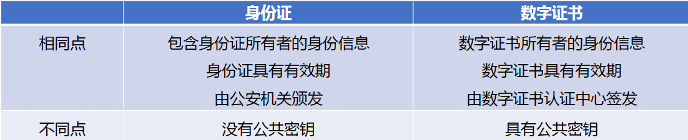

数字证书比身份证只多了一个**公共密钥（简称公钥）**。数字证书提供的是网络上的身份证明。因此，也有人称数字证书是“网络身份证”。

#### 数字证书的内容

最简单的证书包含一个公开密钥、名称以及证书授权中心的数字签名。一般情况下证书中还包括密钥的有效时间，发证机关(证书授权中心)的名称，该证书的序列号等信息，证书的格式遵循x.509国际标准，证书内容如下：

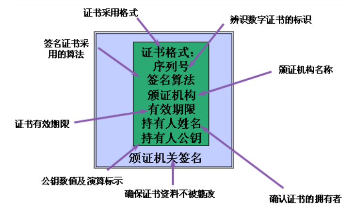

#### 数字证书的原理


数字证书采用公钥机制，证书颁发机构提供的程序为用户产生一对密钥，一把是公开的公钥，它将在用户的数字证书中公布并寄存于数字证书认证中心。另一把是私人的私钥，它将存放在用户的计算机上。

#### 数字证书的工作过程

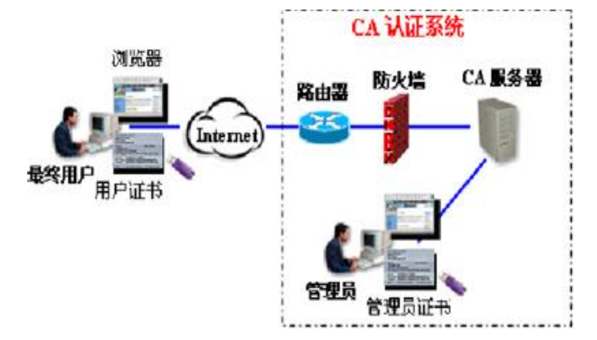

#### 数字证书颁发过程

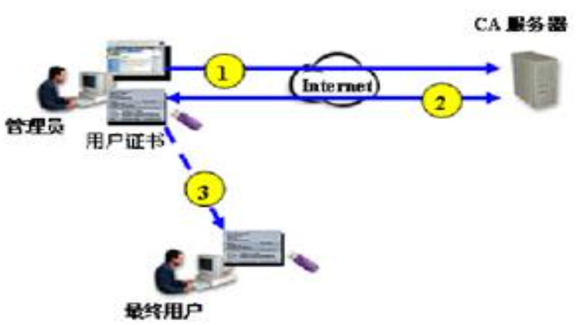

#### 常用的数字证书类型

**个人数字证书**：个人数字证书中包含证书持有者的个人身份信息、公钥及CA中心的签名，它就像我们日常生活中使用的身份证一样，在网络通讯中标识证书持有者个人身份的电子身份证书。

**WEB服务器证书**：是Web   Server与用户浏览器之间建立安全连接时所使用的数字证书。

**设备身份证书**：设备身份证书中包含设备信息、公钥及CA中心的签名，在网络通讯中标识和验证设备的身份以保证与其他服务器或客户端通信的安全性。无线应用证书：无线应用证书用于无线通讯用户的身份识别和信息安全。

#### 数字证书的签发机构

提供电子认证服务的机构一般称为数字证书认证中心（Certificate Authority）数字证书是数字证书认证中心（CA）签发的，CA作为第三方认证机构具有三个特性：

权威性：是由国家主管部门批准的；

公正性：独立于交易双方以外，不参与双方利益；

可信性：具有与提供电子认证服务相适应的专业技术人员和管理人员；具有与提供电子认证服务相适应的资金和经营场所；具有符合国家安全标准的技术和设备；具有国家密码管理机构同意使用密码的证明文件和法律、行政法规规定的其他条件。

#### 数字证书的基本功能

数字证书主要有以下四大功能：

•信息的保密性；

•网络合法身份的确认性: 能方便而可靠地确认网络中对方合法身份是网络信息交换的需要；

•完整性: 数字证书具有签名验证和对电子文件进行加密的功能，可以通过验证方式确认电子信息是否被修改过；

•不可抵赖性；

证书的获取：只要是具有公民权的个人、合法设立的单位、组织机构或网络设备、软件系统均可向CA中心申请数字证书。

#### 数字证书的应用

数字证书的应用范围：

•网银系统；

•网上报税；

•网上公文传输；

•网络身份认证；

•电子商务；

•电子政务；

•安全电子邮件等。

数字证书在电子政务中的应用：

CA中心提供的数字证书应用范围涉及公共事业、金融服务业、工商、税务、海关、质量技术监督、政府行政办公、政府采购、检验检疫、车辆管理、教育科研单位、社保、保险、医疗卫生、企事业单位内部办公等网上业务应用系统。

同时数字证书可用于政府网上行政文件的上传下达及加密、签名等；也可运用数字证书来保证政府网站的安全浏览；还可以将企业代码证、企业营业执照和企业数字证书一体化，为企业网上年检、网上报税、网上报关等网上作业奠定安全的基础。

数字证书在电子商务中的应用：

CA中心提供的数字证书可用于网上购物、企业与企业（B to B）和企业对个人（B  to C）以及个人对个人（C to C）的电子贸易、网上合同的签定、安全电子邮件、网上证券交易、网上银行等电子商务活动中加密信息以及进行数字签名.

同时CA中心所发放的企业及个人数字证书适用于企业及个人进行电子邮件的安全收发、企业及个人网站的安全浏览和网上交易及查询等方面的安全认证和加密等。

### 3-8 链上通信：P2P传播机制

#### P2P网络

P2P不是我们认知的P2P网贷，**在区块链技术中叫对等网络，或者叫做点对点网络**。所谓的对等，指的是参与网络的节点权限、地位、职责都是平等的，不存在强中心者。因此，从字面上看，P2P网络可以理解为对等计算或对等网络。国内一些组织将P2P理解成“点对点”或者“端对端”，计算机学者则统一称为对等网络（Peer-to-peer networking）或对等计算（Peer-to-peer computing），我们可以将P2P定义为：网络的参与者共享他们所拥有的一部分硬件资源（CPU处理能力、GPU显卡能力、内存资源等），这些共享资源通过网络提供服务和内容，能被其它对等节点（Peer）直接访问而无需经过中心。在此网络中的参与者既是资源、服务和内容的提供者（Server），又是资源、服务和内容的获取者（Client）。

P2P 网络不同于传统的客户端/服务端(client/server,C/S)结构，P2P 网络中的每个节点都可以既是客户端也是服务端，因此也不适合使用HTTP 协议进行节点之间的通信，一般都是直接使用Socket 进行网络编程。

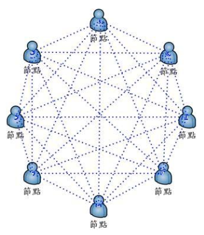

#### P2P技术原理

P2P技术属于覆盖层网络(Overlay Network)的范畴，是相对于客户机/服务器(C/S)模式来说的一种网络信息交换方式。在C/S模式中，数据的分发采用专门的服务器，多个客户端都从此服务器获取数据。这种模式的优点是：数据的一致性容易控制，系统也容易管理。但是此种模式的缺点是：因为服务器的个数只有一个(即便有多个也非常有限)，系统容易出现单一失效点；单一服务器面对众多的客户端，由于CPU能力、内存大小、网络带宽的限制，可同时服务的客户端非常有限，可扩展性差。P2P技术正是为了解决这些问题而提出来的一种对等网络结构。在P2P网络中，每个节点既可以从其他节点得到服务，也可以向其他节点提供服务。这样，庞大的终端资源被利用起来，一举解决了C/S模式中的两个弊端。

P2P网络有3种比较流行的组织结构，被应用在不同的P2P应用中。

①分布式哈希表(DHT): 是一种功能强大的工具，它的提出引起了学术界一股研究DHT的热潮。虽然DHT具有各种各样的实现方式，但是具有共同的特征，即都是一个环行拓扑结构，在这个结构里每个节点具有一个唯一的节点标识(ID)，节点ID是一个128位的哈希值。每个节点都在路由表里保存了其他前驱、后继节点的ID。如图所示。通过这些路由信息，可以方便地找到其他节点。这种结构多用于文件共享和作为底层结构用于流媒体传输。

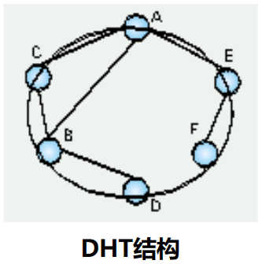

②树形结构：P2P网络树形结构如图所示。在这种结构中，所有的节点都被组织在一棵树中，树根只有子节点，树叶只有父节点，其他节点既有子节点也有父节点。信息的流向沿着树枝流动。最初的树形结构多用于P2P流媒体直播。

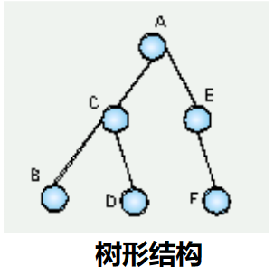

③网状结构：网状结构如图所示，又叫无结构。顾名思义，这种结构中，所有的节点无规则地连在一起，没有稳定的关系，没有父子关系。网状结构为P2P提供了最大的容忍性、动态适应性，在流媒体直播和点播应用中取得了极大的成功。当网络变得很大时，常常会引入超级节点的概念，超级节点可以和任何一种以上结构结合起来组成新的结构，如KaZaA[6]。

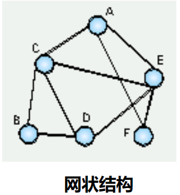

#### 去中心化

区块链中加入P2P网络，使得区块链中的每一个节点都是完全对等的，从而达到去中心化的目的。去中心化，不是不要中心，而是由节点来自由选择中心、自由决定中心。简单地说，中心化的意思，是中心决定节点。节点必须依赖中心，节点离开了中心就无法生存。在去中心化系统中，任何人都是一个节点，任何人也都可以成为一个中心。任何中心都不是永久的，而是阶段性的，任何中心对节点都不具有强制性。

##### 什么是去中心化

节点与节点之间的影响，会通过网络而形成非线性因果关系。这种开放式、扁平化、平等性的系统现象或结构，我们称之为去中心化。很多人以为去中心化是不要中心，事实恰恰相反。去中心化，不是不要中心，而是由节点来自由选择中心、自由决定中心。

中心化的意思，是中心决定节点。节点依赖中心，节点离开了中心就无法生存。而中心化，是节点决定中心，中心依赖节点，中心离开了节点就无法存在

去中心化系统中，任何人都是一个节点，任何人也都可以成为一个中心。任何中心都不是永久的，而是阶段性的，任何中心对节点都不具有强制性

##### 去中心化的价值

容错力：中心化一旦中心出现问题，其他节点就容易全线崩溃。而中心化的系统不太可能出现意外，因为它是依赖其他节点，而其他节点不可能一起出问题

抗攻击力：去中心化的系统会让，被攻击成本更高，因为它缺少敏感的中心点，而中心点则更容易被低的成本攻击，原因就是大家应该都懂，攻击中心就可能完全崩溃，这也是越来越多投资者希望去中心化技术变得更加成熟

防勾结串通：去中心化系统中的参与者难以牺牲其他参与者为代价，而密谋使自己获利。数字资产交易所经常出现平台与庄家勾结割韭菜，如果是去中心化的交易所，那就大大降低了这种可能。事实上去中心化的交易所更加民主，用户会更加倾向于去中心化的交易所

##### 容错力

容错性的核心，其实就是“可以承受出现错误的能力，以此降低系统崩溃的概率”。一台计算机出现故障的概率，和十台计算机的其中五台同时出现故障的概率，哪一个更大？显然是前者。这其实也是分散风险的一种方式，在现实生活中，这种容错能力已经得到了广泛的应用，比如喷气发动机、备用发电机，以及医院、军事的基础设施、多样化金融投资组合、计算机网络等等。但是，去中心化的这种容错能力虽然很有效、也很重要，但它有时远不如一个简单的数学模型来得有用。原因就在于“共模故障

四个喷气发动机比起一个喷气发动机来看确实更不容易出故障，但如果这四个喷气发动机都是同一个工厂制造的呢？或者说，这四个喷气发动机都是被同一个不合格的员工制作的呢？这就是共模故障。

##### 抗攻击力

在纯经济模型中，去中心化其实并不重要。如果你创建了一个“一旦发生51%攻击，验证者就会损失5000万美元”的协议，那这个验证者是由一家公司还是由100家公司控制并不重要。5000万美元是保证这个协议的经济安全的边际成本，那么5000万美元就是5000万美元。事实上，博弈论还会告诉我们，中心化系统甚至可以最大化这种经济安全边际成本的概念（现有的区块链的交易选择模型也反映了这一观点，因为矿工/区块提出者将交易打包到区块中，实际上正是一个非常迅速的轮换独裁的过程）。

但如果是在一个更丰富的经济模型中，特别是如果这个经济模型里存在胁迫的可能性（或者说针对节点的目标DOS 攻击），那么，去中心化就会变得非常重要。当一个人的生命安全受到威胁时，5000万美元对他而言就是身外之物，你可以很容易抢走他的钱，但如果这5000万美元是十个人分散持有的，那么你必须威胁勒索的人数，瞬间就飙到了10倍，而且这10倍的工作量，还要在同一时间里完成，这对任何一个抢劫犯来说，都是噩梦。

##### 防勾结串通

在区块链协议里，建立共识安全背后的数学原理和经济学原理，通常也依赖于这种“反勾结”的设定。“反勾结”就是尽可能避免节点之间相互产生协调，换句话说，它假设一个区块链网络是由许多独立决策的节点组成的。区块链的拥护者相信区块链更安全，因为区块链网络中的任何个体都不能任意去改变协议本身的规则。但如果软件和协议的开发者都服务于同一家公司、同属于同一个家族、都在同一个办公大楼上班，这种情况下其实是很难防范的。要真正保证安全，最关键的一点是防止系统变成一个自私自利的集权垄断体。因此，如果一个区块链网络越松散，它们就越难相互勾结在一起，也就安全

#### 传播机制

所谓信息的传播机制，就是信息传播的形式、方法以及流程等各个环节，包括传播者、传播途径、传播媒介以及接收者等构成的统一体。信息传播机制就是对信息从信息的发布者到信息的接受者过程渠道的总体概括。例如：微信信息传播的本质是它把人的社会关系引入到信息传播中，使社会关系成为影响信息传播效果的一个重要因素。它体现了网民的社会关系和这背后价值的、心理的各种不同层面的文化认同。微博传播活动也成为网民发展社会网络、获得社会资本的一种重要方式。

对于区块链来说，链上的信息传播，也需要具备传播者、传播途径、传播媒介以及接受者四个基本元素。

①所谓的传播者是链上交易的发起人，一般是一个区块链地址，也就是发起地址；

②传播途径是区块链的P2P组网机制，通过分布式的网络来完成信息的传播；

③传播媒介是区块链上的多有节点，交易信息需要经过每一个节点的验证和打包，才能最终达到接收者的地址里；

④接收者是接收该信息的区块链地址。区块链比较特殊，对于接受者地址可以是一个明确的区块链地址，也可以是空的地址，空的地址就代表了这条交易数据是部署的智能合约。

区块链的传播是有一定的规律的，如图所示，这是区块链完全去中心化的一种结构。当其中一个节点进行数据传输时，先将信息传给与自己相连的几个节点，这几个节点接收到信息之后，再往与自己相连的节点进行传输。按照这种传输的模式，将数据传输到全网。


### 3-9 交易先后顺序：时间戳

时间戳的定义：**时间戳是指格林威治时间1970年01月01日00时00分00秒(北京时间1970年01月01日08时00分00秒)起至现在的总毫秒数**。

一般来说，时间戳是一段完整的、可验证的数据，它表示在某个特定时间点存在数据。通常是一个字符序列，唯一地标识某一刻的时间。通俗的讲，时间戳是一份完整的可验证的时间数据证明，它能够证明一份数据存在或发生于哪个时间点。

时间戳的分类：

自建时间戳：此类时间戳是通过时间接收设备（如GPS,CDMA,北斗卫星）来获取时间到时间戳服务器上，并通过时间戳服务器签发时间戳证书。此种时间戳可用来企业内部责任认定，在法庭认证是并不具备法律效力。因其在通过时间接收设备接收时间存在被篡改的可能，故此不能作为法律依据。

可信时间戳：它是由我国中科院国家授时中心与北京联合信任技术服务有限公司负责建设的我国第三方可信时间戳认证服务。由国家授时中心负责时间的授时与守时检测，因其守时监测功能而保障时间戳证书中的时间的正确性和不被篡改。获取时间戳平台有“大众版权保护平台”，可与我国中科院授时中心时间同步。

#### 时间戳的法律效力

自建时间戳不具备法律效力；

可信时间戳即由国家法定时间源来负责保障时间的授时和守时监测，任何机构包括时间戳中心自己不能对时间进行修改以保障时间的权威，只有这样产生的时间戳才具有法律效力；

注：联合信任时间戳服务中心是国家授时中心和联合信任共同建设的我国唯一权威的可信时间戳服务机构（TSA）。中心的建设和运营完全按照国际和国家有关标准，对外签发具有法律效力的可信时间戳，用以证明电子数据的原始性和内容完整性。

#### 时间戳的管理及安全

时间戳的管理：**《时间戳规范》的标准中规定了时间戳的保存、时间戳的备份、时间戳的检索、时间戳的删除和销毁、时间戳的查看和验证**。

时间戳的保存：包括在TSA （时间戳机构）方的保存和在用户方的保存。在TSA方的保存涉及到时间戳数据库的管理和时间戳。记录应当包含的信息项，一般最少应包括入库时间、序列号、完整编码等。时间戳在用户方一般由用户自行保存。

时间戳的备份：在标准中规定了一系列要求，如定期备份、备份介质等。

时间戳的检索：在标准中规定了至少三种检索方式，包括分别按照入库时间、序列号、完整编码检索。

时间戳的删除：当TSA系统由于内部错误或者外部攻击导致产生错误的时间戳时，标准规定了删除时应遵循的要求。在确定某时间戳已经丧失其价值后，标准规定了销毁时应遵循的要求。

时间戳的查看和验证：在标准中规定了TSA应该给用户提供一个方便安全的方法查看其颁发的时间戳，例如提供一个查看软件等。TSA还应该给用户提供一个方便安全的方法对其颁发的时间戳进行验证，例如提供一个验证软件或者通过互联网验证等。

时间戳的安全：由于时间戳在电子取证中的重要作用及其法律地位，时间戳系统必须拥有极高的安全级别，安全保护应包括物理环境安全和软件安全。物理环境安全包括机房安全、设备安全和记录介质安全。**软件安全包括运行环境、可信时间源、签名系统、时间戳数据库和审计**。其中，审计对于错误的查找和责任的跟踪具有重要作用，标准中详细的规定了审计数据产生、审计查阅、审计事件存储、可信时间、审计日志签名的要求。对于证书和密钥的管理应按国家密码管理部门相关标准与规定执行。

#### 时间戳的生成方法及原理

时间戳的生成方法：

目前可信时间戳已成为确立电子数据法律效力的重要技术之一，可信时间戳的生成方法如下：

1、提取用户电子数据摘要（Hash）；

2、用户题出时间戳请求。Hash值被传递给时间戳服务器；

3、时间戳服务器采用权威时间源，由国家授时中心负责授时与守时；

4、由可信第三方时间戳服务机构对电子数据摘要和权威时间记录进行数字签名生成时间戳；

时间戳的工作示意图如下：

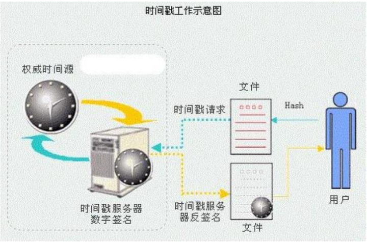

通过可信时间戳可确定电子文件生成的精确时间，并防止电子文件被篡改，为电子数据提供可信的时间证明和内容真实性、完整性证明，作为证据使用具有权威性和可信赖性，符合《电子签名法》要求，在法律上具备证明效力。

#### 时间戳的最新规定

最高人民法院印发《最高人民法院关于互联网法院审理案件若干问题的规定》（以下简称《规定》），并自2018年9月7日起施行。

《规定》主要包括四方面内容，其中关于电子证据问题，规定中明确了：“当事人提交的电子数据，通过电子签名、可信时间戳、哈希值校验、区块链等证据收集、固定和防篡改的技术手段或者通过电子取证存证平台认证，能够证明其真实性的，互联网法院应当确认。”这为当事人提交证据提供了极大的便利，减轻了举证的责任。

#### 时间戳的意义

对于数据而言，如果每条数据都带有一个真实可信的时间戳(这条数据产生的真实时间点)，这样的造假行为就比较难奏效，因为假数据的时间戳一般都是最近的，那么这个时间戳对我们来说就有了如下的意义：

•我们有了真正可以信任的历史数据；

•这些数据因为可信变得更有价值，可以在应用之外被其他应用或者分析工具使用；

•我们可以基于这些可信的历史记录生成信用；

•我们真正进入一个信用社会。

#### 区块链中的时间戳

在区块链系统中，每一个新区块生成时，都会被打上时间戳，最终依照区块生成时间的先后顺序相连成区块链，每个独立节点又通过P2P网络建立联系，这样就为信息数据的记录形成了一个去中心化的分布式时间戳服务系统

例如：在比特币网络中，大约每10分钟产生一个新的区块，并盖上时间戳，广播发送给全网各个节点，这样每个节点手里都有一份这个区块的所有信息，包括时间戳，这就形成了一个分布式时间戳。

区块链与时间戳示意图如下：

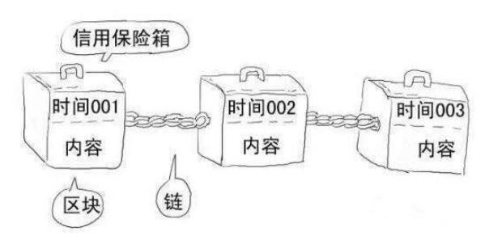

时间戳的这种设计，使得更改一条记录的困难程度按时间的指数倍增加，越老的记录越难更改，区块链运行时间越久，篡改难度越高。具体原因通过区块的学习可以得知，这里不再赘述。

### 3-10 实力挖矿：POW共识机制

#### POW共识机制

POW共识机制POW（Proof-of-work），工作量证明最早是一个经济学名词，它是指系统为达到某一目标而设置的度量方法。简单理解就是一份证明，用来确认你做过一定量的工作。监测工作的整个过程通常是极为低效的，而通过对工作的结果进行认证来证明完成了相应的工作量，则是一种非常高效的方式

POW系统中一定有两个角色，工作者和验证者，他们需要具有以下特点：

①工作者需要完成的工作必须有一定的量，这个量由工作验证者给出

②验证者可以迅速的检验工作量是否达标

③工作者无法自己"创造工作"，必须由验证者发布工作

④工作者无法找到很快完成工作的办法。

在1999年，Markus Jakobsson and Ari Juels两人将pow概念引入计算机体系，设计系统用以抵挡拒绝服务攻击和网络爬虫，后来在反垃圾邮件中被广泛使用。其设计理念是一个正常用户写一封邮件是需要一定的时间，而发送垃圾邮件者是无法接受这个等待的时间，如果pow系统能够使垃圾邮件发送者需要更多的时间来发送邮件，就可以增大他们的成本，起到抵挡攻击的作用。

它要求发起者进行一定量的运算，也就意味着需要消耗计算机一定的时间。这个概念由Cynthia Dwork和Moni Naor1993年在学术论文中首次提出。而工作量证明（POW）这个名词，则是在1999年Markus Jakobsson 和Ari Juels的文章中才被真正提出。

哈希运算是一种最常见的工作量证明机制，它是亚当·贝克（Adam Back）在1997年发明的，用于抵抗邮件的拒绝服务攻击及垃圾邮件网关滥用。在比特币之前，哈希现金被用于垃圾邮件的过滤，也被微软用于hotmail/exchange/outlook等产品中（微软使用一种与哈希现金不兼容的格式并将之命名为电子邮戳）。

该机制主要利用HASH运算的复杂度，通过给定的初始值，通过简单的值递增规律，利用HASH碰撞原理，直到找到特定的碰值，可以通过调节碰撞值得长度，实现对于工作量的调节（碰撞值越长，所需要的运算量越大）。

比特币网络上通过POW机制竞争记账权，由于记账是有奖励的，每次记账都可以给自己凭空增加一定数量的比特币，因此就出现大家争相记账，大家一起记账就会引起问题：出现记账不一致的问题。

POW机制解决这个问题的规则如下：一段时间内（10分钟左右，具体时间会与密码学难题难度相互影响）只有一人可以记账成功通过解决密码学难题（即工作量证明）竞争获得唯一记账权，其他节点复制记账结果。


比特币在Block的生成过程中使用了POW机制，一个符合要求的Block Hash由N个前导零构成，零的个数取决于网络的难度值。要得到合理的Block Hash需要经过大量尝试计算，计算时间取决于机器的哈希运算速度。当某个节点提供出一个合理的Block Hash值，说明该节点确实经过了大量的尝试计算，当然，并不能得出计算次数的绝对值，因为寻找合理hash是一个概率事件。

当节点拥有占全网n%的算力时，该节点即有n/100的概率找到Block Hash。工作证明机制看似很神秘，其实在社会中的应用非常广泛。例如，毕业证、学位证等证书，就是工作证明，拥有证书即表明你在过去投入了学习与工作。生活大部分事情都是通过结果来判断的。

在进行工作量证明之前，记账节点会做进行如下准备工作：

a.收集广播中还没有被记录账本的原始交易信息

b.检查每个交易信息中付款地址有没有足够的余额

c.验证交易是否有正确的签名

d.把验证通过的交易信息进行打包记录

e.添加一个奖励交易：给自己的地址增加12.5比特币

如果节点争夺记账权成功的话，就可以得到12.5比特币的奖励。POW机制为了保证10分钟左右只有一个人可以记账，就必须要提高记账的难度，使得Hash的结果必须以若干个0开头。同是为了满足这个条件，在进行Hash时引入一个随机数变量。

举例：

Hash(上一个Hash值，交易记录集) = 456635BCD

Hash(上一个Hash值，交易记录集，随机数) = 0000aAGHJKSDX

改变Hash的原始信息的任何一部分，Hash值也会随之不断的变化，因此在运算Hash时，不断的改变随机数的值，总可以找的一个随机数使的Hash的结果以若干个0开头（把这个过程称为猜谜），率先找到随机数的节点就获得此次记账的唯一记账权。

POW工作量证明流程图：

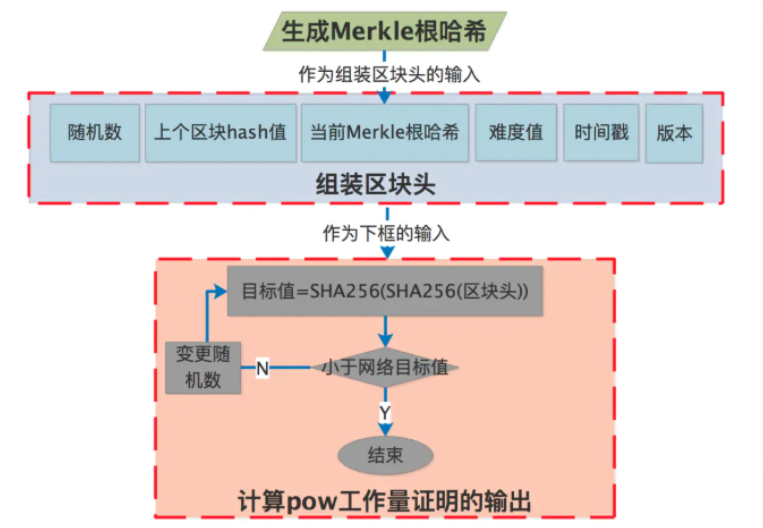

从流程图中看出，pow工作量证明的流程主要经历三步：

1.生成Merkle根哈希

生成Merkle根哈希，即节点自己生成一笔筹币交易，并且与其他所有即将打包的交易通过Merkle树算法生成Merkle根哈希，所以为什么说区块是工作量证明的三要素之一。

2.组装区块头

区块头将被作为计算出工作量证明输出的一个输入参数，因此第一步计算出来的Merkle根哈希和区块头的其他组成部分组装成区块头。

#### POW共识机制-区块头部信息构成

Block头部信息的构成：

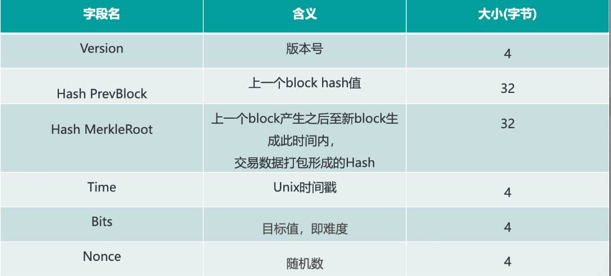

看一下真实的block hash的计算过程（下面采用高度为125552的block数据为例）：

```php
php
$header_hex = "01000000" . // version
// previous block hash
"81cd02ab7e569e8bcd9317e2fe99f2de44d49ab2b8851ba4a308000000000000"
// merkle root hash of transactions in this block
"e320b6c2fffc8d750423db8b1eb942ae710e951ed797f7affc8892b0f1fc122b"
// Time
"c7f5d74d" .
// Bits (Difficulty)
"f2b9441a"
// Nonce
"42a14695";
$header_bin = pack("H*", $header_hex); // hex to bin
$h = hash('SHA256', hash('sha256', $header_bin, true), true); // double sha256
echo bin2hex($h), "\n";
// output: 1dbd981fe6985776b644b173a4d0385ddclaa2a829688d1e0000000000000000
echo bin2hex(strrev($h)), "\n";
// output: 00000000000000001e8d6829a8a21adc5d38d0a473b144b6765798e61f98bd1d
```

该计算过程简单明了：首先将数个字段合并成一块数据，然后对这块数据进行双SHA256运算。

Block的产量为大约每两周2016个，即每10分钟一块。该规则在每个节点的代码里都固定了。

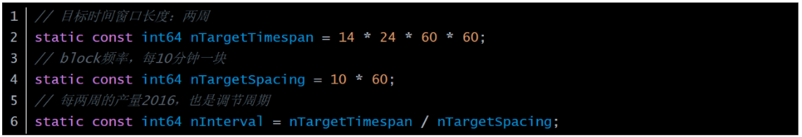

但由于实际算力总是不断变化的（目前一直是快速上升的），所以需根据最近2016个块的耗费时间来调整难度值，维持每10分钟一个block的频率。

#### POW共识记账

上面讲解的是单节点工作量证明流程，有了这个计算流程，我们就得将其使用起来。在比特币平台中，中本聪就是运用的POW工作量证明来使全网节点达到51%及以上的共识记账，以下将介绍pow工作量证明共识是如何记账的？

首先，客户端产生新的交易，向全网广播

第二，每个节点收到请求，将交易纳入区块中

第三，每个节点通过第三章中描述的pow工作量证明

第四，当某个节点找到了证明，向全网广播

第五，当且仅当该区块的交易是有效的且在之前中未存在的，其他节点才认同该区块的有效性

第六，接受该区块且在该区块的末尾制造新的区块

POW工作量证明共识机制时序图：

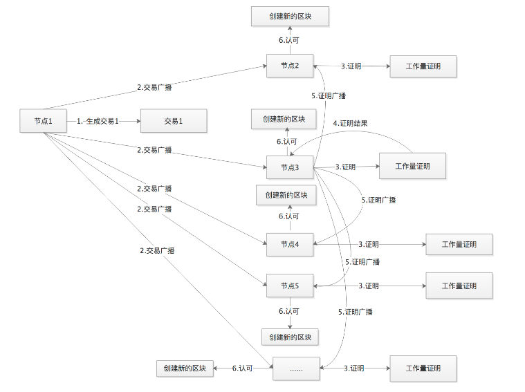

通过上面的分析，我们可以得出

在节点成功找到满足的Hash值之后，会马上对全网进行广播打包区块，网络的节点收到广播打包区块，会立刻对其进行验证。

如果验证通过，则表明已经有节点成功解迷，自己就不再竞争当前区块打包，而是选择接受这个区块，记录到自己的账本中，然后进行下一个区块的竞争猜谜。网络中只有最快解谜的区块，才会添加的账本中，其他的节点进行复制，这样就保证了整个账本的唯一性。

假如节点有任何的作弊行为，都会导致网络的节点验证不通过，直接丢弃其打包的区块，这个区块就无法记录到总账本中，作弊的节点耗费的成本就白费了，因此在巨大的挖矿成本下，也使得矿工自觉自愿的遵守比特币系统的共识协议，也就确保了整个系统的安全。

使用PoW的项目有：比特币、以太坊的前三个阶段（Frontier前沿、Homestead家园、Metropolis大都会）。以太坊的第四个阶段Serenity宁静将采用权益证明机（POS）。POW共识机制

POW 工作量证明机制 - 优点：

1）**去中心化**，将记账权公平的分派到其他节点。你能够获得的币的数量，取决于你挖矿贡献的有效工作

2）**安全性高，破坏系统需要投入极大的成本**，如果想作弊，要有压倒大多数人的算力（51%攻击）

POW 工作量证明机制 - 缺点：

1）挖矿造成大量的资源浪费，目前bitcoin已经吸引全球大部分的算力，其它再用Pow共识机制的区块链应用很难获得相同的算力来保障自身的安全。

2）网络性能太低，需要等待多个确认，容易产生分叉，区块的确认共识达成的周期较长（10分钟），现在每秒交易量上限是7笔。

3）PoW共识算法算力集中化，慢慢的偏离了原来的去中心化轨道。从比特币扩容之争可以看到，算力高的大型矿池是主人，而持币的人没有参与决定的权利，比特币分叉出很多儿子，即将失去“去中心化”的标签。

### 3-11 权益挖矿：POS共识机制

#### POS共识机制

PoW机制存在明显的弊端。一方面，PoW的前提是，节点和算力是均匀分布的，因为通过CPU的计算能力来进行投票，拥有钱包（节点）数和算力值应该是大致匹配的，然而随着人们将CPU挖矿逐渐升级到GPU、FPGA，直至ASIC 矿机挖矿，节点数和算力值也渐渐失配。另一方面，PoW太浪费了。比特币网络每秒可完成数百万亿次SHA256计算，但这些计算除了使恶意攻击者不能轻易地伪装成几百万个节点和打垮比特币网络，并没有更多实际或科学价值。

有鉴于此，人们提出了一些工作量证明的替代者。**权益证明（Proof of Stake，PoS）**就是其中的一种方法。权益证明要求用户证明拥有某些数量的货币（即对货币的权益），点点币（Peercoin）是首先采用权益证明的货币，尽管它依然使用工作量证明挖矿。

点点币在SHA256的哈希运算的难度方面引入了币龄的概念，使得难度与交易输入的币龄成反比。在点点币中，币龄被定义为币的数量与币所拥有的天数的乘积，这使得币龄能够反映交易时刻用户所拥有的货币数量。

点点币的权益证明机制结合了随机化与币龄的概念，未使用至少30天的币可以参与竞争下一区块，越久和越大的币集有更大的可能去签名下一区块。然而，一旦币的权益被用于签名一个区块，则币龄将清为零，这样必须等待至少30日才能签署另一区块。同时，为防止非常老或非常大的权益控制区块链，寻找下一区块的最大概率在90天后达到最大值，这一过程保护了网络，并随着时间逐渐生成新的币而无需消耗大量的计算能力。

要理解POS的实现原理，我认为从pos的实现算法公式来理解是最为直观的，其公式为：

hash(block_header) =<target * coinage

币龄的计算：coinage = 币的个数*币的剩余使用时间

其中，coinage表示币龄，这将意味着，币龄越大，越容易得到答案。而其中币龄的计算是通过挖矿者拥有的币乘以每个币的剩下使用时间得到，这也将意味着拥有的币越多，也越容易得到答案。这样，pos解决了pow中浪费资源的问题，同时挖矿者不可能拥有全网51%的币，所以也解决了51%攻击的问题。

PoS协议的基本框架是按所有的参与者的持币量，去分配打包权和投票权。在PoS的系统里边打包和投票两件事是分开的，它也可以分开——PoW系统里这两个其实是一回事儿。分配完打包权以后，拿到打包权的人就有资格出一个候选区块。这个区块里面包含要处理的交易，并且有他自己的签名。候选区块并不意味着就会被加入共识，在广播候选区块以后还需要由那些有投票权的人去投票。

•基本思想：持币（股）=记账权

持币者直接或间接投票，投票权正比与持币数量

基本框架：

•按照参与者持有的币的数量分配打包权和投票权

•拥有打包权的参与者可以打包交易成候选块并广播

•拥有投票权的参与者可以对候选块投票

•获得多数投票支持的候选块被加入链上

•去中心化机制：

Ø选举和轮换委员会的机制

Ø检测和惩罚违规行为，例如一票多投、有票不投等

在这种新型区块里POS是一种特殊的交易称利息币(coinstake)（依据BTC当中的特殊交易：币基(coinbase)而命名）。在利息币(coinstake) 交易中，区块持有人可以消耗他的币龄获得利息，同时获得为网络产生一个区块和用POS造币的优先权。利息币的第一个输入被称为核心（Kernel），并需要符合某一Hash目标协议。由此POS区块的产生具有随机性，这一过程与POW相似。但有一个重要的区别在于，（POS）随机散列运算是在一个有限制的空间里完成的（具体来说为1 hash/未消费钱包的输出*秒），而不是象POW那样在无限制的空间里寻找，因此无需大量的能源消耗。

权益核心(kernel)所要符合的随机散列目标是以在核心中消耗的币龄的目标值（币*天coin-day）（这与BTC的POW是不同的，BTC的每个节点都是相同的目标值）。因此核心消耗的币龄越多，就越容易符合目标协议。例如，如果李明的钱包里放了100个PPC，而且1年都没有动，那么他可望在2天内产生一个权益核心（个人理解为POS的区块）；同理，如果韩梅有200个PPC，也放了1年没有使用，那么她可能在1天内就能产生一个权益核心。在我们的POS及POW设计中，随机散列的目标值都是持续调整的。这与BTC约每两周一次调整不同。主要目的是为避免采矿产出的突然波动。

#### POS共识机制-缺陷

•缺陷一：我们再从pos的实现算法公式去看，币龄的计算公式中，假如一开始挖矿，只有创始区块中有币，也就是说其他矿机是没法参与挖矿的，因为币的个数这个值对他们来说永远是零，这也就是pos机制的缺陷之一币无法发行的问题。

•缺陷二：同样是从pos的实现算法公式可以分析到，币龄其实就是时间，一旦挖矿者囤积一定的币，很久很久之后发起攻击，这样他也将很容易拿到记账权，所以我们得给每个币设计一个时间上限。

•缺陷三：设计时间上限后，虽然解决掉了部分挖矿者囤积币的缺陷，从公式中仍然看到还会面临一个问题，也就是币的数量这个因素还是会影响我们拿到记账权，很多挖矿者还会囤积代币，给代币造成流通上的缺陷。目前有些平台引入币龄按时间衰弱的方案来解决这一缺陷（例如：瑞迪币）。

•缺陷四：接下来让我们来看看pos共识机制还有哪方面的不足，即使上面的各种缺陷都多少有些解决方案，但例如挖矿者挖一段时间后离线。此时，时间将不纳入币龄减弱计算，这样，挖矿者通过离线时间长来囤积挖矿，同样面临灾难。

#### POS共识机制-发展历程

由于pos存在以上四大缺陷，所以pos的发展历程经历了三个版本，即pos1.0、pos2.0以及pos3.0，其中pos2.0在算法公式中使用的是币的数量，这样，上述缺陷二到四就不再是问题，可这样以后却导致了pos共识机制面临了无成本利益的问题（即nothing at stake）,这也将意味着很容易产生分叉。什么是无成本利益关系问题

我们可以先模拟下这种场景，如下图所示：

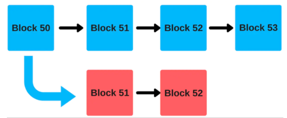

假设我们处在上面的这种情况下，有一条蓝色的主链和一条红色的从主链中分出来的链条，如何禁止一个恶意的矿工在红色区块上挖矿然后推动一次硬分叉（Hard Fork）呢？

在一个工作量证明系统上，这一风险是可以被减轻的。

假设恶意矿工想在红色链上挖矿。即便她投入了她所有的哈希算力，也不会有任何矿工加入她在新链上挖矿。每个其他人都将继续在蓝色链上挖矿，因为在最长的链上挖矿收益更可观，而且没有风险。

记住，工作量证明在资源方面是非常昂贵的。对一个矿工来说，花费许多资源在一个将会被网络拒绝的区块上是没有任何意义的。因此，链分裂在一个工作量证明系统中是被避免了的，因为攻击者将不得不付出大量金钱。

但是，当你把这种情形放到到权益证明下的时候，事情看起来就有些不一样了。如果你是一个验证者，你可以简单地把钱投到红蓝两条链上，完全无需担心间接的不良后果。不管发生什么事，你都总是可以赢，不会失去任何东西，不管你的行为有多恶意。

这就是所谓的“无成本利益关系（Nothing at Stake）”问题，也是以太坊必须解决的问题。他们需要一种协议，可以实行权益证明，同时减少“无成本利益关系”问题。

#### POS共识机制-Casper协议

引入casper协议解决无成本利益关系问题

Csaper是以太坊选择实行的PoS协议，既然有人恶意去使得我们的区块链产生分叉，那么我们想方设法去对恶意制造者加以惩罚，这样不就可以解决我们说的无成本利益关系问题了吗？Csaper协议正式奔着这样的做法去实现的，那我们来看看Csaper是如何去做的呢？

①验证者押下一定比例的他们拥有的以太币作为保证金。

②然后，他们将开始验证区块。也就是说，当他们发现一个可以他们认为可以被加到链上的区块的时候，他们将以通过押下赌注来验证它。

③如果该区块被加到链上，然后验证者们将得到一个跟他们的赌注成比例的奖励。

④但是，如果一个验证者采用一种恶意的方式行动、试图做“无利害关系”的事，他们将立即遭到惩罚，他们所有的权益都会被砍掉。

正是利用了这样的对赌协议，帮我们对恶意制造者加以了惩罚，使得我们的区块链尽量保障不会产生分叉。

#### POS共识机制的优点

PoW与PoS最大的区别在于，PoW在算法复杂度足够高的前提下，基本不需要太多的节点间互相通讯和确认，对代码的实现要求极低。而PoS对于多节点间一致性验证、防伪等要求较高，但是很大程度上可以沿用传统一致性选举的思路进行一定程度的优化即可。

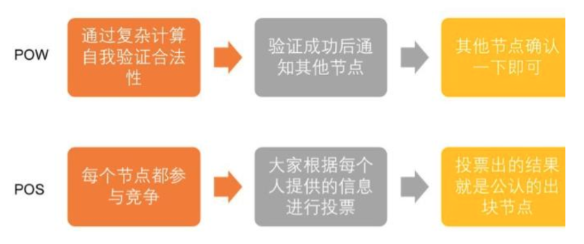

•POS共识机制的**优点**：

Ø**不需要耗费能源和硬件设备**；

Ø**缩短了区块的产生时间和确认时间，提高了系统效率**。

•POS共识机制的缺点：

Ø实现规则复杂，参杂了很多人为因素，**容易产生安全漏洞**；

Ø与POW共识机制一样，**随着确认次数的增加，达成共识的可能性也呈指数级增长**。

ØPOS共识机制的**致命弱点在于币龄依赖问题，攻击者在积累长时间币龄后，挖矿的难度大大降低**，容易对系统发起双花攻击。

### 3-12 董事会体制：DPOS共识机制

#### DPOS共识机制

PoW机制和PoS机制虽然都能有效地解决记账行为的一致性共识问题，但是现有的比特币PoW机制纯粹依赖算力，导致专业从事挖矿的矿工群体似乎已和比特币社区完全分隔，某些矿池的巨大算力俨然成为另一个中心，这与比特币的去中心化思想相冲突。

**股份授权证明机制（Delegated Proof of Stake，DPoS）**的出现正是基于解决PoW机制和PoS机制的这类不足。

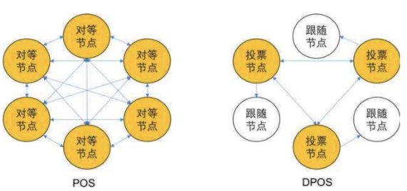

比特股（Bitshare）是一类采用DPoS机制的密码货币，它期望通过引入一个技术民主层来减少中心化的负面影响。

比特股引入了见证人这个概念，见证人可以生成区块，每一个持有比特股的人都可以投票选举见证人。得到总同意票数中的前N个（N通常定义为101）候选者可以当选为见证人，当选见证人的个数（N）需满足：至少一半的参与投票者相信N已经充分地去中心化。

见证人的候选名单每个维护周期（1天）更新一次。见证人然后随机排列，每个见证人按序有2秒的权限时间生成区块，若见证人在给定的时间片不能生成区块，区块生成权限交给下一个时间片对应的见证人。DPoS的这种设计使得区块的生成更为快速，也更加节能。

DPoS充分利用了持股人的投票，以公平民主的方式达成共识，他们投票选出的N个见证人，可以视为N个矿池，而这N个矿池彼此的权利是完全相等的。持股人可以随时通过投票更换这些见证人（矿池），只要他们提供的算力不稳定，计算机宕机，或者试图利用手中的权力作恶。

比特股还设计了另外一类竞选，代表竞选。选出的代表拥有提出改变网络参数的特权，包括交易费用、区块大小、见证人费用和区块区间。若大多数代表同意所提出的改变，持股人有两周的审查期，这期间可以罢免代表并废止所提出的改变。这一设计确保代表技术上没有直接修改参数的权利以及所有的网络参数的改变最终需得到持股人的同意。

为了帮助解释这个共识算法，我想假设3个块生产者A，B和C.因为共识需要2/3 + 1来解决所有情况，所以这个简化模型将假设生产者C被认为是攻击者。在现实世界中，将有21个或更多的块生产者。就像工作证明一样，一般规则是最长的链锁胜出。任何时候，一个诚实的同行看到一个有效的严格的更长的链条，它会从当前的分叉切换到更长的分叉。

我将通过示例展示DPOS如何在最可想象的网络条件下运行。这些例子应该可以帮助你理解为什么DPOS很健壮并且很难打破。

正常情况

在正常操作下，块生产者轮流每3秒产生一个块。假设没有人错过他们，那么这将产生最长的链条。块生产者在任何其他时间段生成块都是无效的。


少数派未连接分支

高达1/3的节点可能是恶意或故障，并创建一个少数叉。在这种情况下，少数叉将只产生一个块每9秒，而大多数叉将产生2块每9秒。再次，诚实的2/3多数将比少数人长。

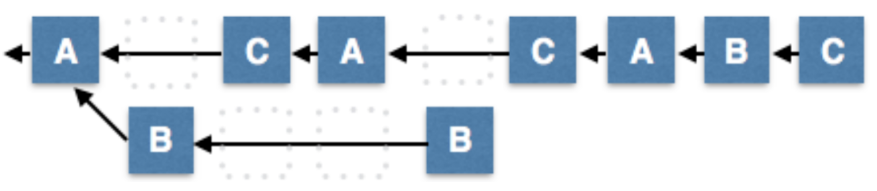

少数派未连接多分支

少数人可以尝试生产无限数量的分支，但是他们的所有分支都将比主要连锁店短，因为少数人的生产环节比大多数人慢。

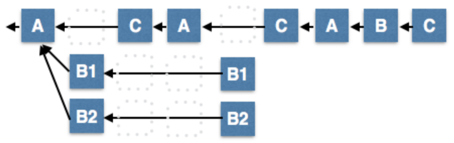

网络破碎

在某种情况下，网络完全有可能被分割很多个碎片，而没有大部分区块生产者。在这种情况下，最长的链将会成为最大的少数。当网络连接恢复后，较小的少数节点将自然地切换到最长的链，并且明确的共识将被恢复。

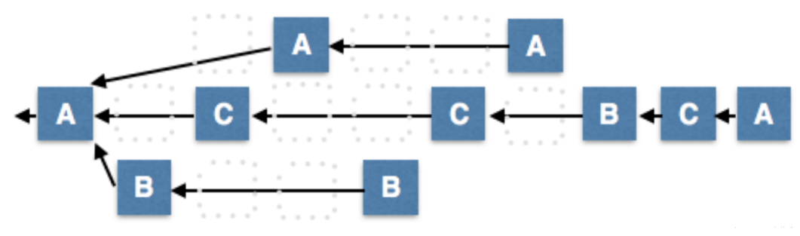

有可能有3个分支其中2个最长的分支是相同的长度。在这种情况下，在第三条最短链上的生产者会放弃原有链，重新加入两条最长链之一的网络。生产商的数量是奇数的，所以不可能长期保持相同。之后，我们将覆盖生产者洗牌，这将随机化生产顺序，以确保即使两个分支具有相同数量的生产者，分支将以不同速度增长。

连接少数派双生产

在这种情况下，少数B在他们的时隙产生了两个或更多个备选块。下一个计划生产者（C），可以选择从B产生的任何一个区块中建立。当这发生时，它将成为最长链，并且选择B1的所有节点将切换叉。不多的少数不良生产商试图传播的替代品并没关系，它们将永远不会成为超过一轮的最长链的一部分。

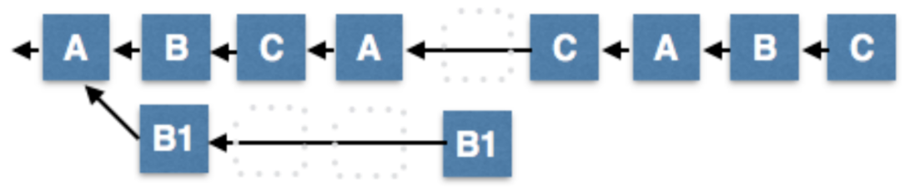

最后不可逆转的块

在网络碎片的情况下，多个分支可以在长时间内继续增长。从长远来看，最长的链将获胜，但观察者需要一种手段来确定何时的块，绝对是增长最快的链的一部分。这可以通过看到2/3 + 1的块生产商的确认来确定。

在下面的图中，B块已经被C和A所证实，A代表2/3＋1确认，因此我们可以推断，如果我们2/3的生产者诚实的话，没有其他的链可能更长。

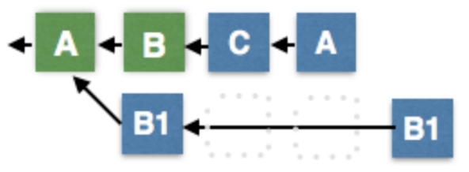

请注意，这个“规则”类似于Bitcoin的6个区块确认“规则”。一些聪明的个体可以设计一系列事件，其中两个节点可以在不同的最后不可逆块上结束。这种边缘情况需要攻击者对通信延迟进行完全控制，并利用该控制而不是一次，而是分开两分钟。如果发生这种情况，那么最长链的长期法则仍然适用。我们估计这种袭击的几率接近0，经济后果如此微不足道，因此不值得担心。

Ø缺少具体数量的生产者

如果不存在明确的生产者法定人数，则少数人有可能继续生产区块。在这些块中，利益相关者可以包括改变他们投票的交易。然后，这些投票可以选择一组新的生产者，并恢复块生产参与到100%。一旦这种情况发生，少数派链最终将超过所有其他链而不需要100%的参与。

在这个过程中，所有观察者都会知道网络状态在不断变化，直到一个链出现67%的参与。那些选择在这些条件下交易的人承担的风险与那些选择接受少于6个确认的人相似。他们这样做的知识，有一个小概率，共识可能最终定居在不同的分支。在实践中，这种情况比接受少于3比特币确认的块要安全得多。

Ø大多数生产者出错

如果大多数生产者变得腐败，那么他们可以生产无限数量的分支，每个分支似乎都会以2/3的多数确认推进。在这种情况下，最后的不可逆块算法会恢复到最长链算法。最长的链将是最大多数人批准的链，这将由少数剩余的诚实节点决定。这种行为不会持续很长时间，因为利益相关者最终会投票替换这些生产者。

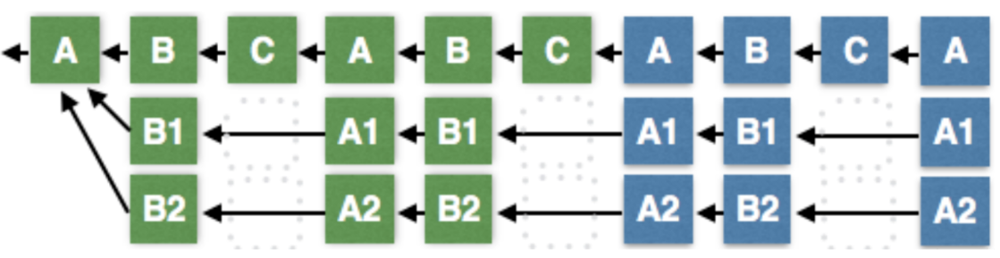

交易作为证明凭证（TaPoS）

当用户签署交易时，他们会根据对区块链状态的特定假设进行交易。这个假设是基于他们对近期区块的看法。如果最长链上的共识发生变化，那么它可能会使签署者同意交易时的假设无效。

对于TaPoS，所有事务都包含最近一个块的散列，并且如果该块不存在于链历史中，则被视为无效。任何在孤立分叉处签署交易的人都会发现交易无效并且无法迁移到主分叉。

这一过程的副作用是针对试图产生替代链的远程攻击的安全性。每个利益相关方在每次交易时都会直接确认区块链。随着时间的流逝，所有的障碍都得到了所有利益相关者的确认，而这是无法在伪造链中复制的。

Ø确定生产者洗牌

在所有的例子中，我们展示了块生产商的循环调度。实际上，块生产商在每一个n个块中洗牌，其中n是生产者的数量。这种随机化确保块生产商B不总是忽略块生产者A，并且在任何时候有多个分支相同生产者数（联盟）的关系最终被打破。

总结

在每一个可想象的自然网络出错下，DPOS是可靠的，即使面对少数生产商的腐败，也能保证安全。与一些竞争算法不同，当大多数生产者失败时，DPOS可以继续发挥作用。在这个过程中，社区可以投票来取代失败的生产商，直到它能恢复100%的参与。我知道没有其他一致性算法在这样高的和不同的故障条件下是鲁棒的。

最终，DPOS从选择块生产商的算法中获得显著的安全性，并验证节点是高质量和独特的个体。使用批准投票的过程确保即使有50%的活跃投票权的人也不能单独选择一个单独的制作人。DPOS的设计，以优化性能的名义条件100%参与诚实节点与强大的网络连接。这使得DPOS有能力在99.9%秒的平均时间内确认交易，同时以优雅、可检测的方式降级，这是微不足道的。

#### DPOS共识机制背后的逻辑

在DPoS共识算法中，选举的根本目的，是通过每个人的投票选举出社区里对项目发展和运行最有利的101个用户，这101个用户的服务器节点既可以高效维护系统的运转，而他们也会贡献自己的能力促进区块链项目的发展，这有点类似于我国的‘人民代表’制度（但是周期更短、效率更高）。通过这种方式，既达到了去中心化的选举共识，又保证了整个系统的运行效率和减少能源浪费。

区块链的正常运转依赖于见证人机制（witness），这些见证人是完全等价的；见证人的职责主要有：

1、提供一台服务器节点，保证节点的正常运行；

2、节点服务器收集网络里的交易；

3、节点验证交易，把交易打包到区块；

4、节点广播区块，其他节点验证后把区块添加到自己的数据库；

5、带领并促进区块链项目的发展；

被选举出的超级节点，必须具备以上的条件和职责，从而为整个社区创造最大化的利益：

使权益所有者能够通过投票决定记账人

最大化权益所有者的红利

最小化保证网络安全的消耗

最大化网络的性能

最小化运行网络的成本

权益所有者拥有控制权

#### DPOS共识机制的优缺点

DPOS共识机制的**优点**：

①**不需要耗费能源和硬件设备**；

②**缩短了区块的产生时间和确认时间，提高了系统效率**。

③**DPOS不需要挖矿，也不需要全节点验证，而是由有限数量的见证节点进行验证，因此简单、高效**。

DPOS共识机制的**缺点**：

①**DPOS被普遍质疑过于中心化**；

②**代理记账节点选举过程中存在巨大的人为操作空间**。

目前使用工作量证明机制DPOS的代表：EOS。EOS的21个超级节点和100个备用节点由EOS权益持有者选举产生，区块的生产按21个区块为一轮。在每轮开始的时候会选出21个区块生产者。前20个区块生产者由系统根据网络持币用户的投票数自动生成，最后一名区块生产者根据其得票数按概率生成。

### 3-13 少数服从多数：PBFT共识机制

#### PBFT共识机制

什么是PBFT？

Practical Byzantine Fault Tolerance ，实用拜占庭容错

什么是BFT？

Byzantine Fault Tolerance ，拜占庭将军问题。

拜占庭将军的问题是什么？

简单地说，是一种少数服从多数的问题。拜占庭罗马帝国的每块封地都驻扎一支由将军统领的军队，将军与将军之间只能靠信差传递消息。在战争时期，拜占庭军队只有占据人数优势情况下，才能夺取目标的胜利。但在军队内有可能存有叛徒，当敌军与之联合起来大于忠诚将军数量时，进攻就会失败。

PBFT 算法的提出主要是为了解决拜占庭将军问题。

要解决这个问题的前提是通信必须是可靠的，如果通信不可靠则问题无解。而拜占庭将军问题中通过通信不可靠而试图达成一致的结果几乎不可能或者非常困难。所以要在通信可靠的前提下来解决此问题。也就是在系统上有一些恶意组件不断发送错误信息的情况下让系统依旧正常运行的能力。

pBFT原理:

在系统中有一个节点会被当做主节点，而其他节点都是子节点。系统内的所有节点都会相互通信，最终目标是大家能以少数服从多数的原则达成数据的共识。

达成共识的过程:

①客户端发一个请求给主节点去执行某个操作；

②主节点通信给各个子节点；

③所有节点通过算法并把结果返回给客户端；

④当客户端「收到结果」后，过程结束；

⑤收到结果时的最大容错节点数

如何得到最大容错节点数？

1.假设n 是总节点数，f 为有问题的节点，

2.问题包括两种，一种是故障节点f，一种是作恶节点f。

3.故障节点收到通信后不会返回结果，作恶节点收到通信后会返回错误的结果。在统计返回节点数时，有问题的节点f 会被排除在外，所以只要正确通信数大于作恶节点数f 即可保证本次通信正常，即f + 1 个正确节点。

4.也就是说总节点数n 包括f + 1 个正确节点，f 个作恶节点和f 个故障节点，即3f + 1 = n。

5.因此pBFT算法支持的最大容错节点数是f = （n-1）/3，

6.也就是超过1/3 的节点数即可。

概述:

Practical Byzantine Fault Tolerance：PBFT，是联盟币的共识算法的基础。实现了在有限个节点的情况下的拜占庭问题，有3f+1的容错性，并同时保证一定的性能。

容错率:

•raft算法的的容错只支持容错故障节点，不支持容错作恶节点，所以容错率高，过半节点正常即可

•PBFT算法可以容忍小于1/3个无效或者恶意节点作恶节点：除了可以故意对集群的其它节点的请求无响应之外，还可以故意发送错误的数据，或者给不同的其它节点发送不同的数据，使整个集群的节点最终无法达成共识，这种节点就是作恶节点。

角色

Primary节点和普通节点，PBFT系统的Primary是轮流当选的，这和zab、raft不一样主节点p = v mod |R|

•p：主节点编号

•v：视图编号

•|R|节点个数

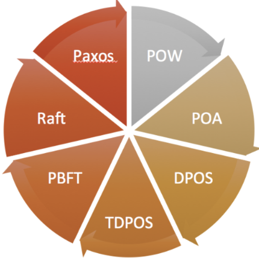

Primary角色分析

Primary节点的作用：

•正常工作时，接收客户端的事务请求，验证request身份后，为该请求设置编号，广播pre-prepare消息

•新Primary当选时，根据自己收集的View-Change消息，发送View-New信息，让其它节点同步数据

•Primary与所有的其它节点维系心跳

Primary节点地位和follower节点一样，并没有什么特权

①如果Primary宕机，会因为心跳超时，而触发重新选举，保证系统运行稳定

②如果Primary恶意发送错误编号的消息，那么会在后续的操作中，被follower察觉，因为prepare和commit阶段都是会进行广播的，一旦不一致，view-change

③如果Primary不发送接收到的request，client在超时未回复时，会重发request到所有的replica，小弟们发现primary竟然私藏消息，view-change

④如果Primary节点篡改消息，因为有Request里面有data和client的签名，所以primary无法篡改消息，其它replica会先验证消息的合法性，否则丢弃，view-change

pBFT算法流程：

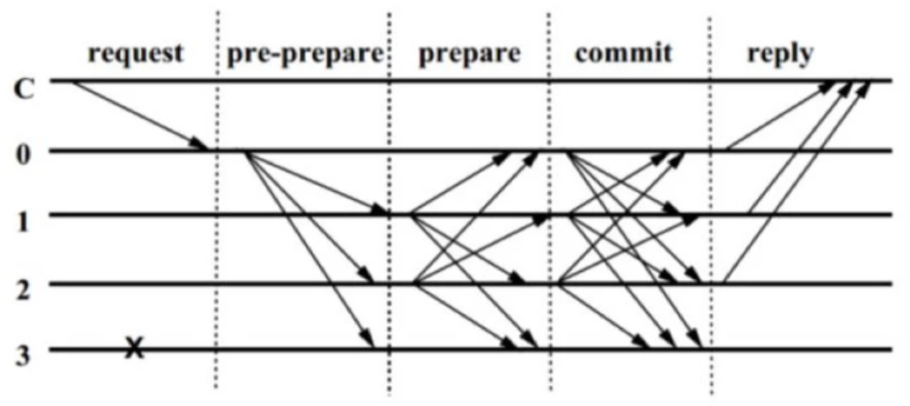

其中

•C代表客户端

•0，1，2，3 代表节点的编号

•打叉的3代表故障节点或者是问题节点，这里表现为故障节点

•0 是主节点

算法的核心三个阶段分别是

①pre-prepare预准备，由于主节点不会发布两条内容不同的通信，则如果收到节点编号相同而内容不同的通信，子节点会选择拒绝请求。

②prepare 准备，由于同时有n个节点接受请求进行通信，所以在一定时间范围内，如果收到超过2f 个不同节点的prepare 消息，就代表prepare 阶段已经完成。

③commit提交，和prepare同理，当收到2f+1 个commit 消息后（包括自己），代表大多数节点已经进入commit 阶段，这一阶段已经达成共识，于是节点就会执行请求，写入数据。

PBFT共识算法的工作流程

客户端发起请求-->转发请求到primary-->primary生成proposal-->primary广播proposal-->所有节点复制proposal并广播-->复制过半节点完成-->广播commit节点-->commit过半节点完成-->应用状态机-->反馈客户端-->客户端统计f+1个反馈消息-->交易完成。

①系统根据机器编号顺序轮流选举出一个primary，primary初始化时发出View-new消息，同步所有节点的数据

②Client发起请求转发给primary，primary验证通过后，广播这个请求，发起pre-prepare消息给所有的follower节点，并且自己也保存这个request

③所有的follower收到pre-prepare消息后，第一步是进行校验，包括数据的顺序是否正确，操作的先后有序性，以及交易是否有效比如签名。（防止客户端造假或者primary节点篡改造假）

④follower验证正确之后，写到自己的磁盘里，然后广播Prepare消息，并且自己也进入Prepare阶段

⑤所有节点统计针对某个Request的Prepare消息，当统计结果超过2f节点时，表明大部分节点已经完成了持久化，则自己进入commit阶段

⑥广播commit 消息，并且统计收到的commit 消息的数量，当超过2f节点都发出commit的消息时

⑦该节点完成commit阶段，写入数据（该操作已经完成2/3共识了），运用自己的状态机，更新stable checkpoint，缓存该客户端最后一次的请求，并且反馈给客户端

⑧当客户端统计反馈的节点超过f个时，表示交易已经被大部分节点确认了，交易成功。如果超时还不成功，则向所有的replica广播这个request

Ø解释

为什么客户端收到f+1个确认时，交易就成功了？

因为默认问题节点为f，那么f+1个确认节点中，肯定有1个是诚实的节点，只要有1个诚实的确认消息，则交易成功，因为1个诚实的消息必须是2f+1个节点都commit操作成功了，才可能有这个1个最终确认消息的。所以为了提升交易处理的速度，只要有f+1个确认反馈，就可以表示交易成功。

Raft Vs PBFT

•Raft系统中leader拥有最高权限，follower如果和leader数据不一致，那么必须删除自己的数据，保持和leader一致

•PBFT中，Primary向我发送命令时，当我认为老大的命令是有问题时，我会拒绝执行。并且很有可能会触发view-change。就算我认为老大的命令是对的，我还会问下团队的其它成员老大的命令是否是对的，只有大多数人（2f+1）都认为老大的命令是对的时候，我才会去执行命令

PBFT的特点

•客户端事务请求的严格有序性

request里面包含了时间戳，request在服务端执行的时候，按照时间戳进行排序执行。而zab协议、raft协议都是按照先到先执行的有序性（服务端），但是PBFT却能按照Client的有序性。即使网络问题，先发起的请求晚于后发起的请求抵达服务端，服务端也不会打乱执行的顺序，PBFT是更严格的操作有序性。这也提高了系统的复杂度。

•性能尚可

PBFT 算法通信复杂度o（n^2^），因为系统在尝试达成状态共识时，涉及到N个几点都需要广播N-1个其它节点。而在没有作恶节点的zab、raft系统中，通信复杂度O(N)

------


## 第四章: 区块链核心代表

### 4-1 1.0代表：比特币概述与特性

#### 比特币概述

比特币（Bitcoin，缩写BTC），是区块链技术的经典应用之一，也是一种加密数字货币或者说是电子现金，比特币不依靠特定货币机构发行，它基于特定的程序算法，通过大量的计算产生。

比特币使用整个P2P互联网中众多节点构成的分布式数据库来确认并记录所有的交易行为。

P2P的去中心化特性与算法就确保了比特币的发行无法被人为控制，比特币从诞生之初，总量就恒定2100万枚，所以说，比特币是天然通缩的。

比特币的产生：2008年11月1日，一个自称中本聪的人发表了一篇题为《比特币：一种点对点的电子现金系统》的白皮书，从此比特币诞生了。

注：白皮书：白皮书是对某一个产品进行公开说明的企业官方文件。通过该文档，企业可以用一种正规的，规范的形式对产品进行发布说明。《比特币：一种点对点的电子现金系统》的白皮书问世，就标志着比特币与底层技术区块链的诞生。

比特币的设计原理：

最小单位：聪（Satoshi）；

1个比特币包含1亿个聪；

总量2100万枚；

每一个聪都能被追踪出只有这的历史记录，且全部记录可公开调阅；

每10分钟增加一个数据块（区块）；

比特币诞生时，每产生一个数据块（区块），奖励打包人50比特币；每达到21万个区块，奖励就减半。

#### 比特币的几个基本概念

散列（Hash）：一种加密算法，将任意长度的不同信息转换为长度相等单内容不同的字符串（二进制数列）。本算法产生相同数字输出的概率微乎其微，保证输出数字一一对应，反推极其困难。比特币中使用SHA256函数进行加密，SHA256函数可以将任意长度的信息转换成一组长度为256个二进制数字，256个0或1能够组合成2256的不同数字，能够满足与比特币相关的任何标记需要。

工作量证明（Proof-of-Work）：一种确保众多节点记录账本保存一致性的方法。在比特币网络中，要想得到比特币就需要先利用自己服务器的算力抢夺记账权，等记账权抢到手之后，把10分钟内发生的所有交易记录按照时间的顺序记录在账本上，然后同步给这个网络上的所有用户。在POW共识机制下，记账人通过计算一道极其困难的数学题的方式获取记账权，第一个计算出答案的人就能够获取记账权，并得到比特币网络给与的比特币奖励。

公开密钥密码体系：

公钥体系：发送方密码加密，接收方配对密码解密，保证安全性。

密钥：一组数字+原始信息+特定算法

解密：私钥自己保存、公钥公开，使用公钥解密私钥加密的信息，用于身份验证，不可抵赖；

公钥丢失可以用私钥恢复；

私钥丢失则无法通过公钥恢复，保证了私钥的私密性。

交易（Transactions）：交易是指一个用户用比特币向另一个用户进行支付的过程。

定义：一枚电子货币是这样一串数字签名：每一位所有者通过对前一次交易和下一位拥有者的公钥签署一个随机散列的数字签名，并将这个签名附加在这枚电子货币的末尾，电子货币就发送给下一位所有者，而收款人通过对签名进行检验，就能够验证该链条的所有者。

区块：

区块就是用于存储区块链网络上一段时间内所有交易数据的数据块，区块均包含三种要素：

•本区块的ID

•交易内容

•前一个区块的ID

比特币系统大约每十分钟产生一个区块，每个区块都能找到其前一个区块，从而形成一条完整的交易链条。

挖矿：

挖矿就是指产生新区块并计算随机数（及上文中提到的计算数学题）的过程，挖矿过程可分为以下六步：

1、以最后一个区块为输入，计算一个散列值；

2、接收交易单并检验，记录新交易，成为一个新区块；

3、随机创造一个随机数，其大小和长度没有限制；

4、将随机数与第一步中的散列值和第二步中记录的新交易内容作为输入，一起放到SHA256函数中，计算出一个256位的二进制数；

5、检查这个二进制数的前N位是否符合要求；

6、符合要求则结束，并全网广播；不符合要求，则重复第二至第六步，直至符合。

发行和信用背书：

比特币没有中央银行负责发行，也没有政府为其提供信用背书。

发行：通过挖矿的形式发放比特币，但是发放的比特币总数固定位2100万枚。

信用：由挖矿和交易的大量计算+消耗的时间和电力等成本提供信用证明，原理如下：

1、在诚实劳动所能获得的报酬高于欺骗时，没有人会花费力气去欺骗；

2、要成功进行欺骗，不仅需要经受其他所有用户的检验，也需要具有高于全网计算能力51%的计算设备。

#### 比特币的特征和应用

特征：

•去中性化

•高度匿名性

•完整的可追溯性

•交易具有不可逆性

•天然的全球性货币

应用：

•支付：操作迅速效能高

•流通：虚拟商品

•价值尺度：劳动的凝结

•贮藏：数字文件形式

•世界货币性

#### 比特币的基本特征

比特币成功实现了去中心化的货币发行与管理：

现有货币：央行发行，政府用财政实力担保。

缺陷：存在国别货币，提高交易成本；政权动荡则信任危机；垄断产生国家特权

比特币：致力于去中心化，密码学算法是的劳动创造信用，产生过程受到全网的监督维护信用。

比特币是一种高匿名化的货币：

1、比特币的账户展示形式是一串数字地址，通过它无法得知拥有者的任何信息；

2、生成过程无需任何实名认证，拥有者通过私钥证明所有权；

3、同意拥有者的不同账号之间没有任何关联，这意味着其他人无法得知特定用户的全部比特币持有量；

优缺点：私密性很高，但是容易被用来洗钱、贩毒、逃税等。

比特币交易具有完整的可追溯性：对于任何一枚比特币而言，其从产生到当前经理的全部状态，都被完整地记录再区块链中，且溯源过程不需要认证，任何人都可以对任何账户进行查询，这有助于实现全网地互相监督。

比特币交易具有不可逆性：每笔交易只有成功和失败两种状态，而不允许撤销操作。

比特币是天然的全球性货币：比特币没有国界，无需兑换。

#### 比特币的典型应用

比特币支付：若无国家政策强制限制，可以支付债务、地租、利息等，对于支付结算双方而言，简便、快捷、低成本。

比特币的流通：交易平台是比特币的主要流通渠道，“比特币-美元”及“比特币-人民币”是目前最主要的交易市场。

注：在中国，比特币是虚拟商品，不具有与货币同等的法律地位。

比特币的价值：比特币的价值来源计算机的无差别劳动。

比特币的贮藏：以数字文件的形式保存在互联网或硬盘等存储媒介中，只要文件不被破坏，没有黑客盗窃，这些货币就不会丢失。

比特币的世界货币性：比特币无国家发行中心，它的使用没有国界。

### 4-2 比特币与交易

#### 比特币运行架构

在区块链中,对于买方和卖方而言,交易双方首先需要在区块链系统中进行身份的确认，即拥有一个在区块链系统中唯一且能够最终被验证和访问到的身份。

比特币系统是当前最成功的区块链应用。目前已经形成完备的生态圈与产业链，其整体交易运行框架如图所示

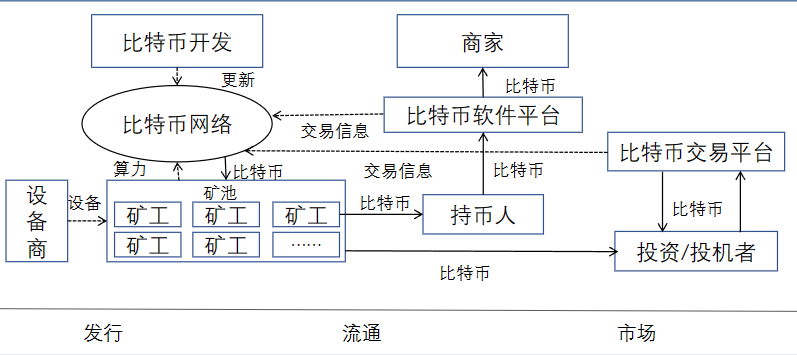

#### 比特币的交易流程

区块链的整个交易流程如图所示

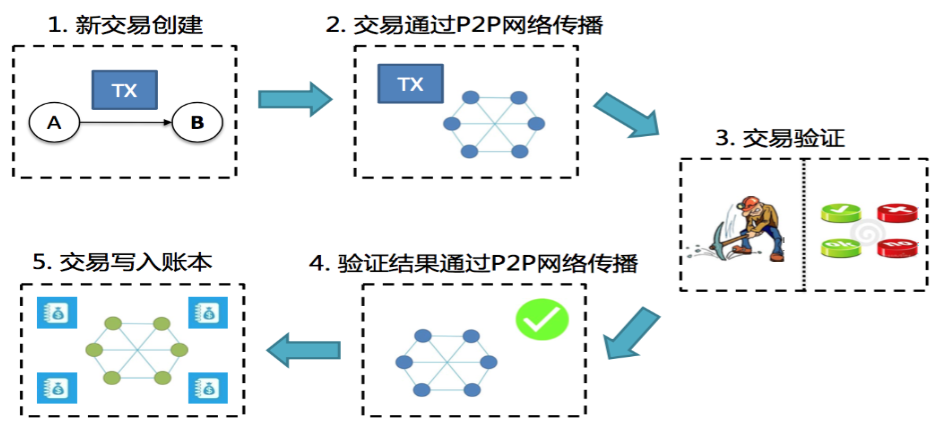

第1步：所有者A利用他的私钥对前一次交易（比特货来源）和下一位所有者B签署一个数字签名，并将这个签名附加在这枚货币的末尾，制作成交易单

要点：B以公钥作为接收方地址

第2步：A将交易单广播至全网，比特币就发送给了B，每个节点都将收到的交易信息纳入一个区块中

要点：对B而言，该枚比特币会即时显示在比特币钱包中，但直到区块确认成功后才可用。目前一笔比特币从支付到最终确认成功，得到6个区块确认之后才能真正确认到帐

第3步：每个节点通过解一道数学难题，从而去获得创建新区块权利，并争取得到比特币的奖励（新比特币会在此过程中产生）

要点：节点反复尝试寻找一个数值，使得将该数值、区块链中最后一个区块的Hash值以及交易单三部分送入SHA256算法后能计算出散列值X（256位）满足一定条件（比如前20位均为0），即找到数学难题的解。由此可见，答案并不唯一

第4步：当一个节点找到解时，它就向全网广播该区块记录的所有盖时间戳交易，并由全网其他节点核对

要点：时间戳用来证实特定区块必然于某特定时间是的确存在的。比特币网络采取从5个以上节点获取时间，然后取中间值的方式作为时间戳。

第5步：全网其他节点核对该区块记账的正确性，没有错误后他们将在该合法区块之后竞争下一个区块，这样就形成了一个合法记账的区块链。

要点：每个区块的创建时间大约在10分钟。随着全网算力的不断变化，每个区块的产生时间会随算力增强而缩短、随算力减弱而延长。其原理是根据最近产生的2016年区块的时间差（约两周时间），自动调整每个区块的生成难度（比如减少或增加目标值中0的个数），使得每个区块的生成时间是10分钟。

比特币中的每笔交易的输人都来自过去未花费的某笔交易的输出(UTXO, UnspentTransaction Output)，该笔输出有接收人的地址。当新交易创建后，生成的交易就会被发送到P2P网络中传播，再通过工作量证明经过节点验证，最终记录到区块链。这就是区块链交易的整个生命周期。

对于普通用户来讲，不需要了解底层交易流程。因此，比特币系统以及很多第三方区块链供应商为普通用户提供了一个软件，称为“钱包”。**用户可以在“钱包”软件中存放自己拥有的比特币以及私钥。**

通过“钱包”软件，如果把比特币钱包简单比作成银行卡账户，那么比特币钱包地址就可以看成是银行卡账号。

比特币地址是一段由数学算法生成的27~34位长度的字符串，一般以数字"1”或“3”开头。每个比特币地址都对应着一个比特币私钥。比特币私钥也是由一串字符组成，一般以数字“5”开头。其具体结构如图所示：

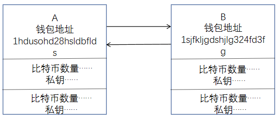

比特币地址和私钥总是成对出现的，比特币私钥是唯一证明用户对该私钥所对应的比特币地址有控制权的依据。一旦用户忘记、丢失或让他人窃取了私钥，该用户将失去对这一地址的比特币的控制权。此外，通过比特币私钥可以找寻比特币地址，进而使用该地址上的比特币，但是从比特币地址不能计算出该地址的私钥。

UTXO：

UTXO（UnspentTransactionOutputs）是**未花费的交易**输出，它是比特币交易生成及验证的一个核心概念。交易构成了一组链式结构，所有合法的比特币交易都可以追溯到前向一个或多个交易的输出，这些链条的源头都是挖矿奖励，末尾则是当前未花费的交易输出。所有的未花费的输出即整个比特币网络的UTXO。

#### 比特币的交易技术原理

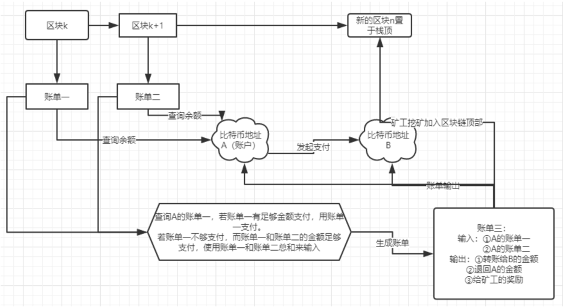

模型图有几个重点：

•个人可用的比特币是以账单形式存在的，在发起交易时，查询区块链中个人可用账单（账单输出账户是你），使用账单来支付相应比特币，产生输出，实际上，是比特币在比特币地址之间的转移。

•本次交易的输入就是上次交易输出，比特币账户（地址）查询余额和交易，就是对区块链里账单里对你账户输出的查询（上图中，对A可支配比特币的查询账单输出：退给A的金额，对B可支配比特币的查询账单输出：转账给B的金额）

•本次交易的输入可以只有一张账单的输出（如果这张账单上的比特币足够），也可以包含几张账单的输出（几张账单加起来比特币>=此次需要支付金额），注意到，上面的>=比交付，因为不太可能利用已有账单完全无误差地凑出本次需支付对应金额，因为账单里的输出金额是不可拆分的，只能利用账单来支付，要将银行里控制的个人账户余额（一串数字）与比特币个人账户余额（账户下的账单输出）区分开来。

•生成的账单三中有给矿工的奖励，这个奖励是你自定的，给不给，给多少都行，这个奖励影响的是交易的优先级，奖励越多，越能尽早地将账单加入区块链中，以保证交易的完成。账单将会被保存在矿工的矿池中，按照奖励优先级来处理账单。

交易输出的锁定与解锁（重点）——锁定脚本与解锁脚本

上面提到了，一个账户可支配的比特币来源于账单的输出，而账单是公开的，每个比特币账户都能知道这笔交易以及交易的输出，那么怎么保证输出只有对应的比特币的账户能用呢？

比特币的锁机制是通过一种类Forth语言脚本来，该脚本语言是种非图灵完备的语言，什么是图灵完备的语言呢，当一门编程语言在不限制内存和不限制时间下，能够解决所有问题，就称为图灵完备的，例如：C/C++，JAVA都是图灵完备语言，反之就是图灵非完备，比特币脚本里没有循环，所以这个脚本不能解决：在满足某种条件下退出循环，否则无限制地循环的问题。

**比特币的脚本语言是一种简单、低级的语言**，它的很多功能已经被编译成立二进制文件，即使我们不了解这种语言，只要能够调用接口就行了，或者可以直接使用C/C++，JAVA这样的语言来完成锁定和解锁的功能。那么为什么不直接用C++等图灵完备的语言呢？这是出于安全考虑的，因为C++，JAVA等语言与内存、操作系统等运行环境，息息相关，而比特币脚本不需要任何运行环境都能运行，这就能抵抗基于内存的攻击或者其他透过系统漏洞的攻击（书上是这样解释的，我觉得，比特币脚本更像一串机器语言的0-1串，由于低级机器语言的限制，很难进行高级编程，同样的，也保证了安全性，因为0-1机器语言很难入侵更改）。

下面是锁定脚本与解锁脚本的例子，以说明锁的交互机制。

假设这笔交易为A向B支付比特币，在交易双方完成交易，生成账单时（非矿工加的解锁和锁定脚本），A向这个账单加上了锁定脚本，这个锁定脚本包含B的比特币地址C，因为B只公开了经过对公钥HASH后的比特币地址C，因为HASH函数的性质，比特币网络上的任何人，都不能通过C逆向得到B的公钥，也就是说，只有B知道自己的公钥能够构建解锁脚本，即只有B的公钥，才能通过HASH运算出地址C，只有能运算出地址C的比特币账户，才能支配这笔比特币。比特币的交易技术原理

脚本语言运行

该脚本语言仅由常数以及操作构成，从前往后遍历脚本，若遇到常数，则将常数入栈，若遇到操作，根据操作的具体要求，对栈顶元素进行弹出，或者弹出两个元素进行运算，再入栈，当一句脚本运行完毕后，仅只剩下栈顶元素，其取值为True\False，很清楚地，True代表验证成功，代表执行脚本的用户具有该账单输出比特币的支配权，用户能够使用该账单作为下笔交易（账单）的输入，下面是个具体例子比特币的交易技术原理

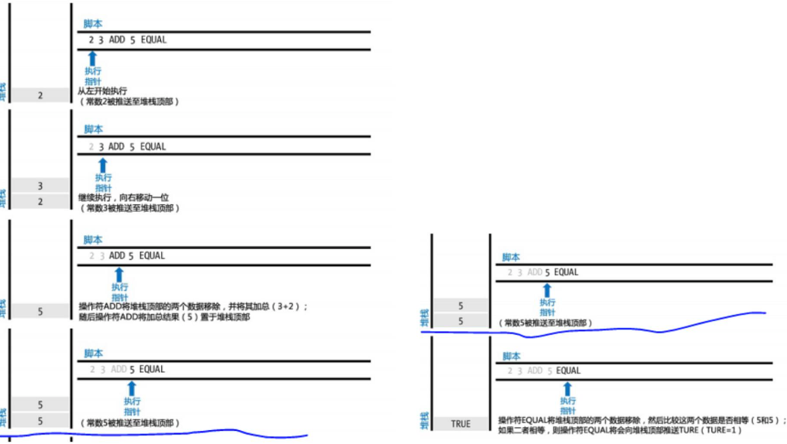

锁定/解锁脚本类型

1）P2PKH (Pay-to-Public-Key-Hash)——比特币网络上大多数交易都属于此类型

解锁脚本，锁定脚本

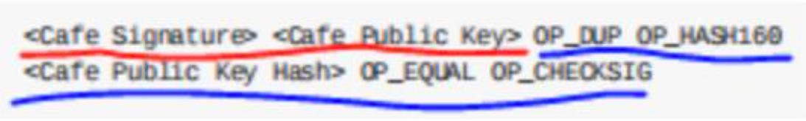

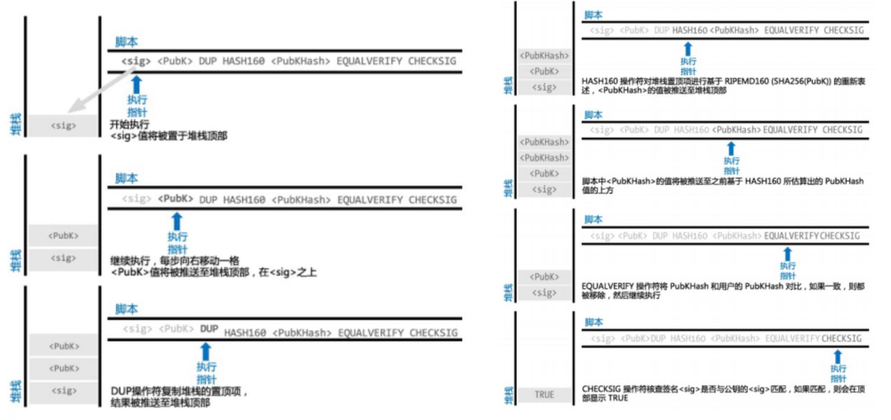

2）P2PK（Pay-to-Public-Key）

写成收款方的公钥，收款方通过自己的私钥生成相应公钥来获取支配权

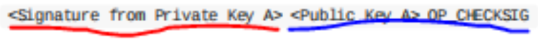

3）P2SH（Pay-to-Script-Hash）

这个脚本类型用于多重签名才能支付，比如，一个公司的账户，由5个人支配，但只要有2个人以上的签名就能进行比特币支付。

我们考虑使用2）的方式来写多重签名命令：

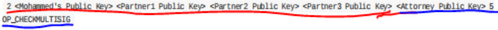

就是说，再使用上图方式多重签名的时候，需要将所有人的公钥都加在锁定脚本里，因为Attorney Public Key时是所有人的公钥运算的结果，而Public Key（公钥）有260bit长，这样下来，在人很多的情况下，甚至会使锁定脚本容量超过账单本身，而且这样的脚本也难以维护，并暴露所有人之间的联系（尽管比特币地址是匿名的）。

P2SH很好地解决了这个问题，P2SH分为除了锁定脚本、解锁脚本之外，多出了赎回脚本：

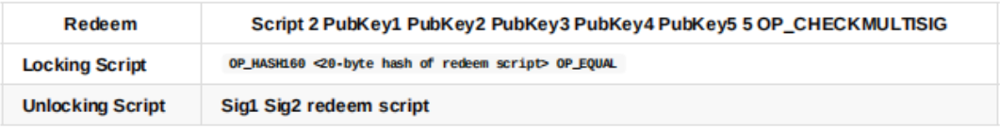

使用方法是分两步：①使用赎回脚本确认用户能在属于定义好的群组；②使用解锁脚本解锁（Sig1 Sig2是2个群组用户的签名）

### 4-3 2.0代表：以太坊简介

#### 区块链2.0-以太坊

区块链2.0的代表是“以太坊”。以太坊是一个平台，它提供了各种模块让用户用以搭建应用。平台之上的应用，其实也就是合约。这是以太坊技术的核，以太坊提供了一个强大的合约编程环境。通过合约的开发，以太坊实现了各种商业与非商业环境下的复杂逻辑。以太坊的核心与比特币系统本身是没有本质的区别的，而以太坊的本质是智能合约的全面实现，支持了合约编程。让区块链技术不仅仅是发币，而提供了更多的商业、非商业的应用场景。

以太坊是一个可编程、可视化、更易用的区块链，它允许任何人编写智能合约和发行代币。就像比特币一样，以太坊是去中心化的，由全网共同记账，账本公开透明且不可窜改。与比特币不同的是，以太坊是可编程的区块链，它提供了一套图灵完备的脚本语言，因此，开发人员可以直接用C语言等高级语言编程，转换成汇编语言，大大降低了区块链应用的开发难度。类似于安卓系统，提供了非常丰富的API 和接口，让用户可以开发出各种APP。从诞生到现在，有200多个以太坊应用诞生，俄罗斯银行也与以太坊基金会达成合作，截止目前（2017年9月），以太坊市值仅次于比特币排行第二位。

•智能合约

网络上关于智能合约的解释都很晦涩。我们可以简单的理解为在区块链上，由事件驱动、以代码形式存在、可执行的特殊交易合同。它是代码、数据的集合。智能合约非常适合对信任、安全和持久性要求较高的应用场景，比如：数字货币、数字资产、投票、保险、金融应用、预测市场、产权所有权管理、物联网、点对点交易等等。目前除数字货币之外，真正落地的应用还不多。和移动互联网刚兴起之时各种各样、各行各业的APP推陈出新一样，去中心化应用的市场在初期肯定有一个红利期。对此有兴趣的开发者，可抓住机会。

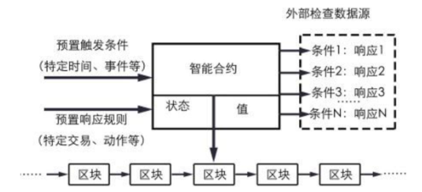

•以太坊模型说明

以太坊的本质就是一个基于交易的状态机(transaction-based state machine)。在计算机科学中，一个状态机是指可以读取一系列的输入，然后根据这些输入，会转换成一个新的状态出来的东西。

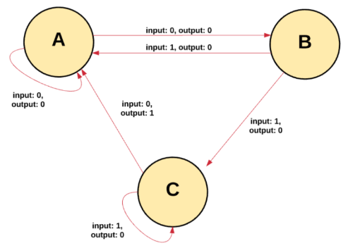

根据以太坊的状态机，我们从创世纪状态(genesis state)开始。这差不多类似于一片空白的石板，在网络中还没有任何交易的产生状态。当交易被执行后，这个创世纪状态就会转变成最终状态。在任何时刻，这个最终状态都代表着以太坊当前的状态。

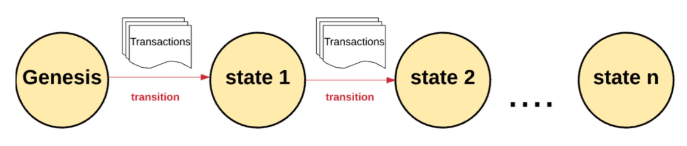

以太坊的状态有百万个交易。这些交易都被“组团”到一个区块中。一个区块包含了一系列的交易，每个区块都与它的前一个区块链接起来。为了让一个状态转换成下一个状态，交易必须是有效的。为了让一个交易被认为是有效的，它必须要经过一个验证过程，此过程也就是挖矿。挖矿就是一组节点（即电脑）用它们的计算资源来创建一个包含有效交易的区块出来。

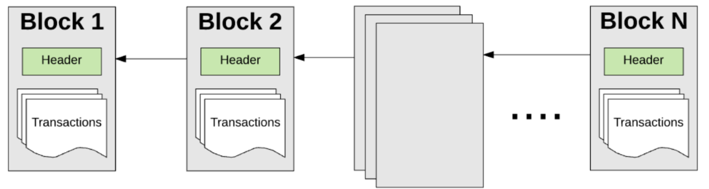

任何在网络上宣称自己是矿工的节点都可以尝试创建和验证区块。世界各地的很多矿工都在同一时间创建和验证区块。每个矿工在提交一个区块到区块链上的时候都会提供一个数学机制的“证明”，这个证明就像一个保证：如果这个证明存在，那么这个区块一定是有效的。为了让一个区块添加到主链上，一个矿工必须要比其他矿工更快的提供出这个“证明”。通过矿工提供的一个数学机制的“证明”来证实每个区块的过程称之为工作量证明(proof of work)。证实了一个新区块的矿工都会被奖励一定价值的奖赏。奖赏是什么？以太坊使用一种内在数字代币—以太币(Ether)作为奖赏。每次矿工证明了一个新区块，那么就会产生一个新的以太币并被奖励给矿工。

•账户

以太坊中账户分为两类：

Ø外部账户(EOA)

该类账户被公钥-私钥对控制(用户)，没有关联任何代码，外部账户的地址由公钥衍生而来。

Ø合约账户(CA) 

该类账户为智能合约分配的账户，被合约代码控制且有代码与之关联智能合约的部署会把合约字节码发布到区块链上，并使用一个特定的地址来标示这个合约，这个地址就是为合约账户。

合约账户存储了代码，外部账户则没有。除了这点之外，这两类账户对于EVM来说都是一样的。合约部署就是将编译好的合约字节码，通过外部账号以发送交易的形式部署到以太坊区块链网络上（由实际矿工出块之后，才会真正部署成功）。外部账户与外部账户之间交易仅仅是转账。但是外部账户到合约账户，是可以激活各种操作的。

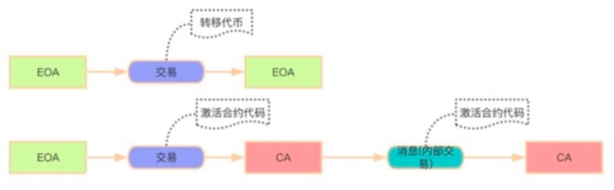

以太坊结构图

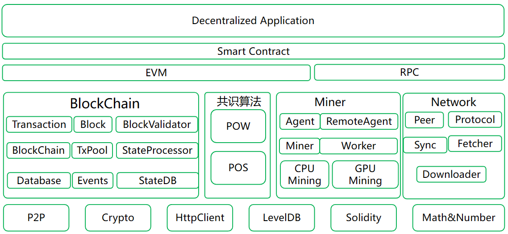

### 4-4 以太坊钱包

暂无资源

### 4-5 3.0代表：EOS简介

#### 区块链3.0应用-EOS

EOS: Enterprise Operation System 中文意思为：商业级区块链操作系统。尽管以太坊创造性引入智能合约概念，极大的简化了区块链应用的开发，但以太坊平台依然有一个很大的限制，就是交易确认时间及交易吞吐量比较小，从而严重影响了以太坊进行商业应用。

交易吞吐量有一个专门的词：TPS （transaction per second 每秒的交易量）比特币的TPS 是大概7，并且最少几十分钟交易才能被确认，以太坊的TPS大概是20左右，交易的确认一般需要几分钟的时间。不过比特币以太坊也在不断进化以提高TPS，比如比特币的闪电网络，以太坊的Sharding技术（分片）以及Plasma技术（分层）。

EOS 项目的目标是建立可以承载商业级智能合约与应用的区块链基础设施，成为区块链世界的“底层操作系统”。

**EOS通过石墨烯技术解决延迟和数据吞吐量问题**，TPS可达到数千，交易的确认时间也只有数秒。同时声称未来使用并行链的方式，最高可以达到数百万TPS。

EOS 设计了一套账户权限管理系统，EOS不再使用地址作为账户，可以直接使用字符作为账户名，并设计了一套的账户权限体系。

此外，在EOS 上转账交易及运行智能合约不需要消耗EOS代币。而是EOS 系统当中，抵押代币获取对应的资源，来执行相应交易，在EOS运行程序完全免费的说是不准确的。

值的一提的是EOS项目其ICO也是基于以太坊ERC20 Token进行的，其ICO 时间长达355天，作为一个当时还未上线的项目，融资额达到40亿美元是前所未有

**技术架构方面**

通俗地讲，EOS的技术架构就是可以实现现有任何高性能去中心化应用的基础架构，提供给开发者透明的网络带宽、计算资源、存储资源，并且对开发者友好。

我们可以把EOS看成一个去中心化的阿里云或者AWS生态。它的性能比以太坊(ETH)高许多倍，因此如果拿它做去中心化交易系统、社交网络、即时通信、预测平台等应用，都会有非常好的用户体验，Steem和BitShares已经是其成功案例。ETH 虽然提出了分片和PoS的方案，但目前其扩容进度总体较慢，而EOS已经上线的主网的TPS ( 代表系统处理能力的性能指标，即每秒处理交易数)最高可达2000多(作者完稿时)。

**经济模型方面**

经济模型对于区块链很重要的原因有如下两个：

①区块链为了避免网络攻击每次交易需要收取Gas或者手续费。

②经济模型作为Token价值的载体，在整个系统的激励机制中有演着重要角色。

Gas费用的存在，导致很多小白用户使用区块链应用的门槛很高。试想注册需要发起一个交易，发帖、点赞、删除也需要，并且使用之前还要给ETH充值。这不符合目前绝大多数用户的互联网免费思维(即用户认为互联网上的产品可以免费使用)，而EOS平台从机制上支持用户完全免费使用，在初始时可以由应用开发者为用户抵押资源。拥有的代币是一种权益证明，证明你能够使用多少资源。从商业逻辑上看，EOS支持“B端收取服务费，C端免费”的模式。

**应用开发方面**

EOS的超高性能可以承载数量众多的DApp应用，所以我们可以预见，EOS将成为可以孵化出众多独角兽项目的超级独角兽平台。

EOS为什么那么快呢?核心原因是它使用了DPoS共识机制。ETH全网的节点都参与生产或验证区块，而EOS只有21个超级节点，因此EOS可以更快地达成致、生产区块。

这些EOS超级节点都是经过社区投票选择出来的，为了保持自己处在投票前列，这些超级节点会投入巨大的成本来升级硬件配置，随着EOS超级节点的逐步竞争和升级，不久的将来它们都会成为一个个超级数据中心。而同时，成为超级节点所获得的代币奖励也非常丰厚，并会随着EOS生态的发展进步增值。

EOS的另一个特点是，具有比较好的标准化和封装。作为区块链中的底层公链系统，就像手机的Android系统或iOS系统，开发者在EOS上开发出一款应用，普通用户就可以直接使用，而不需要安装其他辅助性软件。

我们可以把EOS类比成微信，微信为用户提供了账户、支付系统、朋友圈等各种基础设施，然后由开发商在上面直接开发些小程序，所有的微信用户就都可以使用了。

在EOS上，开发商开发的是DApp应用，而且与微信不同的地方是，EOS网络并不受某个公司的控制，它属于整个EOS。

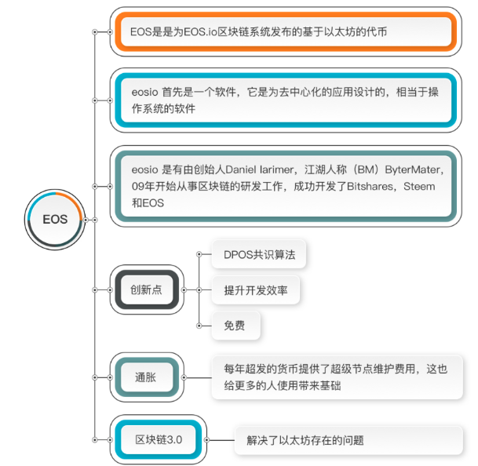

### 4-6 典型联盟链：超级账本

#### 区块链3.0-超级账本

Hyperledger Fabric是区块链中联盟链的优秀实现，主要代码由IBM、Intel、各大银行等贡献，目前v1.1版的kafka共识方式可达到1000/s次的吞吐量。

Hyperledger Fabric 是开源的企业级许可制分布式账本技术(Distributed Ledger Technology, DLT) 平台，这与其它流行的DLT 平台或区块链平台有一些关键的不同。

Hyperledger 是由Linux Foundation 建立的，Linux Foundation 本身具有非常长和非常成功的开源历史及开源项目。Hyperledger 是由多个技术会员会管理的，Hyperledger Fabric 项目由来自多个组织的人员维护。它的开发者社区包括35 个组织和将近200 个开发者。

Fabric 具有高度的模块化和可配置性的架构，支持对广泛范围企业应用的创新和优化，如：银行、金融、保险、医疗、人力资源、供应链、和数字音乐分发。

Fabric 是第一个支持采用通用编程语言编写智能合约的DLT 平台，如Go, Node.js, Java，而不是限制于领域特定语言(domain-specific languages, DSL)。这意味着大多数企业已经具备开发智能合约的技能集，而不需要额外的培训来学习一门新的语言。

Fabric 平台采用的是许可制，意味着与公开无需许可的网络不同的是，参与者已经各自有一定了解，而不是匿名和完全无信任的。这意味着，尽管参与者之间可能不会完全信任对方（例如，他们可能是同一行业的竞争者），但网络可以在治理模型下运行，该治理模型是基于参与者之间确实存在的信任而建立的，例如处理争议的法律协议或框架。

Fabric 平台最重要的特色之一是它对可插拔共识协议的支持，该协议使平台可以更有效地进行定制，以适应特定的用例和信任模型。例如，当部署在单个企业中或由受信任的机构运营时，完全拜占庭式的容错共识可能被认为是不必要的，并且会严重拖累性能和吞吐量。在这种情况下，崩溃容错(crash fault-tolerant, CFT) 共识协议可能绰绰有余，而在多方，去中心化的用例中，可能需要更传统的拜占庭容错(byzantine fault tolerant, BFT) 共识协议。

Fabric 利用不需要原生加密货币的共识协议来实现代价昂贵的挖矿操作或智能合约的执行。避免使用加密货币会降低一些重大的风险，并且无需进行加密货币挖矿操作就意味着可以以与任何其他分布式系统大致相同的运营成本来部署该平台。

**开发概念**

fabric联盟链的开发人员主要分为三类：底层是**系统运维**，负责系统的部署与维护；其次是**组织管理人员**，负责证书、MSP权限管理、共识机制等；最后是**业务开发人员**，他们负责编写chaincode、创建维护channel、执行transaction交易等，如图所示：

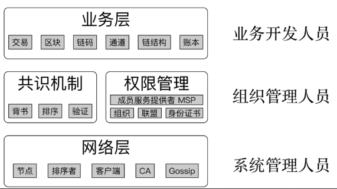

**开发模块**

Fabric大致分为底层的网络层、权限管理模块、区块链应用模块，通过SDK和CLI对应用开发者提供服务，如下图所示：

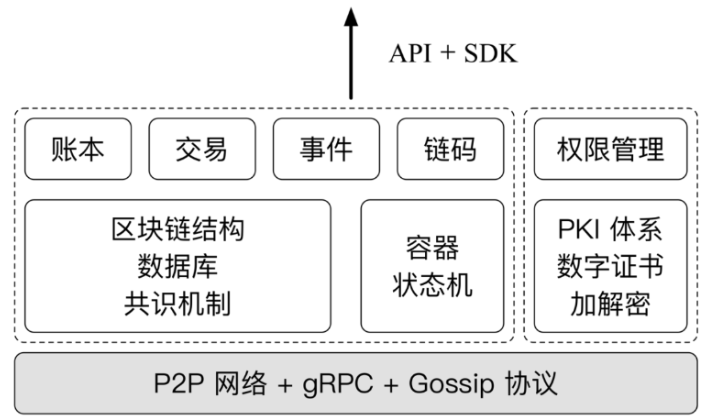

**Fabric链码介绍**

chaincode（链码）是部署在Hyperledger fabric 网络节点上，可被调用与分布式账本进行交互的一段程序代码，也即狭义范畴上的“智能合约”。链码分为系统链码和用户链码。

系统链码用来实现系统层面的功能，包括系统的配置、用户链码的部署、升级、用户交易的签名和验证策略等；

用户链码用于实现用户的应用功能，开发者编写链码应用程序，并将其部署在网络上，终端用户通过与网络节点交互的客户端应用程序调用链码；链码在VP （记账节点，也称校验节点）上的隔离沙盒（目前为Docker 容器）中执行，并通过gRPC协议来被相应的VP 记账节点调用和查询；

**fabric 通道**

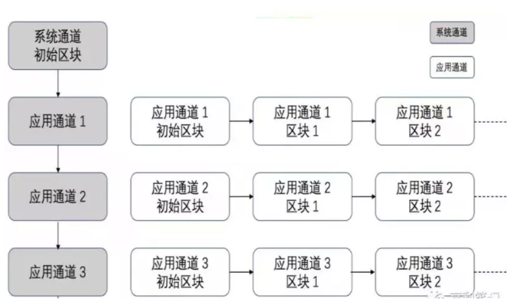

目前通道分为系统通道（System Channel）和应用通道（Application Channel）。排序节点通过系统通道来管理应用通道，用户的交易信息通过应用通道传递。对一般用户来说，通道是指应用通道。

**通道概念**

通道是Fabric中非常重要的概念，它实质是由排序节点划分和管理的私有原子广播通道，目的是对通道的信息进行隔离，使得通道外的实体无法访问通道内的信息，从而**实现交易的隐私性**。

商业应用的一个重要的需求是私密性交易，为此Fabric 设计了通道（Channel）来提供成员之间的隐私保护。通道是部分网络成员之间拥有独立的通信渠道，在通道中发送的交易只有属于通道的成员才可见，因此通道可以看作是Fabric的网络中部分成员的私有通信“子网”。

**通道管理**

通道由排序服务管理。在创建通道的时候，需要定义它的成员和组织、锚节点（anchor peer）和排序服务的节点，一条和通道对应的区块链结构也同时生成，用于记录账本的交易，通道的初始配置信息记录在区块链的创世块（第一个区块）中。通道的配置信息可以用增加一个新的配置区块来更改。

每个组织可有多个节点加入同一个通道，这些节点中可以指定一个锚节点（或多个锚节点做备份）。锚节点代表本组织与其他组织的节点交互，从而发现通道中的所有节点。另外，同一组织的节点会选举或指定主导节点（leading peer ），主导节点负责接收从排序服务发来的区块，然后转发给本组织的其他节点。主导节点可以通过特定的算法选出，因此保证了在节点数量不断变动的情况下仍能维持整个网络的稳定性。

### 4-7 交易瓶颈的处理手段：DAG

#### 区块链3.0-DAG

DAG(Directed acyclic graph)，**有向无环图**，是计算机领域一个常用的数据结构，因为独特的拓扑结构所带来的一些特性，经常被用到处理动态规划，导航中寻求最短路径，数据压缩等场景中。

第一次提出DAG跟区块链结合是在Nxt社区，可以发现DAG最初出现就是为了解决区块链的效率问题。比特币的效率一直比较低，基于工作量证明共识下的出块机制是一个原因，由于链式的存储结构，整个网络中同时只能有一条链，导致出块无法并发执行。社区有人提出DAG的拓扑结构来存储区块，这个时候更多还是类似侧链的解决思路，不同的链条存储不同类型的交易，这样降低出现双花的可能，在之后某个节点需要合并的时候，几个分支再归并到一个区块。

简单介绍下，目前比特币区块链存储结构如下，每个区块存储着当前时间段所有的交易，矿工一直在拼命争夺某个时段交易的打包权利，把当前时间段所有的交易打成一个区块。目前比特币网络平均出块时间在10分钟。

比特币区块的存储结构：

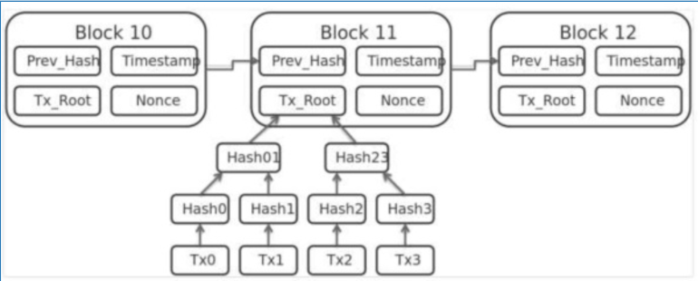

而Nxt社区提出，改变区块的链式存储结构，变成区块DAG。在区块打包时间不变的情况下，网络中可以并行的打包N个区块，网络中的交易就可以容纳N倍。

Ext社区提出的DAG of blocks：

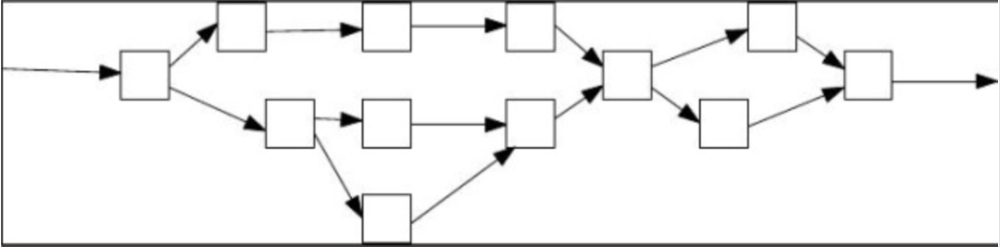

发现这个时候DAG跟区块链的结合还是停留在侧链的思路，不同类型的交易可以并行在不同的链条进行，达到提升性能的目的。这时候的DAG还是有区块的概念。

我们发现不管是最近风头正盛的iota，还是也备受瞩目的byteball，都提出了blockless无区块的概念。不管是比特币还是以太坊，我们总会提到出块速度这样的概念，比特币每十分钟才出一个块，6个出块确认就要一个小时，以太坊好很多，但是出块速度也要十几秒。

为什么一定需要区块呢？15年社区有提出DAGCoin的概念，DagCoin: a cryptocurrency without blocks。这里把区块和交易融合到了一起。我们回想下比特币网络中区块和交易的概念，很多笔交易先打包到区块中，区块和区块之间通过prehash来维护全网的交易顺序。

而DAGCoin的思路，让每一笔交易直接参与维护全网的交易顺序。这样交易被发起后直接跳过打包区块的阶段，直接融入全网，如此达到所谓的blockless效果。这样确实连打包交易出块的时间都省去了，如前文提到的，DAG最初跟区块链的结合就是为了解决效率问题，现在不用打包确认，交易发起后直接进入确认网络，理论上效率自然提高很多。

自此，以blockless独树一帜的DAG区块链雏形基本形成。又以IOTA和Byteball在市场上的表现最为耀眼。

DAG系的区块链有些概念很有趣，了解这些概念更容易理解DAG技术。

**从概率的角度来看双花问题**

在比特币网络中，通过UTXO模型，一个用户对自己可以解锁的UTXO只能发起一次转账，如此解决双花问题。比特币白皮书中也有提到，有可能多个矿工会同时解决哈希难题，获得同一时间段的交易打包权就是出块权，会有临时分叉的可能性。从这个角度来看，比特币网络中所谓的“global ledger state”也是一个不确定的状态。某一笔交易状态的确认是由其后挂靠交易的数量决定的，其后挂靠的交易越多，交易状态回滚的概率越低，这笔交易越安全

**网络宽度**

DAG网络一个重要的问题就是解决网络宽度，DAG网络中，每笔交易被确认，需要链接到已经在网络中存在的并且比较新的交易，如果都选择网络中比较早的交易，会导致网络宽度过宽，新的交易难以得到确认。理想的状态是，新的交易发起时，选择网络中已经存在的并且比较新的交易做链接确认，这样网络的宽度保持在一定范围，能让新的交易有足够快的确认时间。在IOTA中，tangle也提出了自己控制交易宽度的算法，有兴趣可以参考tangle白皮书。

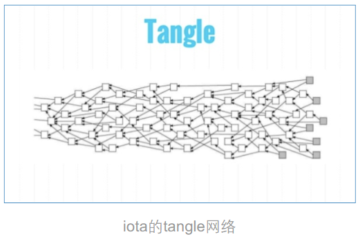

那么DAG究竟有哪些特点，居然让iota市值一度排到了虚拟货币第四的位置。

1.**交易速度快**：如上文提到，由于DAG摒弃了区块概念，交易直接进入全网中（需要指出，iota网络中每发起一笔交易，会类似hashcash一样的机制做简单的pow证明），所以交易速度预期比基于pow和pos的需要出块的区块链会快不少。

2.**无需挖矿**：DAG把交易确认的环境直接下放给交易本身，无需由矿工打包成区块后同意交易顺序。所以DAG网络中没有矿工的角色。

3.**无手续费**：iota的tangle网路中，交易发起只需要做简单的POW工作量证明，整个网络中的POW都是发起交易者自己做的，而不是交给矿工。发起交易无需手续费。

4.**智能合约支持**：目前iota还不支持智能合约，但是官方roadmap中有计划在18年开始实现对智能合约的支持。而byteball也还不支持智能合约。

5.**需要见证节点**：不管是iota还是byteball，目前的网络结构中，还是需要见证人机制的存在。这一部分不管是DPOS、POS、PBFT，大家最终都会在效率、安全性上寻求一种平衡。

------


## 第五章: 区块链应用场景

### 5-1 下一代货币：数字货币

#### 数字货币

从工业革命、电力革命到信息技术革命，历次重大的技术进步无不重塑了人类的生产、生活方式，引起了巨大的经济社会变革。技术是生产力进步的关键因素，是社会发展的主导动力。作为一种社会关系，货币也不例外，它的历次形态演化和内涵扩展均收到了科技进步的深刻影响。

理论上，货币应具备以下基本特征：容易标准化、可分性、携带方便、材料稳定和不容易变质。

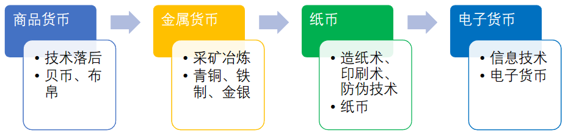

进入21世纪，随着信息技术的快速进步，技术对货币演化的影响进一步深入，货币形态及流通模式日趋数字化和网络化，出现了一种不同于传统货币的新型货币：数字货币


数字货币技术迄今已历经近四十年的研究，未来在中央银行的创新应用场景丰富多元，例如可用于货币发行、流通和调控方式创新；用于解决现行中心化模式下的金融行业“痛点”，优化金融基础设施，提高金融运行效率；用于改进金融监管手段，提高监管效率；用于加强金融信息安全保护等。

另一方面，数字货币技术在金融业的应用将可能引发整个金融运行模式的重构，从而深刻改变中央银行的履职环境，对央行的宏观审慎监管能力提出新的要求。

**数字货币是指以数字形式存在的货币，在不同语境下，有着不同的内涵和外延**。目前，狭义的数字货币主要指纯数字化、不需要物理载体的货币；广义的数字货币等同于电子货币，泛指一切以电子形式存在的货币。

从狭义来看，**最早的数字货币源于1982年David Chaum提出的一种具备匿名性、不可追踪性的电子现金系统**。它的两项关键技术是随机配序和盲化签名：随机配序产生的唯一序列号保证数字现金的唯一性；盲化签名确保银行对该数字现金的匿名背书。

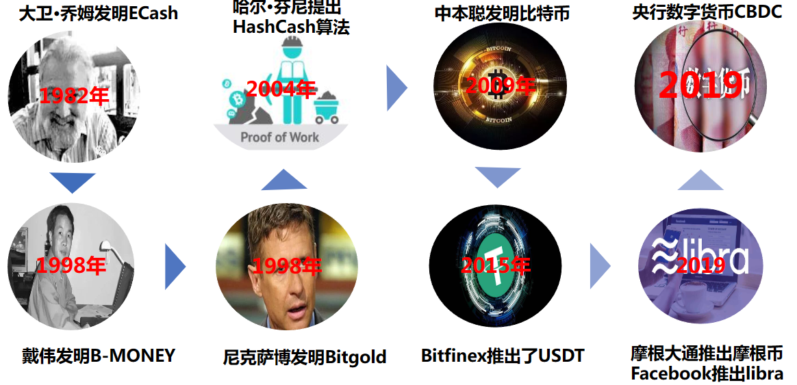


对于比特币的态度：

•绿色为支持

•蓝色中立

•红色不支持

•灰色没表态

对于ICO态度：

•“小伞”是积极监管和许可

•“停止”是禁止

国家数字货币：

•“小眼睛”计划发行“国家数字货币”

2008年，中本聪发表了经典论文《比特币：一种点对点的电子现金系统》，技术思路是：把通常意义上的集中式簿记分拆为约每十分钟一次簿记，簿记数据按照时间顺序连接起来并广播全网，簿记的权利由全网竞争选取。任何节点均可同步网络上的全部簿记记录，均可投入计算资源参与簿记权的争夺。攻击者如果不掌握全网50%以上的计算资源，就无法攻击这套簿记系统。通过这样的技术设计，现在不依赖银行等中介机构而仅靠分布式账本就可以实现。

比特币：

比特币是一个互相验证的公开记账系统，具有总量固定、交易流水全部公开、去中心化、交易者身份信息匿名等特点。“未花费过的交易输出”（UTXO)的绝佳设计，解决了E-Cash数据库无限膨胀的问题，使数字货币技术出现新的飞跃。

继比特币之后，基于区块链技术创新的各种数字货币不断出现。截止到2017年，共有1400多种。目前市场占有率较高的有：比特币、以太币、达世币、门罗币、瑞波币和零币等。

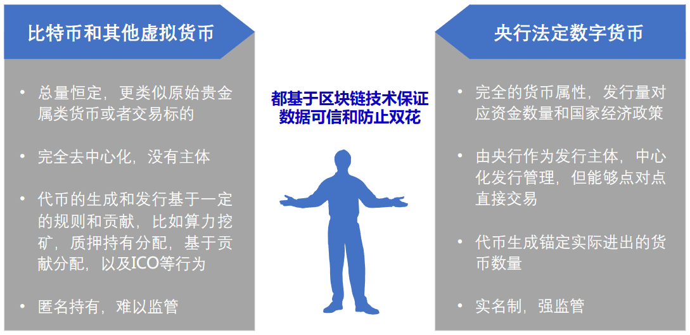

#### 数字货币的发展历程

1.从完全匿名到可控匿名

2.从在线到离线

3.从第三方完全参与到只有在需要撤销匿名性时才参与

4.从单银行到多银行数字货币系统

5.从中心化到去中心化

6.仍待解决的问题

#### 典型的数字货币

**E-Cash**

电子现金系统包含三个主体：银行、支付者、接收者。

交易过程包括：

1.通过盲签名技术，支付者从银行匿名申请支取E-CashCoins；

2.银行将E-CashCoins传送到支付者的同时，支付者将收到的E-CashCoins进行去匿名化处理；

3.支付者将E-CashCoins传递给接收者以获取所需商品及服务；

4.接收者收到E-CashCoins后，将它传递到银行进行鉴定；

5.银行对接收者传送的E-CashCoins进行鉴定，并将鉴定结果告知商家；

6.如果鉴定结果E-CashCoins为真的话，则支付者就会从接收者得到所需商品及服务。

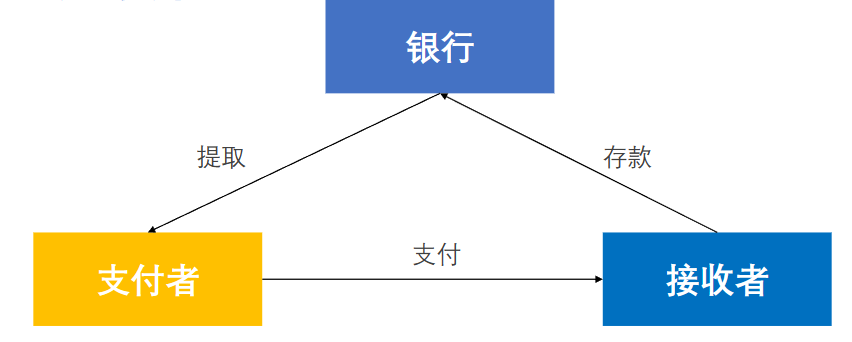

E-Cash系统是最早的基于数字编码方案设计的数字货币系统。当消费者使用E-CashCoins时，商家能看到的只是银行的签名，而不是消费者本人的签名。

由于系统出与隐私保护的考虑采用了非记名的货币发行方式，如果存放数据的介质出现故障并且没有备份，就会像现金一样丢失无法找回。同时，监管机构也无法对非法交易进行有效的追踪和监管。

**比特币**

不同于传统货币，比特币完全是虚拟的，没有实物货币或有形资产背，其交换价值来自于群体自发形成的共识。从技术角度看，比特币隐匿于在工作量证明保护下的交易流水账本中，用户拥有的仅为可在比特币网络中证明自己交易权的密钥

比特币的优点：

1.开放。比特币无需开户，无需第三方清算机构即可完成价值转移，开放自由。比特币基于互联网，天生没有国界，在跨国交易的场景中很有优势。

2.安全。比特币使用的P2P网络架构，区块链技术保护下的公共交易账簿，以及耗费大量资源的工作量证明共同维护着比特币系统的安全。

比特币的缺点：

1.浪费大量能源，不环保。比特币使用工作量证明机制保护账本安全的同时造成了大量的资源浪费。

2.价格波动剧烈。比特币无真实资产背书，缺乏价格锚点，平衡价格来自于市场博弈和群体想象。因为缺乏中央机构的背书调节，只能采用固定发行上限，逐步减少发行量，人为制造稀缺性的方式诱导投机行为，以引导用户持币，扩大影响力，这是比特币缺乏法律强制行为采取的替代手段。

3.支付确认延时长，不利实际应用。由于比特币区块大小的限制和基于工作量证明的“挖矿”确认的共识机制问题，比特币在支付后需要较长等待时间，不适用于快捷支付的应用场景。

4.比特币市场缺乏有效监管，易滋生非法交易。由于匿名性和无中心的特点，对于比特币的监管缺乏有效手段。

**以太币**

以太坊致力于实现一个不停机、抗屏蔽的去中心化应用的部署和运行平台，以太币是以太坊平台的原生代币，去中心化应用的运行需要支付以太币。

以太币的优点：

1.以太币与比特币不同，它的主要目的不是用于商品或服务的支付，而更像是一种“加密燃料”形式的激励，支付运行各种智能商业逻辑程序所需的交易费用。

2.以太坊区块链被设计为完全可编程，较比特币脚本更灵活，扩展性更好，开发更为方便。

3.尽管工作量证明是以太坊目前所选择的共识机制，但是它打算进化到更节省能源的共识机制——权益证明。运行的成本更低，攻击的成本更高。

以太币的缺点：

以太坊希望通过图灵完备的技术充分发挥区块链技术的优势，是开发者可以自由地实现各种商业模式。愿望很好，技术也能实现，但是由此形成的系统太过复杂和灵活，导致两个问题：

1.开发者自己难以防范设计中的漏洞，所形成的智能合约容易受到攻击，不容易写出安全的合约代码；

2.存在有人发布复杂的恶意合约，构造蜜罐骗取钱财的可能。

#### 数字货币原理介绍及发展前景

##### 区块链数字货币：原理介绍

区块链有两个核心，一个不可篡改，另一个是信任。也就是说，在这项技术的支持下，交易不需要经过第三方，可以直接由双方直接进行。一个是匿名的：完全无法跟踪的匿名，第二个是永远不会冻结属性，这意味着区块链的非对称加密技术保证不会冻结属性。这种做法有利于资金的流动和结算。

区块链技术使得交易直接在双方进行，并在整个网络上公布，不得被篡改。区块链技术是一种分布式电子会计系统。每个人都可以进行会计核算。没有中心节点，没有第三方，并且有技术可以确保交易的安全性

##### 区块链数字货币：优势介绍

与传统的票务交易相比，银行不需要提供认证。基于区块链技术的“网”具有权威性和安全性。双方已在交易完成时验证了整个网络。

由于在每个事务完成之后记录该时间段内的每个事务，并且在所有节点处进行完整的复制，这是“块”。因此，除非有办法入侵几乎所有节点，否则信息几乎不可能被篡改。每个块首尾相连，构成区块链。也就是区块链技术。

##### 区块链数字货币：发展前景

数字货币和现金将长期代替并行、。无论是现有钞票还是数字货币的发行和运作，它都将建立在中央银行和商业银行机构的二元体系之上。可能在未来使用区块链技术发行合法的数字货币。有一天，随着技术的发展，数字货币的全球统一也有可能实现。区块链最成功的做法是货币领域的创新。作为数字货币技术之一，数字货币技术还包括移动支付、可信和可控的云计算、加密算法等，而比特币的普及使人们了解区块链的技术框架和广阔的应用前景。

#### 数字货币安全性思考

**BTC**

比特币（Bitcoin，代号BTC）是一种用去中心化、全球通用、不需第三方机构或个人，基于区块链作为支付技术的电子加密货币。比特币由中本聪于2009年1月3日，基于无国界的对等网络，用共识主动性开源软件发明创立。比特币也是目前知名度与市场总值最高的加密货币。

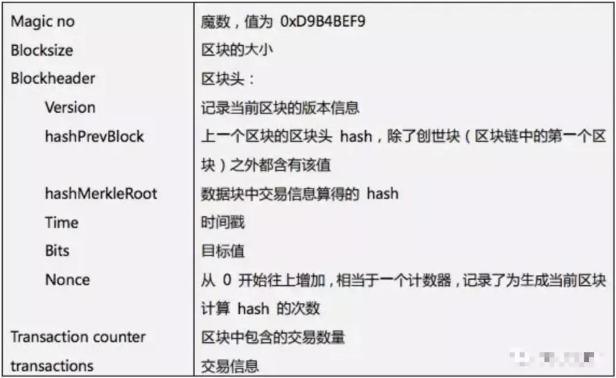

**钱包和交易**

比特币钱包的地址就是公钥通过Base58算法编码后的一段字符串，使用该算法可以将公钥中的一些不可见字符编码成平时常见的字符。Base58相对于Base64来说消除了非字母或数字的字符，如：“+”和“/”，同时还消除了那些容易产生混淆的字符，如数字0和大写字母O，大写字母I和小写字母l。这一段用作比特币钱包地址的字符串就相当于一个比特币账户。

交易属于比特币中的核心部分，区块链应用到数字货币上也是为提供更安全可靠的交易。交易之前会先确认每一笔笔交易的真实性，如果是真实的，交易记录便会写入到新的区块中去，而一旦加入到区块链中了也就意味着再也不能被撤回和修改。

交易验证流程大概为：

1.验证交易双方的钱包地址，也就是双方的公钥。

2.支付方的上一笔的交易输出，前面也说到了钱包里面是没有存放你的比特币数量的，而你每一笔交易都会产生交易输出记录到区块链中。通过交易输出可以确认支付方是否能够支付一定数量的比特币。

3.支付方的私钥生成的数字签名。如果使用支付方的公钥能解开这个数字签名便可以确认支付方的身份是真实的，而不是有人恶意的使用当前的支付方的钱包地址在做交易。

一旦这些信息都能得到确认便可以将交易信息写入到新的区块中去，完成交易。受比特币区块大小的限制（目前的为1MB，一笔交易信息大概需要500多字节），一个区块最多只能包含2000多笔的交易。因为区块链中记录了所有的交易信息，所以每个比特币钱包的交易记录和币的数量都是可以被查到的，但是只要没有对外公开承认钱包地址是属于你的，也不会有人知道一个钱包地址的真实拥有者。

还有一种交易叫做coinbase交易，当矿工挖到一个新的区块时，他会获得挖矿奖励。挖矿奖励就是通过coinbase交易拿到手的，也一样是需要把交易信息添加到新的区块中去，但是coinbase交易不需要引用之前的交易输出。

**安全问题**

比特币基于区块链，具有去中心化结构，用户通过一个公开的地址和密钥来宣示所有权。某种程度上，谁掌握了这个密钥，谁就实质性地拥有了对应地址中的比特币资产。而区块链的防篡改特征，是指比特币的交易记录不可篡改，而非密钥不会丢失。同时，也正因为区块链不可篡改，密钥一旦丢失，也意味着不可能通过修改区块链记录来拿回比特币。

因此针对比特币的盗币事件屡有发生，主要是通过下面三个手段：

1.交易平台监守自盗

2.交易所遭受黑客攻击

3.用户交易账户被盗。

交易平台监守自盗可以向平台索回，但是黑客攻击导致的盗币，很难被追回。因为黑客一旦盗取比特币，接下来便会通过混币等手段进行洗白，除非有国家力量强力介入，否则追回的可能性仅仅停留在理论层面。

### 5-2 区块链与供应链金融

#### 供应链金融面临的问题

供应链金融以供应链起点至终点的真实贸易情况为基础，以贸易产生的可确定未来现金流为直接还款来源。四流合一成供应链企业融资关键（**四流：资金流、信息流、物流、商流**）。

那么供应链金融在业务模式上就存在四流难合一的情况，法律规定企业间部分商务信息需要以纸质票据的形式传递，信息互联网技术在企业间搭建信息系统会出现数据安全不可信、数据准确不可信等问题。企业间缺乏统一的商务信息系统使得四流难合一，从而形成了中小企业贷款难、银行风控难、相关部门监管难的情况。

在融资模式方面，各类融资模式由于业务场景不同，面临着除四流难合一外的场景化问题：

1.预付款融资场景：

融资基础：预付款项下客户对供应商的提货权；

价值：缓解一次性缴纳大额订货资金带来的资金压力；

主要形式：先票/款后货授信、担保提货授信等；

风险：上游供货商出现不能按时、全额发货等情况，融资企业失去提货权等。

2.应收账款融资场景：

融资基础：真实合同下的应收账款作为还款来源；

价值：缓解下游企业赊销账期较长或资金较大所带来的资金紧张；

主要形式：保理、保理池融资、反向保理等；

风险：贸易非真实性风险、买方不承认、缓付或不付应付账款发生商业纠纷风险等。

3.库存融资场景：

融资基础：对资产（货物）的控制；

价值：缓解在途物资及库存产品占用的资金；

主要形式：静态抵质押授信、动态抵质押授信等；

风险：运输风险、销售不佳无法变现、融资企业失去货物所有权等。

4.战略关系融资场景：

融资基础：无抵押物情况下，基于供应链企业之间的战略伙伴及长期合作产生的信任进行融资；

作用：满足无抵押物企业的融资需求；

主要形式：通常选择一级分销商作为战略伙伴；

风险：基于关系治理，不可控性强，无抵押无，风险相对较高。

在供需对比方面，企业贷款难、小型企业尤为严重。小型企业缺乏完善管理机制、财务报表不规范，银行很难通过其自身提供的信息进行有效风控。而供应链金融模式下，核心企业信用只能传递至一级供应商，多级供应商无法借助核心企业信用进行贷款融资，对小型企业贷款难的问题解决度力有限。

在市场规模方面，供应链金融市场渗透率低。是否需要贷”和“是否能贷”是影响供应链金融市场规模的两个因素。而对“需要贷”的企业会面临“不能贷”的问题。通过解决传统供应链金融模式存在的问题，让更多“不能贷”企业实现“可以贷”，可让市场规模得到释放。

问题总结与原因分析：

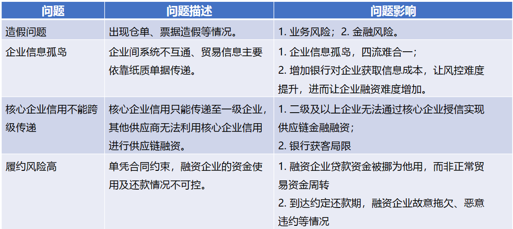

#### 区块链+供应链金融解决方案

**四流上链：数据更可信，线上操作：业务更高效**

目前在行业中，区块链+供应链金融未形成标准化解决方案，数据管理方式不同是主要的差异化体现之一），整体对业务的创新与优化主要体现在：凭证可多级拆转融、业务线上执行、数据存储上链。对比传统业务模式，优势主要体现为：

•**最大化实现四流合一**，区块链难篡改使数据可信度高，降低企业融资及银行风控难度；

•风控数据获取、合同签订、票据流转等**业务执行线上化，周期短、效率高**；

•**凭证可多级拆转融**，解决非一级供应商融资难、资金短缺问题；

•智能合约固化资金清算路径，极大**减少故意拖欠资金等违约行为的发生**。

**业务场景：反向保理：凭证拆转融，解决多级供应商融资难及资金短缺问题**

除四流难合一外，核心企业信用只能传递至一级供应商、而多级供应商却无法借助核心企业信用进行贷款。区块链解决方案可实现电子凭证拆转融：用链上电子凭证代替传统业务模式中的纸质商票。电子凭证可拆分，持有凭证的下游供应商可用全部（或1/n）凭证支付给上游供应商，可贴现，可融资。

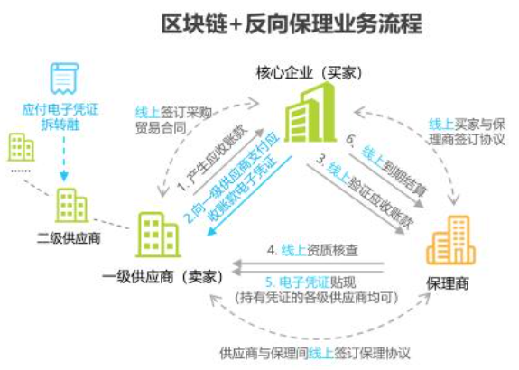

**区块链+反向保理价值分析**

1、解决多级供应商授信问题：赊销盛行使上游供应商资金缺口较大，若无核心企业背书难获得银行优质贷款。传统纸质票据无法拆分，只能在核心企业与一级供应商间流转；而链上电子凭证可由一级供应商拆分流转至二级（和多级）供应商，从而让核心企业信用传递至多级供应商。因赊销导致供应商资金短缺问题得到解决。

2、贴现效率高：线下纸质票据变为线上电子凭证，贸易、融资周期极大缩短，（贴现）理论上为0～12小时。

3、降低生产成本：综合（1）（2），通过降低供应商贷款成本，从而有利于降低原材料或中间产品生产成本，并最终降低核心企业的整体生产成本。

**业务场景：ARIF：链上电子仓单凭证解决纸质仓单造假问题**

ARIF（accounts receivable and inventory financing），库存与应收账款融资，是以资产控制为基础的商业贷款的基础。通常库存占整个供应链运营成本的30%+，仓单的无重复抵押、真实性、货物监控是仓库管理的关键，数据全面、可信成银行审批关键。

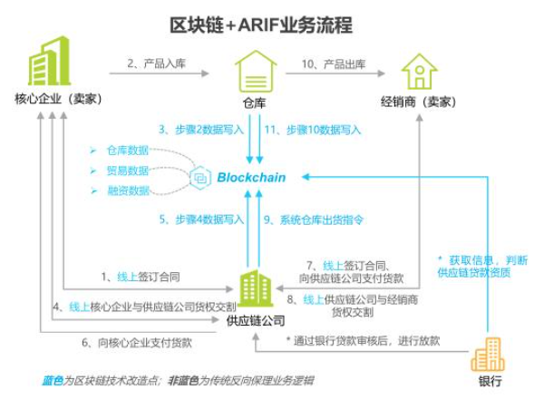

**区块链+ARIF价值分析**

1、极大降低仓单造假风险，优化仓库管理：传统业务模式中，仓库取货以纸质票据为凭证，造假风险较高；区块链系统上以电子凭证代替纸质票据、由RFID、AGV、视频分析等技术监测商品进出库等动态、读取商品信息并写入区块链系统，从而降低仓库管理造假作弊风险

2、降低供应链公司的贷款难度：相比于IT线上系统，区块链的难篡改特性让链上数据可信，更易获取银行的信任，降低了供应链公司的贷款难度。

#### 区块链+供应链金融典型企业案例

**蚂蚁金服-双链通**

双链通是蚂蚁区块链基于核心企业应付账款在其产业链上流转的供应链协作网络。应付账款开立、流转、拆分、融资、清分都运行在蚂蚁区块链之上。核心企业、金融机构、服务机构、合作伙伴皆可入驻生态，成为金融级高可信联盟链成员。

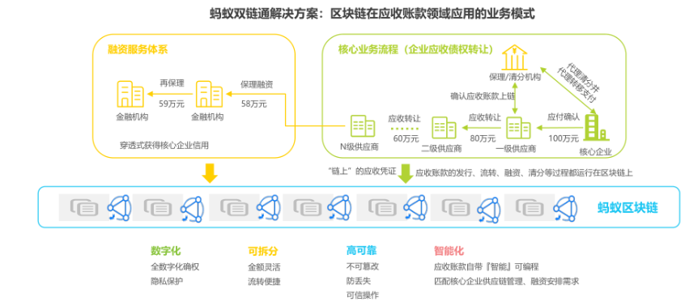

**布比区块链-壹诺供应链**

•通过区块链共享账本为记账依据，充分实现信息、资金、物流统一；

•可向多级供应商提供金融服务，以核心企业的信用为保障，做为整个产业链条下第一还款来源，风险可控；

•银行虚拟账户对接银行支付通道，利用智能合约固化资金清算路径，避免违约的同时实现企业内部资金调拨、对账管理。

•设立拆分、流转的收益分配机制，鼓励应收资产逐级流转，满足不同场景、不同参与方资金诉求；

•T+0在线融资放款。

•提供企业互联网实名认证、可个性化配置的流程化管理；


#### 供应链金融的主要挑战

首先，供应链金融企业的发展受制于整个供应链行业对外的低透明度。

供应链所代表的是商品生产和分配所涉及到的所有环节，包括从原材料到成品制成再到流通至消费者的整个过程。目前的供应链可以覆盖数百个阶段，跨越数十个地理区域，所以很难去对事件进行追踪或是对事故进行调查。

买方缺少一种可靠的方法去验证及确认产品和服务的真正价值，因为供应链普遍缺乏透明度，这就意味着我们支付的价格无法准确地反映产品的真实成本。

其次，高居不下的交易成本。

仍然以应收账款为例，从显性的角度考虑，传统供应链金融链涉及到应付账款方、增信机构、保理机构的多方处理，花费时间长、成本高，这是由于必须由信任机构完成相应的认证和账务处理，通常至少要耗费数周时间才能到账，手续费用昂贵。从隐形角度考虑，为了获取一笔应收账款，交易公司通常要进行大量的调研，并在此基础上进行风控。如果标的金额太少，利息都覆盖不了成本。

第三，核心企业的“魔咒”。

上述问题的出现和叠加促使核心企业登上历史舞台。就像上下游之间的堤坝，核心企业起到了贯穿产业链的作用。对于核心企业来说，天生具有从事供应链金融的优势。核心企业几乎掌握了所有上下游企业的交易数据，手头握着所有的应收、应付账款，兼具天时地利人和。比如，海尔集团、迪信通等行业巨头都成立了自己的供应链金融公司，并试图用互联网的方式来提高效率，改造行业。

当前，核心企业模式是供应链金融的主要模式。核心企业在供应链金融的发展历程中具有积极意义，然而伴随着核心企业不断发展壮大，历史的车轮再次重复，先进生产力终将成为阻碍进步的绊脚石，核心企业的存在也会限制平台型企业的发展。这是因为核心企业作为供应链金融中最为重要的角色，它们的话语权和议价能力都十分强大，这就会使得很多平台型供应链金融遭遇一种尴尬：核心企业和他们达成合作，很快就会看到供应链金融的好处，进而想到“为什么这个事情我不能自己干?”于是，解除合作，开始自建团队、亲自操盘。

因此，很多平台宁可放弃行业巨头、和小公司或保理公司合作。核心企业的“魔咒”，桎梏了众多平台的发展。核心企业模式只能用于自身行业、甚至只能是在自己的产业链条上做文章，天花板太低。除此之外，采用核心企业模式也会出现联合诈骗的可能性。

#### 什么是供应链金融

供应链金融并不是一个新生事物。实际上，传统金融机构就一直在干这件事——给企业融资。由于交易双方都是个体，相互之间很难产生信任关系，进而导致了巨大的“信用成本”。因为这种不信任，很难做到实时的交易交割。

比如，一家公司和供应商签订合作关系，必须有1到6个月的账期，不可能货到付款。为了给生产提供驱动资金，供应商又不得不去银行贷款，并为此支付利息，从而增加了生产成本。

与此同时，很多行业也很难从银行拿到贷款。以煤炭物流行业举例，银行恐怕都不太敢贷款给煤炭物流商。他们的抵押物只能是煤炭，基于这一行业的特点，银行很难准确评估抵押物的价值，整体风险承受能力受限。大企业难，中小企业更没有可能从银行拿到钱。要么需要抵押物，要么需要信用背书，中小企业得过五关斩六将才能满足银行的硬性要求并拿到贷款。而实体经济要落地生产，又需要资金作为润滑剂。

供应链金融，就试图用一种新的方式来解决资金的流动问题。传统银行的贷款方式是抵押物，而抵押物在供应链金融中就是应收账款或票据等交易凭证。在产业链中，常常会存在多个资金不流通的阻塞点。比如，一家大公司和供应商签了200万的采购合同，合同规定6个月后才全额支付款项。这6个月，就是账期。

如果供应商遇见困难，需要资金周转怎么办?

供应链金融的玩法是，将这6个月的应收账款当成抵押物，拿去金融机构借钱。当然，供应商提前拿到钱，需要支付一定利息，200万可能只能拿到180万，剩下20万算利息。6个月后，大公司不再给供应商付款，而将货款200万结算给金融机构，金融机构凭此获利20万。这就是供应链金融的核心逻辑——试图打通传统产业链所有不通畅的阻塞点，让链条上的所有资金流动起来。

### 5-3 区块链与公共卫生事件

这个农历新年假期，我们都在经历一场影响全球的公共卫生事件带来的冲击。我愿意相信所有的相关参与者，本意一定是想努力把事件带往最好的结局。当然，我们都看到了，此次公共卫生事件，跟全球之前的一些其他性质的公共事件一样，治理的过程往往都无法做到事事顺意，甚至有时候还会事与愿违。

盖因其性质上的“公共”的特点，导致相关参与方众多、相关利益方多元、相关关系者复杂、相关方目标不同......所以公共事件的有效治理在全球都是一件几乎不可能完成的任务。

尤其在信息社会时代，在复杂的网络背景下，从2003年的“SARS”到现在的“新冠肺炎”（NCP），我们发现单靠自上而下的治理机制，已经越来越难于包打天下甚至越来越难于有效管控了。这不仅是因为近十几年高铁大发展，导致人员在全国的快速流动，更是因为互联网尤其是社交网络的发展所导致的信息发布、传播的多元和过载。

信息化时代，复杂网络结构带来的复杂社会现象，给全球的公共事务治理带来了很多新的问题；但数字化技术，也给全球公共事务治理创造了很多新的工具，比如人工智能、云计算，以及区块链。

从这次疫情防控过程，我们看到，主要有以下几个方面急缺的技术：

①预警技术。在疫情预警方面，虽然不一定是应用区块链技术，但是数字技术、IT技术是能解决这方面问题的。当年H1N1疫情发生的时候，谷歌是通过搜索药品和购买药品数据来确认疫情发展情况。反观这次疫情的预警出现非常晚，从而没有给武汉市民留下空间。

②其次是捐赠物资、钱款的透明性以及物资配送的及时性。到目前为止，我们知道的一些最前线的机构、部门，物资还是非常紧张，紧张到难以想象。物资的调配调动，也需要更好的解决方法。

③给民众的医疗物资的配发问题。首先是通知的时间不及时，其次是民众医疗物资和生活物资配发。在改革开发以前，票证可以在紧缺经济当中起到配给作用，但这次疫情太突然了，甚至连这个很熟的工具也没用起来。统一分配这个体制，现在感觉不到有明显的效果。配发配送配置，是IT系统、信息系统能很好解决的问题，但大家没有做好这方面的准备，所以这次疫情中出现了一定程度的混乱，到现在还没有优化到很好。

④稀缺物质的优化配置。比如医用酒精、N95口罩这些物资，优先配置给哪些部门哪些人？我们社会做资源的配置，一般是两种机制，一是市场机制，价高者得；其次是找一个权威机构来集中配置。但是真正到了灾情发生的时候，就会发现，第一种机制不合理；第二种机制也不理想，容易出现按照权利和关系进行分配，而不是按需分配。我们缺少第三、第四种资源配置方式，所以导致一遇到问题就抓瞎。

这次所有的IT手段，发挥的作用都不太给力。区块链技术这一次虽然有借口，因为从区块链技术得到正名至今才几个月时间，这项技术来不及做什么事情。但是区块链之外的其他技术，效果也并不让人满意。反而是存在十年以上的技术应用，比如微博，微信这些社交媒体，救了一些人。个人认为，各种技术本身可以在疫情中发挥更大作用，但这次可能是因为疫情发展趋势超出预料，平时疏于防范，所以一下子没能发挥作用。比如智慧城市的建设在平时更偏重效率一些，没有更多考虑风险防范方面的内容。

**区块链技术两大特点决定了它在疫情防控中发挥空间大**

从原理上来讲，区块链最大的特点2个：

一个是**分布式共识协议**，以前的分布式协议，它的能力仅限于在同一个利益主体内部，把计算资源进行分布，但还是归一个中心管，我在他们中间形成同步，形成共识。它的计算节点可以跨越信任边界，即便每个人意见不一样，每个人有自己的私欲、观点、看法，可以彼此相互不认同、不信任，但仍旧可以基于区块链协议达成共识，形成状态的一致。

其次是**区块链有特殊的存储结构**，可以很容易进行验证。可以把验证成本降到极低，如果做一件事情需要非常多的验证，比如金融、比如食品药品安全，传统的IT系统，在验证方面，能力差，成本高，区块链可以通过一系列设计（哈希指针、分布式共识协议等）让验证成本非常低。

对于区块链拥有者来说，使用区块链之后，他可以自证清白，让别人在系统上进行验证。区块链技术这种能力特别适合于用在在一个需要高度透明化，需要频繁验证，取得共识、信任的场合。尤其是在一个特别混乱的阶段，个别传统的权威会失去权威性，那么此时有个能自我验证的系统，是非常重要的。但在平时正常情况下，去推广这样一个自验证系统，很多企业会抵触，关涉到自我企业的机密。

区块链能为防疫抗灾做点什么呢？

**最优化公信实现**

第一，公共事务的治理往往需要多方信息的互通、互证、互享，而这种互通、互证、互享必须低信任成本并且及时、高效、可信。分布式账本最基本的技术特点是数据可由参与各方添加，由参与各方互证、互认以实现不可篡改、不可撤销。

公共事务治理当中的信息公开、存证和溯源，是一项最好不过的区块链应用了。利用分布式账本技术来做善款的追踪、食品和药品的溯源、项目进展的透明化等，早已经是通过区块链实现的很成熟的解决方案。

任何突发的公共事务，一定都是短时间里全社会范围内万众瞩目的事件，两千万人昼夜“监工”武汉临时医院的建设就是一个明证。给全社会一个可靠、可信并且公开、透明的“数学证明”，可能是让全社会最快达成共识，最快产生公信的最好方法。

毕竟，通过数学算法得出结果，所有人都可以自行验证其正确与否。一加一等于二的结论，全球七十亿人都认同。关于区块链在这方面的作用，业界已有不少实践了，此处不再赘述。

**最高效多方协同**

第二，公共事务的治理往往需要多方参与，需要大规模协同作战。全球大多数公共事务治理过程中出现的处置不当、处置效果不彰或者处置效率很低等问题，都与不能很好地协调参与多方来有效地进行大规模协同作战有关系。

区块链被设计成一个多方参与记账，共享一个账本的“总帐系统”，例如以太坊当年就是以建立一个“全球计算机协作网络”为目标的。虽然以太坊追求的最高目标目前还没有达成，但作为参与各方共同记账的数据总帐系统，区块链已经可以有效地运作了。

公共事务的治理模式不能照搬公司事务的治理模式。自上而下的集中决策机制在面对公共事务治理时，至少在这三方面可能力有不逮：

①是无法有力地协调众多外部或者跨界的参与方，对很多的外部参与方，决策者不可能每个那么熟悉；

②是对发生在边缘、底层的复杂情况和紧急情况反应不及时，甚至毫无察觉；

③是术业有专攻，公共事务的治理需要汇集众多的资源与能力，它不是一个集中决策机制所能够涵盖的。本次武汉红会处理全球捐赠物资的错乱，反映的就是中心化治理机制在公共事务治理当中的无能为力。医疗物资的仓储、运输、分发，是特殊行业的一门特殊专业，连医院都要依靠专业公司的服务，红会自身怎么可能短时间建立起来这方面的能力呢？

区块链分布式总帐系统，就是一个帮助建立大规模协同作战系统的技术，从而实现开放节点接入许可、依据各自角色担任特殊节点、共享所有数据、共同确认数据、分别负责各种任务等多个方位协同。

**最有效激励机制**

第三，公共事务治理的参与方往往是不同利益主体，所以需要尽可能地照顾到各方利益，才能发挥出各方的积极性。清华大学贾西津教授论述过政府保障责任和社会志愿机制是公共事务治理当中的两种资源配置机制。政府保障责任与社会志愿机制是相辅相成、互为补充、缺一不可的。但如果对社会志愿机制实行统筹调配，又会打击社会志愿机制的积极性。在本次疫情事件过程中，我们也看到很多社会志愿者想尽各种办法来绕过湖北省宣布的统筹调配机制，甚至不惜动用直升飞机来把捐赠物资送到指定捐赠对象手里。

这其中主要原委在于：

* 因为公共事务治理的非营利特点，吸引各参与方积极参与的利益诉求不再是经济利益的分配，因此不能再依靠中心化机构来掌控、评价和分配。

* 社会志愿者的动机可能是同情心、家乡情、社会声誉、慈善公益、个人英雄主义、企业文化、医学研究等等等等。

* 面对疫情事件利益相关者的正当利益诉求，如何建立一个足够满足这些五花八门利益诉求的“激励相容”机制？靠原来熟悉的“统筹调配”机制，显然是无能为力的。

* 区块链的激励机制本来就是为了解决对“利益相关者”激励相容而设计。区块链是在世界越来越平、社交关系越来越虚拟化、机构越来越平台化网络化、经济和社会活动越来越数字化的时代，为解决去中心化治理的有效性而诞生的技术系统。

* 区块链的激励机制，不是用来有效解决中心化事务处理模式的激励问题；它是用来有效解决利益多元化的、去中心化的、利益相关者模式的有效激励问题。

* 因公共事务治理的非营利性，相关参与方肯定不能用经济手段来调动积极性，尽可能地照顾到所有参与方的不同利益动机，建立一个有效的、激励相容的激励机制，是决定公共事务治理成败的关键之举。

**最可靠隐私保护**

第四，公共事务治理往往是跨界、跨行、跨专业甚至跨国的：让武汉红会非常头疼的药品和医疗器材的存储、运输、分发的问题，却是九州通医药公司的日常事务；日本目前确诊的一百位新冠病毒患者，其中七十几位是来自于一艘国际邮轮的各国游客；中国疾病控制当局从一开始就积极向世界卫生组织和全球主要国家通报了在中国发生的疫情及基因分析情报，以寻求全球合作。

这样各色各等的陌生人或互不隶属的机构，要达成合作关系共同来解决世界性的公共事务问题，确认合作意向也许并不困难，但是真正开展实质性的合作，往往就会涉及参与多方的数据交换和数据协同计算的问题。

各国、各行业、各个人都存在数据主权、数据产权、数据隐私的确权和保护需求。坚实可靠的数据确权和数据隐私保护，是跨国、跨行业、跨个人大规模合作的前提条件。

区块链的分布式账本、共识记账、经济激励、社区治理再加上诸如哈希函数、零知识证明、同态加密、可验证计算、安全多方计算等密码学算法，是上述世界性合作博弈难题到目前为止最优雅的解决方案。

典型案例：如何用区块链解决防疫时期的口罩供给问题?

如果当疫情陷入紧张状况时，每人一天只节省的使用用一张口罩的话，那么每天的口罩用量将会达到十四亿张。假使以14天的潜伏期来看，人们至少需要14张口罩，连续配带，因此会需要拥有上百亿张口罩，才有机会彻底避免病毒的传染。

口罩供需在紧张状况面临的赛局问题

关于口罩的购买，从赛局的角度来看，即便每个人不贪心，也会害怕有其它人将口罩垄断，因此人们在自由市场购买口罩的时候，保守估计，也会抓平均一人10张。

因此，就算假设没有恶意囤积口罩的人，仍然必须够同时间提供几百亿张于市场，才有机会确保善良的人，可以人人买到口罩。

买口罩的漏洞问题以及疫情持续扩大的问题

当中国把进口问题解决之后，该如何作到公平的平均分配呢? 这会是个大问题，因为我可以A 店买三张，接着再到B 店买三张，一直买。

这样子就永远有一群人永远买不到口罩，而这群人买不到口罩的时候，疫情的传染就会永无止尽反覆的传染不止，而进口的口罩量就会持续被消耗，若这消耗的口罩是降低来自他国库存的话，那么便会陷入全球数量来不及供给的状况。

也就是说，这是个很严肃的问题，口罩的产能一直有限，而全球库存也有限，你必须要能够一次进口足够大量的口罩供人民使用，并且能确保每个人都拿到一定的口罩量，这个会阻止传染的一个有效方法。

区块链要解决口罩供需的场景

因此我们必须要在口罩量不足的情况下，在人人自危的情况下，让大家有信心可以拿到合适的口罩量，并且能接二连三的拿到口罩，好国全民众才好进行抗疫。像类似这样子的解法，也可以用来解决为何武汉人民始终拿不到外来紧急医疗资源的问题。

一个使用科技、政府、通路、捐赠者共赢的解决方案

当人们在区块链作实名认证之后，可以透过private key 上购买口罩Token, 透过智能合约，每个人可以购买的量都有限，而且大家是公平的，没有人可以超买。

人们先花钱购买了口罩token 之后，可以去各地通路上去用token 取得口罩。得到token 的通路可以用token 去跟政府换钱，又或是把这token 送给当初捐赠这口罩的人。

如果我们能够直接使用区块链，公开透明我们的口罩资讯与可追踪性，世界各国也会比较能够相信这些捐赠出来的口罩，是真的有效降低疫情传染。

民众购买口罩的方式：

(1)直接透过手机App, 作区块链上的实名认证。(提供身份证资料等)

​	(1.2)若认证不成功，可远端连线户政事务所提供协助及帮忙。

​	(1.3)若还是不行的话，才至户政事务所现场作登记。

​	(1.4)手机若发生遗失，可套用(1.2) (1.3)的作法再次取得自己的private key 。

(2) 直接使用手机In-App Purchase 购买口罩token

​	(2.1)当有多少口罩进来时，政府透过Smart Contract更新，而Smart Contract会自动把大家能够购买的数量给更新。每个人购买token的量不可超过上限。另外1个口罩token都有unique的序号，每个实体口罩也都会设定独特的unique number 

​	(2.2)这是政府作的App,消费者购卖token的现金，会流向政府。

(3)民众使用token 到各大通路与商店，用token 换口罩

(4) 人民用token 换到口罩之后, 这个流向会被纪录，并且可追縱与应用

​	(4.1)若这是捐赠者所捐出的口罩，捐赠者将可获知是谁换得口罩

​	(4.2)若这是工厂所生产的口罩，工厂直接用token跟政府换80%的现金,另外10 %的现金则分润给通路商，再10%分给物流业。通路的意思指，提供民众token兑换口罩的该商家。这样子的好处

透过以上四个步骤，我们即可以解决供给问题。

### 5-4 区块链与慈善公益

随着互联网技术在公益慈善领域的应用，慈善信息化建设进程加快，公众对慈善组织透明度的关注不断提升，尤其是对其业务活动信息和财务信息的披露。但是,我国的慈善组织的信息披露存在一些问题。

①**信息披露能力不足**，慈善组织的信息采集和处理都需要专业的培训,需要设计程序规范、运作透明的工作机制和财务管理机制，有效追逐捐赠款物的使用情况、反馈机制和公示制度，但是大部分慈善组织欠缺这方面能力。

②**披露信息的平台不健全**，尤其是一些基金会没有官方网站进行披露或官网信息更新不及时。

③**披露信息的边界不清**，除了法律法规要求慈善组织披露的信息外,其他信息慈善组织是否应该披露没有统一规定。

为了解决慈善组织的信息披露和透明度问题,我们建议以区块链技术构建我国慈善事业的4.0阶段,即区块链慈善阶段。区块链技术以其分布式数据存储模式、全网公开透明性和永久保留不可篡改性,适于解决公益慈善领域的信息披露和资金流通透明问题,以技术方式重构人与组织间的信任机制,这将带来我国公益慈善事业的重大变革,改变慈善组织信息披露的难点、提升信息披露透明度、提升公众对慈善组织的信任,进而有利于促进公众的小额捐贈,推动我国公益慈善事业的进一步发展。

**从公益1.0到公益3.0**

在过去的40年,我国公益的发展受制度和技术水平的影响,不断发展选代，我们将之划分为公益1.0、公益2.0和公益3.0阶段。20世纪80年代至20世纪末是公益1.0阶段，其典型特征是政府主导慈善。在这一阶段,慈善组织大多脱胎于政府或党群社团，以政府信任为背书进行筹款,在“大政府、小社会”的社会结构下,慈善组织的活动受到过度行政化的影响，无法合理、有效地处理慈善资源和慈善项目对接问题。从21世纪初开始，特别是2008年汶川地震后,进入公益2.0阶段，其典型特征是以企业为代表的非慈善组织加入慈善事业中。快速发展的企业以企业社会责任的名义投身于慈善事业,“企业-慈善组织联盟”成为主要慈善运作模式。

其市场性和开放性提高,但岀现慈善组织对企业大额捐贈的恶性竟争，如恶意隐秘对自身不利的信息以获得捐赠,造成慈善项目运作效率低下，资源浪费。同时,企业为了获得税收优惠,选择与政府有关联的慈善组织为合作伙伴,其中也滋生了腐败、诈捐等行为(王凯茜王大洲,2015)。在过去的3~5年,特别是2015年腾讯“99公益日”的出现,益3.0阶段到来,即互联网慈善阶段。一方面,随着汶川地震等特大自然灾害及“郭美美事件”等公益丑闻的发生,我国公民的主体性和主体意识开始觉醒,并推动我国公民的慈善意识发展;另一方面,随着互联网技术的发展和阐述,具有高度通达性、透明度和使用友好性的新媒体时代到来,为我国公益进入3.0阶段打破了技术障碍(王名、王超,2014)。

互联网技术使得公益3.0阶段具有三方面突出特征:

①是**公益慈善组织的发展更加成熟**,主要表现在数量增长快、领堿覆盖广、慈善领堿创新创业多等方面;

②是**公益慈善资源得到巨大增长**。近三年稳定在千亿元规模上,特别是腾讯“99公益日”推动的全民参与捐赠的新模式,扩大了网络筹款规模,推动我国公益慈善走岀资源短缺时代;

③是**慈善组织透明度提升**,互联网的公开、透明、快速传播的特点,推动了慈善组织的信息披露、慈善项目信息传播、受助人信息反馈等发展,一定程度上提高了公众对慈善组织的信任感。

但是,慈善组织扮演着由捐赠人到受助人的信任中介的角色,网络曝光的慈善组织丑闻引发了大范围的信任缺失,慈善组织的公信力影响着我国公众参与慈善事业的意愿和信心。具体模式参见图（互联网慈善模式中各参与主体关系示意）。

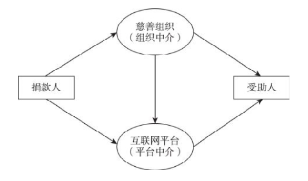

**区块链技术推动我国慈善进入公益4.0阶段**

从理论上讲,区块链技术带来的信任互联网机制将推动公益慈善进入公益4.0阶段,该阶段的突出特征是去中心化的区块链技术带来人人参与的新局面,并以技术重塑信任机制来提高慈善组织公信力,开启慈善组织公信力塑造与提升的新篇章。

近几年,随着区块链技术的出现及在公益领域的应用,区块链所构建的价值信用机制将依托于互联网带来新的信任模式。最重要的,区块链的去中心化将带来慈善模式中的“去慈善组织化”,使得慈善组织不再扮演资产流转中介的角色,捐款人和受助人直接对接,具体模式参见图（区块链慈善模式下各参与主体关系示意）。

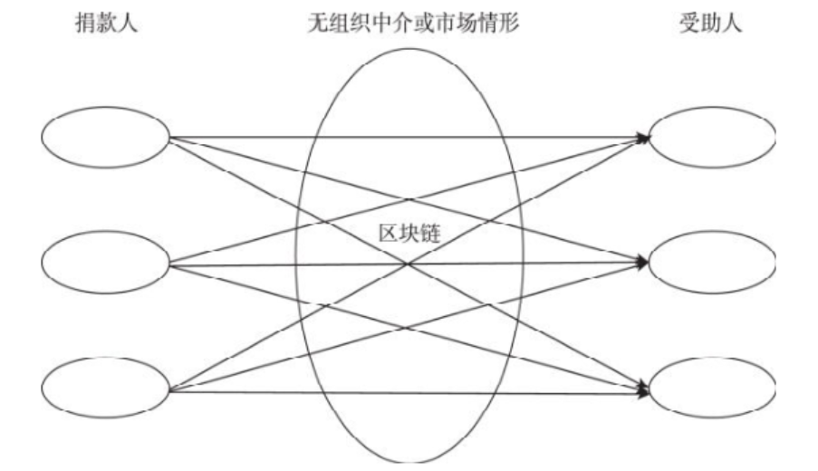

这有利于推动“慈善四化”,即捐款对象明确化、捐款流程简便化、善款金额透明化、善款管理专业化,这将显著提升慈善组织的公信力,鼓励更多公众参与到慈善事业中,推动我国慈善事业的繁荣健康发展。此外,区块链的不可篡改性,可以确保财务信息不被篡改;可匿名性能保护捐款者的隐私,尤其利于低调的企业家进行大额捐赠;在区块链技术底层引入智能合约,针对具体的捐助项目,直接创造一个专项的捐款合约，确定捐款的使用规则，可以确保专款专用，降低组织和个人贪污的风险。此外，相关数据信息上链，使得数据公开透明，也有利于规范慈善组织的信息披露。

**公益4.0阶段模式分析**

1、区块链技术可以解决四类慈善问题

将区块链应用于慈善领域十分必要,业界和学界都在关注可能的应用和研究,但目前没有一个成熟的机制。我们认为,区块链技术可以应用到公益慈善领域的四个具体方面。

①基于区块链技术的信息披露机制。区块链技术以底层技术规范建构了参与者的共识机制,此共识机制可以作为慈善组织信息披露的标准,并依据法律法规的规定,慈善组织基于便于使用的区块链技术平台(例如App),将相关信息上链,实现披露信息的透明和全网公开,解决慈善组织信息披露能力不足、信息披露平台不健全、信息披露范围不明确等问题。基于区块链技术的善款跟踪机制。可以利用区块链技术来记载和存储公益平台上的善款募集、资金划拨和使用情况,实现捐赠信息的公开和资金去向的可追踪。

②基于区块链技术的信息监管机制。区块链的信息公开和数据可追溯,使得各个参与者共同记账、信息同步,可以扮演传统监察机构的角色,对数据披露和资金流通进行监管

③基于区块链技术的公益慈善机构审计制度。建立区块链公益账户(公有链),这与原有的各个慈善机构的私有账户有显著区别,将公益慈善捐赠的数据公开化,便于相关信息的审计。

2、区块链技术将带来五方面慈善模式变革

区块链技术应用于慈善事业将带来慈善模式的创新变革。具体来说:

①慈善组织的角色发生了改变,主要任务由原有的资产流转中介转变为信息发布和审核者,其线下对项目和受助人的信息搜集和审查成为关键,这也是区块链技术不能改变的。这种角色转变,将带来慈善组织业务重点的转变,需要重新设计慈善组织的业务流程和重点。

②角色转变也带来了慈善组织与各利益相关方的关系变化，如何处理与捐赠人、受助人、网络平台的关系值得研究。

③慈善组织运营模式的改变，如管理机制、捐赠模式、筹资模式、监督机制等。

④组织财务机制研究,在区块链技术影响下,组织的善款筹集、利用、跟踪、监管等都发生了变化,组织如何应对这种变化并制定新的财务管理机制有待研究。

⑤组织信息披露方式改变,区块链的公开透明解决了慈善组织与众信息不对称的问题,慈善组织利用这一点进行信息搜集、筛选编辑、发布也会有所变化。

**公益4.0模式的实践意义**

①有助于提升慈善组织的规范、效率和公信力。公益慈善领域已有一些组织在积极探索将区块链技术应用于慈善捐款活动中。

在国内，如中国光大银行的“母亲水窖”公益慈善项目、众托帮爱心互助项目布萌区块链、蚂蚁金服基于区块链技术为中华社会救助基金会“聆天使计划”开设互联网捐赠平台、数链的基于区块链的大病综合救治系统;在国外,区块链技术被应用在慈善领域,以意大利的Helperbit平台、英国的Disperse平台为典型。将区块链技术应用于慈善领域,不仅在技术上保障了公益数据的真实性,提升了公益透明度和信任度;而且还能帮助公益项目节省信息披露成本,降低交易成本,提高捐赠效率。

②有助于动员更多的公众参与到慈善事业中,探索一条解决公益慈善痛点的路径。区块链技术解决了捐赠人对自己捐款去向的担忧,知道自己的钱到底用在了哪里,有没有用到受助人身上,用到受助人身上多少钱等,有利于解决捐赠人的捐赠痛点。

③区块链技术的去中心化将带来慈善事业的去慈善组织中介化,由此数字技术带来的信任机制将扩展慈善组织行为的有形边界,带来慈善事业范围的进一步扩展,尤其是到慈善组织力量薄弱的地区。由此,慈善事业的发展不再主要依托于慈善组织的有形边界和有限力量,区块链技术带来的分布式数据储存和传输,将实现捐赠人和受助人的点对点连接,实现更大范围的慈善互联互助。

④基于区块链技术的慈善解决方案是在信息化时代下,为重塑公正、诚信的社会主义核心价值观而进行的创造性尝试。区块链技术带来的慈善织公信力提升、捐助人对慈善组织信任感提升等,有利于推动社会中普遍信任的提升。

基于以上四点，将区块链技术应用于公益慈善领域，具有一定的必要性和实效性。

------


## 第六章: 区块链技术风险

### 6-1 隐患依旧：51%攻击

#### 51%攻击

定义：51%攻击是指掌握了比特币全网的51%算力之后，用这些算力来重新计算已经确认过的区块，就会破坏区块链去中心化的特性，同时也让网络处在几种攻击风险之下，例如自私挖矿，取消所有转账，双花以及随机分叉。

能够做到的事情：

•修改自己的交易记录，这可以使他进行双重支付；

•组织区块确认部分或全部交易；

•阻止部分或全部矿工开采到任何有效的区块；

无法做到的事情：

•修改其他人的交易记录；

•阻止交易被发出去（交易会被发出，只是显示0个确认而已）；

•改变每个区块产生的比特币数量；

•凭空产生比特币；

•把不属于他的比特币发送给自己或其他人。

#### 如何发动51%攻击

两个前提：

•掌握了比特币全网的51%算例；

•手里持有比特币；

攻击过程：

1、把自己持有的比特币出售给个人或机构，并将收益兑换成美元。

2、假设，自己出售比特币的这条交易记录将会记录在第100个区块中，攻击者就可以利用自己51% 的算力从第99个区块开始重新计算第100个区块。

3、由于自己的算力一直维持在51%，那么自己生成区块的速度一定会在某个时间点超过原有的那条区块链。

4、当自己计算的区块链长度长过原区块链2个区块的时候，根据比特币网络的协议，原区块链将被丢弃，至此攻击成功。

后果：

原区块链上99个区块之后的交易全部作废，并有以下影响：

•99个区块之后没有交易的客户的币数量没有任何影响。

•99个区块之后转出比特币的人会发现：币回来了。

•99个区块之后接收到比特币的人会发现：币消失了。

•最重要的后果是：人们对比特币网络的信心降到冰点，比特币的币值将受到重创。

其他说明：

1、51%攻击是一个相对概念，现实中无需51%算力就可以发动51%攻击，比如45%算力，有成功可能性，但非确定性成功。有这么一个场景：原块链长度100，攻击者具备45%算力，从99个区块开始计算，运气好的话，攻击块链延长到101个，而原块链还是100长度，攻击就成功了。

2、攻击可以隐藏地计算，直到比原区块链多两个块链后才放出，按照目前的比特币网络协议，可以马上取代原区块链，因而整个攻击可以不为人所知，直至最后一时刻。

#### 51%攻击悖论

攻击成本：

攻击需要掌握比特币全网的51%算力

分析这一点，掌握了比特币全网的51%算力，得需要多少钱。全网算力按照100P计算，矿机价格按照1T/8600元计算(这是目前最低的价格)51P矿机购买费用=100P * 51% * 1024 * 8600元=449,126,400=4.5亿，然后电费估计1亿元，总计花费5.5亿元。

攻击收益：

哪要卖掉多少比特币才能获得更多的利益呢，至少要获得至少5.5亿的收益，才能在帐面上收支平衡，但要做这么大的攻击，而且攻击后的币值肯定会下降，因而一定要非常大的利益才能让攻击者这么做，因而我们按照卖掉比特币能获利20亿估计。

持有比特币=20亿/10000（2020年2月比特币价格）=20万个比特币

我们假设攻击者以2000元的成本拥有比特币，他原先的买币成本是2.5亿。如果在短时间卖出20万个比特币，会把价格从10K打到谷底1K-2K了。我们姑且假定，这是场外交易，对比特币价格没有影响。

成功实施51%攻击后，我们认为在一段较长的时间内，人们对比特币的信心降低到冰点，比特币的价格会处于较低水平，如1000元甚至更低，直至技术永远解决了51%攻击的可能性。

因而，即便攻击者成功实施了攻击，他的20万比特币的价值也将处于一个较低水平=20万* 1000=2亿。

结论：

人们挖矿的目的就是为了利益，而一旦发起攻击，很大概率会入不敷出，所以任何有理性的人，为了获得更大收益，根本不会发动这样的攻击，相反还会制止这种行为的发生，这就是51%攻击悖论。

### 6-2 增加区块容量：扩容与隔离见证

#### 扩容

定义：

举个例子：假设你在火车站等车，每趟火车间隔一小时，只能坐10个人。一旦火车满载，第十一名乘客只能等待下一趟。

区块链区块大小就类似于火车容量，当数据量（人流量）越来越多的时候，为了减少等待时间，就需要增加区块（火车）的容量，这就是扩容。

扩容的方式：

加密货币的扩容解决方案主要可以分为两种，“链上扩容”和“链下扩容”。通常情况下，链上扩容指的是直接发生在区块链上，通过改变区块大小或数据结构从而达到提高处理交易能力的解决方案；而链下扩容则指的是在加密货币的主链之外，建立外围或第二层交易网络。

线上扩容：

线上扩容指直接增大区块的容量大小。

缺点：假设你将块大小从1MB增加到1GB，当你创建块时，必须将其传送给网络中的其他人，而网络无法快速处理庞大的文件。就像你使用电子邮件，当你上传一个大文件时，邮箱会不接受。这就是增加区块大小的毛病，不能超越某个临界点，所以这种解决方案的能力是有限的

线下扩容：

线下扩容指通过区块链网络之外发生的私人协议完成交易。

举例：你每天购买早餐花费10元钱，你不愿意为这10元的交易而拥挤整个网络，所以你们签订一个合同，你每天都要付象征10元的一个通证。你向网络发送一笔交易来标记合同的开始，30天后再发送一笔交易来标志该合同的结束，合同结束后，早餐店老板可以在网络上把这30个通证交换为300元。

缺点：整个过程都集中在托管这些链下交易的服务器上，这些链下网络也是黑箱，其透明性和安全性是值得怀疑的

#### 隔离见证

定义：

在区块链中，一条交易记录包括见证信息和交易信息。隔离见证就是把见证信息即脚本签名(scriptSig)信息从基本结构(base block) 里拿出来，放在一个新的数据结构当中。这样做有以下几点好处：

•可以修复一个由交易延展性（transaction malleability）引起的问题；

•可以实现闪电网络；

•一定程度上增加一个区块里可容纳的交易数，缓解交易拥堵；

举例：

比如我们有一个交通法规，说一条大路上只能容许总面积是100单位面积的车辆。每个车我们有30个单位的面积。大马路上一次只能跑3辆车。

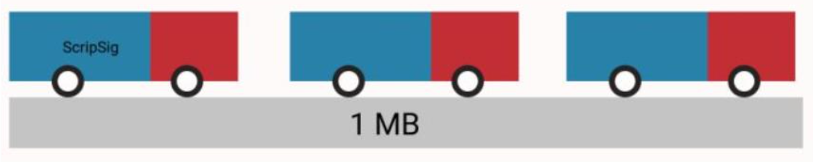

这时候把车的结构重新调整下，把拖车放到了顶上。每个车的面积单位变成了14个单位. 这时候大马路上一次能跑7辆车了。

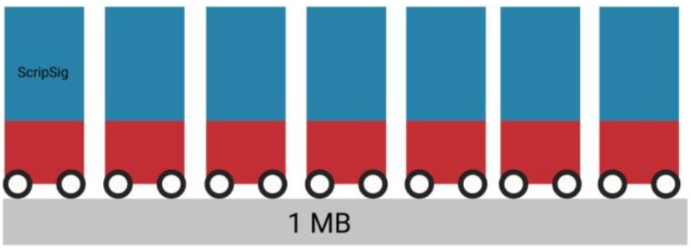

在这个举例中：马路= 1个区块		车= 每一笔交易

几个疑问：

那么脚本签名是不是和每笔交易在一起呢？

如图所释：车顶上的那个方块(脚本签名ScripSig) 是属于车的一部分。验证交易的时候签名当然会被一起验证。

见证是不是在区块链上？

如图所释：只是改变了车的结构，而且整个车还是开在马路上。所以当然在区块链里面！

隔离见证技术成熟吗？

隔离见证从提出到最后激活经历了数年时间，其实早在2016年1月21日就已经部署在测试网络了。到了**2017年8月份才正式激活**。技术已经相当成熟，但是从全部测试完毕到激活的过程又经历了很多争议。因为矿工的意见不能统一。而现在是2018年，很多人还是不了解隔离见证，然后BCH党开始各种黑这个技术。所以我觉得有必要花时间来做些研究，写些科普的知识。我们现在其实最需要的是知识的传播。

为什么不直接加大区块容量？

其实这两个扩容方法都是可以采取，但是有一个先后问题。先后次序会很大程度影响到比特币的整个网络。那么为什么技术上要先上隔离见证，简单说来直接增大区块容量让下载全节点不适合于普通PC电脑，网络中越少的全节点其实不利于比特币安全。至于大区块什么时候实施？到时候家用PC，宽带等技术都更新了。大多数人都能运行全节点。那时候上大区块也是很容易的事情。

隔离见证的其中一个好处是能缓解我们交易堵塞的问题。但是最重要的是为了闪电网络铺路。一种建立在比特币底层网络的智能合约。

### 6-3 提高交易效率：侧链与闪电网络

#### 侧链与闪电网络

在侧链技术的研究方面，Blockstream是较为领先的一个公司。2014年10月，以亚当为首的开发团队正式发布了侧链白皮书，2015年6月，Blockstream宣布将为其侧链项目发布一个开源代码库和测试环境。

侧链白皮书中提出了一种新技术——“楔入式侧链”，通过它可以实现不同区块链间资产的互相转移。由于侧链是独立的系统，因此技术与理念上的创新不会受到主链的局限，即使出现创新失败或者恶意攻击，所受的损害也只限于侧链本身。

本质上，区块链是不同数字价值的载体，而侧链技术则是连接不同区块链的通路。现在还不能断言最终成熟的侧链技术形态，甚至我们也不知道未来真正大规模应用于区块链间连接的技术是否会以“侧链技术”的名义出现，但侧链技术的理念及核心功能的发展与成熟是毋庸置疑的。

**侧链协议本质上是一种跨区块链解决方案，通过这种解决方案，可以实现数字资产从第一个区块链到第二个区块链的转移，又可以在稍后的时间点从第二个区块链安全返回到第一个区块链**。其中第一个区块链通常被称为主区块链或者主链，每二个区块链则被称为侧链。这种技术为开发区块链技术的新型应用和实验打开了一扇大门。

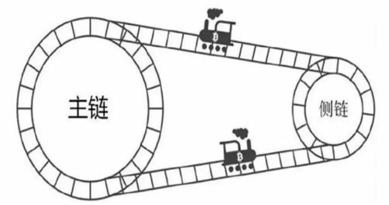

侧链协议产生的几个原因：

（1）应对其他区块链的创新威胁以太坊（Ethereum）区块链、比特股（Bitshares）区块链后来居上，对比特币区块链产生相当大的威胁，智能合约和各种去中心化应用在以上两个区块链上兴起，受到人们欢迎；而基于比特币的应用则因为开发难度大，项目不多。

（2）比特币核心开发组不欢迎附生链基于比特币区块链也有合约币（Counterparty）、万事达币（Mastercoin）和彩色币（ColoredCoin）等附生链，但是比特币核心开发组并不欢迎，觉得它们降低了比特币区块链的安全性。他们曾经一度把OP_RETURN的数据区减少到40字节，逼迫合约币开发团队改用其他方式在比特币交易中附带数据。

（3）BlockStream商业化考虑2014年7月份以太坊众筹时，获得了价值1.4亿人民币的比特币，还有20%的以太币，开发团队获得了巨大的回报。但是比特币核心开发组并没有因为他们辛勤工作获得可观回报，因而他们成立了BlockStream，拟实现商业化价值。基于以上三个原因，提出侧链协议、把比特币转出比特币区块链、另行开发二代区块链，这样的选择既能保证比特币区块链的安全，又能应对二代币的冲击，还能针对不同应用场景实现商业化，因而成了BlockStream的必然选择。侧链协议侧链协议的目的是实现双向锚定（Two-wayPeg），使得比特币可以在主链和侧链中互转。

**侧链实现的技术基础是双向锚定（Two-wayPeg）**，通过双向锚定技术，可以实现暂时的将数字资产在主链中锁定，同时将等价的数字资产在侧链中释放，同样当等价的数字资产在侧链中被锁定的时候，主链的数字资产也可以被释放。

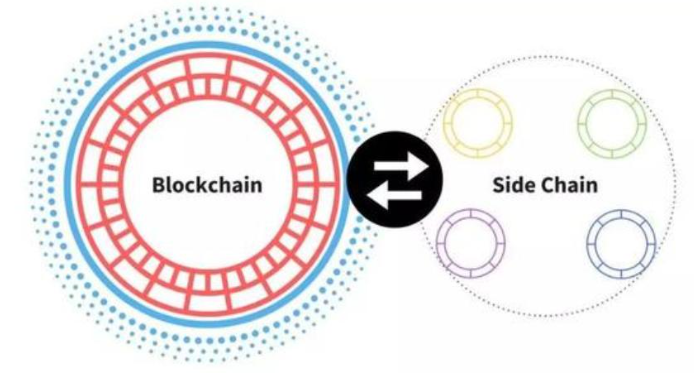

比特币主链与侧链关系图双向锚定的几个阶段：

①发送锁定交易，把比特币锁定在主链上。由比特币持有者操作，发送一个特殊交易，把比特币锁定在区块链上。

②等待一个确认期确认期的作用是等待锁定交易被更多区块确认，可防止假冒锁定交易和拒绝服务攻击，典型的等待时间是1-2天。

③在侧链上赎回比特币确认期结束后，用户在侧链上创建一个交易花掉锁定交易的输出，并且提供一个SPV工作量证明，输出到自己在侧链上的地址中去。该交易称为赎回交易，SPV工作量证明是指赎回交易所在区块的工作量证明。

④等待一个竞争期竞争期的作用是防止双花。在此期间：

（1）赎回交易不会被打包到区块

（2）新传输到侧链的比特币不能使用

（3）如果有工作量更大的工作证明出现，即该赎回交易包括了比特币主链更大难度的SPV证明，则上一个赎回交易将被替换。竞争期结束后，该赎回交易将被打包到区块中，用户可以使用他的比特币。

从侧链转比特币到主链的过程也是如此，这就是侧链双向锚定协议。

**原理**

“**无需信任**”指的不依赖外部的可信方也可完成正确的操作的特性，一般是能够让所有参与方自己验证信息是否正确。例如，密码学签名系统中，“无需信任”是一个隐式的必要条件（如果攻击者能伪造签名，那么这个签名系统将被视为被完全破解）。虽然分布式系统中一般不需如此，但比特币在系统的大部分中提供了“无信任”操作。

“**楔入式侧链**”的一个主要目标是在比特币系统模型之上最小化附加的信任。难点是币在侧链间的安全转移：接收链必须能得知发送链的币已被正确锁定。在比特币的领导下，我们提议用DMMS来解决这一问题。尽管有可能利用一个简单基于信任的方案，引入固定数量签名者来验证币的锁定，但有很多重要理由让我们避免这种单点故障的引入：

信任个人签名者，并不仅仅意味期待他们做事诚实，他们还必须永远不出漏洞、永远不会泄露关键的秘密、永远不会被挟持、永远不会停止参与网络。

由于数字签名是长期存在的，对任何信任的要求也必须如此。经验告诉我们，即使时间跨度只有几个月，信任需求也是一种危险的期待，更何况我们所期望的金融系统所能持续的时间长达几个世代。

在比特币系统消除了单点故障前，数字货币一直没有什么吸引力，社区强烈反对引入这种弱点。2007年以来的金融事件更加强了社区的不信任；对金融系统和其他公共机构的公共信任也同样处于历史的低点。

**侧链的实现方式**

单一托管：最简单的实现主链与侧链双向锚定的方法就是通过将数字资产发送到一个主链单一托管方（类似于交易所），当单一托管方收到相关信息后，就在侧链上激活相应数字资产。这个解决方案的最大问题是过于中心化：

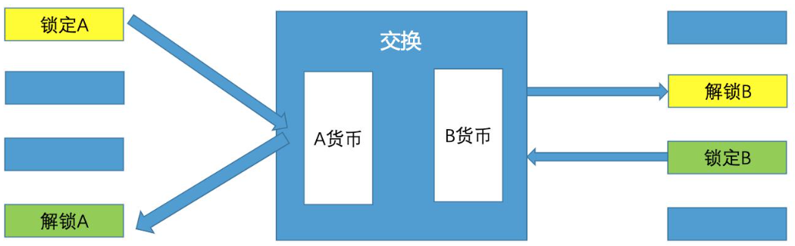

联盟模式：联盟模式是使用公证人联盟来取代单一的保管方，利用公证人联盟的多重签名对侧链的数字资产流动进行确认。

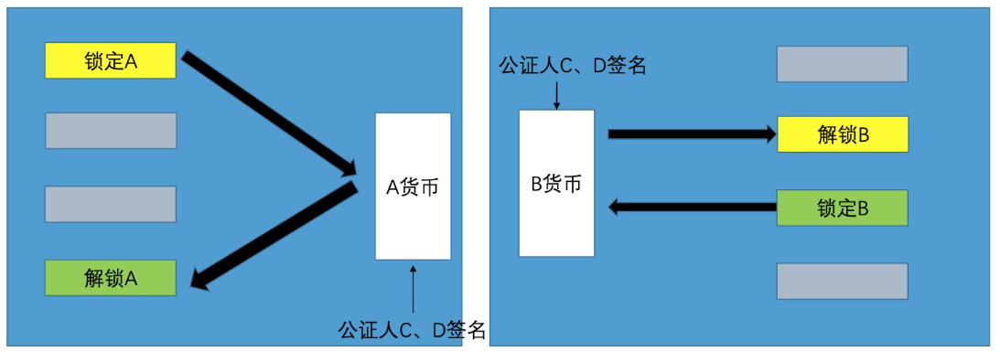

**几个侧链列举**

当前，比较著名的比特币侧链有ConsenSys的BTCRelay、Rootstock和BlockStream推出的元素链，非比特币的侧链如Lisk等。

1、BTC-Relay

由ConsenSys团队推出BTCRelay被认为是区块链上的第一个侧链，BTCRelay项目是在以太坊基金会之下诞生并成长起来的，BTCRelay其主要原理是BTCRelay把以太坊网络与比特币网络以一种安全去中心化的方式连接起来。BTCRelay通过使用以太坊的智能合约功能可以允许用户在以太坊区块链上验证比特币交易。

侧链机制不仅允许用户将交易发送到其他的地址或账户，还可以发送到其他的区块链。BTCRelay使用区块头创建一种小型版本的比特币区块链，以太坊DApp开发者可以从智能合约向BTCRelay进行API调用来验证比特币网络活动。BTCRelay进行了跨区块链通信的有意义的尝试，打开了不同区块链交流的通道。其主要示意图如下：

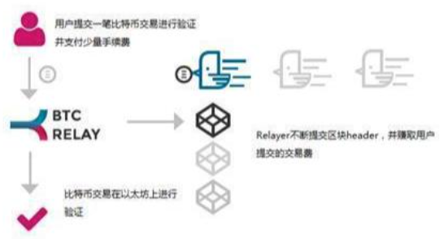

2、RootStockRoot

Stock是一个建立在比特币区块链上的智能合约分布式平台。它的目标是将复杂的智能合约实施为一个侧链，为核心比特币网络增加价值和功能。RootStock实现了以太坊虚拟机的一个改进版本，它将作为比特币的一个侧链，使用了一种可转换为比特币的代币作为智能合约的“燃料”，其原理示意图如下：

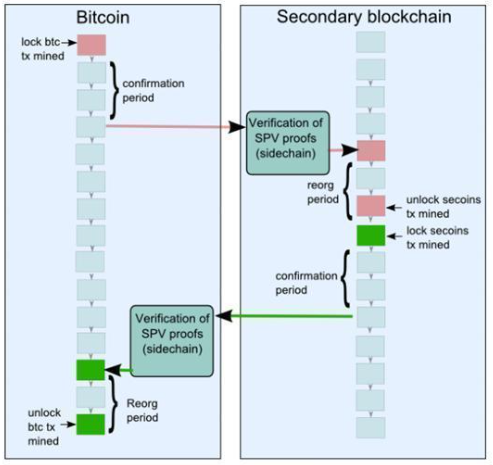

根链和以太坊在功能上是高度重合的，它们都是一个点对点的分布式计算网络嘛，根链没有发行任何代币，它是和比特币一起挖矿的，叫联合挖矿。

3、Elements（元素链）

元素链是Blockstream公司的开源侧链项目，是一个侧链的参考实现。元素链使用了比特币双向挂钩技术，侧链协议的目的是实现双向锚定（Two-wayPeg），使得比特币可以在主链和侧链中互转。元素链给比特币快速带来许多创新技术，除了智能合约外，他还给比特币快速带来许多创新技术，包括私密交易、证据分离、相对锁定时间、新操作码、签名覆盖金额等等特性。这些技术可以被任意组合应用到任意侧链中。作为一个与比特币测试网络相对接的侧链，。元素链有可能被其他技术取代。

4、LISK

LISK是新一代的区块链平台，它把每个应用加到LISK的单独侧链上。用过比特币和以太坊的朋友都知道，由于比特币和以太坊只有一条主链，所有功能和数据都加入这条主链导致区块快速膨胀，超大的区块体积，超长的同步时间，这个一个很痛苦的经历。Lisk的侧链模式给在处理高交易量下如何解决网络拥堵的问题提供了一种方法，用户只有用到相关的应用时才需要下载对应的侧链，大大减小了无效的同步数据，保持了整个Lisk网络的高效运行，而且，Lisk网络的速度随着时间的推移会继续加快，越显示他的特别优势。

**闪电网络简介**

比特币的交易网络最为人诟病的一点便是交易性能：全网每秒7笔的交易速度，远低于传统的金融交易系统；同时，等待6个块的可信确认导致约1个小时的最终确认时间。

闪电网络的主要思路十分简单--将大量交易放到比特币区块链之外进行。该设计最早是2015年2月在论文《TheBitcoinLightningNetwork:ScalableOff-ChainInstantPayments》中提出。

比特币的区块链机制自身提供了很好的可信保障，但是很慢；另一方面考虑，对于大量的小额交易来说，是否真实需要这么高的可信性？闪电网络通过智能合约来完善链下的交易渠道。

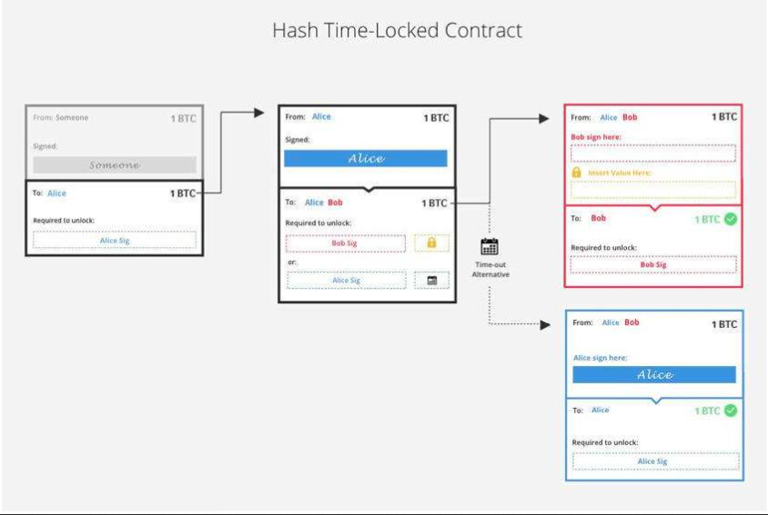

闪电网络的目的是实现安全地进行链下交易，其本质上是使用了哈希时间锁定智能合约来安全地进行零确认交易的一种机制，通过设置巧妙的‘智能合约’，完善链下通道，使得用户可以在闪电网络上进行零确认的交易。

**核心的概念主要有两个：RSMC（RecoverableSequenceMaturityContract）和HTLC（HashedTimelockContract）**。RSMC保障了两个人之间的直接交易可以在链下完成，HTLC保障了任意两个人之间的转账都可以通过一条“支付”通道来完成。这两个类型的交易组合构成了闪电网络。从而实现任意两个人都可以在链下完成交易。

**RSMC**

RecoverableSequenceMaturityContract，中文可以翻译为“可撤销的顺序成熟度合同”。其实主要原理很简单，就是类似准备金机制。我们先假定交易双方之间存在一个“微支付通道”（资金池）。双方都预存一部分资金到“微支付通道”里，之后每次交易，就对交易后的资金分配方案共同进行确认，同时签字作废旧的版本。当需要提现时，将最终交易结果写到区块链网络中，被最终确认。可以看到，只有在提现时候才需要通过区块链。

任何一个版本的方案都需要经过双方的签名认证才合法。任何一方在任何时候都可以提出提现，提现需要提供一个双方都签名过的资金分配方案（意味着肯定是某次交易后的结果）。在一定时间内，如果另外一方提出证明表明这个方案其实之前被作废了（非最新的交易结果），则资金罚没给质疑成功方。这就确保了没人会拿一个旧的交易结果来提现。

另外，即使双方都确认了某次提现，首先提出提现一方的资金到账时间要晚于对方，这就鼓励大家尽量都在链外完成交易。

**HTLC**

微支付通道是通过HashedTimelockContract来实现的，中文意思是“哈希的带时钟的合约”。这个其实就是限时转账。理解起来其实也很简单，通过智能合约，双方约定转账方先冻结一笔钱，并提供一个哈希值，如果在一定时间内有人能提出一个字符串，使得它哈希后的值跟已知值匹配（实际上意味着转账方授权了接收方来提现），则这笔钱转给接收方。

不太恰当的例子，约定一定时间内，有人知道了某个暗语（可以生成匹配的哈希值），就可以拿到这个指定的资金。

推广一步，甲想转账给丙，丙先发给甲一个哈希值。甲可以先跟乙签订一个合同，如果你在一定时间内能告诉我一个暗语，我就给你多少钱。乙于是跑去跟丙签订一个合同，如果你告诉我那个暗语，我就给你多少钱。丙于是告诉乙暗语，拿到乙的钱，乙又从甲拿到钱。最终达到结果是甲转账给丙。这样甲和丙之间似乎构成了一条完整的虚拟的“支付通道”。

HTLC的机制可以扩展到多个人，大家可以想象一下，想象出来了就理解了闪电网络。

闪电网络采用了更合理的支付网络架构，代表着效率的提高。与其向所有人广播交易，交易可以更直接地发送给收款人。只有当交易双方不诚实时，才需要进入繁琐的流程——链上共识操作。通过这种方式，可以实现相当于互联网上各方之间直接沟通所能达到的性能和效率，同时保留比特币区块链的一些安全特性。然而，如果各方想在出现问题时可以随时回归到区块链上并收回资金，那么建立这样一种支付系统是非常复杂的，并且还存在着一些重大风险和局限性。

闪电网络是如何工作的？

闪电网络的正常使用包括通过向区块链网络提交正常的资金交易来开通支付通道，然后进行任何数量的闪电交易，更新通道内资金的临时分配而不广播到区块链，最后关闭支付通过广播最终版本的交易来分配通道内的资金。

闪电网络是基于比特币区块链构建的智能合约系统，允许两方直接进行快速，廉价的支付。为了实现这些快速而廉价的交易，采取了以下步骤：

①设置一个多重签名钱包，其中包含一定数量的比特币（由双方中的至少一方提供）

②钱包地址然后保存到公共比特币区块链中，包括资产负债表（智能合约），证明该比特币存款的多少属于谁

③在此支付通道进行一次设置之后，这两方就可以进行无限次的交易，而无需触及存储在区块链中的信息

④对于每次交易，双方签署更新的资产负债表以便始终反映存储在多信用点钱包中的比特币的金额属于谁

⑤更新后的资产负债表不会上传到区块链，而是双方保留其副本。

⑥每当发生争议或支付通道关闭时，双方都可以使用最新的互相签署的资产负债表来支付他们在多信用卡钱包中的份额。

这听起来非常麻烦，但实际上对于最终用户来说，进行闪电支付几乎不需要烧脑的工作，所有上述操作都将在后台自动进行。

闪电网络使用支付渠道有效地允许用户直接与对方进行交易，而不是将业务广播到整个世界（又名公共区块链）。通过彼此跟踪彼此之间的支付，双方可以避免与区块链进行昂贵且耗时的交互。如果LightningNetwork上的余额存在某种争议，那么由双方提供的最近的资产负债表将决定多sig钱包中资金的分配方式。

闪电网络不需要对手方合作退出支付通道。双方都可以选择单方面关闭通道。因为所有各方都有多个多签名。在这个网络上有许多用户之间的通道，理论上可以通过这个网络向任何人发送付款。

闪电网络解决问题的思路——针对微支付场景

要提升比特币系统的交易吞吐量，直接在链上广播大量的交易是不可行的，吞吐量是有限的，解决的办法是压缩交易。在微支付应用场景下，如果交易双方之间会进行大量的微支付交易，那么将所有这些微支付交易都上链是没有绝对必要的，那些中间状态其实可以不用上链，只要最终所有的微支付交易的最终状态上链就可以了，因为即使所有微支付交易上链，最后的状态也还是最终状态。所以，在链下，记录大量的微支付交易状态信息，而在链上，只对创建状态及最终状态上链。将大量的微支付交易压缩为少量链上交易。这样就大大提升了交易吞吐量。简要概括就是：将大量交易放到比特币区块链之外进行，只把关键环节放到链上进行确认。

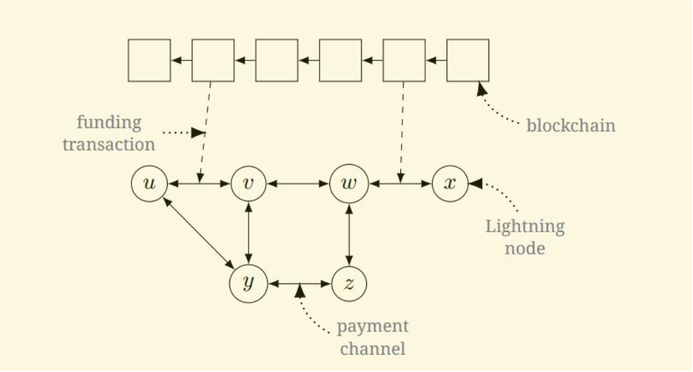

闪电网络的主要特点

理论上来说，闪电网络应该允许网络中的所有参与者通过在节点之间找到一条路径，由此能够在各个方向上进行近乎即时且廉价的交易。因此，只要没有出现问题，就可以避免向比特币网络进行广播，从而形成可扩容网络。该体系架构甚至允许小微交易并增强了付款隐私性。

由于相对时间锁定功能，通道可以无限期地保持开放，并且不存在交易对手方风险;如果有人试图通过恶意地关闭通道来窃取资金，交易的其他参与方将有一个很长的时间窗口来发起他们自己的赎回交易并收回资金。

**快速支付**：在既定通道内的支付几乎可以像数据通过互联网在两个节点之间传输一样快。

**无需可信第三方**：通道中的两个参与者直接使用常规的比特币交易进行互相支付（其中只有一个是广播的），因此任何第三方都不能控制其资金。

**为区块链减负**：只有开启通道，关闭通道和争议性交易需要提交到区块链上进行，允许闪电网络内的所有其他交易保持未提交状态。这这使得闪电网络用户可以通过比特币进行频繁支付，而不会使必须处理区块链上每笔交易的完整节点承担过多的负担。

**支付通道可以无限期地保持开放**：只要频道中的双方继续彼此合作，频道可以无限期地保持开放-没有强制超时期限。根据双方的意愿，可以长期保持通道开启，这可以进一步减少区块链上的负载，同时也可以稀释最终的费用。

**双方约定可快速关闭通道**：如果双方同意，可以立即关闭支付通道（双方可能希望等待一个或多个确认以确保支付通道在正确的状态下关闭）。双方未达成协定（如一方消失）也可以关闭通道，但需要耗费更长的时间。

**洋葱式路由**：支付路由信息可以以嵌套的方式加密，以便中间节点只知道他们收到了可路由支付的人和下次发送给谁，防止中间节点知道发起者或目的地。

**具有多重签名功能**：每个参与方都可以要求通过多个密钥对他们的付款进行签名

**跨链**：如果另一条区块链支持用于哈希锁的相同哈希函数，以及具备创建时间锁的能力，支付通道就可以跨多个区块链（包括侧链）进行路由。利用异构区块链共识规则，交叉链式原子互换可以立即发生在链外。只要链可以支持相同的加密散列函数，就可以跨区块链进行交易，而不需要信任第三方托管商。

**小额支付是可能的**：由于费用与支付金额成比例，您可以支付一分钱;会计甚至以千分之一的精确度完成。

**付款即时结算**：资金在通过网络到达目的地和返回所需的时间内发送，通常为几分之一秒。

**改进隐私**：并非每个交易都存储在公共区块链上，只有当支付通道最终关闭并且余额支付给双方

#### 区块链的软硬分叉机制

##### 硬分叉

区块链中的硬分叉，通常是出现在不升级的节点不能验证升级的节点，导致了两种不一致的规则。

其中最出名的硬分叉就是以太坊DAO事件：

最开始只有以太币，2016年7月，以太币开发者”V神“为了挽回黑客盗走以太币的损失，升级了以太币软件，使得盗走的以太币得以挽回。当然社区中不是所有人都支持开发者，所以他们没有升级软件。这样新旧软件产生了不兼容问题，按照不同的算法，形成了两条主链。分别是以V神开发者代表的以太坊，和部分社区成员代表的以太经典。

在区块链的世界中，硬分叉表示对区块链协议的重大更新，该更新不能向后兼容，在更新协议之后，未更新协议的结点的交易将会被当做无效交易拒绝。理论上来说，在硬分叉过程中，所有的结点都必须更新到最新的协议。如果没有达到100%的结点更新协议的话，那么就会产生如下的情况：一条链将会分叉成为2条，这就是所谓的硬分叉。

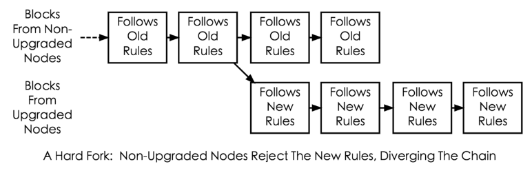

以太坊在第1920000区块高度上硬分叉出来了两条链，分别称为以太坊（简称ETH)和以太经典（简称ETC）。

1. 匿名交易（PrivateTransaction）

   在这次更新中，以太坊将引入zk-SNARKs，或者Zero-knowledgeproofs零知识确认协议。该协议的引入，将会使以太坊拥有和ZCASH，Monero一样，匿名交易的功能。

2. 难度炸弹/冰河时期（Difficulty-Bomb）

   难度炸弹是V神在以太坊源码中隐藏的一段代码，该代码的终极目的是：让以太坊平滑地从比较低端浪费资源的POW（proofof work）共识机制转化为比较高端的POS（proof of stake）的共识机制。

##### 软分叉

软分叉就是指区块链出现旧的节点验证新的节点能通过就像不知道升级了一样。

那么说到这里你是不是觉得有问题，既然新的版本兼容旧的版本又怎么会出现分叉呢？

这里的兼容是指，旧的版本能验证通过新的区块，而新升级的矿工则将旧机器新产生的区块视为非法。注意新旧矿工都承认最长链后，新的矿工不在承认旧机器新产生的区块链。

这分为两者情况：

一种是新机器先产生确认过的最长链后的第一个区块，那么旧机器也以此区块为起点构建新的区块，只是不被承认罢了，如果所有的节点都升级以后，那么久不存在旧的链了

另一种情况如果有一个时刻，旧机器先找到了新的区块，那么旧机器以此区块继续寻找下一个区块，如果旧的机器一直不停的寻找到新的区块，而新机器在这个最长链的长度赶不上旧的最长链，旧机器就会在此链上一直寻找下去，这种情况一般是由于采用PoW共识机制的旧机器算力强于新机器造成的，那么就诞生了两条链，一条是旧机器产生的，一条是新机器产生的。

#### 侧链模拟工具讲解

侧链协议是一种跨区块链的解决方案。通过这种解决方案，可以实现数字资产从一个区块链到另一个区块链的转移，之后又可以从第二个区块链返回到前一个区块链中。其中第一个区块链被称为主链，第二个区块链则被称为侧链。最初，主链通常指的是比特币区块链，而现在主链可以是任何区块链。侧链协议被设想为一种允许数字资产在主链与侧链之间进行转移的方式，这种技术为开发区块链技术的新型应用和实验打开了一扇大门。

以上是侧链的解释和作用。那么本模拟工具通过购买场景，来解释什么是侧链，侧链的用途是什么。这里我们准备了两条链，但是不知道哪一条是主链、哪一条是侧链，这里没做区分。接下来咱们注意来体验一下。

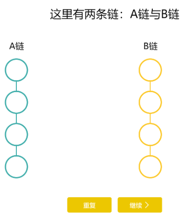

假设在A链的账户上你拥有50个A金币，这是你在A链上的资产，你在B链上的账户余额是0。接下来的问题是，你需要通过B链中的B金币向商店购买商品。那么问题来了，你在B链上账户金额是0，怎么来购买商品？这个问题就用到了侧链技术来把A链上的金币转移到B链上。

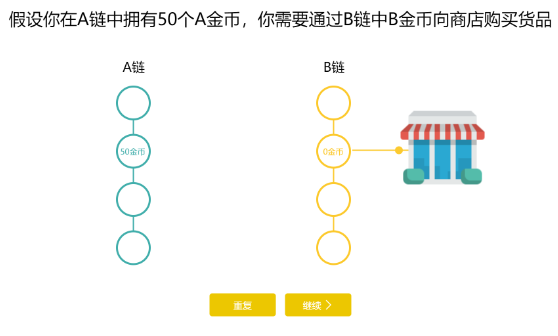

区块链是一串使用密码学方法相关联产生的数据块，每一个数据块中包含了若干网络交易的信息，用于验证其信息的有效性（防伪）和生成下一个区块，对于普通用户来说它就像一个公有账本，记载所有的交易记录，对于开发者来说可以理解为一个分布式的数据库。区块链这个数据库的特点是去中心化、开放、自治、不可篡改，区块链与去中心化应用息息相关，非常适合为去中心化应用提供存储功能。

侧链是一种特殊的区块链。它使用一种叫做“SPV 楔入”的技术实现与其他区块链之间的资产转移，这使得用户能用已有的资产来使用新的加密货币系统。人们不必再担心比特币难于采纳创新和适应新需求，只要创造一个侧链，然后对接到比特币的区块链中即可，通过继承和复用比特币强大的区块链，还避免了新货币的流动性短缺和市场波动等问题。并且由于侧链是一个独立的、隔离的系统，侧链中出现的严重问题只会影响侧链本身，这极大地降低了创新的风险和成本。

接下来我需要将A链上的50个A金币放到一个特定的地址中，进行金币锁定。这一步是最关键的一步，实现了A链上的金币向B链转移的可能。这就好比，我用支付宝向商家支付一样，先把银行卡面的钱放在支付宝里，然后用支付宝里面的钱向商家进行支付一样，整个过程是一样。但是原理却差了很多。感兴趣的同学可以了解一下，这个过程是如何实现的。

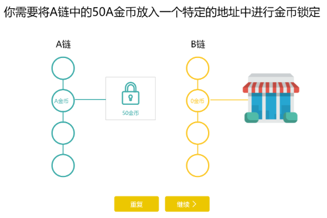

实现原理：A链向“特定脚本地址”发送一笔金币，该地址上的金币将被系统冻结。该交易成功确认后，侧链网络将会识别这一信息，并在侧链网络中的特定地址产生与这笔比特币数量相对应的侧链货币。

B链得到你这锁定信息之后，就会在B链上产生相应的金币，这里我们把A链和B链的货币都是一个性质的金币，所以在B链上会产生相同数量的金币。

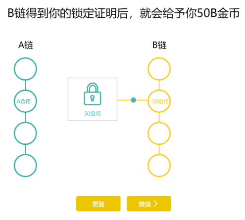

侧链原理：为了能够实现侧链，首先需要明确清晰的认识到侧链的目的，在实现主链暂时不能胜任的新需求时，能够将主链上的资产无缝的转移到侧链上，而且侧链上的资产不是一种新的独立的币，因为如果每一种侧链都引人一种新的数字货币，那么，在主链向侧链进行资产互通的过程中还要处理大量的汇率转换问题。所以侧链和主使用统一的数字货币，货币的发行机制以及本身的安全性都由主链来整体维护，侧链只需要关注技术上的创新就行了。

通过以上过程，B链上成功的出现了50金币。之后你就可以用着50金币去商店购买商品了。这个过程各位同学是否理解了呢。那么接下来有几个问题需要思考

1.为什么要用侧链来支付商品，难道主链支付不行吗？

2.侧链上的货币能回到主链上吗？

3.侧链的作用是什么？

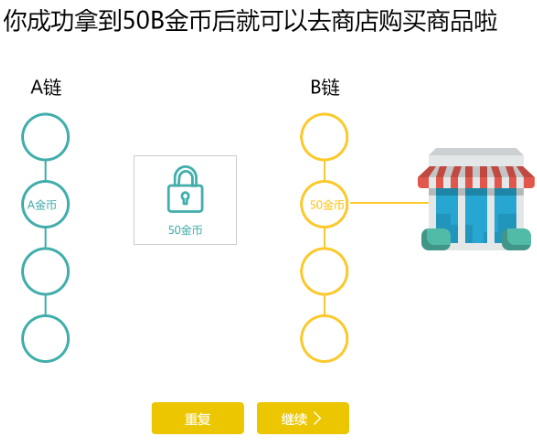

1、为什么要用侧链来支付商品，难道主链支付不行吗？

答案：用主链来支付是可以的。侧链的出现是为了弥补比特币区块链运行中的一些问题比如比特币区块链是一个单一原生的数字资产，不能与其他任何资产相兑换，以及，在比特币区块链中，由于本身强大的共识机制反而导致交易缓慢等，这些都需要比特币区块链考虑是否进行技术上的升级，来满足人们对区块链更多的需求。然而比特币区块链对整个系统的完备性和安全性都有很高的要求，对比特币系统本身的升级改造需要很严密的验证以及需要一个安全升级的途径。为了满足更多更新的需求，就需要一种辅助的区块链，首先，能够实现将比特币以一种虚拟的方式转移到侧链中，然后，不同的侧链可以根据对应的需求进行针对性开发，以帮助比特币区块链或者说主链实现其他需求，而不需要主链频繁的更新。同时，在侧链完成操作之后，在侧链中的资产可以随时的转移回比特币区块链或者主链中，从而实现资产的安全回流。由此就产生了开发侧链的需求。

2、侧链上的货币能回到主链上吗？

答案：可以回到主链上。在侧链网络中，通过特定方式“销毁”一定数量的侧链货币，例如将其发送至永远无法使用的特定地址。比特币网络识别该信息后，从之前被“冻结”的比特币中“解冻”与侧链币“销毁”数量相对应的比特币，并将其发送至比特币网络中的特定地址。通过以上方式，可以实现比特币网络中的货币价值在主链与侧链间的转移。例如，某比特币侧链发行的全网货币基于主链冻结了l万比特币，则这1万比特币此时在主链上是无法使用的，相当于移出了比特币主链网络。

3、侧链的作用是什么？

答案：

•现与其他区块链之间的资产转移，这使得用户能用已有的资产来使用新的加密货币系统。人们不必再担心比特币难于采纳创新和适应新需求，只要创造一个侧链，然后对接到比特币的区块链中即可，通过继承和复用比特币强大的区块链，还避免了新货币的流动性短缺和市场波动等问题。并且由于侧链是一个独立的、隔离的系统，侧链中出现的严重问题只会影响侧链本身，这极大地降低了创新的风险和成本。

•侧链之所以重要是因为它减少了主链的‘膨胀’，‘允许主链继续保持迅速和高效，只有那些那些对去中心化应用（Dapp）感兴趣的人才会负责维护侧链，而不是所有人。此举可以使整个平台保持精简。

•侧链给予了我们非常高的可扩展性，可以通过侧链生成成千上万个DAPP（即分布式应用），因为每一个DAPP都在其自己的侧链上运行，通过使用侧链，像比特币这样的主链可以保持非常的精简并且高效，因为它并不会涉及任何的DAPP数据。

------

> © 2023 iWyh2
