# 区块链文件存储

## 1.Go语言实现命令行

### 1-1 Go语言内置的os库

#### 内置os库分析

 **1. 释义：**

**使用内置os库来打造命令行工具**，本质上就是**读取命令行参数**，**对函数进行封装操作**。os包会给Go语言提供一些函数和变量。**Os.Args**就是其中变量之一。

变量os.Args作为一个**字符串切片**。可以理解它是一个**动态容量的顺序数组**，可以通过**os.Args** **[i]**来访问单个元素，也可以通过**os.Args** **[m:n]**来访问一段连续子区间，数组长度或其数组元素数量可用**len(os.Args)**表示。而**在Go语言中，所有的索引使用半开区间**，即包含第一个索引，**不包含最后一个索引**。os.Args的第一个元素是**os.Args[0]**,它**是命令本身的名字**；**另外的元素是程序开始执行时运行的参数**。表达式**os.Args** **[m:n]**表示一个从第m个到第n-1个元素的slice。一般输出时不需要传出可执行文件的本身信息，因此一般输出都是此种表达os.Args [1:n]。

 **2.实例：**

**通过一个os.Args读取命令行参数的用法，这里新建了一个结构体classstu代表一个学生信息，再通过结构化的方式显示出来。**

**三步实现过程：**

**(1)新建学生信息结构体 ：**

```go
type classstu struct {
   Name string
   Year string
}  
```

**(2)读取命令行参数，再判断输出信息参数是否合适再输出**

```go
func PriOs() {
   args := os.Args
   if len(args) != 3 {
      fmt.Println("Please add name,years ")
      return
   }
   var classUser classstu
   classUser.Name = os.Args[1]
   classUser.Year = os.Args[2]
   for _, value := range os.Args[1:] {
      fmt.Print("参数:", value)
   }
}
```

**(3)主函数入口编译，调用封装函数**

```go
func main() { //函数体
   PriOs()
}
```

**在终端输入命令行参数代码：**

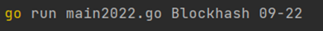

**命令行终端输出结果：**


该实例将学生信息显示在终端输出，通过的核心处理是在读取命令行参数之后再执行函数的操作（读取学生信息，赋值给定义的结构体，最后进行数据处理输出。）

**3.结构解析：**

```go
type classstu struct {                     // 结构体声明
   Name string
   Year string
}     
```

**结构体声明：**通过结构体声明格式type struct{}声明classstu结构体类型并声明其中的字段名Name,Year以及对应的相关数据类型string。

```go
func PriOs() {                   // 函数封装
   args := os.Args
   if len(args) != 3 {
      fmt.Println("Please add name,years ")
      return
   }
   var classUser classstu
   classUser.Name = os.Args[1]
   classUser.Year = os.Args[2]
   for _, value := range os.Args[1:] {
      fmt.Print("参数:", value)
   }
}
```

**函数封装：**将结构体中的字段依次赋值给动态数组参数os.Args进行输出，并在输出时剪切掉文件信息，在命令行参数输入时也判断数组长度的相关信息，只会在规定输入格式下才能有效读取命令行参数。

**细化分析：**

```go
   args := os.Args                      // 输入判断
   if len(args) != 3 {
      fmt.Println("Please add name,years ")
      return
   }
```

**输入判断：**将变量参数os.Args赋值给一个临时变量，通过临时变量args去判断动态数组的长度，如果满足数组长度为3则判断返回为true,跳出判断函数继续进行向下进行编译获取。

```go
   var classUser classstu                // 参数处理
   classUser.Name = os.Args[1]
   classUser.Year = os.Args[2]
   for _, value := range os.Args[1:] {
      fmt.Print("参数:", value)
   }
```

**参数处理：**先进行**结构体类型classstu的实例化**处理并指定结构体实例名为classUser（需要注意的是**结构体在声明构建时仅仅只是声明一个类型，系统并不会为它分配相应的内存**，**只有被实例化后才会分配内存空间**），再将变量os.Args通过命令行所获取的参数依据元素索引进行赋值，再将获取赋值依次循环打印出来。

### 1-2 Go语言内置flag库

#### 内置flag库分析

**1.结构：**

```go
flag.函数方法名(Type 指针, flag名, 默认值, 帮助信息)
```

结构分解：

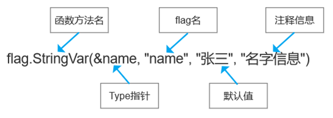

**解析**：**flag包**实现了**命令行参数的解析**。**每个参数认为一条记录**，根据实际进行定义，到一个set集合。**每条都有各自的状态参数**。

**使用flag包的正常流程为：**

**1.**  **先通过flag.String(),flag.Bool(),flag.Int()等函数来定义命令行中需要使用的参数。**

**2.**  **在定义完flag命令行参数后，通过调用flag.Parse()来进行对命令行参数的解析。**

**3.**  **获取flag.String(),flag.Bool(),flag.Int()等方法的返回值，即对应用户输入的参数。**

**需要注意的是：flag.Xxx()返回的值是变量的内存地址，要获取值时要通过在变量前加\*获取。**

**实例解析： 通过flag包的函数方法，实现命令行用户参数信息输出。**

```go
package main                  // 包文件的声明导入

import (
   "flag"
   "fmt"
)

func main() {                                                        // 函数体
   var user string
   var pwd string
   var host string
   var port int
   // &user 就是接受用户命令行中输入的 -u后面的参数值
   flag.StringVar(&user, "zl", "", "用户名，默认为空")
   flag.StringVar(&pwd, "pwd", "", "用户名，默认为空")
   flag.StringVar(&host, "host", "", "用户名，默认为空")
   flag.IntVar(&port, "port", 3306, "端口号，默认为3306")
   flag.Parse()
   fmt.Printf("user=%v pwd=%v, host=%v, port=%v", user, pwd, host, port)
}
```

在本地终端中输入打包命令：

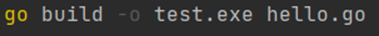

通过终端打包文件test.exe

命令行参数输入：

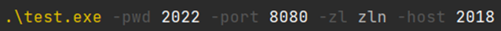

终端输出：
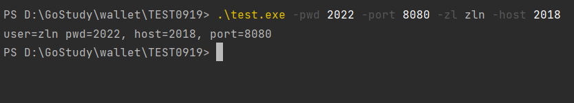

该实例**将端口信息在终端输出**，通过的核心处理是**在读取命令行参数之后再执行函数的操作**，将数据输出。

**2.结构解析**

```go
package main                             // 包文件的声明导入
import (
   "flag"
   "fmt"
)
```

**包文件的声明与引入：**通过包文件的声明与引入将程序的编译环境准备完善，通过关键字package声明main包这个特殊包，代表了该程序文件被分配所需的编译地址空间，成为了一个有运算内存的可运行应用程序，同时关键字import导入程序编译时所需的各类包方法，使函数中的编译方法能直接调用。

```go
   var user string       // 声明变量
   var pwd string
   var host string
   var port int
```

**声明变量：**Go语言是静态类型语言，因此变量（variable）是有明确类型的。变量通过关键字Var来命名标识符再通过明确变量类型来完成变量的完整声明的过程。编译器也会检查函数调用中，来验证变量类型的正确性。

```go
// &user 就是接受用户命令行中输入的 -u后面的参数值
   flag.StringVar(&user, "zl", "", "用户名，默认为空") // flag包的函数使用
   flag.StringVar(&pwd, "pwd", "", "用户名，默认为空")
   flag.StringVar(&host, "host", "", "用户名，默认为空")
   flag.IntVar(&port, "port", 3306, "端口号，默认为3306")
   flag.Parse()
   fmt.Printf("user=%v pwd=%v, host=%v, port=%v", user, pwd, host, port)
```

**flag包的函数使用**：在Go语言中，flag包使用**函数flag.StringVar()方法定义使用参数**，并**通过Parse()方法进行命令行参数的解析**。**最后获取参数解析的返回值**。通过fmt包中的输出打印参数将参数数据输出到控制台。

------


## 2.Go语言文件存储

### 2-1 文件读取

#### 文件读取分析

**1. 实例举例：通过程序实例对文件进行数据读取操作并输出相应的文件内存地址和文件内容输出。**

```go
package main                    // 包文件的声明导入

import (
   "bufio"
   "fmt"
   "io"
   "os"
)

func main() {                           // 函数体
   openFile()
}

// todo: 1、打开文件
func openFile() {                     // 嵌套函数封装
   file, err := os.Open("zl.txt")
   if err != nil {
      fmt.Println("open 打开错误： file err=", err)
   }
   fmt.Println("file:", *file)
   defer file.Close()                  // 关闭文件
   reader := bufio.NewReader(file)   // 创建一个 *Reader， 是带缓存的
   for {
      str, err := reader.ReadString('\n')     // 读取到换行就结束
      if err == io.EOF {
         break
      }
      fmt.Print(str)
   }
   fmt.Println("文件读取结束")
}
```

**同目录下的文本文件：zl.txt**

```txt
区块链人才培养摇篮-知链--ZL
区块链人才培养摇篮-知链--ZL
```

终端输出：

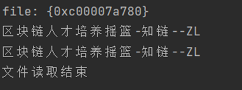

**2.结构解析：**

```go
package main                // 包文件的声明导入
import (
   "bufio"
   "fmt"
   "io"
   "os"
)
```

**包文件的声明与引入：**通过包文件的声明与引入将程序的编译环境准备完善，通过关键字package声明main包这个特殊包，代表了该程序文件被分配所需的编 译地址空间，成为了一个有运算内存的可运行应用程序，同时关键字import导入程序编译时所需的各类包方法，使函数中的编译方法能直接调用。

```go
func main() {                             // 函数体
   openFile()
}
```

**函数体：** func main() 是程序开始执行的函数。main 函数是每一个可执行程序所必须包含的，一般来说都是在启动后第一个执行的函数（如果有 init() 函数则会先执行该函数）。函数执行开始后，函数内语句依照main（）函数内依次执行。函数体在运行时编译语句，并调用封装函数。

```go
// todo: 1、打开文件
func openFile() {                  // 嵌套函数封装
   file, err := os.Open("zl.txt")
   if err != nil {
      fmt.Println("open 打开错误： file err=", err)
   }
   fmt.Println("file:", *file)
   defer file.Close()                 // 关闭文件
   reader := bufio.NewReader(file)    // 创建一个 *Reader， 是带缓存的
   for {
      str, err := reader.ReadString('\n')     // 读取到换行就结束
      if err == io.EOF {
         break
      }
      fmt.Print(str)
   }
   fmt.Println("文件读取结束")
}
```

**函数的封装：**程序通过封装将对文件进行处理，通过**os库中的open()函数来读取文件数据并输出文件相应的内存地址**。在输出文件内存地址后再**通过close函数关闭**。Open（）函数在go语言中相当于一个文件操作符，使用完成之后需要使用close（）函数关闭。

**深化分析：**

```go
   file, err := os.Open("zl.txt")        // 关闭文件
   if err != nil {
      fmt.Println("open 打开错误： file err=", err)
   }
   fmt.Println("file:", *file)
```

**打开文件：**封装函数通过os库中的函数体**Open()来打开文本文件**的相应数据，并判断文件读取是否错误，如果错误则会输出错误提示，如果文件正常打开读取则会输出文件类型相应的指针地址。

```go
defer file.Close()                         // 关闭文件
```

**关闭文件：**需要注意的是在Go语言中使用的**文件关闭方法是通过defer语句来调用**，它在文件后续的数据读取工作中起到了至关重要的作用，**defer用于注册一个延迟调用，所有函数在执行RET返回指令之前，都会先检查是否存在defer语句，若存在则先逆序调用defer语句进行收尾工作再退出返回**；因此我们注意的是在函数中defer，return，返回值三者执行的顺序应该是：**return最先给返回值赋值；接着defer开始执行一些收尾工作；最后RET指令携带返回值退出函数**。值的注意的是**defer最主要作用在于是，当函数执行完毕后，能够及时调用函数所创建的资源**。而我们**一般将该语句写在文件打开语句后是因为担心在后续处理中可能存在忘记关闭文件的情况**，**同时在后续文件数据处理中，我们也能依次使用该文件**。

这**在另一方面也解决了传统的php,java资源关闭不易控制时机的情况**，使我们不用考虑资源使用后的相关处理问题。

```go
   reader := bufio.NewReader(file)     // 创建一个 *Reader， 是带缓存的
   for {
      str, err := reader.ReadString('\n')      // 读取到换行就结束
      if err == io.EOF {
         break
      }
      fmt.Print(str)
   }
   fmt.Println("文件读取结束")
}
```

**文件数据读取：**需要注意的是，在文件读取过程中有多种方法，一类是**小型文件一次性读取**，可以**使用方法ioutil.ReadFile方法来一次性读取**，且次文件**不需要关闭文件**；但需要注意的事，涉及到项目的实际开发过程，**文件的一次性读取会占用大量的运算空间，影响整个项目的优异性**，所以在一般的项目中，采用更多的是**逐行读取文件**的函数方法，其中较为常用的方法为**ReadString,ReadLine,ReadBytes**，它们的简要作用分别为：**ReadLine 返回单个行，不包括行尾字节**,就是说,返回的内容不包括\n或者\r\n，**返回的类型为[]byte**；**ReadString('\n') 以分隔字符方式读取,遇到传入的分割字符时就返回结果,返回的结果包含分隔字符本身,返回的类型为string**,比如传入\n,代码遇到\n字符就返回,而文件行尾都是以\n结尾,所以ReadString('\n')就实现了**分行读取**；**ReadBytes('\n') 和ReadString方法差不多,只是结果以[]byte类型返回数据**；

在此实例程序中，所使用的正是**ReadString('\n')函数方法，每当它读取到分隔符是就会返回读取的字段结果**，当然返回的结果肯定也包含了分隔符本身，返回类型也是string类型的数据，以此完成了分行读取需求，并在读取完成后使用的返回err类型是io.EOF,可以通过此类型跳出循环。

### 2-2 文件的写入

#### 文件写入分析

**（1）文件写入的第一类方法：Write()方法用于写入[]byte类型的信息到文件中。**

**结构：**

```go
func (file \*File)Write(b []byte) (n int, err Error)
```

**结构分解：通过写入一个 slice, 返回写的个数, 错误信息, 通过 File 的内存地址调用。**

**实例举例：将文本“你好啊，明天”写入文本zl.txt中。**

```go
func openFile() {
   file, err := os.OpenFile("zl.txt", os.O_CREATE|os.O_RDWR, 0666)
   if err != nil {
      fmt.Println(err)
   }
   defer file.Close()
   content := []byte("你好啊，明天")
   if _, err = file.Write(content); err != nil {
      fmt.Println(err)
   }
   fmt.Println("成功写入！")
}
```

终端输出：

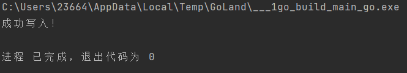

**在创建的文本中显示：**

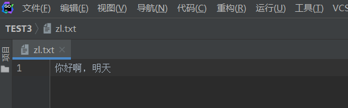

**结构解析：**

```go
   file, err := os.OpenFile("zl.txt", os.O_CREATE|os.O_RDWR, 0666) // 操作文件
   if err != nil {
      fmt.Println(err)
   }
```

**操作文件：在实例中通过os库中的读写权限设置，分别通过os.O_CREATE模式创建文件，并通过os.O_RDWR模式读写文件，并判断文件处理过程是否成功，若不成功则会输出err,若文件处理成功则会进入下一步文件编译。**

```go
defer file.Close()                 // 延迟关闭文件
```

**延迟关闭文件：**在Go语言中使用的文件关闭方法通过defer语句来调用， defer用于注册一个延迟调用，所有函数在执行RET返回指令之前，都会先检查是否存在defer语句，若存在则先逆序调用defer语句进行收尾工作再退出返回；因此我们注意的是在函数中defer，return，返回值三者执行的顺序应该是：return最先给返回值赋值；接着defer开始执行一些收尾工作；最后RET指令携带返回值退出函数。值的注意的是defer最主要作用在于是，当函数执行完毕后，能够及时调用函数所创建的资源。而我们一般将该语句写在文件打开语句后是因为担心在后续处理中可能存在忘记关闭文件的情况，同时在后续文件数据处理中，我们也能依次使用该文件。

```go
content := []byte("你好啊，明天")                // 数据文件写入
   if _, err = file.Write(content); err != nil {
      fmt.Println(err)
   }
   fmt.Println("成功写入！")
}
```

**数据文件写入：程序中通过短类型声明法声明一个字节数组的临时变量，并将文本数据通过Write()方法写入所创建的相关文件中。同样如果在写入操作中没有写入成功，函数则会输出err特定语句输出。**

**（2）文件写入的第二种方法：WriteString()方法用于将字符串写入文件。**

**结构：**

```go
func (file \*File)WriteString(s string) (ret int, err Error)
```

**其中参数s为string类型的字符串。**

**解析：WriteString()方法的本质上是对Write()方法的调用。WriteString()方法的返回值就是Write()方法的返回值。WriteString()方法的参数字符串，Write()方法的参数[]byte(s)。**

**实例举例：创建一个新zl2.txt文件并在其中写入字符串“Go Web编程实战”。**

```go
func main() {
   file, err := os.Create("zl2.txt")               // 操作文件
   if err != nil {
      fmt.Println(err)
   }
   defer file.Close()     // 延迟关闭文件
   file.WriteString("Go Web编程实战")           // 数据输入
}
```

终端输出：
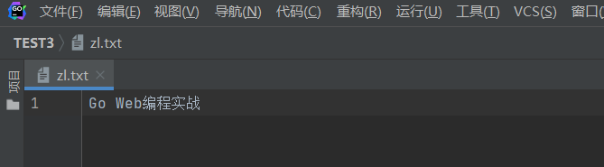

**结构分解：**

```go
file, err := os.Create("zl2.txt")         // 操作文件
   if err != nil {
      fmt.Println(err)
   }  
```

**操作文件：在实例中通过os库中的Create()函数创建新的文件，并判断文件处理过程是否成功，若不成功则会输出err,若文件处理成功则会进入下一步文件编译。**

```go
defer file.Close()             // 延迟关闭文件
```

**延迟关闭文件：**在Go语言中使用的文件关闭方法通过defer语句来调用， defer用于注册一个延迟调用，所有函数在执行RET返回指令之前，都会先检查是否存在defer语句，若存在则先逆序调用defer语句进行收尾工作再退出返回；因此我们注意的是在函数中defer，return，返回值三者执行的顺序应该是：return最先给返回值赋值；接着defer开始执行一些收尾工作；最后RET指令携带返回值退出函数。值的注意的是defer最主要作用在于是，当函数执行完毕后，能够及时调用函数所创建的资源。而我们一般将该语句写在文件打开语句后是因为担心在后续处理中可能存在忘记关闭文件的情况，同时在后续文件数据处理中，我们也能依次使用该文件。

```go
file.WriteString("Go Web编程实战")         // 数据输入
```

**数据输入：根据Go语言中os库中提供的名为File的对象处理文件中，通过WriteString()方法将string数据信息写到文件中。**

**（3）文件写入的第三种方法：WriteAt()方法用于指定位置写入[]byte类型的信息。**

**结构：**

```go
func (file \*File) WriteAt(b []byte, off int64) (n int, err Error)
```

**结构解析：该方法表示基本输入源的偏移量off处开始，将len(p)个字节读取到p中。它返回读取的字节数n（0<=n<=len(p)）,以及任何遇到的错误。**

**实例解析：将第二种方法中的实例程序输出“Go We编程实战”替换为“Go Web编程数据写入”。**

```go
n, err := file.WriteAt([]byte("数据写入"), 12)     // 数据输入
if err != nil {
   panic(err)
   fmt.Println(n)
}
```

**在zl2.txt文本中的输出：**


**结构解析：**

```go
n, err := file.WriteAt([]byte("数据写入"), 12)     // 数据输入
if err != nil {
   panic(err)
   fmt.Println(n)
}
```

**数据输入：在该程序中通过WriteAt()方法指定在12个字节部分为起始位置，进行字节替换，将字节长度读取到12时，替换数据内容进行输入。并判断文件处理过程是否成功，若不成功则会输出err,若文件处理成功则会进入下一步文件编译。与之前使用fmt包中函数输出函数Println（）使用不同的是，而是通过panic函数来做异常处理，需要注意的是panic函数一般返回的是让程序崩溃的错误。**

------


## 3.Gob编码

### 3-1 Gob编码

#### Gob编码分析

##### 1.通过gob包中自带的编解码工具实现对数据结构的编码和序列化操作。

###### **1.1** **通过gob中带的编码工具将数据进行编码操作。**

```go
type Company struct {          // 结构体声明
   Id      int
   Title   string
   Content string
   Author  string
}
// 写入二进制数据到磁盘文件
func write(data interface{}, filename string) {
   buffer := new(bytes.Buffer)
   encoder := gob.NewEncoder(buffer)
   err := encoder.Encode(data)
   if err != nil {
      panic(err)
   }
   err = ioutil.WriteFile(filename, buffer.Bytes(), 0600)  // 数据写入
   if err != nil {
      panic(err)
   }
}
func main() {                 // 主函数读取
   company := Company{
      Id:      1,
      Title:   "知链",
      Content: "知链区块链人才培养摇篮",
      Author:  "zhangln",
   }
   write(company, "company.dat")
}
```

**终端输出：数据编码完成并在列表目录中生成了列表文件。**

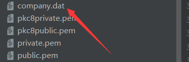

##### **2.**结构解析

```go
type Company struct {                 // 结构体声明
   Id      int
   Title   string
   Content string
   Author  string
}
```

**结构体声明**：**在 Go语言中一般通过结构体（struct）来实现面向对象**。另外结构体通过关键字**type来命名标识符**再通过明确字段名的的数据类型来完成结构体的成员完整声明过程。需要注意的是当声明匿名结构体后访问前一定要指定匿名结构体名字，否则编译器就会报错。

```go
// 写入二进制数据到磁盘文件
func write(data interface{}, filename string) {
   buffer := new(bytes.Buffer)
   encoder := gob.NewEncoder(buffer)
   err := encoder.Encode(data)
   if err != nil {
      panic(err)
   }
   err = ioutil.WriteFile(filename, buffer.Bytes(), 0600)   // 数据写入
   if err != nil {
      panic(err)
   }
}
```

**数据编码处理并写入文件**：在数据处理的过程中**先对数据传入做一个缓冲处理**，通过**bytes.Buffer创建数据缓冲区**，随后通过go语言中自带的gob编解码包**gob.NewEncoder来支持程序完成对变长类型的编解码**（这意味着它是可通用的），最后就可以**通过Encode()来实现对数据的编码**，数据编码完成后**使用 ioutil.WriteFile（）将数据写入文件中**，其中括号中**第一个参数是文件路径，第二个是要写入的内容，第三个是写入权限**。其中**0600代表仅拥有者具有文件的读取和写入权限**。

```go
func main() {                     // 主函数读取
   company := Company{
      Id:      1,
      Title:   "知链",
      Content: "知链区块链人才培养摇篮",
      Author:  "zhangln",
   }
   write(company, "company.dat")
}
```

**主函数读取**：在主函数中**结构体Company进行实例化**，**实例化结构体分配数据**，并调用write()函数从而对数据进行编码处理，最后将二进制数据写入到磁盘文件中。

##### **3.**当我们进行编码后我们怎样进行数据的读取和解码呢？

```go
var stuData Company                        // 主函数
read(&stuData, "company.dat")
fmt.Printf("%#v\n", stuData)
```

**主函数处理：在主函数中进行函数调取从而实现数据处理并实现输出。**

```go
// 从磁盘文件加载二进制数据
func read(data interface{}, filename string) {
   raw, err := ioutil.ReadFile(filename)
   if err != nil {
      panic(err)
   }
   buffer := bytes.NewBuffer(raw)
   dec := gob.NewDecoder(buffer)
   err = dec.Decode(data)
   if err != nil {
      panic(err)
   }
}
```

**数据解码读取**：**通过ioutil.ReadFile()进行文件数据的读取**，ioutil.ReadFile，**适用于文件比较小的读入**，将整个文件的操作都封装到整个函数中去了。在数据读取后就再**通过Decode()函数对读取的数据进行解码输出**，从而得到结果。

终端输出：

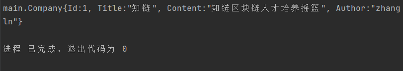

------


## 4.区块链文件存储实战

------

> © 2023 iWyh2