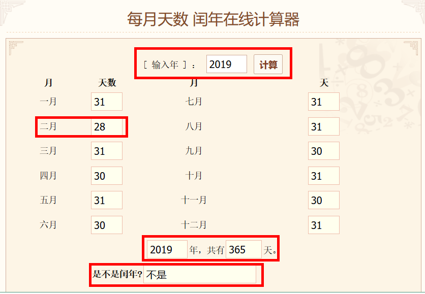

#                day04.API

## 题目1



```
如图所示:当我们输入年份的时候,会自动计算2月份的天数,以及自动判断是否为闰年,一年有多少天,设计程序,实现此功能!
```

### 训练目标

```
灵活运用Date和Calendar类的方法
```

### 训练提示

```java
1.设置日期的时候要知道设置的2月1日实际上是国内3月1日
2.然后用3月1日再减去1天,就是2月的最后一天,就是2月的天数
```

### 参考方案

```
1.使用Calendar的set方法去设置年月日
2.使用Calendar的add方法去减去1天
```

### 操作步骤

```java
1.定义Scanner对象,调用nextInt方法键盘录入一个年份
2.调用getInstance()方法获取Calendar对象
3.调用Calendar中的set方法设置年,月,日
  由于国外的月份和国内的月份不一样,所以,当我们设置2月的时候其实代表的是我们国内的3月
  年份:我们输入的年份
  月份:2月(实际上是我国3月份)
  日:1日
4.调用Calendar中的add方法,让3月1日减去1天,就是二月的最后一天
5.调用Calendar中的get方法,获取得出的日期
6.输出输入的年份2月有多少天
7.判断,如果得出的日期==28天,证明是平年,共365天,否则就是闰年,共366天
```

### 参考答案

```java
public class Test01 {
        public static void main(String[] args) {
           //1.定义Scanner对象,调用nextInt方法键盘录入一个年份
            Scanner sc = new Scanner(System.in);
            System.out.println("请你输入年份:");
            int year = sc.nextInt();
            //2.调用getInstance()方法获取Calendar对象
            Calendar calendar = Calendar.getInstance();
            /*
              3.调用Calendar中的set方法设置年,月,日
                由于国外的月份和国内的月份不一样,所以,当我们设置2月的时候其实代表的是我们国内的3月
                年份:我们输入的年份
                月份:2月(实际上是我国3月份)
                日:1日
            */
            calendar.set(year,2,1);//代表3月1日
            //4.调用Calendar中的add方法,让3月1日减去1天,就是二月的最后一天
            calendar.add(Calendar.DATE,-1);
            //5.调用Calendar中的get方法,获取得出的日期
            int day = calendar.get(Calendar.DATE);
            //6.输出输入的年份2月有多少天
            System.out.println(year+"年的2月有"+day+"天");
            //7.判断,如果得出的日期==28天,证明是平年,共365天,否则就是闰年,共366天
            if (day==28){
                System.out.println("今年是平年!共365天");
            }else{
                System.out.println("今年是闰年!共366天");
            }
        }
}
```

### 

```

```

## 题目2

```
某公司人事举办了这样一个活动,凡是入职6周年的员工,赠送一个精美小礼品,于是员工纷纷去计算了自己的入职年限,请设计程序,帮同事们计算出入职年限.
```

### 训练目标

```
Date,SimpleDateFormat
```

### 训练提示

```
1.按照指定的格式将输入的日期转换成Date对象
2.获取Date对象对应的毫秒值
3.获取当前系统毫秒值,然后两个毫秒值相减
```

### 参考方案

```
1.利用SimpleDateFormat中的parse方法将输入的日期转成Date对象
2.调用Date中getTime方法获取对应的毫秒值
3.调用System中的currentTimeMillis()方法获取当前系统毫秒值
4.两个毫秒值相减的出结果,再使用结果/ 1000 / 60 / 60 / 24得出天数,用天数除以365
```

### 操作步骤

```
1. 接受键盘录入的入职日期字符串
2. 将日期字符串转换为日期对象，方便获取毫秒值
3. 获取入职日期的毫秒值
4. 获取当前系统的毫秒值
5. 计算时间差
6. 将单位换算成天
7. 将天换算成年,并打印
```

### 参考答案

```java
public class Test01 {
    public static void main(String[] args) throws ParseException {
        // 1. 接受键盘录入的入职日期字符串
        Scanner sc = new Scanner(System.in);
        System.out.println("请输入您入职的日期,格式为：xxxx年xx月xx日");
        String joinStr = sc.next();
        // 2. 将日期字符串转换为日期对象，方便获取毫秒值
        SimpleDateFormat sdf = new SimpleDateFormat("yyyy年MM月dd日");
        Date joinDate = sdf.parse(joinStr);
        // 3. 获取入职日期的毫秒值
        long joinTime = joinDate.getTime();
        // 4. 获取今天的毫秒值
        long todayTime = System.currentTimeMillis();
        // 5. 计算时间差
        long result = todayTime - joinTime;
        //6.将单位换算成天
        long day = result / 1000 / 60 / 60 / 24;
        int year = (int) (day/365);
        //7.将天换算成年,并打印
        System.out.println("您入职公司已经" + year + "年");
    }
}
```

### 

```

```

## 题目3


```
如图所示:我们在逛淘宝的时候,搜索商品之后都可以按照价格从低到高显示,后面淘宝可能会出现新的商品,那么新添的商品也会按照价格从低到高重新排序,请设计一个程序,完成添加新商品之后价格重新排序.
```

### 训练目标

```
System,Arrays
```

### 训练提示

```
1.利用System中的方法将老数组中的价格复制到新数组中
2.利用Arrays中的方法将新数组中的价格进行排序
```

### 参考方案

```
1.利用System中的arraycopy方法将老数组中的价格复制到新数组中,然后将添加的价格也放在新数组中
2.利用Arrays中的sort方法,对新数组中的价格进行由低到高的排序
```

### 操作步骤

```
1.创建Scanner对象,输入要添加商品的价格
2.定义老数组,存储原始商品的价格
3.定义新数组,将新商品的价格添加到新数组中
4.将老数组中的价格复制到新数组中
5.将新添加的商品价格放到新数组中
6.将新添加的商品价格放到新数组中,重新排序
7.展示排序之后的新数组
```

### 参考答案

```java
public class Test01 {
    public static void main(String[] args) {
        //1.创建Scanner对象,输入要添加商品的价格
        Scanner sc = new Scanner(System.in);
        System.out.println("请您输入新商品的价格:");
        double num = sc.nextDouble();
        //2.定义老数组,存储原始商品的价格
        double[] oldPrice = {23.6,34.4,35.3,36.2,78.8,89.6,100.3};
        //3.定义新数组,将新商品的价格添加到新数组中
        double[] newPrice = new double[oldPrice.length+1];

        //4.将老数组中的价格复制到新数组中
        System.arraycopy(oldPrice,0,newPrice,0,oldPrice.length);

        //5.将新添加的商品价格放到新数组中
        newPrice[newPrice.length-1] = num;

        //6.将新添加的商品价格放到新数组中,重新排序
        Arrays.sort(newPrice);

       //7.展示排序之后的新数组
        System.out.println(Arrays.toString(newPrice));
    }
}
```

## 题目4:

```
请使用Math 相关的API，计算在 -10.8  到5.9  之间，绝对值大于6  或者小于2.1 的整数有多少个？
```

### 训练目标

```
Math类的使用
```

### 训练提示

 

```
   利用循环,将-10.8到5.9之间的整数循环出来,然后利用Math类中的方法求出循环出来的数的绝对值
然后比较是否大于6或者小于2.1
```

### 参考方案

```
1.利用循环,初始化变量为-10.8的,可以取-10
2.循环到5.9
3.利用Math类中的abs方法将循环出来的每个数求出对应的绝对值
4.然后看看循环出来的数的绝对值是否大于6或者小于2.1
```

### 操作步骤

```
1.定义最小值,为-10.8
2.定义最大值,为5.9
3.定义一个变量,用来计数count,初始化为0
4.利用循环,将从-10.8到5.9的整数循环出来
5.调用Math类中的abs方法求出绝对值,并判断是否大于6或者小于2.1
  如果条件成立,count++
6.输出符合条件的数量
```

### 参考答案

```java
public class MathTest {
  public static void main(String[] args) {
    // 定义最小值
    double min = -10.8;
    // 定义最大值
    double max = 5.9;
    // 定义变量计数
    int count = 0;
    // 范围内循环
    for (double i = Math.ceil(min); i <= max; i++) {
      // 获取绝对值并判断
      if (Math.abs(i) > 6 || Math.abs(i) < 2.1) {
        // 计数
        count++;
      }
    }
    System.out.println("个数为: " + count + " 个");
  }
}
```

## 题目5


```
如图所示:我们使用转账的时候,输入金额之后小数点后面只能输入到2位,而在程序内部,实际上是把输入的元,转成了分去操作了,当我们转成功之后,会再把分变成元来展示给用户们,请设计程序,完成所描述的需求
   提示:直接将元转成分,再将分转成元(至于软件内部怎么操作分的,我们无需关心)
```

### 训练目标

```
BigDecimal
```

### 训练提示

```
1.利用BigDecimal对象中的方法将元转成分
2.再利用BigDecimal对象中的方法将分转成元
```

### 参考方案

```
1.调用BigDecimal对象的multiply乘以100,将元转成分
2.调用BigDecimal的divide方法,除以100,保留2位小数,2位小数后面的直接省略,将分转成元
```

### 操作步骤

```
1.定义Scanner对象,输入要转账的金额,因为用BigDecimal需要传递String,所以我们调用next方法录入
2.调用转换金额的方法,参数传递我们录入的金额
3.定义转换金额的方法,参数为String类型
4.创建两个BigDecimal对象,一个传递转账的金额,一个传递字符串的100
5.调用BigDecimal对象的multiply乘以100,将元转成分
6.调用BigDecimal的divide方法,除以100,保留2位小数,2位小数后面的直接省略,将分转成元
7.将得出的BigDecimal对象调用doubleValue方法转成double类型,并将double类型的结果返回
```

### 参考答案

```java
public class MoneyUtils {
    public static void main(String[] args) {
        Scanner sc = new Scanner(System.in);
        System.out.println("请你输入要转的金额:");
        String money = sc.next();
        //调用转换金额的方法
        Double aDouble = yuanToFen(money);
        System.out.println(aDouble);
    }
    public static Double yuanToFen(String money){
        //创建BigDecimal对象
        BigDecimal money1 = new BigDecimal(money);
        BigDecimal money2 = new BigDecimal("100");
        //将要转账的金额乘以100,变成分的单位
        BigDecimal multiply = money1.multiply(money2);
        //将分单位的金额除以100变成元,并且保留2位小数,展示给用户
        BigDecimal divide = multiply.divide(money2, 2, BigDecimal.ROUND_DOWN);
        //将BigDecimal对象转成double,并返回
        double v = divide.doubleValue();
        return v;
    }
}
```

### 