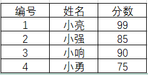
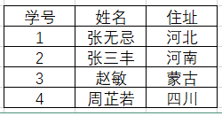
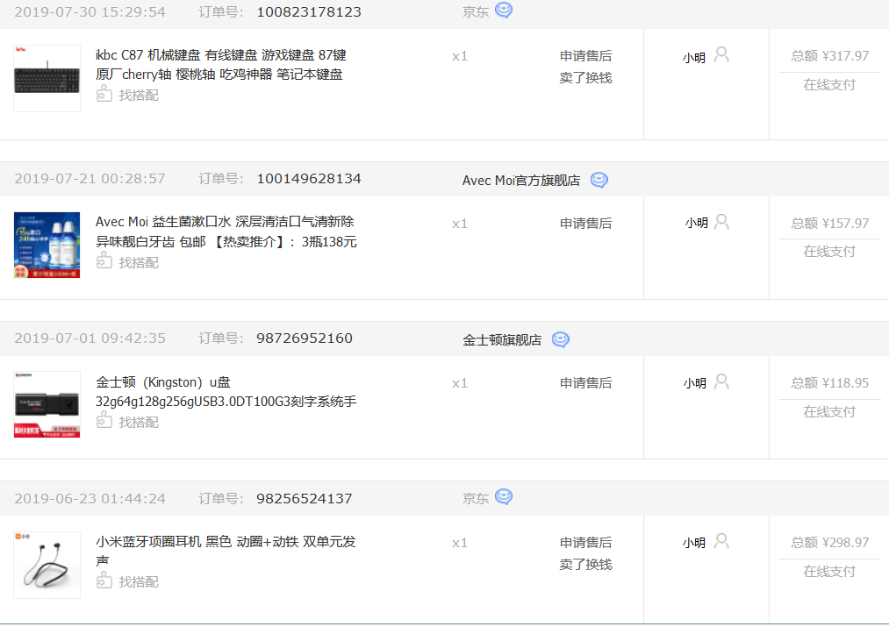
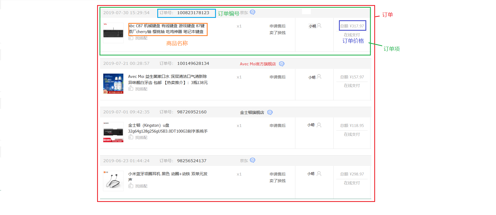

#                                                                                           day06集合

# 简答题:

### 1.ArrayList的大小是如何自动增加的？

```
  答:
    当有人试图在arraylist中增加一个对象的时候，Java会去检查arraylist，以确保已存在的数组中有足够的容量来存储这个新的对象。如果没有足够容量的话，那么就会新建一个长度更长的数组，旧的数组就会使用Arrays.copyOf方法被复制到新的数组中去，现有的数组引用指向了新的数组。
```

### 2.ArrayList和LinkedList的区别？

```
    a.List是接口类，ArrayList和LinkedList是List的实现类。

    b.ArrayList是动态数组（顺序表）的数据结构。顺序表的存储地址是连续的，所以在查找比较快，但是在插入和删除时，由于需要把其它的元素顺序向后移动（或向前移动），所以比较熬时。

    c.LinkedList是链表的数据结构。链表的存储地址是不连续的，每个存储地址通过指针指向，在查找时需要进行通过指针遍历元素，所以在查找时比较慢。由于链表插入时不需移动其它元素，所以在插入和删除时比较快。
```

# 编程题:

## 题目1



```
有4个人参加公务员考试,考试成绩如图所示,录取3名学生,淘汰分数最低的一名,设计一个程序,完成需求
```

### 训练目标

```
ArrayList
```

### 训练提示

```
创建4个学生对象分别为其属性赋值,存到集合中,求出集合中学生对象分数最低的,将其删除.
```

### 参考方案

```
1.调用ArrayList中的add方法将学生对象添加到集合中
2.求出学生中分数最低的学生,调用ArrayList中的remove方法,将其删除
```

### 操作步骤

```java
   1.定义一个学生类,包含两个私有的属性,构造方法,以及get/set方法
   2.定义一个ArrayList集合 list
   3.创建4个学生对象,调用add方法将4个方法存到list集合中
   4.定义一个变量score,来接收集合中第一个学生的成绩
   5.定义一个变量index,接收最低成绩学生的在集合中出现的索引
   6.遍历集合,获取出来每一个学生对象的成绩,去和第一个学生成绩做比较
     如果小于第一个学生成绩,就将成绩低的赋值给score,然后将对应的索引赋值给index
   7.根据index将对应的学生调用remove删除
   8.遍历集合中学生的学号,姓名,考试成绩
```

### 参考答案

```java
//Student类
public class Student {
    private int id;
    private String name;
    private int score;

    public Student() {
    }

    public Student(int id, String name, int score) {
        this.id = id;
        this.name = name;
        this.score = score;
    }

    public int getId() {
        return id;
    }

    public void setId(int id) {
        this.id = id;
    }

    public String getName() {
        return name;
    }

    public void setName(String name) {
        this.name = name;
    }

    public int getScore() {
        return score;
    }

    public void setScore(int score) {
        this.score = score;
    }

    @Override
    public String toString() {
        return "Student{" +
                "id=" + id +
                ", name='" + name + '\'' +
                ", score=" + score +
                '}';
    }
}
```

```java
public class Test02 {
    public static void main(String[] args) {
        //1.定义一个ArrayList集合 list
        ArrayList<Student> list = new ArrayList<>();
        //2.创建4个学生对象
        Student s1 = new Student(1, "小亮", 99);
        Student s2 = new Student(2, "小勇", 85);
        Student s3 = new Student(3, "小响", 90);
        Student s4 = new Student(4, "小强", 89);
        //3.调用add方法将4个方法存到list集合中
        list.add(s1);
        list.add(s2);
        list.add(s3);
        list.add(s4);

        //4.定义一个变量index,接收最低成绩学生的在集合中出现的索引
        int index = 0;
        //5.定义一个变量score,来接收集合中第一个学生的成绩
        int score = list.get(0).getScore();

        //6.遍历集合,获取出来每一个学生对象的成绩,去和第一个学生成绩做比较
        for (int i = 0; i < list.size(); i++) {
            int data = list.get(i).getScore();
            //7.如果小于第一个学生成绩,就将成绩低的赋值给score,然后将对应的索引赋值给index
            if (score>data){
                score = data;
                index = i;
            }
        }
        //8.根据index将对应的学生调用remove删除
        list.remove(index);

        for (int i = 0; i < list.size(); i++) {
            System.out.println("录取的学生编号为:"+list.get(i).getId()+",姓名为:"+list.get(i).getName()+",分数为:"+list.get(i).getScore());
        }
    }
}
```

### 

```

```


## 题目2



```
如图,表格中是三年级一班的学生信息,后来张三丰移民到了山东,李老师需要将张三丰对应的住址改掉,请用程序完成需求,并将学生的信息打印到控制台上
```

### 训练目标

```
ArrayList集合,String
```

### 训练提示

```
创建4个学生对象,存放到集合中,遍历集合,将名字为张三丰的学生地址修改成"山东"
```

### 参考方案

```
1.调用ArrayList中的add方法,将学生对象添加到集合
2.遍历集合,调用String中的equals方法判断名字是否为"张三丰"
3.如果是"张三丰",调用ArrayList中的set方法将地址修改成"山东"
```

### 操作步骤

```
    1.创建ArrayList集合
    2.创建4个对象,分别
    3.将对象存放到集合中
    4.遍历集合,将每一个学生的姓名拿出来
    5.判断如果是"张三丰",将对应的住址修改成"山东"
    6.遍历集合,获取集合中Student的属性值
```

### 参考答案

```java
/*
   Student类
 */
public class Student {
    private int id;
    private String name;
    private String address;

    public Student() {
    }

    public Student(int id, String name, String address) {
        this.id = id;
        this.name = name;
        this.address = address;
    }

    public int getId() {
        return id;
    }

    public void setId(int id) {
        this.id = id;
    }

    public String getName() {
        return name;
    }

    public void setName(String name) {
        this.name = name;
    }

    public String getAddress() {
        return address;
    }

    public void setAddress(String address) {
        this.address = address;
    }
}

```

```java
//测试类
public class Test01 {
    public static void main(String[] args) {
        //1.创建ArrayList集合
        ArrayList<Student> list = new ArrayList<>();
        //2.创建4个对象
        Student s1 = new Student(1, "张无忌", "河北");
        Student s2 = new Student(2, "张三丰", "河南");
        Student s3 = new Student(3, "赵敏", "蒙古");
        Student s4 = new Student(4, "周芷若", "四川");
        //3.将对象存到集合中
        list.add(s1);
        list.add(s2);
        list.add(s3);
        list.add(s4);

        //4.遍历集合,将每一个学生的姓名拿出来
        for (int i = 0; i < list.size(); i++) {
            Student student = list.get(i);
            String name = student.getName();
            //5.判断如果是"张三丰",将对应的住址修改成"山东"
            if ("张三丰".equals(name)){
                Student s = new Student(student.getId(), name, "山东");
                list.set(i,s);
            }
        }

        //6.遍历集合,获取集合中Student的属性值
        for (int i = 0; i < list.size(); i++) {
            System.out.println("学生学号为:"+list.get(i).getId()+",姓名                   为:"+list.get(i).getName()+",住址为:"+list.get(i).getAddress());
        }

    }
}

```

### 

```

```

## 题目3

```
 模拟注册用户,如果存在要注册的用户,直接显示"对不起,您注册的用户已经存在!请直接登录!",可以继续注册;
 如果不存在要注册的用户,显示"注册成功!",并将所有用户的信息显示出来!
```

### 训练目标

```
ArrayList集合  迭代器  String
```

### 训练提示

```
1.往集合中存储3个用户-->准备数据
  "小明", "123"
  "小红", "456"
  "小勇", "789"
2.通过键盘录入的形式输入要注册的用户名和密码
  如果集合中有输入的用户名和密码,证明已经注册了
  否则,没有注册,并将其添加到集合中
```

### 参考方案

```
 1.调用add添加3个用户-->做准备数据
 2.通过键盘录入录入用户名和密码
 3.遍历集合,调用String中的equals方法比较,如果录入的用户名和密码和遍历出来的一样,证明注册过,否则,调用add方法往集合中添加要注册的用户名和密码
```

### 操作步骤

```
1.创建ArrayList集合
2.创建3个User对象
3.将3个User对象存到usersList集合中
4.创建Scanner对象
5.使用while循环录入
6.调用next方法键盘录入要注册的用户名
7.创建一个专门判断集合中有没有要注册的用户名的方法并调用
8.如果有,直接输出"对不起,您注册的用户已经存在!请直接登录!"
  否则,接着录入要注册的密码,封装成User对象,添加到集合中
9.使用迭代器遍历集合
```

### 参考答案

```java
//User类
public class User {
    private String name;
    private String password;

    public User() {
    }

    public User(String name, String password) {
        this.name = name;
        this.password = password;
    }

    public String getName() {
        return name;
    }

    public void setName(String name) {
        this.name = name;
    }

    public String getPassword() {
        return password;
    }

    public void setPassword(String password) {
        this.password = password;
    }
}
```

```java
//测试类
package cn.itcast.day06.arraylist02;
public class Test01 {
    public static void main(String[] args) {
        //1.创建ArrayList集合
        ArrayList<User> usersList = new ArrayList<>();
        //2.创建3个User对象
        User u1 = new User("小明", "123");
        User u2 = new User("小红", "456");
        User u3 = new User("小勇", "789");

        //3.将3个User对象存到usersList集合中
        usersList.add(u1);
        usersList.add(u2);
        usersList.add(u3);

        //4.创建Scanner对象
        Scanner sc = new Scanner(System.in);
        //5.使用while循环录入
        while(true){
            //6.调用next方法键盘录入要注册的用户名
            System.out.println("请你输入要注册的用户名:");
            String username = sc.next();
            //7.创建一个专门判断集合中有没有要注册的用户名的方法并调用
            boolean b = isUser(username, usersList);
            /*8.如果有,直接输出"对不起,您注册的用户已经存在!请直接登录!"
              否则,接着录入要注册的密码,封装成User对象,添加到集合中*/
            if (b){
                System.out.println("对不起,您注册的用户已经存在!请直接登录!");
            }else{
                System.out.println("请你输入要注册的密码:");
                String password = sc.next();
                
                User user = new User(username, password);
                
                usersList.add(user);
                System.out.println("注册成功!");
                System.out.println("------------");
                showUser(usersList);
                break;
            }
        }

    }
    //9.使用迭代器将注册成功的用户都显示出来
    public static void showUser(ArrayList<User> usersList) {
        Iterator<User> iterator = usersList.iterator();
        while (iterator.hasNext()){
            User user = iterator.next();
            System.out.println(user.getName()+":"+user.getPassword());
        }
    }

    public static boolean isUser(String username, ArrayList<User> usersList) {
        boolean flag = false;
        for (int i = 0; i < usersList.size(); i++) {
            User user = usersList.get(i);
            if (username.equals(user.getName())) {
                flag = true;
                break;
            }
        }
        return flag;
    }
}
```

### 

```

```


## 题目四



```
使用所学知识,完成"我的订单"业务需求
我的每个订单中有很多订单项,而订单项都是由商品构成的,我们的账户上有可能有很多个订单,请设计一个程序完成订单,并将订单项中的每一个商品信息打印到控制台上!
```


### 训练目标

```
ArrayList集合,迭代器
```

### 训练提示

```
集合嵌套,利用双重for循环遍历
```

### 参考方案

```
将订单项对象放入订单的集合中,由于"我的订单"中可能有多个订单,所以我们将订单的集合再放入到另外一个集合中,然后利用双重for循环将订单项的属性值遍历出来
```

### 操作步骤



```
1.定义一个订单项类,提供构造,get/set方法
2.定义一个集合用于存储多个订单
3.定义一个集合用于存储多个订单项
4.创建订单项对象,将对象添加到集合
5.将每一个订单存到集合中
6.遍历集合
```

### 参考答案

```java
/*
  订单项类
 */
public class ProductItem {
    //订单项id
    private int productItemId;
    //订单项编号
    private int productItemNumber;
    //商品编号
    private int productNumber;
    //商品名称
    private String productName;
    //商品价格
    private double price;

    public ProductItem() {
    }

    public ProductItem(int productItemId, int productItemNumber, int productNumber, String productName, double price) {
        this.productItemId = productItemId;
        this.productItemNumber = productItemNumber;
        this.productNumber = productNumber;
        this.productName = productName;
        this.price = price;
    }

    public int getProductItemId() {
        return productItemId;
    }

    public void setProductItemId(int productItemId) {
        this.productItemId = productItemId;
    }

    public int getProductItemNumber() {
        return productItemNumber;
    }

    public void setProductItemNumber(int productItemNumber) {
        this.productItemNumber = productItemNumber;
    }

    public int getProductNumber() {
        return productNumber;
    }

    public void setProductNumber(int productNumber) {
        this.productNumber = productNumber;
    }

    public String getProductName() {
        return productName;
    }

    public void setProductName(String productName) {
        this.productName = productName;
    }

    public double getPrice() {
        return price;
    }

    public void setPrice(double price) {
        this.price = price;
    }

    @Override
    public String toString() {
        return  productItemId +
                "," + productItemNumber +
                "," + productNumber +
                "," + productName +
                ", " + price
                ;
    }
}

```

```java
/*
  测试类:
 */
public class Test01 {
    public static void main(String[] args) {
        //创建存放订单的集合
        ArrayList<ArrayList<ProductItem>> list = new ArrayList<>();
        //创建随机数对象
        Random rd = new Random();
        //定义订单集合
        ArrayList<ProductItem> productItemsList = new ArrayList<>();

        //创建订单项对象
        ProductItem productItem1 = new ProductItem(1, rd.nextInt(100000000), 1, "酸奶", 50);
        ProductItem productItem2 = new ProductItem(2, rd.nextInt(100000000), 2, "手机", 5000);
        ProductItem productItem3 = new ProductItem(3, rd.nextInt(100000000), 3, "手机壳", 45);
        ProductItem productItem4 = new ProductItem(4, rd.nextInt(100000000), 4, "漱口水", 35);

        //将订单项放到订单中
        productItemsList.add(productItem1);
        productItemsList.add(productItem2);
        productItemsList.add(productItem3);
        productItemsList.add(productItem4);

        //将每一个订单存到第一个集合中
        list.add(productItemsList);

        //遍历集合
        Iterator<ArrayList<ProductItem>> iterator = list.iterator();
        while (iterator.hasNext()){
            ArrayList<ProductItem> items = iterator.next();
            for (int i = 0; i < items.size(); i++) {
                ProductItem productItem = items.get(i);
                System.out.println(productItem.getProductItemId()+","+productItem.getProductItemNumber()+","+productItem.getProductNumber()+","+productItem.getProductName()+","+productItem.getPrice());

            }
        }
    }
}
```

### 

```

```

