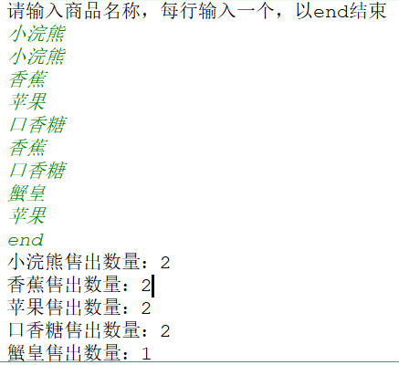
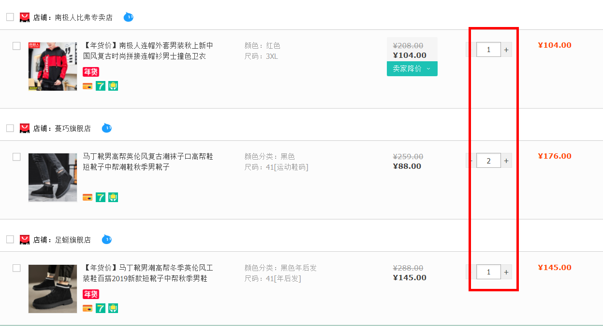
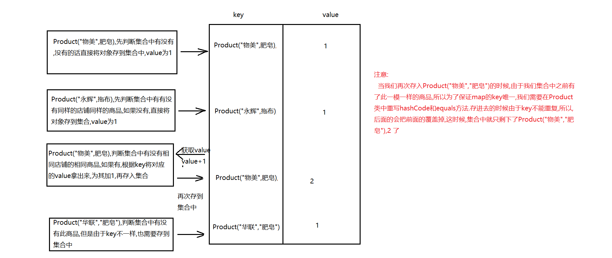

#                                                               5day08

## 题目1

```
某商店想统计一下一天内所售出的商品以及商品的数量，请设计程序完成此需求,展示每个售出的商品名称和数量
  要求:通过键盘录入商品名称模拟售出的商品，录入一次表示商品售出一次，直到录入end结束,结束之后,将统计结果打印出来.运行结果如下:
```



### 训练目标

```
HashMap,HashMap的遍历
```

### 训练提示


### 参考方案

```
  调用HashMap中的containsKey方法判断集合中包不包含输入的商品
  如果方法返回的是false,证明map集合中没有输入的商品,直接将商品和1存储到集合
  否则,证明集合中包含我们输入的商品,然后调用get方法根据键(商品)获取对应的值(数量)
  给这个值加1,最后将输入的商品和值加1后的结果重新存到集合中
```

### 操作步骤

```
1.创建HashMap集合,以商品名做键，以售出数量做值
2.创建Scanner对象,键盘录入
3.一直输入商品，直到end结束
4.如果输入的是end,直接结束循环录入
5.判断商品是否已售出过，如果售出过，数量加1，如果没有，数量存为1
6.遍历查看结果
```

### 参考答案

```java
public class Test01 {
    public static void main(String[] args) {
        // 1.创建HashMap集合,以商品名做键，以售出数量做值
        HashMap<String, Integer> map = new HashMap<>();
        // 2.创建Scanner对象,键盘录入
        Scanner sc = new Scanner(System.in);
        System.out.println("请输入商品名称，每行输入一个，以end结束");
        // 3.一直输入商品，直到end结束
        while (true) {
            String goods = sc.next();
            //4.如果输入的是end,直接结束循环录入
            if ("end".equals(goods)) {
                break;
            }
            // 5.判断商品是否已售出过，如果售出过，数量加1，如果没有，数量存为1
            if (map.containsKey(goods)) {
                map.put(goods, map.get(goods) + 1);
            } else {
                map.put(goods, 1);
            }
        }
        // 6.遍历查看结果
        for (String key: map.keySet()) {
            Integer value = map.get(key);
            System.out.println(key + "售出数量：" + value);
        }
    }
}
```

### 视频讲解

```
另附avi格式视频.
```

## 题目2

```
某学校Java学科分为基础班和就业班:
Java基础班:
  001	李晨
  002	范冰冰
Java就业班:
  001	马云
  002	马化腾
使用HashMap嵌套HashMap方式完成存储数据,并遍历出所有的学生
```

### 训练目标

```
HashMap的嵌套(HashMap嵌套HashMap)
```

### 训练提示

```
1.每个学生的学号和姓名就是一个键值对,可以放在一个map集合中
2.Java基础班对应着存放学号和姓名的map集合
3.先遍历出外面的Map集合,拿到内部的Map集合
4.再遍历内部的Map和,将具体的key和value获取出来
```

### 参考方案

```
1.创建一个JavaSE基础班的HashMap集合,一个JavaEE就业班的HashMap集合,key为学号,value为姓名
2.创建另外一个HashMap集合,key为:"JavaSE基础班", value为存储学号,姓名的HashMap集合
  再存储一个key为:"JavaEE就业班", value为存储学号,姓名的HashMap集合
3.遍历外层HashMap集合,得出内部HashMap集合,再遍历内部HashMap集合中的学号和姓名
```

### 操作步骤

```
1.定义Java基础班的HashMap<String, String>
2.存放2个学生到Java基础班的Map
3.定义Java就业班的HashMap<String, String>
4.存放2个学生到Java就业班的Map
5.定义某学校集合HashMap<String, HashMap<String, String>>
6.将Java基础班和Java就业班存放到某学校HashMap集合中
7.使用keySet获取所有的key,返回值为set集合,再用增强for循环将set集合存放的key遍历出来
  7.1使用keySet获取某学校集合的所有key
  7.2使用增强for获取某学校集合每个key
  7.3通过key找value,value是Java基础班的HashMap和Java就业班的HashMap
  7.4拿到班级的HashMap所有key
  7.5遍历班级的每个key(学号)
  7.6根据班级的key(学号)去找value(姓名)
```

### 参考答案

```java
public class Test {
    public static void main(String[] args) {
        // 1.定义Java基础班的HashMap<String, String>
        HashMap<String, String> JavaSEMap = new HashMap<String, String>();
        // 2.存放2个学生到Java基础班的Map
        JavaSEMap.put("001", "李晨");
        JavaSEMap.put("002", "范冰冰");

        // 3.定义Java就业班的HashMap<String, String>
        HashMap<String, String> JavaEEMap = new HashMap<>();
        // 4.存放2个学生到Java就业班的Map
        JavaEEMap.put("001", "马云");
        JavaEEMap.put("002", "马化腾");

        // 5.定义某学校集合HashMap<String, HashMap<String, String>>
        HashMap<String, HashMap<String, String>> czbkMap = new HashMap<>();
        // 6.将Java基础班和Java就业班存放到某学校HashMap集合中
        czbkMap.put("Java基础班", JavaSEMap);
        czbkMap.put("Java就业班", JavaEEMap);

        // 7.使用keySet和增强for遍历出里面的元素
        // 7.1使用keySet获取某学校集合的所有key
        Set<String> keySet = czbkMap.keySet(); // "Java基础班", "Java就业班"
        // 7.2使用增强for获取某学校集合每个key
        for (String czbkKey : keySet) {
            System.out.println(czbkKey);
            // 7.3通过key找value,value是Java基础班的HashMap和Java就业班的HashMap
            HashMap<String, String> classMap = czbkMap.get(czbkKey);

            // 7.4拿到班级的HashMap所有key
            Set<String> classKeys = classMap.keySet();
            // 7.5遍历班级的每个key(学号)
            for (String key : classKeys) {
                // 7.6根据班级的key(学号)去找value(姓名)
                String value = classMap.get(key);
                System.out.println("\t" + key + " -- " + value);
            }
        }

    }
}
```

### 视频讲解

```
另附avi格式视频.
```


## 题目3



```
  如图所示:我们在逛淘宝的时候,会把喜欢的商品加入到购物车中,当我们第一次加入到购物车的时候,购物车中该商品的数量会显示为1,如果我们添加的是同一个店铺的同一件商品,购物车中该商品的数量会增加1。但是如果添加的不是同一个店铺的商品不用,我们则认为不是同一件商品,添加到购物车的时候就会当做新商品添加。请设计程序,完成将商品添加到购物车的需求.
```

### 训练目标

```
HashMap,HashMap的遍历
```

### 训练提示



### 参考方案

```
1.我们用Product对象作为key,数量作为value,所以要保证key唯一,我们的Product就要重写hashCode和equals方
  法
2.当我们往集合中存的时候,要利用containsKey方法判断集合中有没有店铺和商品名称都一样的对象,如果没有,证明购物车中是第一次添加此商 
  品,value为1
3.如果集合中有店铺和商品名称都一样的对象,证明购物车之前已经添加了此商品,我们就调用get方法根据key获取
  value,让value+1,最后重新存到集合中即可
```

### 操作步骤

```
1.定义一个商品类,包括两个属性:store(店铺名称),name(商品名称),提供对应的构造以及get/set方法,还有重写     hashCode和equals方法
2.定义测试类
  2.1.创建Scanner对象
  2.2.创建Map集合对象
  2.3.循环将商品加入购物车
  2.4.根据输入的店铺名称和商品名称,封装成Product对象
  2.5.如果集合中不包含我们添加的同一个店铺同一个商品的话,直接往集合中添加该商品
  2.6.否则将该商品对应的值(数量)从集合中获取出来,让其加1
  2.7.将加1之后的商品重新添加到集合中
  2.8.遍历集合
```

### 参考答案

```java
//商品类
public class Product {
    //店铺名称
    private String store;
    //商品名称
    private String name;

    public Product(String store, String name) {
        this.store = store;
        this.name = name;
    }

    public String getStore() {
        return store;
    }

    public void setStore(String store) {
        this.store = store;
    }

    public String getName() {
        return name;
    }

    public void setName(String name) {
        this.name = name;
    }

    @Override
    public boolean equals(Object o) {
        if (this == o) return true;
        if (o == null || getClass() != o.getClass()) return false;
        Product product = (Product) o;
        return Objects.equals(store, product.store) &&
                Objects.equals(name, product.name);
    }

    @Override
    public int hashCode() {

        return Objects.hash(store, name);
    }

    @Override
    public String toString() {
        return "Product{" +
                "store='" + store + '\'' +
                ", name='" + name + '\'' +
                '}';
    }
}
```

```java
/*
  测试类
 */
public class Test {
    public static void main(String[] args) {
        //1.创建Scanner对象
        Scanner sc = new Scanner(System.in);
        //2.创建Map集合对象
        HashMap<Product, Integer> hashMap = new HashMap<>();
        //3.循环将商品加入购物车
        while (true) {
            System.out.println("请你输入要添加商品的店铺:");
            String store = sc.next();
            if (store.equals("end")) {
                break;
            }else{
                System.out.println("请你要输入添加的商品名称:");
                String name = sc.next();
                //4.根据输入的店铺名称和商品名称,封装成Product对象
                Product product = new Product(store, name);

                if (!hashMap.containsKey(product)) {
                    //5.如果集合中不包含我们添加的同一个店铺同一个商品的话,直接往集合中添加该商品
                    hashMap.put(product, 1);
                    look(hashMap);
                } else {
                    //6.否则将该商品对应的值(数量)从集合中获取出来,让其加1
                    Integer number = hashMap.get(product);
                    number++;
                    //7.将加1之后的商品重新添加到集合中
                    hashMap.put(product, number);
                    look(hashMap);
                }

            }

        }

    }

    public static void look(HashMap<Product, Integer> hashMap) {
        //8.遍历集合
        Set<Map.Entry<Product, Integer>> entrySet = hashMap.entrySet();
        for (Map.Entry<Product, Integer> entry : entrySet) {
            Product key = entry.getKey();
            Integer value = entry.getValue();
            System.out.println(key+"-->"+value);
        }
    }


}
```

### 视频讲解

```
另附avi格式视频.
```

