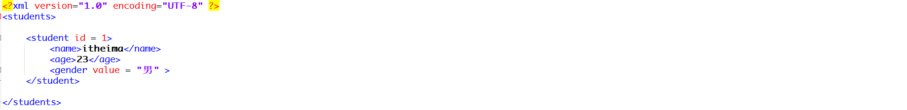
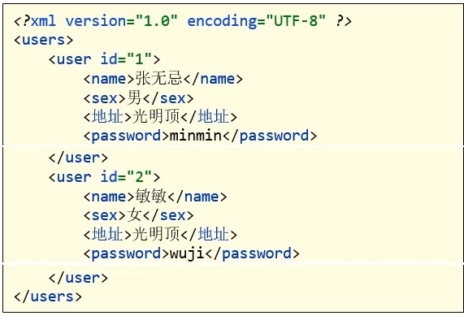

##  day11作业

#### 一、今日方法：

1. Properties集合中方法名称以及作用：

   ```java
   答：
   ```

2. 日志技术中涉及的类名以及方法名称：

   ```java
   答：
   ```

3. 多线程中涉及类名以及方法名称：

   ```java
   答：
   ```


------

#### 三、简答题：

1. 配置文件有什么作用？

   ```java
   答：
   ```

2. 今天学习的配置文件，各有什么特点？

   ```java
   答：
   ```

3. 简述什么是xml文档约束以及DTD约束和schema约束的区别？

   ```java
   答：
   ```

4. 日志技术有什么作用？日志技术使用步骤有哪些？

   ```java
   答：
   ```

5. 日志有几种级别，分别是什么？

   ```java
   答：
   ```

6. 什么是多线程？有几种实现方式？

   ```java
    答：
   ```

7. 多线程实现方式有什么特点？

   ```java
   答：
   ```
------

#### 四、排错题：

##### 排错题1：指出下述xml文件出现的语法错误并说明原因？


```tex
答：
```

##### 排错题2：指出下述xml中标签出现的语法错误的位置并且说明原因？



```java
答：
```

------

#### 四、代码题：

##### 第一题：分析以下需求，并用代码实现

**训练目标**：

​	掌握java中xml解析的基本使用，以及理解其在实际开发中的应用

**需求描述**：

​	将下图中的xml的数据，解析到java中，并将User标签的id属性作为键，User标签中的子标签中的数据，封装到User对象中，并作为值，存入Map<Integer,User>集合中。

​	最后遍历map集合中的键值对数据，打印在控制台。

​	User类中属性：name、sex、address、password



------

##### 第二题：【选做题】分析以下需求，并用代码实现

**训练目标**：

​	掌握java中字节流和File对象的基本使用

**需求描述**：

	模拟歌曲复制和删除过程：假设在D：\\songs文件夹中存在一些歌曲(歌曲文件，可以为txt格式，)
	循环显示该菜单：请选择您要进行的操作：1：查询所有歌曲   2：根据歌曲名称复制  3：根据歌曲名称删除 4: 退出
	举例：
		用户输入：1
			存在以下歌曲：
				蒙娜丽莎的眼泪
				烟花易冷
				上海滩
				小苹果
				夜空中最亮的星
	
		用户输入：2
			请输入要复制的歌曲名称: 上海滩
			请输入存储路径: E:\\songs  (说明:该路径如果存在则不创建,不存在则创建)
			复制结果: 歌曲上海滩已经成功复制到E:\\songs目录中
	
		用户输入：3
			请输入要删除的歌曲名称: 上海滩
			删除结果: 歌曲上海滩已经成功删除
	
		用户输入: 4
			退出系统


