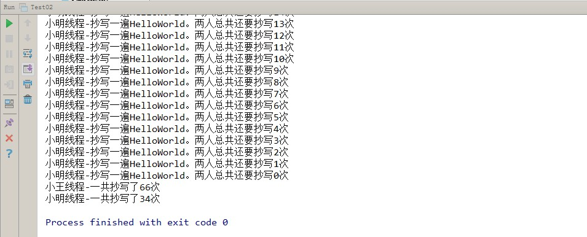
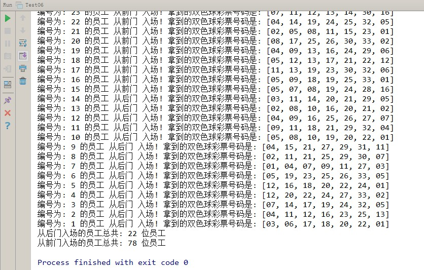

# day09多线程

# 知识点

## 题目1（加强训练）

```
本案例模拟一个简单的银行系统,使用两个不同的线程向同一个账户存钱。
账户的初始余额是1000元，两个线程每次存储100元,分别各存储1000元，不允许出现错误数据。
程序运行结果如下图所示：不要求轮流存
```


### 训练目标

能够使用多线程解决存钱问题。

### 训练提示

1、什么是线程？

2、如何创建并开启线程？

3、如何解决线程安全问题？

### 参考方案

定义账户类，初始化账户余额。提供存钱和获取前的方法，开启两个线程操作账户

### 操作步骤

1、定义银行账户Account类
1.1、 定义int类型成员变量leftMoney，代表账户余额
1.2、 定义构造方法，给账户初始化
1.3、 定义deposit方法，给账户存钱
1.4、 定义getLeftMoney方法，查看账户余额
2、定义线程任务类Transfer,实现Runnable接口
2.1、定义Account类型成员变量account
2.2、定义构造方法，给成员变量account赋值
2.3、覆盖重写run方法（使用同步方法或同步代码块保证数据安全），方法内部使用for循环，执行10次存钱，并打印账户余额的操作
3、定义测试类Test01
3.1、创建账户类Account的对象,初始化余额为1000元
3.2、创建线程任务Transfer类的对象，传递账户类Account的对象
3.3、创建2个Thread类的对象，传递线程任务Transfer类的对象并指定线程名称
3.4、2个Thread类的对象分别调用start方法，开启线程


### 参考答案

```java
//1、定义银行账户Account类
public class Account {
    //1.1、 定义int类型成员变量leftMoney，代表账户余额
    private int leftMoney;
    //1.2、 定义构造方法，给账户初始化
    public Account(int leftMoney) {
        this.leftMoney = leftMoney;
    }
    //1.3、 定义deposit方法，给账户存钱
    public void deposit(int money) {
        leftMoney += money;
    }
    //1.4、 定义getLeftMoney方法，查看账户余额
    public int getLeftMoney() {// 查询账户余额
        return leftMoney;
    }
}
```

```java
//2、定义线程任务类Transfer,实现Runnable接口
public class Transfer implements Runnable {
    //2.1、定义Account类型成员变量account
    private Account account;
    //2.2、定义构造方法，给成员变量account赋值
    public Transfer(Account account) {
        this.account = account;
    }
    //2.3、覆盖重写run方法（使用同步方法或同步代码块保证数据安全），
    //方法内部使用for循环，执行10次存钱，并打印账户余额的操作
    //同步方法
    public void run() {
        for (int i = 0; i < 10; i++) {// 向账户中存入100次钱
            //调用同步方法
            transfer();            
        }
    }
    //同步方法
    public synchronized void transfer() {
        account.deposit(100);// 向账户中存入100块钱
        System.out.println(Thread.currentThread().getName()+" 存入100元后,账户的余额是: "+account.getLeftMoney());
    }
    
    /*
    //使用同步代码块
    public void run() {        
    	for (int i = 0; i < 10; i++) {// 向账户中存入100次钱
        	synchronized(this){
            account.deposit(100);// 向账户中存入100块钱
            System.out.println(Thread.currentThread().getName()+" 存入100元后,账户的余额是: "+account.getLeftMoney());
       		}
        }
        
    }
    */
}
```

```java
//3、定义测试类Test01
public class Test01 {
    public static void main(String[] args) {
        //3.1、创建账户类Account的对象,初始化余额为1000元
        Account account = new Account(1000);
        //3.2、创建线程任务Transfer类的对象，传递账户类Account的对象
        Transfer transfer = new Transfer(account);
        //3.3、创建2个Thread类的对象，传递线程任务Transfer类的对象并指定线程名称
        Thread t1 = new Thread(transfer,"小王");
        Thread t2 = new Thread(transfer,"小李");
        //3.4、2个Thread类的对象分别调用start方法，开启线程
        t1.start();
        t2.start();        
    }
}
```


### 视频讲解

另附avi格式视频。


## 题目2（加强训练）

```
小明上课时打瞌睡,被老师发现,老师惩罚他抄写100遍单词"HelloWorld",而且老师每发现一个同学,惩罚的次数和抄写的内容都不一样。恰好今天学习多线程,于是乎小明就找到了小王帮助他一起抄写单词。
请使用多线程模拟小明和小王一起完成抄单词的惩罚。
程序运行效果如下图：不要求轮流写，不要求平均分配抄写次数
```



### 训练目标

能够使用多线程解决抄写单词问题。

### 训练提示

1、Runnable接口方式创建并开启线程有什么好处？

2、如何创建并开启线程？

3、如何解决线程安全问题？

### 参考方案

定义类描述抄写次数和抄写内容。定义线程任务类，开启2个线程执行线程任务。

### 操作步骤

1、定义惩罚Punishment类
1.1、 定义int类型成员变量leftCount，代表抄写次数
1.2、 定义String类型成员变量copyWord,代表抄写内容
1.3、 定义构造方法，给初始化抄写次数和抄写内容
1.4、 定义set和get方法
2、定义线程任务类CopyRunnable,实现Runnable接口
2.1、定义Punishment类型成员变量punishment
2.2、定义构造方法，给成员变量punishment赋值
2.3、覆盖重写run方法（使用同步方法或同步代码块保证数据安全），按照打印要求实现功能
3、定义测试类Test02
3.1、创建惩罚类Punishment的对象,初始化抄写次数为100,抄写内容为HelloWorld
3.2、创建线程任务CopyRunnable类的对象，传递惩罚类Punishment的对象
3.3、创建2个Thread类的对象，传递线程任务CopyRunnable类的对象并指定线程名称
3.4、2个Thread类的对象分别调用start方法，开启线程


### 参考答案

```java
//1、定义惩罚Punishment类
public class Punishment {
    //1.1、 定义int类型成员变量leftCount，代表抄写次数
    private int leftCount;
    //1.2、 定义String类型成员变量copyWord,代表抄写内容
    private String copyWord;//需要抄写的内容
	//1.3、 定义构造方法，给初始化抄写次数和抄写内容
    public Punishment(int leftCount, String copyWord) {
        this.leftCount = leftCount;
        this.copyWord = copyWord;
    }

    //1.4、 定义set和get方法
}

```

```java
//2、定义线程任务类CopyRunnable,实现Runnable接口
public class CopyRunnable implements Runnable {
    //2.1、定义Punishment类型成员变量punishment
    private Punishment punishment;
	//2.2、定义构造方法，给成员变量punishment赋值
    public CopyRunnable(Punishment punishment) {
        this.punishment = punishment;
    }
	//2.3、覆盖重写run方法（使用同步方法或同步代码块保证数据安全），按照打印要求实现功能
    @Override
    public void run() {
        //定义int变量,统计每个线程的书写次数
        int count = 0;
        //获取线程名称
        String threadName = Thread.currentThread().getName();
        while(true) {
            //同步代码块
            synchronized (this) {
                //如果没有写完
                if (punishment.getLeftCount() > 0) {
                    //获取剩余次数
                    int leftCount = punishment.getLeftCount();
                    System.out.println(threadName+"线程-抄写一遍"+punishment.getCopyWord()+"。两人总共还要抄写"+(--leftCount)+"次");
                    //修改剩余次数
                    punishment.setLeftCount(leftCount);
                    //计数器+1
                    count++;
                } else {
                    //写完了,终止循环
                    break;
                }
            }
        }
        //输出每个线程的书写次数
        System.out.println(threadName+"线程-一共抄写了"+count+"次");
    }
}
```

```java
//3、定义测试类Test02
public class Test02 {
    public static void main(String[] args) {
        //3.1、创建惩罚类Punishment的对象,初始化抄写次数为100,抄写内容为HelloWorld
        Punishment punishment = new Punishment(100,"HelloWorld");
        //3.2、创建线程任务CopyRunnable类的对象，传递惩罚类Punishment的对象
        CopyRunnable task = new CopyRunnable(punishment);
        //3.3、创建2个Thread类的对象，传递线程任务CopyRunnable类的对象并指定线程名称
        Thread t1 = new Thread(task, "小明");
        Thread t2 = new Thread(task, "小王");
        //3.4、2个Thread类的对象分别调用start方法，开启线程
        t1.start();
        t2.start();
    }
}
```

### 视频讲解

另附avi文件提供。


## 题目3（综合扩展）

```
某房产公司大促销,所有购房者可以参加一次抽奖,抽奖箱中总共有10个奖品,
分别是:"苹果手机","华为手机","三洋踏板摩托","迪拜7日游","苹果笔记本",
"联想笔记本","小米空气净化器","格力空调","海尔冰箱","海信电视"
所有抽奖者分成两组进行抽奖,请创建两个线程,名称分别为“第一组”和“第二组”，随机从抽奖箱中完成抽奖
程序运行效果如下图：不要求轮流写，不要求平均分配抽奖次数
```

### 

### 训练目标

能够使用多线程解决抽奖问题。

### 训练提示

1、Runnable接口方式创建并开启线程有什么好处？

2、如何创建并开启线程？

3、如何解决线程安全问题？

4、解决线程安全问题用什么当做锁对象？

### 参考方案

定义类描述抄写次数和抄写内容。定义线程任务类，开启2个线程执行线程任务。

### 操作步骤

1、定义线程任务类CJTask,实现Runnable接口
1.1、 定义List类型成员变量prizeList，代表抽奖池
1.2、 定义构造方法，初始化抽奖池
1.3、 覆盖重写run方法（使用同步方法或同步代码块保证数据安全），按照打印要求实现功能（死循环内部嵌套 同步）1.3.1、 没有奖品，结束循环
1.3.2、有奖品，从抽奖池中随机抽取一个（注意：抽一个奖品，抽奖池中就少一个）
1.3.3、打印输出
2、定义测试类Test03
2.1、创建List集合对象prizeList代表抽奖池
2.2、向List集合对象prizeList中添加所有的奖项
2.2、创建线程任务CJTask类的对象，传递抽奖池List集合对象prizeList
2.3、创建2个Thread类的对象，传递线程任务CJTask类的对象并指定线程名称
2.4、2个Thread类的对象分别调用start方法，开启线程	


### 参考答案

```java
//1、定义线程任务类CJTask,实现Runnable接口
public class CJTask  implements Runnable {
	//1.1、 定义List类型成员变量prizeList，代表抽奖池
	private List<String> prizeList;
	//1.2、 定义构造方法，初始化抽奖池
	public CJTask(List<String> prizeList) {
		this.prizeList = prizeList;
	}
	
    //1.3、 覆盖重写run方法（使用同步方法或同步代码块保证数据安全），按照打印要求实现功能（死循环内部嵌套 同步）
	@Override
	public void run() {
		while(true) {
			synchronized (this) {
                //1.3.1、 没有奖品，结束循环
				if(prizeList.size()<=0) {
					break;
				}
                //1.3.2、有奖品，从抽奖池中随机抽取一个（注意：抽一个奖品，抽奖池中就少一个）
				String prize = prizeList.remove(new Random().nextInt(prizeList.size()));
				try {
					Thread.sleep(100);
				} catch (InterruptedException e) {
					e.printStackTrace();
				}
                //1.3.3、打印输出
				System.out.println(Thread.currentThread().getName()+"...抽出了一个: "+prize);
			}
		}
	}
	
}
```

```java
//2、定义测试类Test03
public class Test03 {
	public static void main(String[] args) {
        //2.1、创建List集合对象prizeLis代表抽奖池
		List<String> prizeList = new ArrayList<>();
        
        //2.2、向List集合对象prizeLis中添加所有的奖项
		Collections.addAll(prizeList,"苹果手机","华为手机","三洋踏板摩托","迪拜7日游","苹果笔记本",
				"联想笔记本","小米空气净化器","格力空调","海尔冰箱","海信电视");

		//2.2、创建线程任务CJTask类的对象，传递抽奖池List集合对象prizeList
		CJTask cjx = new CJTask(prizeList);
        
		//2.3、创建2个Thread类的对象，传递线程任务CJTask类的对象并指定线程名称
		Thread t1 = new Thread(cjx,"第一组");
		Thread t2 = new Thread(cjx,"第二组");
        
        //2.4、2个Thread类的对象分别调用start方法，开启线程	
        t1.start();
        t2.start();
	}
}
```


### 视频讲解

另附avi文件提供。


## 题目4（综合扩展）

```
某公司组织年会,会议入场时有两个入口,在入场时每位员工都能获取一张双色球彩票,假设公司有100个员工,利用多线程模拟年会入场过程,并分别统计每个入口入场的人数,以及每个员工拿到的彩票的号码。
双色球球规则:
双色球: 由6个红色球号码和1个蓝色球号码组成。
红色球: 从1--33中选择。
蓝色球: 从1--16中选择。
红球从小到大的顺序,不可重复,蓝球和红球可以重复
线程运行后打印格式如下：不要求两个入口轮流进，不要求平均分配进入人数
```



### 训练目标

能够使用多线程解决年会入场问题。

### 训练提示

1、如何根据双色球彩票规则产生一张彩票？

2、如何统计每个入口的进入人数？

3、是否有线程安全问题？

4、如果有线程安全问题如何解决？

### 参考方案

使用List集合存储彩票，定义线程任务类从List集合中获取彩票，开启2个线程执行线程任务。

### 操作步骤

1、定义工具类DoubleColorBallUtils,产生双色球
1.1、 构造方法私有
1.2、 定义静态方法create,产生一个双色球,返回String
2、定义线程任务类EntranceTask,实现Runnable接口
2.1、 定义int类型成员变量num，代表入场人数
2.2、 定义List类型成员变量doubleColorBalls，存放num张彩票
2.3、定义构造方法，给成员变量赋值，确定入场人数，准备彩票
2.4、 覆盖重写run方法（使用同步方法或同步代码块保证数据安全），按照打印要求实现功能（死循环内部嵌套 同步）	2.4.1、定义int变量count，记录每个入口进入的人数
2.4.2、 所有人员都已经入场，结束循环
2.4.3、 有人员入场，随机抽取一个双色球（注意：抽一个双色球，就少一个）
2.4.4、 打印输出
2.4.5、计数器加1
2.4.6、循环结束，打印每个入口进入的人数
3、定义测试类Test04
3.1、创建List集合对象doubleColorBalls代表所有的双色球
3.2、向List集合对象doubleColorBalls中添加所有的双色球
3.3、创建线程任务EntranceTask类的对象，传递存储双色球的List集合对象doubleColorBalls,并指定入场人数
3.4、创建2个Thread类的对象，传递线程任务EntranceTask类的对象并指定线程名称
3.5、2个Thread类的对象分别调用start方法，开启线程	


### 参考答案

```java
//1、定义工具类DoubleColorBallUtils,产生双色球球
public class DoubleColorBallUtils {
    //1.1、 构造方法私有
    private DoubleColorBallUtils(){}
    //1.2、 定义静态方法create,产生一个双色球,返回String
    public static String create() {
        //创建Random对象,产生int数字
        Random r = new Random();
        //创建List集合对象,存储双色球
        List<String> list = new ArrayList<>();
        //存储红球,只要list集合长度<6,就添加红球
        while(list.size()<6) {
            //产生1-33的数字
            int num = r.nextInt(33)+ 1;
            //保证数字是两位数字,一位数字前面补0
            String strNum = num<10?0+""+num:num+"";
            //保证红球不重复
            if (!list.contains(strNum)) {
                list.add(strNum);
            }
        }
        //对红球按照从小到大的顺序排序
        Collections.sort(list);
        //产生一个蓝球
        int num = r.nextInt(16)+ 1;
        //保证数字是两位数字,一位数字前面补0
        String strNum = num<10?0+""+num:num+"";
        //添加蓝球
        list.add(strNum);
        //返回String
        return list.toString();
    }
}

```

```java
//2、定义线程任务类EntranceTask,实现Runnable接口
public class EntranceTask implements Runnable {
    //2.1、 定义int类型成员变量num，代表入场人数
	private int num;
    //2.2、 定义List类型成员变量doubleColorBalls，存放num张彩票
	private List<String> doubleColorBalls;
    //2.3、定义构造方法，给成员变量赋值，确定入场人数，准备彩票
	public EntranceTask(int num, List<String> doubleColorBalls) {
		this.num = num;
		this.doubleColorBalls = doubleColorBalls;
	}
	//2.4、 覆盖重写run方法（使用同步方法或同步代码块保证数据安全），按照打印要求实现功能（死循环内部嵌套 同步）
	@Override
	public void run() {
        //2.4.1、定义int变量count，记录每个入口进入的人数
		int count = 0;
		//获取当前线程的名称
		String threadName = Thread.currentThread().getName();
		while (true) {
			synchronized (this) {
				//2.4.2、 所有人员都已经入场，结束循环
				if (num <= 0) {
					break;
				}
                //2.4.3、 有人员入场，随机抽取一个双色球（注意：抽一个双色球，就少一个）
				//产生一个随机索引
				int index = new Random().nextInt(doubleColorBalls.size());
				//获取一张双色球
				String doubleColorBallNumber = doubleColorBalls.remove(index);
				//2.4.4、 打印输出
				System.out.println("编号为: " + (num--) + " 的员工 从" + threadName + " 入场! 拿到的双色球彩票号码是: " + doubleColorBallNumber);
                //2.4.5、计数器加1
				count++;
			}
		}
        //2.4.6、循环结束，打印每个入口进入的人数
		System.out.println("从" + threadName + "入场的员工总共: " + count + " 位员工");
	}


}
```

```java
//3、定义测试类Test04
public class Test06 {
    public static void main(String[] args) {
    	//3.1、创建List集合对象doubleColorBalls代表所有的双色球
        List<String> doubleColorBalls = new ArrayList<>();
        //3.2、向List集合对象doubleColorBalls中添加所有的双色球
        for (int i = 0; i < 100; i++) {
            doubleColorBalls.add(DoubleColorBallUtils.create());
        }
        //3.3、创建线程任务EntranceTask类的对象，传递存储双色球的List集合对象doubleColorBalls,并指定入场人数
        EntranceTask nh = new EntranceTask(100,doubleColorBalls);
        //3.4、创建2个Thread类的对象，传递线程任务EntranceTask类的对象并指定线程名称
        Thread t1 = new Thread(nh,"后门");
        Thread t2 = new Thread(nh,"前门");
        //3.5、2个Thread类的对象分别调用start方法，开启线程	
        t1.start();
        t2.start();
    }
}

```


### 视频讲解

另附avi文件提供。


## 题目5（综合扩展）

```
编写四个线程两个线程打印1-52的整数,另两个线程打字母印A-Z.
整体打印数字和字母的顺序没有要求,要求分别单独看数字,单独看字母为升序排列的
每个数字和字母之间用空格隔开
不要求两个线程轮流打
```


### 训练目标

能够使用多线程解决打印数字和字母问题。

### 训练提示

1、两个线程任务不同怎么办？

2、是否有线程安全问题？

4、如果有线程安全问题如何解决？

### 参考方案

创建两个任务类,一个负责打印数字,一个负责打印字母,开启四个线程,每两个线程处理一个任务。

### 操作步骤

1、定义线程任务类PrinterNumTask,实现Runnable接口
1.1、定义int类型成员变量num，初始化值1,代表要打印的数字从1开始
1.2、 覆盖重写run方法（使用同步方法或同步代码块保证数据安全），按照打印要求实现功能（死循环内部嵌套 同步）	1.2.1、如果num>52,结束循环
1.2.2、如果num<=52,打印数字
1.2.3、num++
2、定义线程任务类PrinterCharTask,实现Runnable接口
2.1、定义char类型成员变量ch，初始化值‘A’,代表要打印的字母从A开始
2.2、 覆盖重写run方法（使用同步方法或同步代码块保证数据安全），按照打印要求实现功能（死循环内部嵌套 同步）	1.2.1、如果ch>‘Z’,结束循环
1.2.2、如果ch<=‘Z’,,打印字母
1.2.3、ch++
3、定义测试类Test05
3.1、创建线程任务PrinterNumTask类的对象，代表打印数字的线程任务
3.2、创建线程任务PrinterCharTask类的对象，代表打印字母的线程任务
3.3、创建2个Thread类的对象，传递线程任务PrinterNumTask类的对象
3.4、创建2个Thread类的对象，传递线程任务PrinterCharTask类的对象
3.5、4个Thread类的对象分别调用start方法，开启线程


### 参考答案

```java
//1、定义线程任务类PrinterNumTask,实现Runnable接口
public class PrinterNumTask implements Runnable {
    //1.1、定义int类型成员变量num，初始化值1,代表要打印的数字从1开始
    private int num = 1;
	//1.2、 覆盖重写run方法（使用同步方法或同步代码块保证数据安全），按照打印要求实现功能（死循环内部嵌套 同步）
    @Override
    public void run() {
        while(true) {
            synchronized (this) {
                //1.2.1、如果num>52,结束循环
                if(num>52) {
                    break;

                }
                //1.2.2、如果num<=52,打印数字
                //打印数字
                //System.out.println(Thread.currentThread().getName()+"打印数字: "+num);
                System.out.print(num+" ");
                //1.2.3、num++
                num++;
            }
        }
    }
}

```

```java
//2、定义线程任务类PrinterCharTask,实现Runnable接口
public class PrinterCharTask implements Runnable {
    //2.1、定义char类型成员变量ch，初始化值‘A’,代表要打印的字母从A开始
    private char ch = 'A';
	//2.2、 覆盖重写run方法（使用同步方法或同步代码块保证数据安全），按照打印要求实现功能（死循环内部嵌套 同步）
    @Override
    public void run() {
        while(true) {
            synchronized (this) {
                //1.2.1、如果ch>‘Z’,结束循环
                if(ch>'Z') {
                    break;

                }
                //1.2.2、如果ch<=‘Z’,,打印字母
                //打印字符
                System.out.print(ch+" ");
                //1.2.3、ch++
                ch++;
            }
        }
    }
}

```

```java

//3、定义测试类Test05
public class Test05 {
    public static void main(String[] args) {
    	//3.1、创建线程任务PrinterNumTask类的对象，代表打印数字的线程任务
        PrinterNumTask printerNumTask = new PrinterNumTask();
        //3.2、创建线程任务PrinterCharTask类的对象，代表打印字母的线程任务
        PrinterCharTask printerCharTask = new PrinterCharTask();
        //3.3、创建2个Thread类的对象，传递线程任务PrinterNumTask类的对象
        Thread t1 = new Thread(printerNumTask);
        Thread t2 = new Thread(printerNumTask);
        //3.4、创建2个Thread类的对象，传递线程任务PrinterCharTask类的对象
        Thread t3 = new Thread(printerCharTask);
        Thread t4 = new Thread(printerCharTask);
        //3.5、4个Thread类的对象分别调用start方法，开启线程
        t1.start();
        t2.start();
        t3.start();
        t4.start();
    }
}

```

### 视频讲解

另附avi文件提供。


