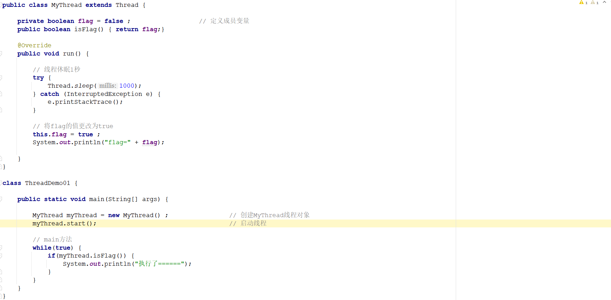

##  day12作业

#### 一、选择题

##### 1. Java语言中提供了一个（ D ）线程，自动回收动态分配的内存

A. 异步 

B. 消费者

C. 守护 

D. 垃圾收集

##### 2. Java语言避免了大多数的（ C ）是错误的。

A. 数组下标越界 

B. 算术溢出 

C. 内存泄露 

D. 非法的方法参数

##### 3. 有三种原因可以导致线程不能运行，它们是（ABC）

A．等待 

B．阻塞 

C．休眠 

D．由于I/O操作而阻塞

##### 4.当（A）方法终止时，能使线程进入死亡状态。

A．run 

B．setPrority

C．sleep

D．yield

##### 5.用（B）方法可以改变线程的优先级。

A．run 

B．setPrority 

C．yield 

D．sleep

##### 7.线程通过（D）方法可以休眠一段时间，然后恢复运行。

A．run 

B．setPrority 

C．yield 

D．sleep

##### 8. 关于下列同步说法错误的是 ( D )

 A. 同步代码块可以锁住指定代码,同步方法是锁住方法中所有代码

 B. 同步代码块可以指定锁对象,同步方法不能指定锁对象

 C. 对于非static方法,同步锁是this

 D. 对于static方法,同步锁是调用此方法的对象

------


#### 二、今日方法：

1. 线程同步涉及到的关键字以及类名和方法名：

   ```java
   答：
   ```

2. 线程六种状态的名称：

   ```java
   答：
   ```

3. 线程通信涉及的方法名称：

   ```java
   答：
   ```

4. 线程工具类中，能创建不同线程池的方法名称：

   ```java
   答：
   ```

------

#### 三、简答题：

1. 多线程是不是就是线程不安全？为什么会发生线程安全？

   ```java
   答：
   ```

2. 有几种方式解决线程安全？需要注意什么？

   ```java
   答：
   ```

3. 简述通过ThreadPoolExecutor创建线程池时，构造方法对应的7个参数分别表示什么意思？并说明常见的任务的拒绝策略都有哪些？

   ```java
   答：
   ```

4. 为什么要使用线程池，线程池有什么优势？

   ```java
   答：
   ```

5. 简述线程池的工作流程？

   ```java
   答：
   ```

------

#### 四、排错题：

##### 排错题1：分析当执行如下程序的ThreadDemo01的main方法的时候，在控制台会输出什么内容？如果想一直输出"执行了======"应该对该程序如何改造【只允许对flag变量进行相关修改】？并且说明原因？



```tex
答：
```

##### 排错题2：以下代码在控制台输出结果是什么？多运行几次试试？如果结果不是如你所愿，请试着猜一下原因~


```java
答：
```

#### 五、代码题：

##### 第一题：分析以下需求，并用代码实现

**训练目标**：

​	掌握java中多线程基本使用

**需求描述**：

​	有100份礼品，小红，小明两人同时发送，当剩下的礼品小于10份的时候则不再送出，利用多线程模拟该过程并将线程的名称打印出来。并最后在控制台分别打印小红，小明各自送出多少分礼物。

##### 第二题：分析以下需求，并用代码实现

**训练目标**：

​	掌握java中多线程基本使用

**需求描述**：

```java
有一个抽奖池,该抽奖池中存放了奖励的金额,该抽奖池中的奖项为 {10,5,20,50,100,200,500,800,2,80,300,700}; 
	创建两个抽奖箱(线程)设置线程名称分别为“抽奖箱1”，“抽奖箱2”，随机从抽奖池中获取奖项元素并打印在控制台上,格式如下:
	
	1.每次抽出一个奖项就打印一个(随机)
		抽奖箱1 又产生了一个 10 元大奖
		抽奖箱1 又产生了一个 100 元大奖
		抽奖箱1 又产生了一个 200 元大奖
		抽奖箱1 又产生了一个 800 元大奖	
		抽奖箱2 又产生了一个 700 元大奖			
		//.....

	2.每次抽的过程中，不打印，抽完时一次性打印(随机)
		在此次抽奖过程中，抽奖箱1总共产生了6个奖项，分别为：10,20,100,500,2,300最高奖项为300元，总计额为932元
		在此次抽奖过程中，抽奖箱2总共产生了6个奖项，分别为：5,50,200,800,80,700最高奖项为800元，总计额为1835元

	3.每次抽的过程中，不打印，抽完时一次性打印(随机)
		在此次抽奖过程中，抽奖箱1总共产生了6个奖项，分别为：10,20,100,500,2,300最高奖项为300元，总计额为932元
		在此次抽奖过程中，抽奖箱2总共产生了6个奖项，分别为：5,50,200,800,80,700最高奖项为800元，总计额为1835元
		在此次抽奖过程中,抽奖箱2中产生了最大奖项,该奖项金额为800元
		
	以上打印效果只是数据模拟,实际代码运行的效果会有差异
```

------

##### 第三题：【选做题】分析以下需求，并用代码实现

**训练目标：**

​	掌握java中多线程的线程通信基本使用

**需求描述：**	 

​	用两个线程玩猜数字游戏，第一个线程负责随机给出1~100之间的一个整数，第二个线程负责猜出这个数。
要求：

1. 每当第二个线程给出自己的猜测后，第一个线程都会提示“猜小了”、“猜 大了”或“猜对了”。
2. 猜数之前，要求第二个线程要等待第一个线程设置好 要猜测的数。
3. 第一个线程设置好猜测数之后，两个线程还要相互等待，其原则是：
   - 第二个线程给出自己的猜测后，等待第一个线程给出的提示；
   - 第一个 线程给出提示后，等待第二个线程给出猜测，如此进行，直到第二个线程给 出正确的猜测后，两个线程进入死亡状态。 


