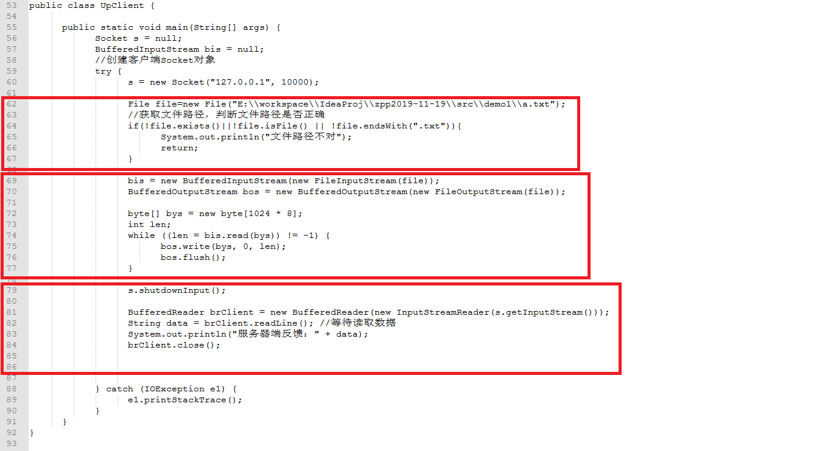

##  day13作业

#### 一、选择题

##### 1. 下面关于TCP的描述，不正确的是( D )
A.它是面向连接的传输协议
B.它和IP相结合，构成Internet协议的核心
C.TCP是一个精确传输协议，但并不是及时传输协议
D.TCP的主要作用是将网络数据流压缩成数据报的形式

##### 2.Internet中的主要通信协议是( D )
A.HTML
B.HTTP
C.ARPA
D.TCP/IP

##### 3. 目前应用最广泛的IP地址是基于IPV4的，每个IP地址的长度为（D）位。
A.4
B.8
C.16
D.32

#####  4.TCP的特点不包括如下哪一点(C)
A. 面向连接
B. 传输数据无限制
C. 传输速度快
D. 面向字节流

#### 二、今日方法：

1. java中，表示互联网协议 (IP) 地址类名及方法名称：

   ```java
   答：
   ```

2. UDP协议涉及的类名及方法名称：

   ```java
   答：
   ```

3. TCP协议涉及的类名及方法名称：

   ```java
   答：
   ```

------

#### 三、简答题：

1. 简述TCP协议的特点？

   ```java
   答：
   ```

2. 简述UDP协议的特点？

   ```java
   答：
   ```

3. 简述三次握手过程？

   ```java
   答：
   ```

4. 简述四次挥手过程？

   ```java
   答：
   ```

------

#### 三、排错题

 以下代码中共有5处错误，红框标出的代码范围内存在错误，请找出具体错误，并给出修改方案。

  需求：   

  编写客户端和服务器端程序，客户端用于上传.txt文件，服务器端用于接收文件，文件上传成功后，服务器端给客户端一个反馈：文件上传成功。

  1、需要对文件类型进行判断

  2、服务器端采用多线程实现，文件名不能冲突




```java
答：
9，Socket s = ss.accept(); 
13，new Thread(()->{......})  
64，if(!file.exists()||!file.isFile() || !file.getName().endsWith(".txt"))  
70，BufferedOutputStream bos = new BufferedOutputStream(s.getOutputStream());  
79，s.shutdownOutput()

```

------

#### 四、代码题：

##### 第一题：分析以下需求，并用代码实现

**训练目标**：

​	掌握java中网络编程的基本使用

**需求描述**：

分别创建客户端、服务端，并绑定端口。

1. 服务端要求：
   1. 使用多线程来侦听客户端请求；
   2. 如果有客户发出请求，则主动给每位客户端发送一句“欢迎光临！请上传文件(文本文件)！”；
   3. 用户上传后，将文件保存在本地，并回复上传成功；
   4. 如果客户端上传的文件中有敏感词汇，则替换成**，再保存。
   5. 敏感词汇：操
2. 客户端要求：
   1. 创建一个套接字(Socket)， 向服务器的侦听端口发出请求；
   2. 从本地选择一个带有敏感词汇的文本文件上传到服务器；
   3. 并将服务端响应的数据在控制台输出。


------


