# 前端环境搭建、员工管理

## 课程内容

- 前端环境搭建

- 员工分页查询
- 启用禁用员工账号
- 新增员工
- 修改员工

## 1. 前端环境搭建

### 1.1 技术选型

本项目使用到的前端技术如下：

- node.js
- vue
- ElementUI
- axios
- vuex
- vue-router
- typescript

### 1.2 熟悉前端代码结构

直接导入课程资料中提供的苍穹外卖项目前端初始工程，此工程中已经开发了部分功能，后续我们在此基础上开发新功能即可。

导入后的效果如下：

主要代码在src目录中，src目录结构如下：

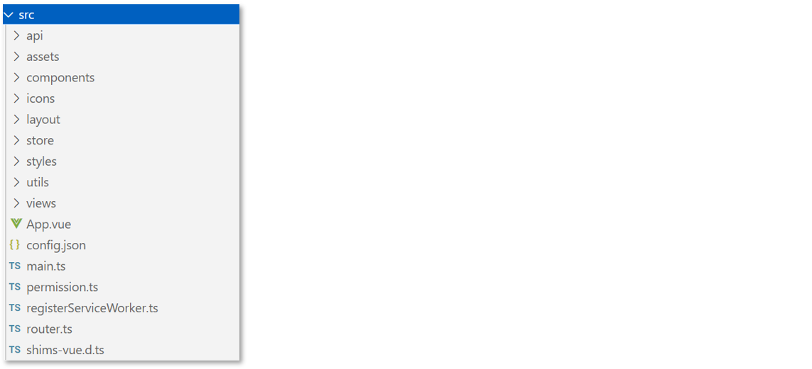

下面重点介绍一下src中的重点文件和目录：

- api：存放封装了Ajax请求文件的目录
- components：公共组件存放目录
- views：存放视图组件的目录
- App.vue：项目的主组件，页面的入口文件
- main.ts：整个项目的入口文件
- router.ts：路由文件

注意：我们上面导入的初始工程中并没有前端项目运行所依赖的JS包，需要在终端通过 npm install 命令进行安装。安装完成后，可以看到生成了node_modules目录，目录中就是安装的JS包，效果如下：

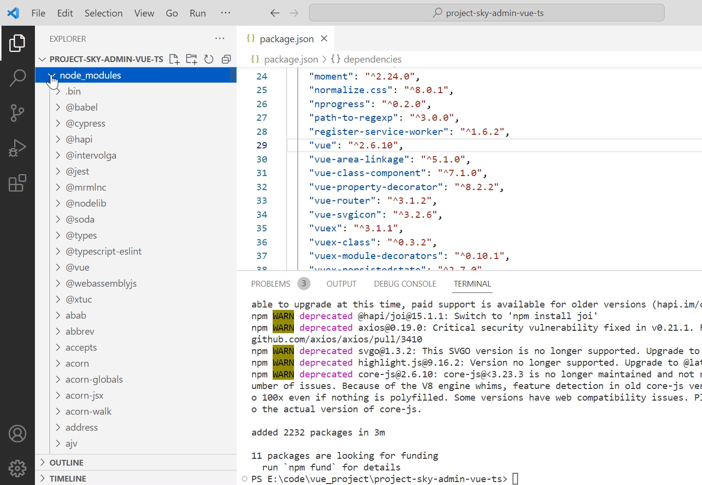

接下来，我们通过初始工程中已经完成的登录功能来跟踪程序的执行过程，熟悉前端项目的代码结构。

首先需要启动前端项目，命令为：npm run serve，然后访问前端项目，效果如下：

注意：需要同时启动后端 java 服务，才能进行前后端交互。

具体操作的步骤如下：

① 获得登录页面路由地址

​	登录页面完整的访问地址为 http://localhost:8888/#/login，其中登录页面的路由地址为 /login，我们需要通过此路由地址找到对应的登录视图组件

② 从main.ts中找到路由文件

​	main.ts是整个前端项目的入口文件，在此文件中会创建Vue实例，在创建Vue实例时需要传入路由对象，所以从此文件中可以找到对应的路由文件位置。如下所示：

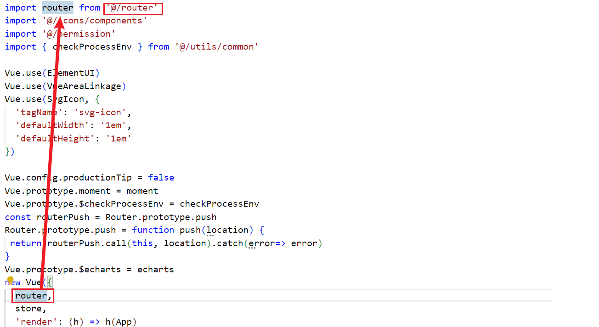

③ 从路由文件中找到登录视图组件

​	在路由文件中会配置整个项目所有的路由映射规则，我们只需要找到 /login 这个路径对应的实体组件即可。如下所示：

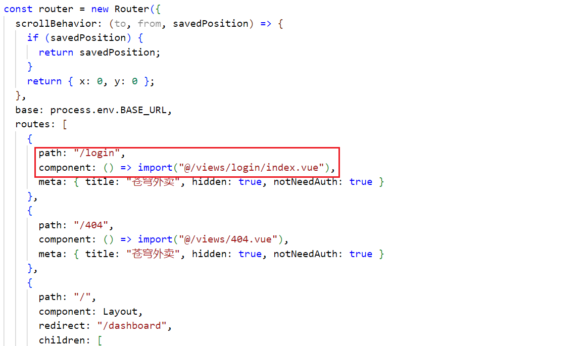

④ 从登录视图组件中找到登录方法

​	从上面的路由文件可以确定登录视图组件就是src/views/login/index.vue，此时就可以打开这个文件，然后仔细阅读代码，找到登录方法，如下所示：

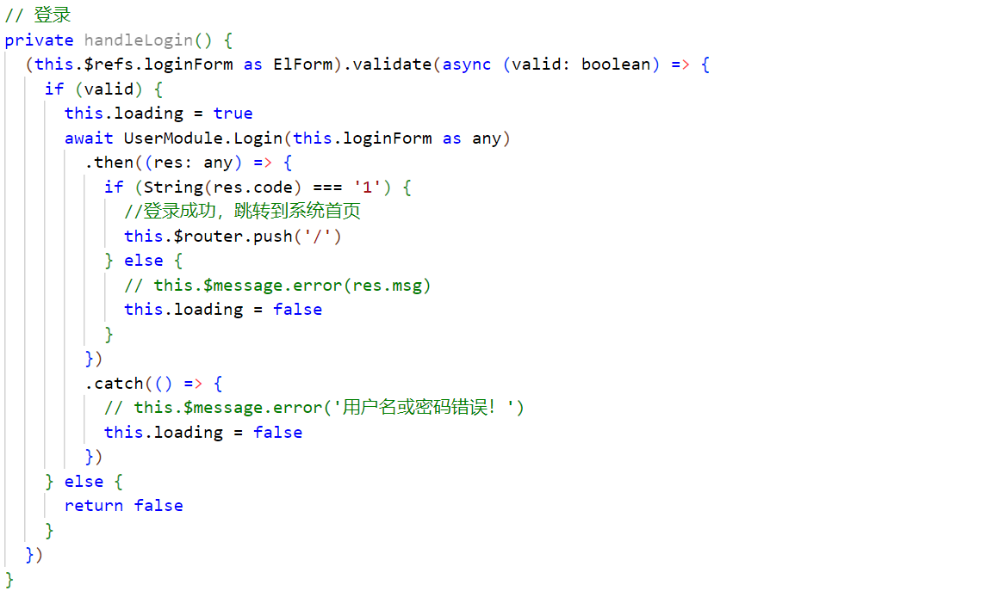

⑤ 跟踪登录方法的执行过程

​	找到登录方法后，就需要跟踪代码的执行过程，主要就是观察前后端的交互过程。例如前端如何发送的Ajax请求，后端返回的数据格式等等

## 2. 员工分页查询

### 2.1 需求分析和接口设计

根据产品原型来了解需求，员工分页查询的产品原型如下：

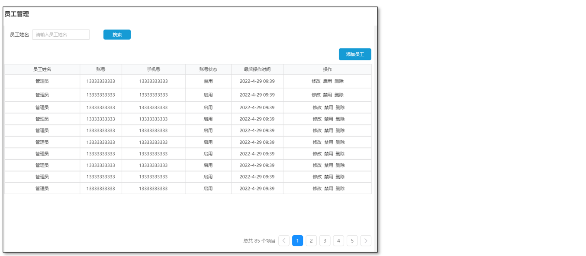

业务规则：

- 根据页码展示员工信息(员工姓名、账号、手机号、账号状态、最后操作时间等)
- 每页展示10条数据
- 分页查询时可以根据需要，输入员工姓名进行查询

要展示员工分页数据，就需要前后端进行数据交互，对应的接口如下：

**基本信息**

**Path：** /admin/employee/page

**Method：** GET

**请求参数**

**Query**

| 参数名称 | 是否必须 | 示例 | 备注       |
| -------- | -------- | ---- | ---------- |
| name     | 否       | 张三 | 员工姓名   |
| page     | 是       | 1    | 页码       |
| pageSize | 是       | 10   | 每页记录数 |

**返回数据**

| 名称          | 类型        | 是否必须 | 默认值 | 备注 | 其他信息          |
| ------------- | ----------- | -------- | ------ | ---- | ----------------- |
| code          | number      | 必须     |        |      |                   |
| msg           | null        | 非必须   |        |      |                   |
| data          | object      | 必须     |        |      |                   |
| ├─ total      | number      | 必须     |        |      |                   |
| ├─ records    | object []   | 必须     |        |      | item 类型: object |
| ├─ id         | number      | 必须     |        |      |                   |
| ├─ username   | string      | 必须     |        |      |                   |
| ├─ name       | string      | 必须     |        |      |                   |
| ├─ password   | string      | 必须     |        |      |                   |
| ├─ phone      | string      | 必须     |        |      |                   |
| ├─ sex        | string      | 必须     |        |      |                   |
| ├─ idNumber   | string      | 必须     |        |      |                   |
| ├─ status     | number      | 必须     |        |      |                   |
| ├─ createTime | string,null | 必须     |        |      |                   |
| ├─ updateTime | string      | 必须     |        |      |                   |
| ├─ createUser | number,null | 必须     |        |      |                   |
| ├─ updateUser | number      | 必须     |        |      |                   |

### 2.2 代码开发

要开发前端代码，首先需要找到对应的组件。从路由文件 router.ts 中找到员工管理页面（组件）。

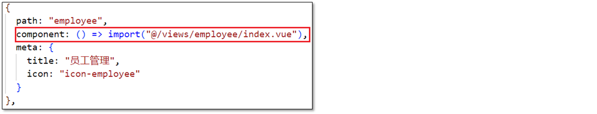

可以看到，员工管理页面（组件）的位置为：src/views/employee/index.vue。我们只需要在此文件中开发员工分页查询相关的前端代码即可，整个开发过程大概可以分为以下几个关键步骤：

1. 根据产品原型，制作页面头部效果（输入框、查询按钮等）
2. 为查询按钮绑定单击事件，发送Ajax请求，查询员工分页数据，实现前后端交互
3. 提供 vue 的初始化方法，在页面加载后就查询分页数据
4. 使用ElementUI提供的表格组件展示分页数据
5. 使用ElementUI提供的分页条组件实现翻页效果

注意：开发过程中，并不是所有的代码都实现了再测试，而是开发一部分，就需要测试一下，看效果，如果有问题再调整。没有问题，再继续开发、测试。所以，这是一个逐渐完善的过程。下面我们就按照上面的几个关键步骤来开发，每开发完一个关键步骤，就需要测试一下，来验证我们的代码是否正确。

#### 2.2.1 制作页面头部效果

根据产品原型，制作页面头部效果（输入框、查询按钮等）。产品原型中的头部效果如下：

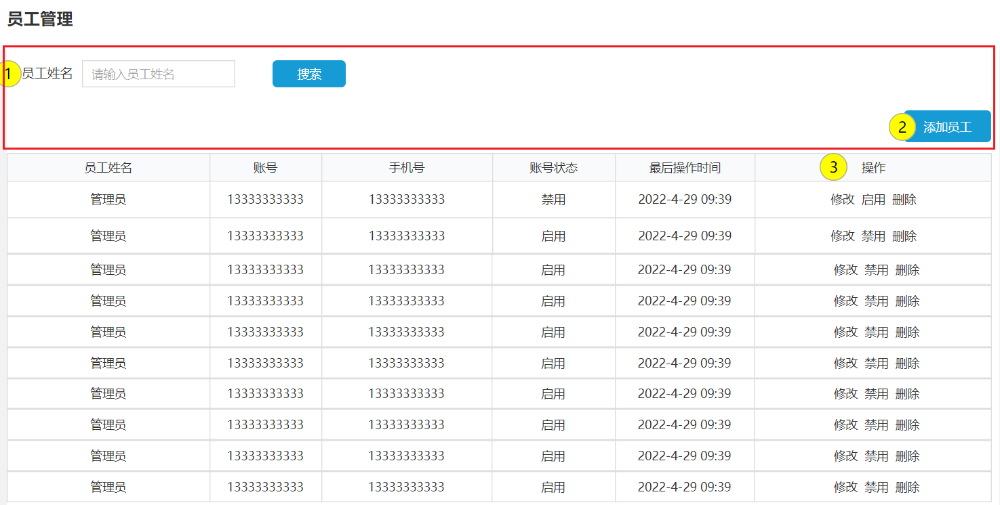

注意：输入框和按钮都是使用 ElementUI 提供的组件，对于前端的组件只需要参考 ElementUI 提供的文档，进行修改即可。实现代码如下：

~~~html

    <label style="margin-right: 5px">
        员工姓名: 
    </label>
    <el-input placeholder="请输入员工姓名" style="width: 15%" />
    <el-button type="primary" style="margin-left: 20px">查询</el-button>
    <el-button type="primary" style="float: right">+添加员工</el-button>

~~~

开发完上面代码后，就可以测试一下，页面效果如下：

#### 2.2.2 实现前后端数据交互

前面我们已经完成了页面头部效果开发，接下来就需要开发前后端数据交互的动态效果。

第一步：为查询按钮绑定单击事件

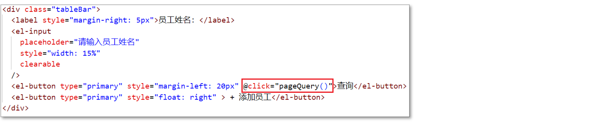

第二步：在methods中定义 pageQuery 方法，先验证当前方法能否正常执行

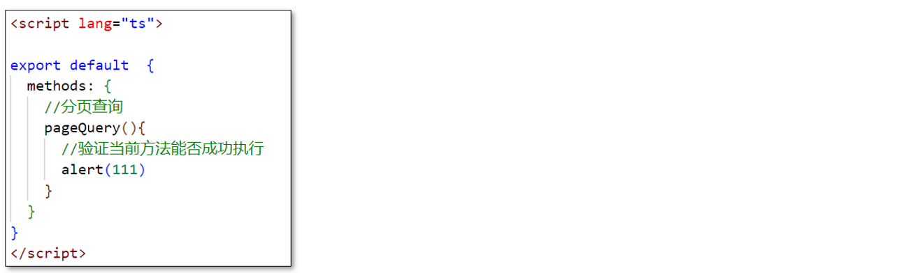

注意：按照开发规范，真正发送Ajax请求的代码需要封装到 api目录下的ts文件中（src/api/employee.ts）

第三步：在src/api/employee.ts 中定义 getEmployeeList 方法，实现发送Ajax请求获取分页数据

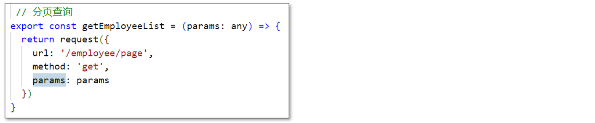

注意：发送 Ajax 请求的URL地址需要和前面我们设计的分页查询接口对应

第四步：在员工管理组件中导入 employee.ts 中定义的方法，并在data() 方法中定义分页相关的模型数据

注意：需要将name属性和上面的员工姓名输入框进行双向绑定，如下：

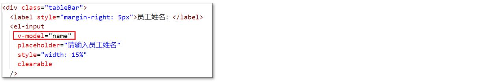

第五步：在pageQuery 方法中调用 getEmployeeList 方法

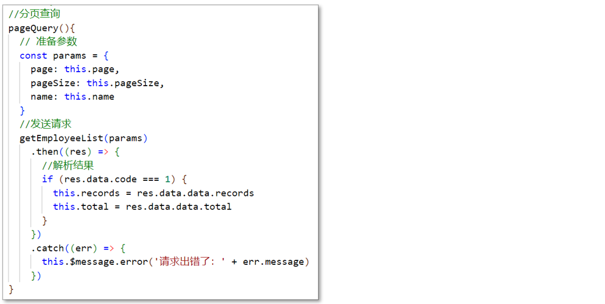

#### 2.2.3 自动发送Ajax请求

前面的代码我们已经实现了前后端数据交互，但是有一个问题，就是只有在点击查询按钮时才会发生Ajax请求，实现分页数据查询。我们通常需要的是在当前页面（组件）加载后，就需要发送Ajax请求，查询第一页的数据。要实现这个效果，我们可以通过vue的生命周期方法，即created方法来做到，代码如下：

#### 2.2.4 使用表格展示分页数据

前面我们已经实现了前后端数据交互，现在就需要将后端返回的数据通过表格展示出来，我们可以使用ElementUI提供的表格组件，具体使用方法可以参照官方提供的示例 https://element.eleme.io/#/zh-CN/component/table

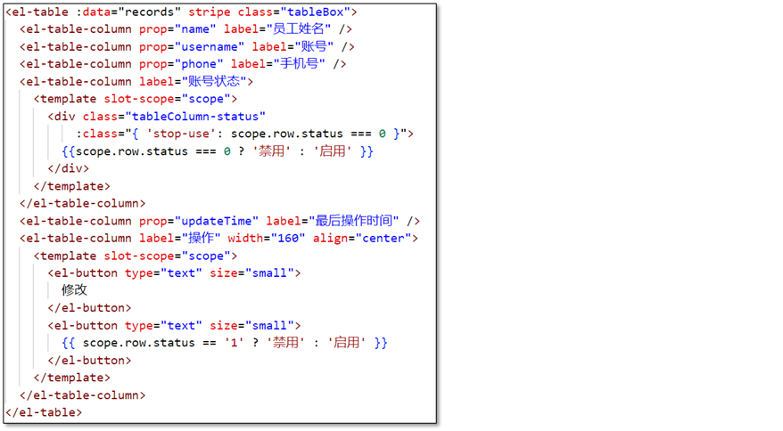

#### 2.2.5 使用分页条实现翻页效果

使用 ElementUI 提供的分页条组件，并绑定事件处理函数，具体使用方法可以参照官方提供的示例 https://element.eleme.io/#/zh-CN/component/pagination

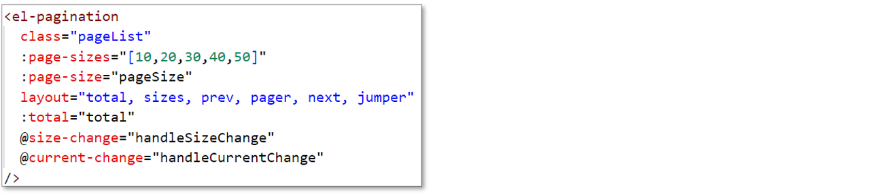

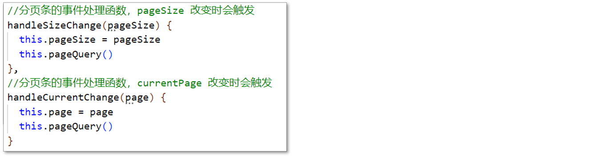

### 2.3 功能测试

可以通过下面两种方式来测试：

- 直接进行前后端联调，查看页面效果
- 通过浏览器F12查看数据交互过程

## 3. 启用禁用员工账号

### 3.1 需求分析和接口设计

根据产品原型来进行需求分析：

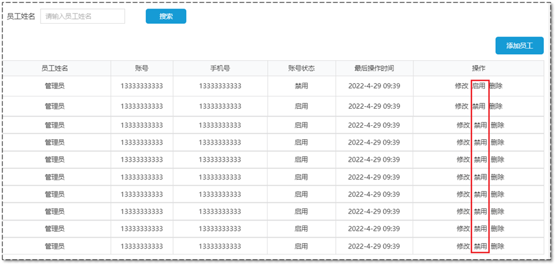

可以对状态为“启用” 的员工账号进行“禁用”操作

可以对状态为“禁用”的员工账号进行“启用”操作

状态为“禁用”的员工账号不能登录系统

接口设计如下：

 **基本信息**

**Path：** /admin/employee/status/{status}

**Method：** POST

**请求参数**

**Headers**

| 参数名称     | 参数值           | 是否必须 | 示例 | 备注 |
| ------------ | ---------------- | -------- | ---- | ---- |
| Content-Type | application/json | 是       |      |      |

**路径参数**

| 参数名称 | 示例 | 备注                  |
| -------- | ---- | --------------------- |
| status   | 1    | 状态，1为启用 0为禁用 |

**Query**

| 参数名称 | 是否必须 | 示例 | 备注   |
| -------- | -------- | ---- | ------ |
| id       | 是       |      | 员工id |

**返回数据**

| 名称 | 类型    | 是否必须 | 默认值 | 备注 | 其他信息      |
| ---- | ------- | -------- | ------ | ---- | ------------- |
| code | integer | 必须     |        |      | format: int32 |
| data | string  | 非必须   |        |      |               |
| msg  | string  | 非必须   |        |      |               |

### 3.2 代码开发

第一步：为启用、禁用按钮绑定单击事件

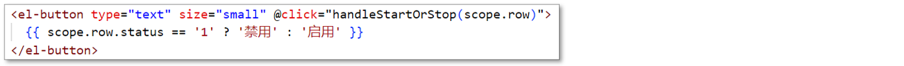

第二步：编写对应的处理函数handleStartOrStop

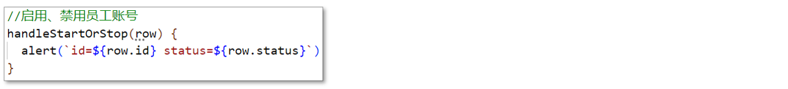

到此可以先测试一下，检查当前方法能否成功执行，页面效果如下：

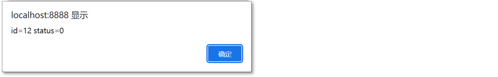

第三步：在 employee.ts 中封装启用禁用员工账号方法，发送Ajax请求

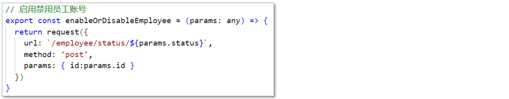

注意：发送请求的方式和相关参数，必须和前面的接口设计保持一致

第四步：在员工管理组件中引入上面定义的enableOrDisableEmployee方法，并完善 handleStartOrStop 方法

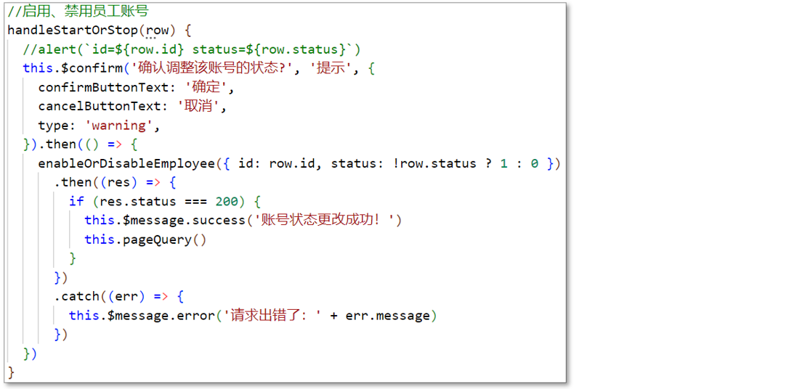

第五步：代码优化，如果是管理员账号则不允许更改账号状态

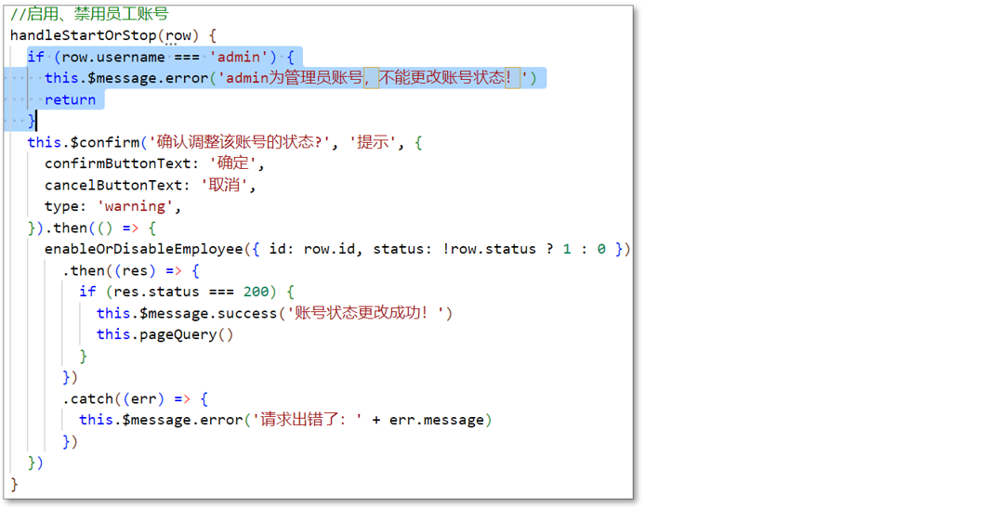

### 3.3 功能测试

直接进行前后端联调，查看页面效果

通过浏览器F12查看数据交互过程

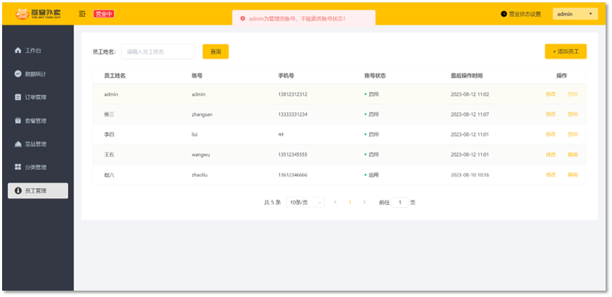

## 4. 新增员工

### 4.1 需求分析和接口设计

根据产品原型来进行需求分析，产品原型如下：

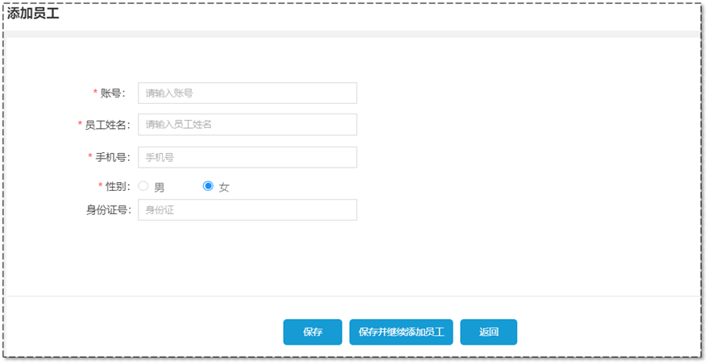

新增员工时需要录入 账号、员工姓名、手机号、性别、身份证号等信息。其中账号因为是登录凭证，所以必须是唯一的。手机号要求必须是合法的11位手机号码，身份证号为合法的18位身份证号码。

当新员工入职后，可以通过当前的新增员工功能来为新员工开通账号，新员工通过开通的账号来登录商家管理端系统。

接口设计如下：

 **基本信息**

**Path：** /admin/employee

**Method：** POST

**请求参数**

**Headers**

| 参数名称     | 参数值           | 是否必须 | 示例 | 备注 |
| ------------ | ---------------- | -------- | ---- | ---- |
| Content-Type | application/json | 是       |      |      |

**Body**

| 名称     | 类型    | 是否必须 | 默认值 | 备注   | 其他信息      |
| -------- | ------- | -------- | ------ | ------ | ------------- |
| id       | integer | 非必须   |        | 员工id | format: int64 |
| idNumber | string  | 必须     |        | 身份证 |               |
| name     | string  | 必须     |        | 姓名   |               |
| phone    | string  | 必须     |        | 手机号 |               |
| sex      | string  | 必须     |        | 性别   |               |
| username | string  | 必须     |        | 用户名 |               |

**返回数据**

| 名称 | 类型    | 是否必须 | 默认值 | 备注 | 其他信息      |
| ---- | ------- | -------- | ------ | ---- | ------------- |
| code | integer | 必须     |        |      | format: int32 |
| data | object  | 非必须   |        |      |               |
| msg  | string  | 非必须   |        |      |               |

### 4.2 代码开发

要开发新增员工前端代码，首先需要了解添加员工业务功能的操作步骤：

1. 在员工管理列表页面，点击 “添加员工”按钮，跳转到新增页面
2. 在新增员工页面录入员工相关信息
3. 点击“保存”按钮完成新增操作

接下来我们就可以按照上面的操作步骤来具体开发前端的代码。

第一步：为“添加员工”按钮绑定单击事件

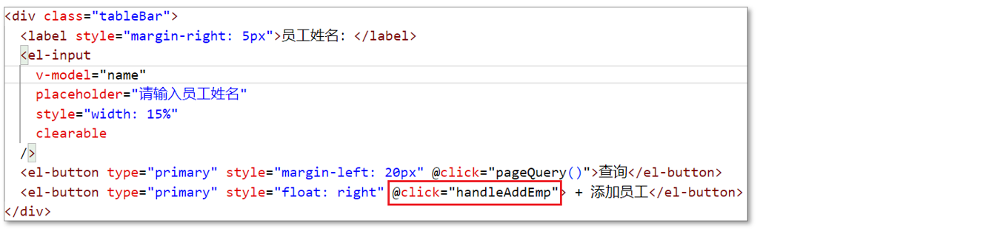

第二步：编写 handleAddEmp 方法，进行路由跳转

注意：在路由文件中已经配置了如下路由规则

第三步：根据产品原型，开发页面元素

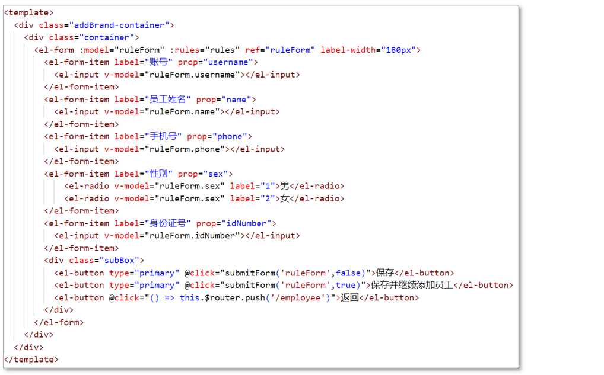

第四步：定义模型数据和表单校验规则

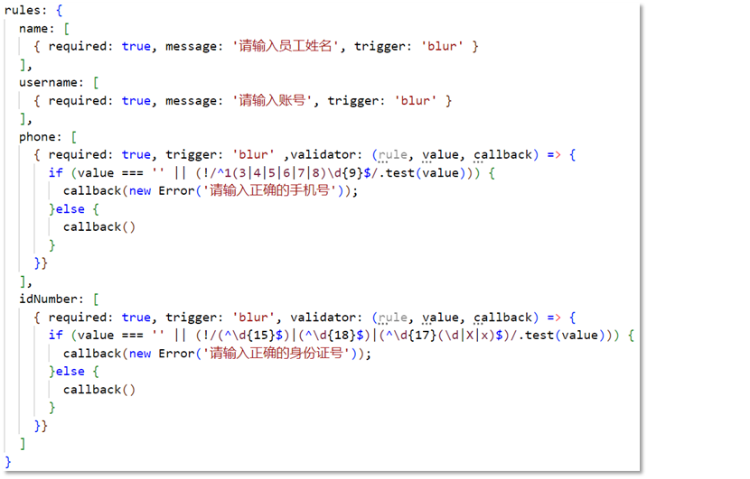

第五步：在 employee.ts 中封装新增员工方法，发送Ajax请求，实现前后端交互

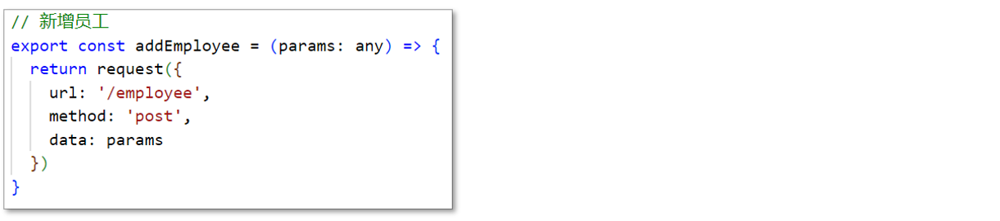

注意：

- 发送请求的方式和相关参数，必须和前面的接口设计保持一致
- 使用此方法时，别忘了在组件中通过import导入

第六步：在 methods 中定义提交表单的方法 submitForm

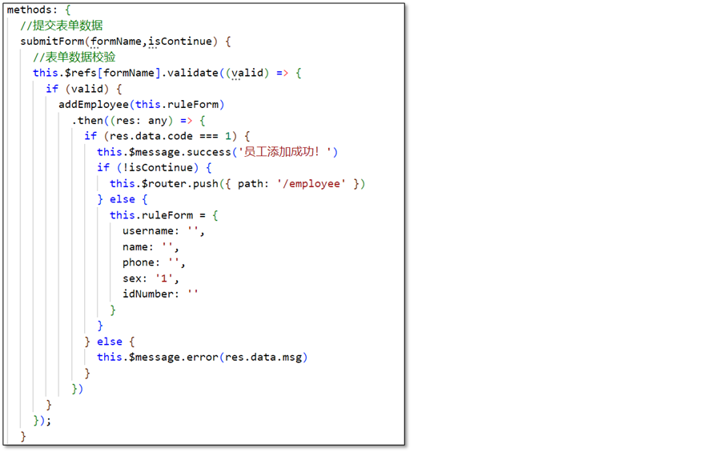

### 4.3 功能测试

直接进行前后端联调，查看页面效果

通过浏览器F12查看数据交互过程

## 5. 修改员工

### 5.1 需求分析和接口设计

根据产品原型来进行需求分析，产品原型如下：

修改员工时需要回显 账号、员工姓名、手机号、性别、身份证号等信息。其中账号因为是登录凭证，所以必须是唯一的。手机号要求必须是合法的11位手机号码，身份证号为合法的18位身份证号码。根据需要对数据进行修改即可。

修改员工功能涉及到2个接口，分别是根据id查询员工信息和根据id修改员工信息。具体接口设计如下：

（1）根据id查询员工 接口

**基本信息**

**Path：** /admin/employee/{id}

**Method：** GET

**请求参数**

**路径参数**

| 参数名称 | 示例 | 备注   |
| -------- | ---- | ------ |
| id       | 100  | 员工id |

**返回数据**

| 名称          | 类型    | 是否必须 | 默认值 | 备注 | 其他信息          |
| ------------- | ------- | -------- | ------ | ---- | ----------------- |
| code          | integer | 必须     |        |      | format: int32     |
| data          | object  | 必须     |        |      |                   |
| ├─ createTime | string  | 非必须   |        |      | format: date-time |
| ├─ createUser | integer | 非必须   |        |      | format: int64     |
| ├─ id         | integer | 非必须   |        |      | format: int64     |
| ├─ idNumber   | string  | 非必须   |        |      |                   |
| ├─ name       | string  | 非必须   |        |      |                   |
| ├─ password   | string  | 非必须   |        |      |                   |
| ├─ phone      | string  | 非必须   |        |      |                   |
| ├─ sex        | string  | 非必须   |        |      |                   |
| ├─ status     | integer | 非必须   |        |      | format: int32     |
| ├─ updateTime | string  | 非必须   |        |      | format: date-time |
| ├─ updateUser | integer | 非必须   |        |      | format: int64     |
| ├─ username   | string  | 非必须   |        |      |                   |
| msg           | string  | 非必须   |        |      |                   |

（2）根据id修改员工信息 接口

**基本信息**

**Path：** /admin/employee

**Method：** PUT

**请求参数**

**Headers**

| 参数名称     | 参数值           | 是否必须 | 示例 | 备注 |
| ------------ | ---------------- | -------- | ---- | ---- |
| Content-Type | application/json | 是       |      |      |

**Body**

| 名称     | 类型    | 是否必须 | 默认值 | 备注 | 其他信息      |
| -------- | ------- | -------- | ------ | ---- | ------------- |
| id       | integer | 必须     |        |      | format: int64 |
| idNumber | string  | 必须     |        |      |               |
| name     | string  | 必须     |        |      |               |
| phone    | string  | 必须     |        |      |               |
| sex      | string  | 必须     |        |      |               |
| username | string  | 必须     |        |      |               |

**返回数据**

| 名称 | 类型    | 是否必须 | 默认值 | 备注 | 其他信息      |
| ---- | ------- | -------- | ------ | ---- | ------------- |
| code | integer | 必须     |        |      | format: int32 |
| data | string  | 非必须   |        |      |               |
| msg  | string  | 非必须   |        |      |               |

### 5.2 代码开发

要开发修改员工前端代码，首先需要了解修改员工业务功能的操作步骤：

1. 在员工管理列表页面点击 “修改”按钮，跳转到修改页面
2. 在修改员工页面录入员工相关信息
3. 点击“保存”按钮完成修改操作

注意：

- 由于添加员工和修改员工的表单项非常类似，所以添加和修改操作可以共用同一个页面（addEmployee.vue）
- 修改员工涉及到原始数据回显，所以页面跳转时需要传递员工id作为参数

接下来我们就可以按照上面的操作步骤来具体开发前端的代码。

第一步：在员工管理页面中，为“修改”按钮绑定单击事件，用于跳转到修改页面

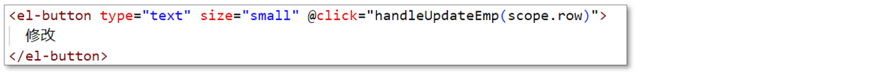

第二步：在methods中编写 handleUpdateEmp 方法，实现路由跳转

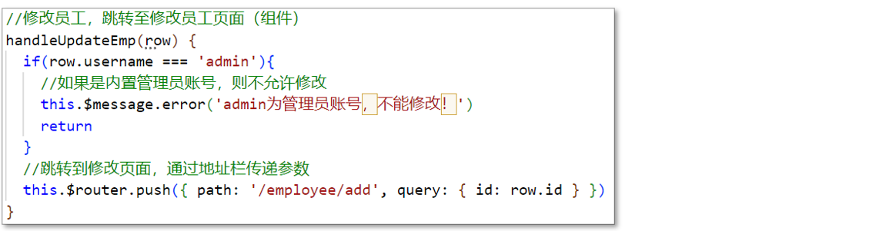

注意：使用路由对象的push方法在进行路由跳转时，可以通过地址栏传递参数，具体语法为：

~~~javascript
this.$router.push({path: 路由路径, query:{参数名:参数值}})
~~~

第三步：在 addEmployee.vue 组件中定义模型数据optType，用于区分本次操作是新增还是修改

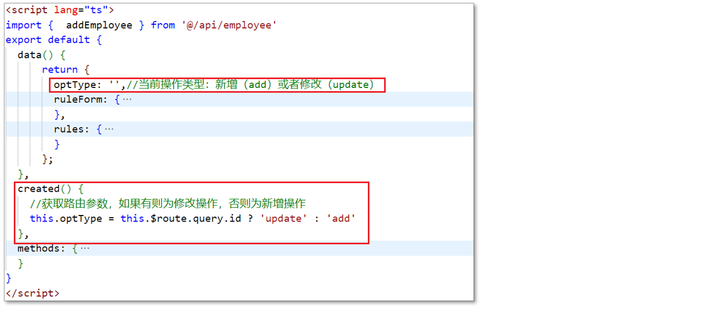

注意：区分当前操作是新增员工还是修改员工，只需要尝试获取路由参数id。如果能获取到则当前操作为修改，否则为新增。具体获取路由参数的语法为：

~~~javascript
this.$router.query.参数名
~~~

第四步：如果是修改操作，需要根据id查询员工原始信息用于页面回显，需要在 employee.ts 中创建queryEmployeeById方法

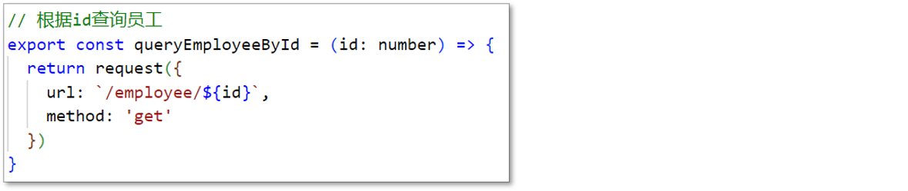

注意：

- 发送请求的方式和相关参数，必须和前面的接口设计保持一致
- 使用此方法时，别忘了在组件中通过import导入

第五步：在 addEmployee.vue 组件的 created 方法中查询员工原始信息用于页面数据回显 

到目前位置已经实现了员工信息的回显，可以进行简单的测试，如果回显没有问题再继续开发后面的代码

第六步：如果是修改操作，“保存并继续添加员工” 按钮则不需要显示，通过 v-if 指令进行判断

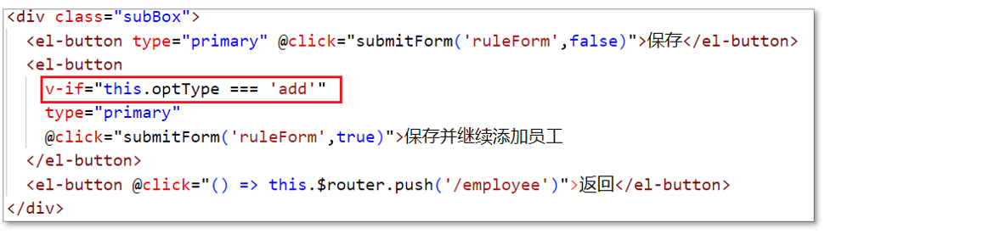

第七步：在 employee.ts 中创建方法，用于修改员工，发送Ajax请求

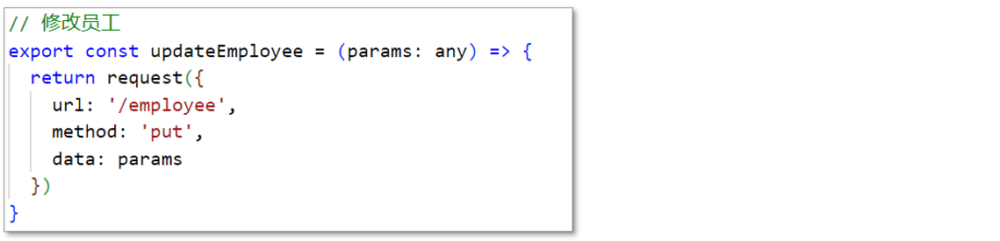

注意：

- 发送请求的方式和相关参数，必须和前面的接口设计保持一致
- 使用此方法时，别忘了在组件中通过import导入

第八步：修改 addEmployee.vue 组件中的 submitForm 方法，需要根据当前操作类型执行新增或者修改操作

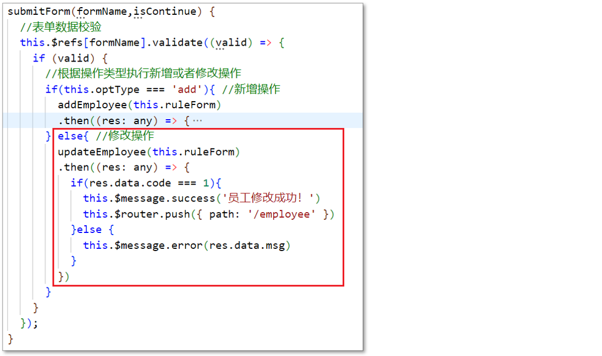

### 5.3 功能测试

直接进行前后端联调，查看页面效果

通过浏览器F12查看数据交互过程