# 套餐管理

## 课程内容

- 套餐分页查询
- 启售停售套餐
- 删除套餐
- 新增套餐

## 1. 套餐分页查询

### 1.1 需求分析和接口设计

根据产品原型来了解需求，套餐分页查询的产品原型如下：

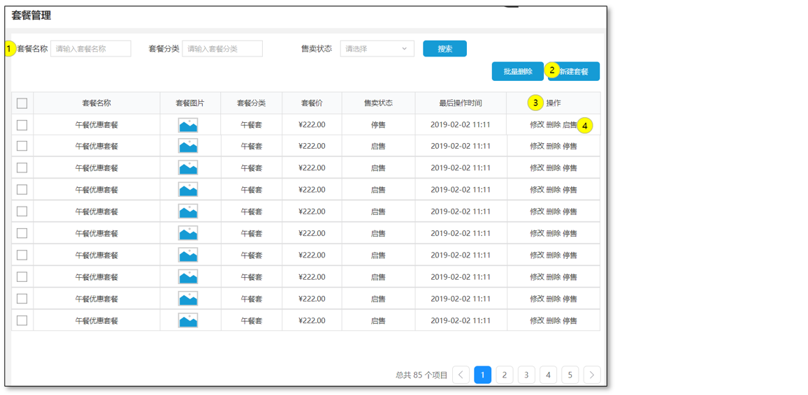

业务规则：

- 根据页码展示套餐信息(套餐名称、套餐图片、套餐分类、价格、售卖状态、最后操作时间等)
- 每页展示10条数据
- 分页查询时可以根据需要，输入套餐名、套餐分类、售卖状态 进行查询

要展示套餐分页数据，就需要前后端进行数据交互，对应的接口有两个：

- 分类查询接口（用于套餐分类下拉框中分类数据展示）
- 套餐分页查询接口

（1）分类查询接口

 **基本信息**

**Path：** /admin/category/list

**Method：** GET

**请求参数**

**Query**

| 参数名称 | 是否必须 | 示例 | 备注                               |
| -------- | -------- | ---- | ---------------------------------- |
| type     | 否       | 2    | 分类类型：1为菜品分类，2为套餐分类 |

**返回数据**

| 名称          | 类型      | 是否必须 | 默认值 | 备注 | 其他信息          |
| ------------- | --------- | -------- | ------ | ---- | ----------------- |
| code          | integer   | 必须     |        |      | format: int32     |
| data          | object [] | 非必须   |        |      | item 类型: object |
| ├─ createTime | string    | 非必须   |        |      | format: date-time |
| ├─ createUser | integer   | 非必须   |        |      | format: int64     |
| ├─ id         | integer   | 非必须   |        |      | format: int64     |
| ├─ name       | string    | 非必须   |        |      |                   |
| ├─ sort       | integer   | 非必须   |        |      | format: int32     |
| ├─ status     | integer   | 非必须   |        |      | format: int32     |
| ├─ type       | integer   | 非必须   |        |      | format: int32     |
| ├─ updateTime | string    | 非必须   |        |      | format: date-time |
| ├─ updateUser | integer   | 非必须   |        |      | format: int64     |
| msg           | string    | 非必须   |        |      |                   |

（2）套餐分页查询接口

 **基本信息**

**Path：** /admin/setmeal/page

**Method：** GET

**请求参数**

**Query**

| 参数名称   | 是否必须 | 示例 | 备注         |
| ---------- | -------- | ---- | ------------ |
| categoryId | 否       |      | 分类id       |
| name       | 否       |      | 套餐名称     |
| page       | 是       |      | 页码         |
| pageSize   | 是       |      | 每页记录数   |
| status     | 否       |      | 套餐起售状态 |

**返回数据**

| 名称            | 类型      | 是否必须 | 默认值 | 备注 | 其他信息          |
| --------------- | --------- | -------- | ------ | ---- | ----------------- |
| code            | number    | 必须     |        |      |                   |
| msg             | null      | 非必须   |        |      |                   |
| data            | object    | 非必须   |        |      |                   |
| ├─ total        | number    | 非必须   |        |      |                   |
| ├─ records      | object [] | 非必须   |        |      | item 类型: object |
| ├─ id           | number    | 必须     |        |      |                   |
| ├─ categoryId   | number    | 必须     |        |      |                   |
| ├─ name         | string    | 必须     |        |      |                   |
| ├─ price        | number    | 必须     |        |      |                   |
| ├─ status       | number    | 必须     |        |      |                   |
| ├─ description  | string    | 必须     |        |      |                   |
| ├─ image        | string    | 必须     |        |      |                   |
| ├─ updateTime   | string    | 必须     |        |      |                   |
| ├─ categoryName | string    | 必须     |        |      |                   |

### 1.2 代码开发

要开发前端代码，首先需要找到对应的组件。从路由文件 router.ts 中找到套餐管理页面（组件）。

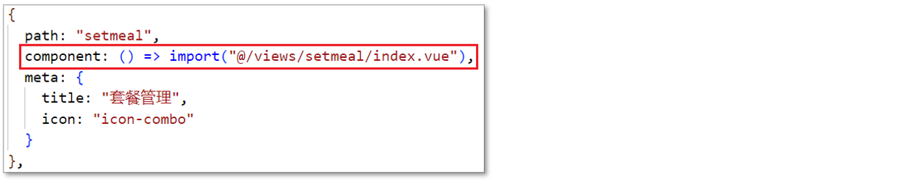

可以看到，套餐管理页面（组件）的位置为：src/views/setmeal/index.vue。我们只需要在此文件中开发套餐分页查询相关的前端代码即可，整个开发过程大概可以分为以下几个关键步骤：

1. 根据产品原型，制作页面头部效果（输入框、下拉框、查询按钮等）
2. 动态填充套餐分类下拉框中的分类数据
3. 为查询按钮绑定单击事件，发送Ajax请求，查询套餐分页数据，实现前后端交互
4. 提供 vue 的初始化方法，在页面加载后就查询分页数据
5. 使用ElementUI提供的表格组件展示分页数据
6. 使用ElementUI提供的分页条组件实现翻页效果

注意：开发过程中，并不是所有的代码都实现了再测试，而是开发一部分，就需要测试一下，看效果，如果有问题再调整。没有问题，再继续开发、测试。所以，这是一个逐渐完善的过程。下面我们就按照上面的几个关键步骤来开发，每开发完一个关键步骤，就需要测试一下，来验证我们的代码是否正确。

#### 2.2.1 制作页面头部效果

根据产品原型，制作页面头部效果（输入框、查询按钮等）。产品原型中的头部效果如下：

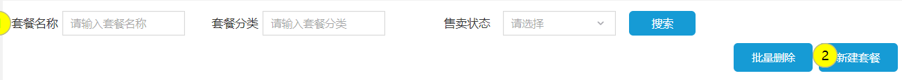

注意：输入框和按钮都是使用 ElementUI 提供的组件，对于前端的组件只需要参考 ElementUI 提供的文档，进行修改即可。实现代码如下：

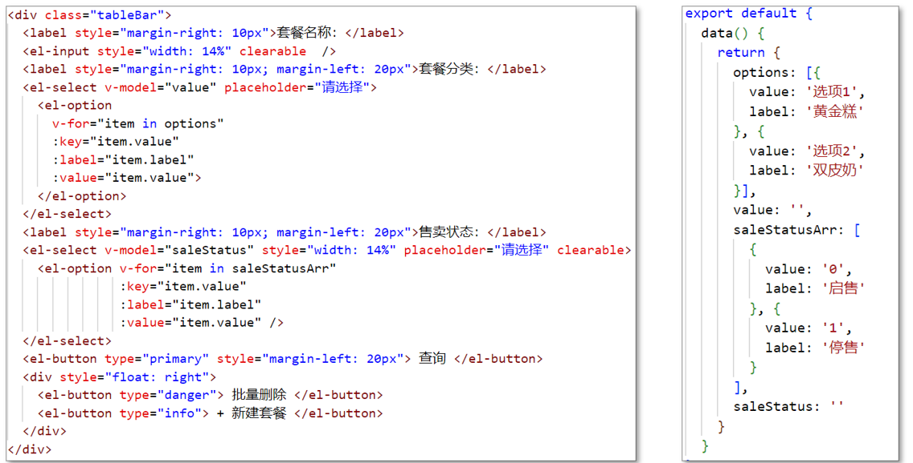

注意：当前套餐分类下拉框中的数据是直接在页面固定写死的，后续需要改为从后端动态获取。

#### 2.2.2 动态填充套餐分类下拉框数据

现在需要将套餐分类下拉框中的数据改为动态获取，即前端需要发送Ajax请求，调用后端的分类查询接口，然后将后端返回的套餐分类数据动态展示在下拉框中。因为本次前后端交互是需要查询分类数据，所以按照项目规范，发送Ajax请求的代码需要定义到 src/api/category.ts 文件中。其实在此文件中已经定义了此方法，如下：

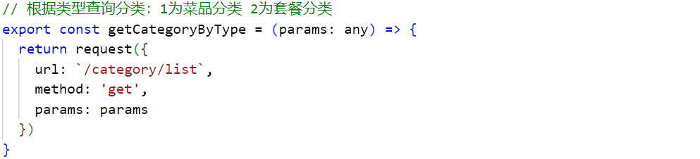

所以，此处只需要将此方法(getCategoryByType)导入当前组件，然后在 created 方法中调用此方法，获取套餐分类数据，动态填充套餐分类下拉框即可。具体代码如下：

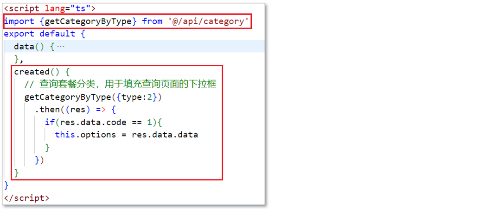

注意：因为此处我们要查询的是套餐分类，所以传递的参数type值为2。

前面我们已经初步实现了页面头部制作，并且可以填充下拉框中的数据了。但是命名上并不是特别规范，所以我们需要进行一个调整，具体修改后端的代码如下：

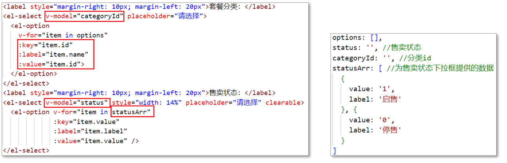

两个下拉框的测试效果如下：

#### 2.2.3 动态获取套餐分页数据

前面我们已经完成了页面头部效果开发，接下来就需要开发前后端数据交互的动态效果。

第一步：为查询按钮绑定单击事件

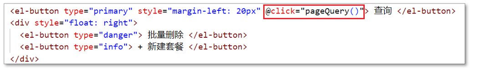

第二步：在methods中定义 pageQuery 方法，先验证当前方法能否正常执行

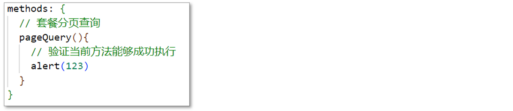

注意：按照开发规范，真正发送Ajax请求的代码需要封装到 api目录下的ts文件中（src/api/setMeal.ts）

第三步：在src/api/setMeal.ts 中定义 getSetmealPage 方法，实现发送Ajax请求获取分页数据

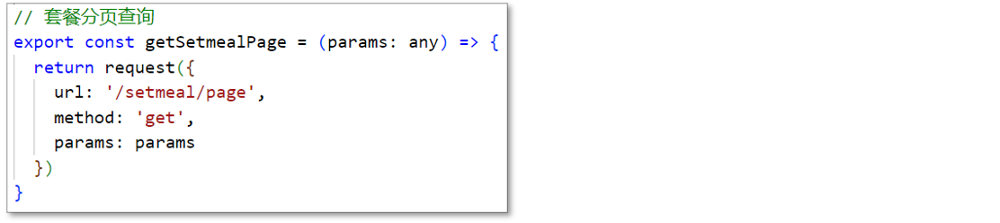

注意：发送 Ajax 请求的URL地址需要和前面我们设计的分页查询接口对应

第四步：在套餐管理组件中导入 setMeal.ts 中定义的方法，并在data() 方法中定义分页相关的模型数据

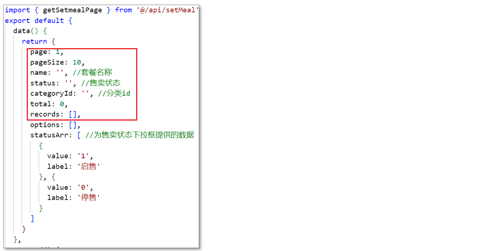

注意：需要将属性和上面的输入框、下拉框进行双向绑定。

第五步：在pageQuery 方法中调用 getSetmealPage方法，实现前后端数据交互

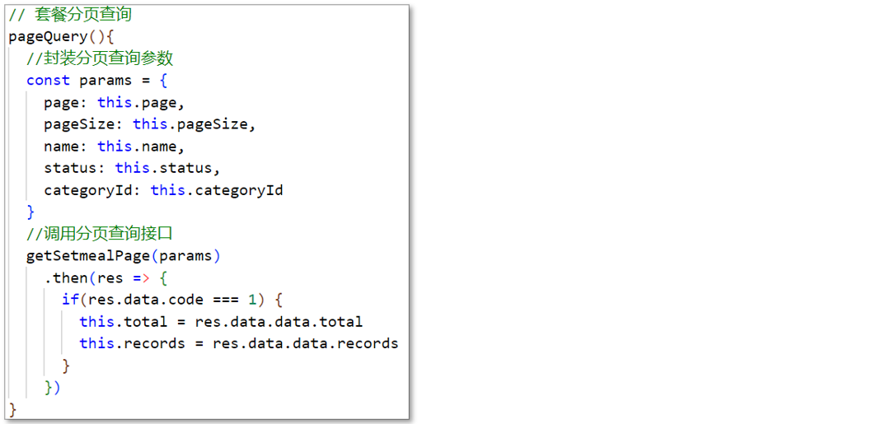

#### 2.2.4 自动发送Ajax请求

前面的代码我们已经实现了前后端数据交互，但是有一个问题，就是只有在点击查询按钮时才会发生Ajax请求，实现分页数据查询。我们通常需要的是在当前页面（组件）加载后，就需要发送Ajax请求，查询第一页的数据。要实现这个效果，我们可以通过vue的生命周期方法，即created方法来做到，代码如下：

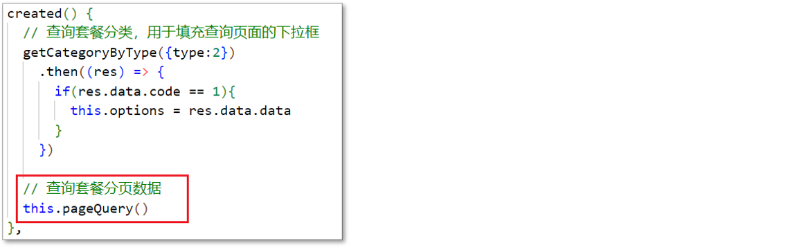

#### 2.2.5 使用表格展示分页数据

前面我们已经实现了前后端数据交互，现在就需要将后端返回的数据通过表格展示出来，我们可以使用ElementUI提供的表格组件，具体使用方法可以参照官方提供的示例 https://element.eleme.io/#/zh-CN/component/table

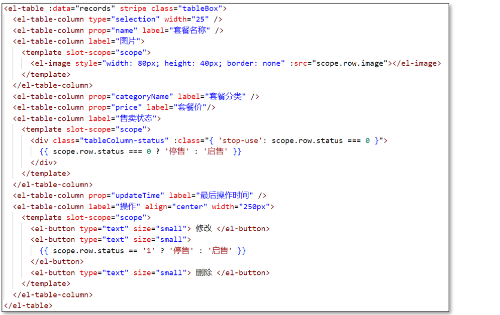

#### 2.2.6 使用分页条实现翻页效果

使用 ElementUI 提供的分页条组件，并绑定事件处理函数，具体使用方法可以参照官方提供的示例 https://element.eleme.io/#/zh-CN/component/pagination

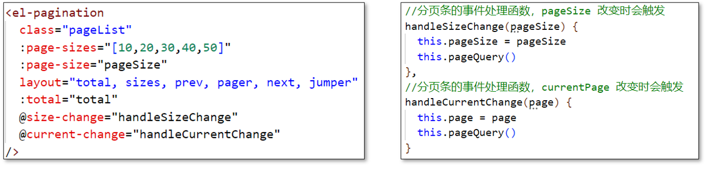

### 1.3 功能测试

可以通过下面两种方式来测试：

- 直接进行前后端联调，查看页面效果
- 通过浏览器F12查看数据交互过程

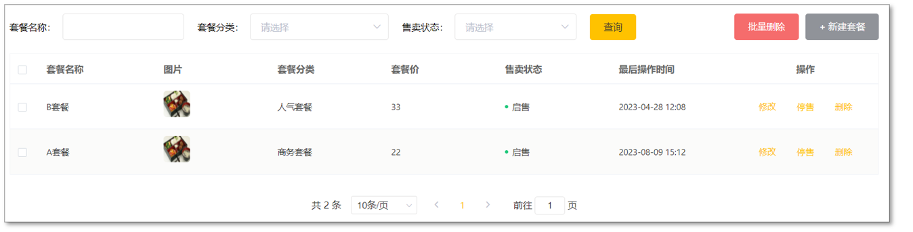

## 2. 启售停售套餐

### 2.1 需求分析和接口设计

根据产品原型来进行需求分析：

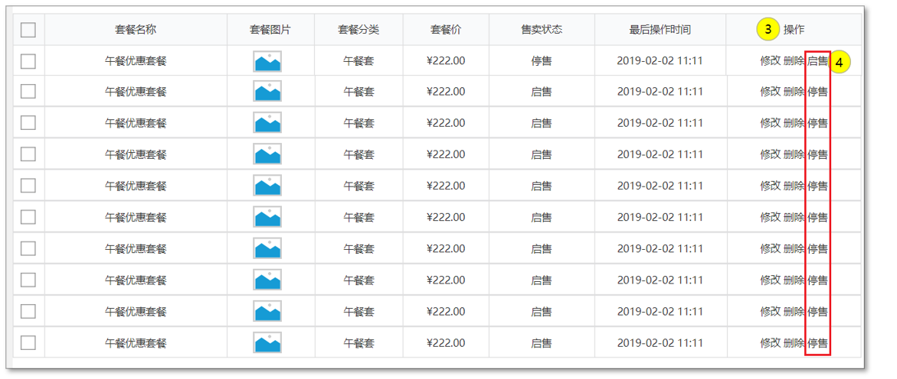

可以对状态为“启售” 的套餐进行“停售”操作

可以对状态为“停售”的套餐进行“启售”操作

状态为“停售”的套餐不展示在用户端小程序中，所以用户不能购买停售的套餐

接口设计如下：

**基本信息**

**Path：** /admin/setmeal/status/{status}

**Method：** POST

**请求参数**

**Headers**

| 参数名称     | 参数值           | 是否必须 | 示例 | 备注 |
| ------------ | ---------------- | -------- | ---- | ---- |
| Content-Type | application/json | 是       |      |      |

**路径参数**

| 参数名称 | 示例 | 备注                           |
| -------- | ---- | ------------------------------ |
| status   | 1    | 套餐状态，1表示起售，0表示停售 |

**Query**

| 参数名称 | 是否必须 | 示例 | 备注   |
| -------- | -------- | ---- | ------ |
| id       | 是       | 101  | 套餐id |

**返回数据**

| 名称 | 类型    | 是否必须 | 默认值 | 备注 | 其他信息      |
| ---- | ------- | -------- | ------ | ---- | ------------- |
| code | integer | 必须     |        |      | format: int32 |
| data | object  | 非必须   |        |      |               |
| msg  | string  | 非必须   |        |      |               |

### 2.2 代码开发

第一步：为启售停售按钮绑定单击事件

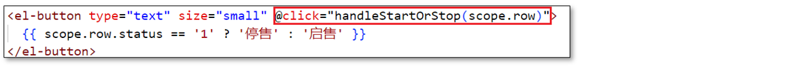

第二步：编写对应的处理函数handleStartOrStop

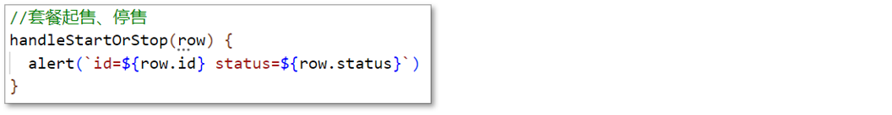

到此可以先测试一下，检查当前方法能否成功执行，页面效果如下：

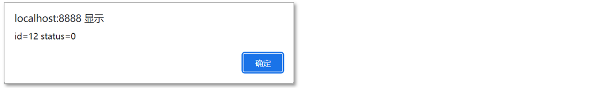

第三步：在 setMeal.ts 中封装套餐起售停售方法，发送Ajax请求

注意：发送请求的方式和相关参数，必须和前面的接口设计保持一致

第四步：在套餐管理组件中引入上面定义的enableOrDisableSetmeal方法，并完善 handleStartOrStop 方法

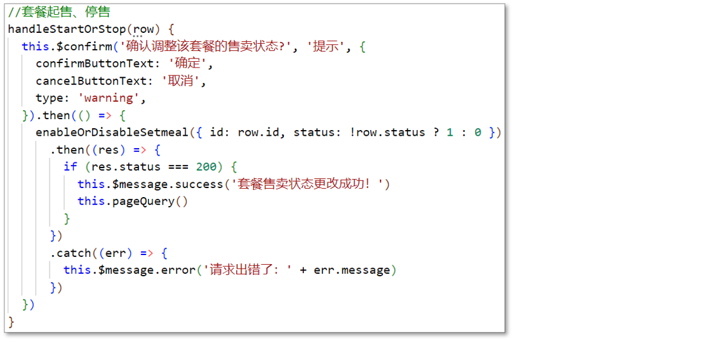

注意：

- 在进行套餐启售停售操作时，建议先弹出确认框，用户点击确定按钮后再进行前后端交互
- 在传递套餐状态参数status时，需要进行简单的处理，即：如果当前套餐状态值为1，则传递过去的参数为0；如果当前套餐状态值为0，则传递过去的参数为1

### 2.3 功能测试

直接进行前后端联调，查看页面效果

通过浏览器F12查看数据交互过程

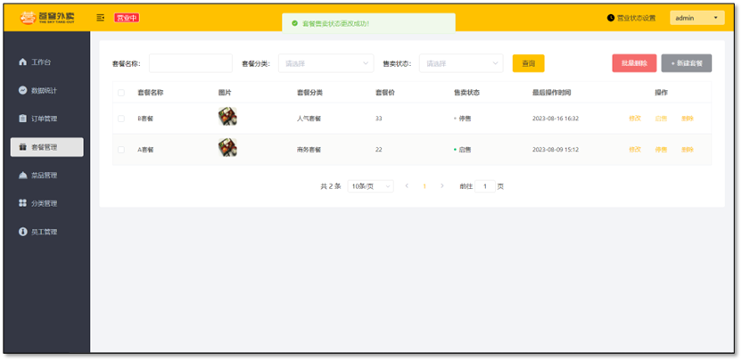

## 3. 删除套餐

### 3.1 需求分析和接口设计

根据产品原型来进行需求分析，产品原型如下：

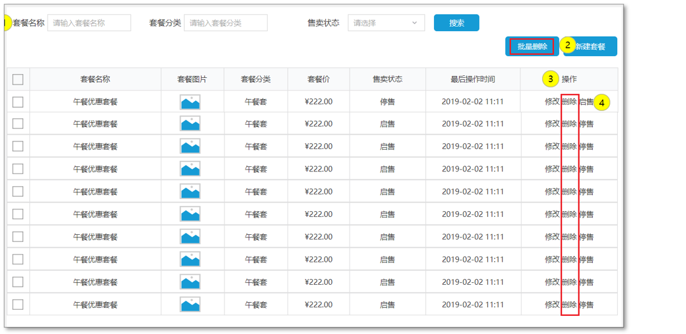

- 点击 删除 按钮，删除指定的一个套餐
- 勾选需要删除的套餐，点击 批量删除 按钮，删除选中的一个或多个套餐
- 状态为 “启售” 的套餐不能删除，需要给出操作提示

可以看到，删除套餐功能在操作时有两种方式。一种是点击【删除】按钮，可以删除对应的一个套餐；一种是勾选需要删除的套餐，然后点击【批量删除】按钮，可以删除勾选的多个套餐。我们在设计接口时可以兼容这两种不同的操作方式，也就是只需要一个接口即可。

接口设计如下：

**基本信息**

**Path：** /admin/setmeal

**Method：** DELETE

**请求参数**

**Query**

| 参数名称 | 是否必须 | 示例  | 备注 |
| -------- | -------- | ----- | ---- |
| ids      | 是       | 1,2,3 | ids  |

**返回数据**

| 名称 | 类型    | 是否必须 | 默认值 | 备注 | 其他信息      |
| ---- | ------- | -------- | ------ | ---- | ------------- |
| code | integer | 非必须   |        |      | format: int32 |
| data | object  | 非必须   |        |      |               |
| msg  | string  | 非必须   |        |      |               |

### 3.2 代码开发

要开发删除套餐前端代码，首先需要了解删除套餐业务功能的操作步骤：

1. 在套餐管理列表页面，点击 【删除】按钮，或者勾选套餐然后点击【批量删除】按钮，弹出确认对话框
2. 点击确认对话框中的【确定】按钮，则执行删除操作。如果套餐状态为“启售”，则不能删除，弹出信息提示
3. 点击确认对话框中的【取消】按钮，则关闭对话框，不执行删除操作

接下来我们就可以按照上面的操作步骤来具体开发前端的代码。

第一步：在 setMeal.ts 中封装删除套餐方法，发送Ajax请求，用于实现前后端交互

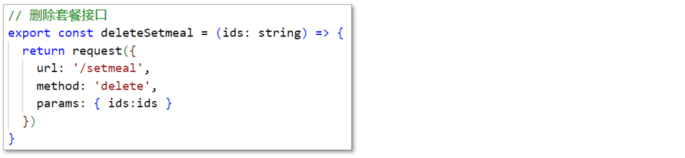

注意：

- 发送请求的方式和相关参数，必须和前面的接口设计保持一致
- 使用此方法时，别忘了在组件中通过import导入

第二步：为【批量删除】按钮绑定单击事件，并在methods中编写对应的处理函数

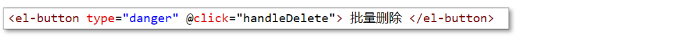

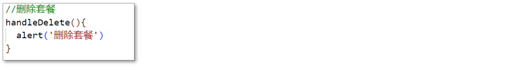

到目前为止我们点击【批量删除】按钮，是可以执行handleDelete方法的。接下来我们需要解决一个问题，就是当前选中了哪些套餐呢？我们需要能够动态获取到，因为我们需要将这些套餐的id作为参数传递到后端。

第三步：参考 ElementUI 的官方文档，为表格组件添加 **selection-change** 事件和对应的处理函数，通过此事件我们就可以动态获取到当前勾选的套餐有哪些

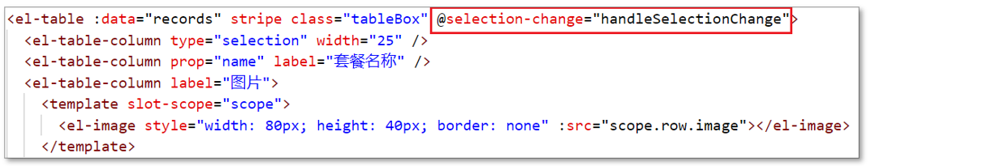

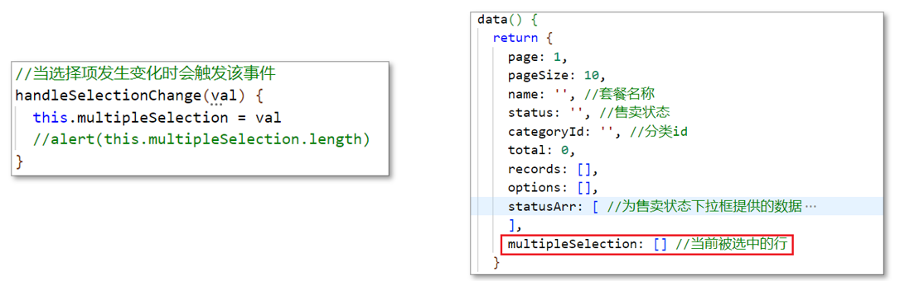

注： **selection-change** 事件为 当选择项发生变化时触发的事件

第四步：完善 handleDelete 方法，获取当前被选中的行，并进行参数准备

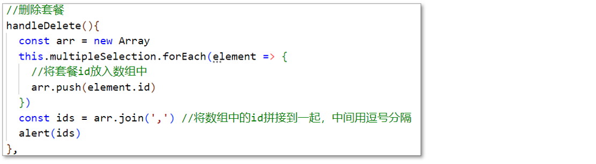

注意：单个删除 和 批量删除，都是调用 handleDelete 方法，所以此方法还需要进一步调整

第五步：为【删除】按钮绑定单击事件，处理函数还是 handleDelete

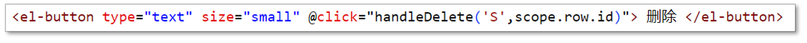

注意：

- 在 handleDelete 方法中通过第一个参数来区分是单个删除还是批量删除
- S表示单个删除，B表示批量删除

第六步：调整 handleDelete 方法，使其兼容单个删除和批量删除

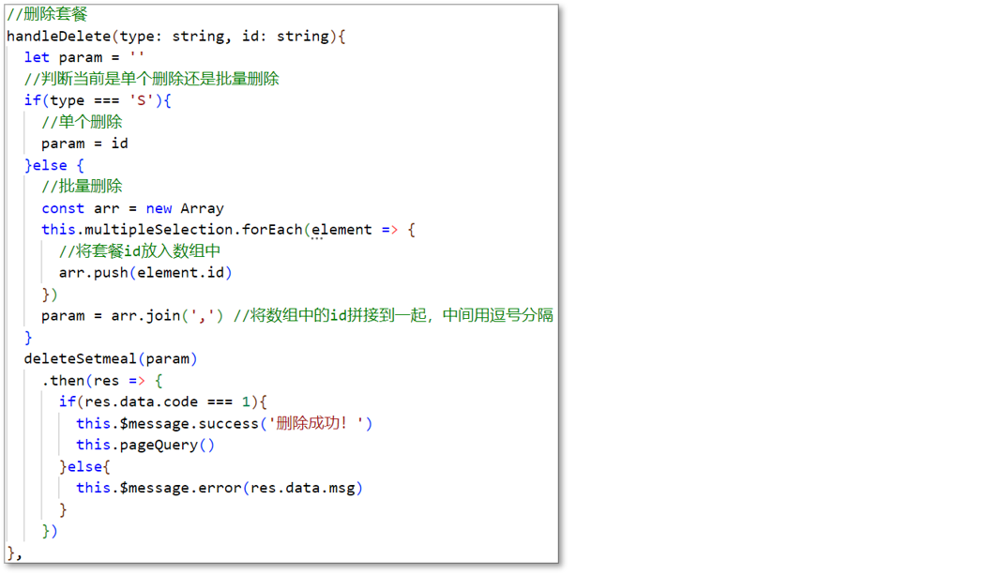

第七步：完善 handleDelete 方法，进行相应提示

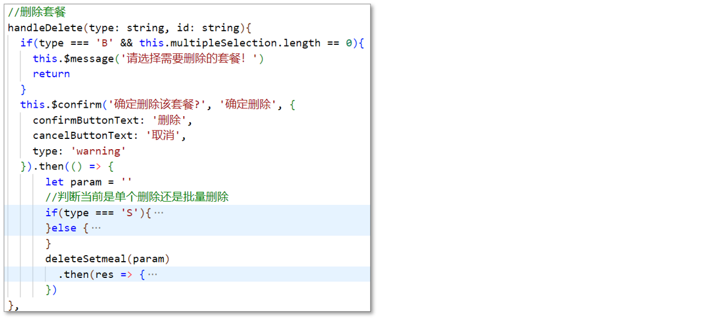

注：

- 批量删除时，如果没有选中套餐，给出提示
- 删除之前需要弹出确认框，让用户确认

### 3.3 功能测试

直接进行前后端联调，查看页面效果

通过浏览器F12查看数据交互过程

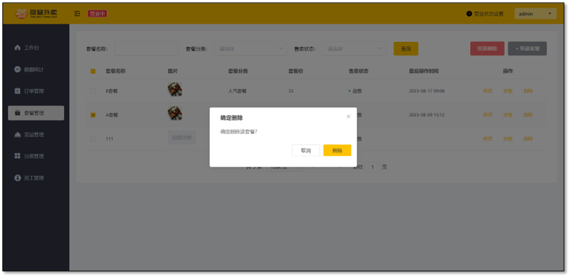

## 4. 新增套餐

### 4.1 需求分析和接口设计

根据产品原型来进行需求分析，产品原型如下：

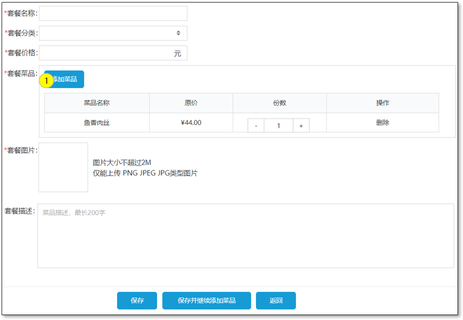

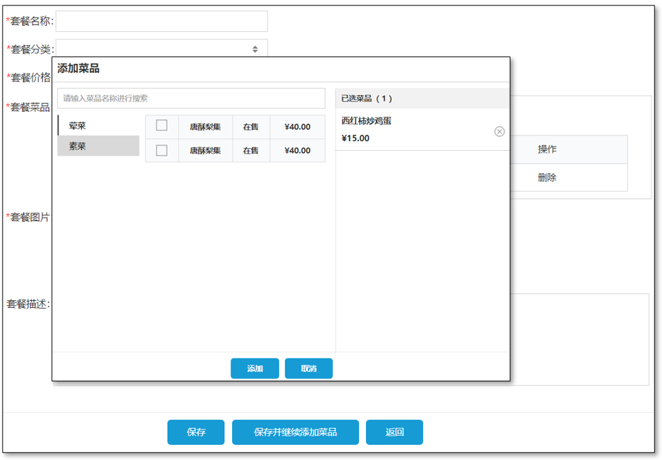

新增套餐时需要录入套餐名称、所属分类、套餐价格、套餐包含的菜品、套餐图片、描述等信息。其中套餐包含的菜品需要在弹出的添加菜品窗口中勾选。在弹出的添加菜品窗口中需要按照分类来展示菜品。

新增套餐功能涉及到4个接口，分别是：

- 根据类型查询分类 接口
- 根据分类查询菜品 接口
- 文件上传 接口
- 新增套餐 接口

(1) 根据类型查询分类 接口

 **基本信息**

**Path：** /admin/category/list

**Method：** GET

**请求参数**

**Query**

| 参数名称 | 是否必须 | 示例 | 备注                               |
| -------- | -------- | ---- | ---------------------------------- |
| type     | 否       | 2    | 分类类型：1为菜品分类，2为套餐分类 |

**返回数据**

| 名称          | 类型      | 是否必须 | 默认值 | 备注 | 其他信息          |
| ------------- | --------- | -------- | ------ | ---- | ----------------- |
| code          | integer   | 必须     |        |      | format: int32     |
| data          | object [] | 非必须   |        |      | item 类型: object |
| ├─ createTime | string    | 非必须   |        |      | format: date-time |
| ├─ createUser | integer   | 非必须   |        |      | format: int64     |
| ├─ id         | integer   | 非必须   |        |      | format: int64     |
| ├─ name       | string    | 非必须   |        |      |                   |
| ├─ sort       | integer   | 非必须   |        |      | format: int32     |
| ├─ status     | integer   | 非必须   |        |      | format: int32     |
| ├─ type       | integer   | 非必须   |        |      | format: int32     |
| ├─ updateTime | string    | 非必须   |        |      | format: date-time |
| ├─ updateUser | integer   | 非必须   |        |      | format: int64     |
| msg           | string    | 非必须   |        |      |                   |

(2) 根据分类查询菜品 接口

 **基本信息**

**Path：** /admin/dish/list

**Method：** GET

**请求参数**

**Query**

| 参数名称   | 是否必须 | 示例 | 备注   |
| ---------- | -------- | ---- | ------ |
| categoryId | 是       | 101  | 分类id |

**返回数据**

| 名称           | 类型      | 是否必须 | 默认值 | 备注 | 其他信息          |
| -------------- | --------- | -------- | ------ | ---- | ----------------- |
| code           | integer   | 必须     |        |      | format: int32     |
| data           | object [] | 非必须   |        |      | item 类型: object |
| ├─ categoryId  | integer   | 非必须   |        |      | format: int64     |
| ├─ createTime  | string    | 非必须   |        |      | format: date-time |
| ├─ createUser  | integer   | 非必须   |        |      | format: int64     |
| ├─ description | string    | 非必须   |        |      |                   |
| ├─ id          | integer   | 非必须   |        |      | format: int64     |
| ├─ image       | string    | 非必须   |        |      |                   |
| ├─ name        | string    | 非必须   |        |      |                   |
| ├─ price       | number    | 非必须   |        |      |                   |
| ├─ status      | integer   | 非必须   |        |      | format: int32     |
| ├─ updateTime  | string    | 非必须   |        |      | format: date-time |
| ├─ updateUser  | integer   | 非必须   |        |      | format: int64     |
| msg            | string    | 非必须   |        |      |                   |

(3) 文件上传 接口

**基本信息**

**Path：** /admin/common/upload

**Method：** POST

**请求参数**

**Headers**

| 参数名称     | 参数值              | 是否必须 | 示例 | 备注 |
| ------------ | ------------------- | -------- | ---- | ---- |
| Content-Type | multipart/form-data | 是       |      |      |

**Body**

| 参数名称 | 参数类型 | 是否必须 | 示例 | 备注 |
| -------- | -------- | -------- | ---- | ---- |
| file     | file     | 是       |      | 文件 |

**返回数据**

| 名称 | 类型    | 是否必须 | 默认值 | 备注         | 其他信息      |
| ---- | ------- | -------- | ------ | ------------ | ------------- |
| code | integer | 必须     |        |              | format: int32 |
| data | string  | 必须     |        | 文件上传路径 |               |
| msg  | string  | 非必须   |        |              |               |

(4) 新增套餐 接口

**基本信息**

**Path：** /admin/setmeal

**Method：** POST

**接口描述：**

**请求参数**

**Headers**

| 参数名称     | 参数值           | 是否必须 | 示例 | 备注 |
| ------------ | ---------------- | -------- | ---- | ---- |
| Content-Type | application/json | 是       |      |      |

**Body**

| 名称          | 类型      | 是否必须 | 默认值 | 备注                      | 其他信息          |
| ------------- | --------- | -------- | ------ | ------------------------- | ----------------- |
| categoryId    | integer   | 必须     |        | 分类id                    | format: int64     |
| description   | string    | 非必须   |        | 套餐描述                  |                   |
| id            | integer   | 非必须   |        | 套餐id                    | format: int64     |
| image         | string    | 必须     |        | 套餐图片                  |                   |
| name          | string    | 必须     |        | 套餐名称                  |                   |
| price         | number    | 必须     |        | 套餐价格                  |                   |
| setmealDishes | object [] | 必须     |        | 套餐包含的菜品            | item 类型: object |
| ├─ copies     | integer   | 必须     |        | 份数                      | format: int32     |
| ├─ dishId     | integer   | 必须     |        | 菜品id                    | format: int64     |
| ├─ id         | integer   | 非必须   |        | 套餐和菜品关系id          | format: int64     |
| ├─ name       | string    | 必须     |        | 菜品名称                  |                   |
| ├─ price      | number    | 必须     |        | 菜品价格                  |                   |
| ├─ setmealId  | integer   | 必须     |        | 套餐id                    | format: int64     |
| status        | integer   | 必须     |        | 套餐状态：1位起售 0为停售 | format: int32     |

**返回数据**

| 名称 | 类型    | 是否必须 | 默认值 | 备注 | 其他信息      |
| ---- | ------- | -------- | ------ | ---- | ------------- |
| code | integer | 必须     |        |      | format: int32 |
| data | object  | 非必须   |        |      |               |
| msg  | string  | 非必须   |        |      |               |

### 4.2 代码解读

新增套餐操作步骤：

①点击 “新建套餐”按钮，跳转到新增页面

②在新增套餐页面录入套餐相关信息

③点击“保存”按钮完成新增操作

首先需要找到新增套餐页面，可以通过操作过程来找：

第一步：在套餐管理列表页面中找到【新建套餐】按钮，查看按钮绑定的事件和对应的处理函数

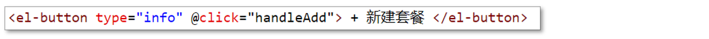

第二步：在methods中找到handleAdd函数，查看跳转的路由路径

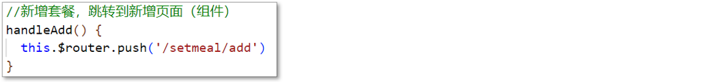

第三步：在路由文件中找到此路径对应的视图组件，可以看到是src/views/setmeal/addSetmeal.vue

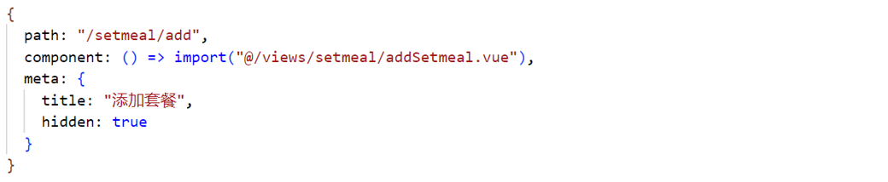

第四步：解读src/views/setmeal/addSetmeal.vue这个文件即可

### 4.3 功能测试

直接进行前后端联调，查看页面效果

通过浏览器F12查看数据交互过程