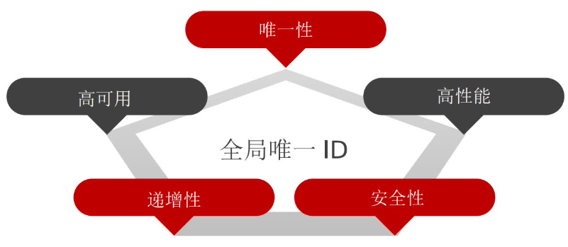

# Redis


# 一. 基础篇

## 1. 初识Redis

### 1.1 认识NoSQL

|          |                             SQL                              |                        NoSQL                        |
| :------: | :----------------------------------------------------------: | :-------------------------------------------------: |
| 数据结构 |                     结构化（Structured）                     |                      非结构化                       |
| 数据关联 |                     关联的（Relational）                     |                      无关联的                       |
| 查询方式 |                           SQL查询                            |                      非SQL查询                      |
| 事务特性 | ACID（原子性Atomicity 一致性Consistency 隔离性Isolation 持久性Durability） |               BASE（基本一致 无事务）               |
| 存储方式 |                             磁盘                             |                        内存                         |
|  扩展性  |                             垂直                             |                        水平                         |
| 使用场景 |   1）数据结构固定 2）相关业务对数据安全性，一致性要求较高    | 1）数据结构固定 2）安全性，一致性要求不高 3）性能高 |

NoSQL的非结构化：

1. 键值对
2. Document（文档类型）
3. 列类型
4. Graph

### 1.2 认识Redis

Redis（Remote Dictionary Server）远程词典服务器，诞生于2009年，是一个**基于内存的键值型NoSQL数据库**

特性：

* 键值型，value支持多种不同的数据结构，功能丰富
* 单线程，每个命令具备原子性
* 低延迟，速度快（基于内存，IO多路复用）
* 支持数据持久化
* 支持主从集群，分片集群
* 支持多语言客户端

### 1.3 安装Redis

大多数企业都是基于Linux服务器来部署项目，而且Redis官方也没有提供Windows版本的安装包。因此基于Linux系统来安装Redis.

此处选择的Linux版本为CentOS-7

参考：[Redis官网](https://redis.io/)


[**单机安装Redis**]

安装Redis依赖

Redis是基于C语言编写的，因此首先需要安装Redis所需要的gcc依赖：

```sh
yum install -y gcc tcl
```

上传安装包并解压

然后将资料提供的Redis安装包上传到虚拟机的任意目录：


例如，我放到了/usr/local/src 目录：


解压缩：

```sh
tar -xzf redis-6.2.6.tar.gz
```

解压后：


进入redis目录：

```sh
cd redis-6.2.6
```

运行编译命令：

```sh
make && make install
```

如果没有出错，应该就安装成功了

默认的安装路径是在 `/usr/local/bin`目录下：


该目录已经

默认配置到环境变量，因此可以在任意目录下运行这些命令。其中：

- redis-cli：是redis提供的命令行客户端
- redis-server：是redis的服务端启动脚本
- redis-sentinel：是redis的哨兵启动脚本


[**Redis启动**]

redis的启动方式有很多种，例如：

- 默认启动
- 指定配置启动
- 开机自启

【默认启动】

安装完成后，在任意目录输入redis-server命令即可启动Redis：

```shell
redis-server
```

如图：


这种启动属于`前台启动`，会阻塞整个会话窗口，窗口关闭或者按下`CTRL + C`则Redis停止。不推荐使用。

【指定配置启动】

如果要让Redis以`后台`方式启动，则必须修改Redis配置文件，就在我们之前解压的redis安装包下（`/usr/local/src/redis-6.2.6`），名字叫【redis.conf】：


我们先将这个配置文件备份一份：

```shell
cp redis.conf redis.conf.bck
vim redis.conf
```

然后修改redis.conf文件中的一些配置：

```properties
# 允许访问的地址，默认是127.0.0.1，会导致只能在本地访问。修改为0.0.0.0则可以在任意IP访问，生产环境不要设置为0.0.0.0
bind 0.0.0.0
# 守护进程，修改为yes后即可后台运行
daemonize yes 
# 密码，设置后访问Redis必须输入密码
requirepass 020920
```

Redis的其它常见配置：

```properties
# 监听的端口
port 6379
# 工作目录，默认是当前目录，也就是运行redis-server时的命令，日志、持久化等文件会保存在这个目录
dir .
# 数据库数量，设置为1，代表只使用1个库，默认有16个库，编号0~15
databases 1
# 设置redis能够使用的最大内存
maxmemory 512mb
# 日志文件，默认为空，不记录日志，可以指定日志文件名
logfile "redis.log"
```

启动Redis：

```sh
# 进入redis安装目录 
cd /usr/local/src/redis-6.2.6
# 启动
redis-server redis.conf
```

停止服务：

```sh
# 利用redis-cli来执行 shutdown 命令，即可停止 Redis 服务，
# 因为之前配置了密码，因此需要通过 -u 来指定密码
redis-cli -u 020920 shutdown
```

【开机自启】

我们也可以通过配置来实现开机自启。

首先，新建一个系统服务文件：

```shell
vi /etc/systemd/system/redis.service
```

内容如下：

```conf
[Unit]
Description=redis-server
After=network.target

[Service]
Type=forking
ExecStart=/usr/local/bin/redis-server /usr/local/src/redis-6.2.6/redis.conf
PrivateTmp=true

[Install]
WantedBy=multi-user.target
```

然后重载系统服务：

```sh
systemctl daemon-reload
```

现在，我们可以用下面这组命令来操作redis了：

```sh
# 启动
systemctl start redis
# 停止
systemctl stop redis
# 重启
systemctl restart redis
# 查看状态
systemctl status redis
```

执行下面的命令，可以让redis开机自启：

```shell
systemctl enable redis
```


[**Redis客户端**]

安装完成Redis，我们就可以操作Redis，实现数据的CRUD了。这需要用到Redis客户端，包括：

- 命令行客户端
- 图形化桌面客户端
- 编程客户端

【Redis命令行客户端】

Redis安装完成后就自带了命令行客户端：redis-cli，使用方式如下：

```shell
redis-cli [options] [commonds]
```

其中常见的options有：

- `-h 127.0.0.1`：指定要连接的redis节点的IP地址，默认是127.0.0.1
- `-p 6379`：指定要连接的redis节点的端口，默认是6379
- `-a 123321`：指定redis的访问密码 

其中的commonds就是Redis的操作命令，例如：

- `ping`：与redis服务端做心跳测试，服务端正常会返回`pong`

不指定commond时，会进入`redis-cli`的交互控制台：


【图形化桌面客户端】

GitHub上的大神编写了Redis的图形化桌面客户端，地址：https://github.com/uglide/RedisDesktopManager

不过该仓库提供的是RedisDesktopManager的源码，并未提供windows安装包。

在下面这个仓库可以找到安装包：https://github.com/lework/RedisDesktopManager-Windows/releases


在资料中可以找到Redis的图形化桌面客户端：


解压缩后，运行安装程序即可安装：


安装完成后，在安装目录下找到rdm.exe文件：


双击即可运行：


点击左上角的`连接到Redis服务器`按钮：


在弹出的窗口中填写Redis服务信息：


点击确定后，在左侧菜单会出现这个链接：


点击即可建立连接了：


Redis默认有16个仓库，编号从0至15。通过配置文件可以设置仓库数量，但是不超过16，并且不能自定义仓库名称。

如果是基于redis-cli连接Redis服务，可以通过select命令来选择数据库：

```sh
# 选择 0号库
select 0
```

## 2. Redis常见命令

### 2.1 五种常见数据结构

| 基本类型  |          样例          |
| :-------: | :--------------------: |
|  String   |      Hello World       |
|   Hash    | {name: "wyh", age: 21} |
|   List    |   [A -> B -> C -> C]   |
|    Set    |       {A, B, C}        |
| SortedSet |   {A: 1, B: 2, C: 3}   |

| 特殊类型 |        样例         |
| :------: | :-----------------: |
|   GEO    | {A: (120.3, 30.5)}  |
|  BitMap  | 0110110101110101011 |
| HyperLog | 0110110101110101011 |

可以在[官方帮助文档](https://redis.io/commands)查询所有命令

### 2.2 通用命令

通用命令是部分数据类型都可以执行的命令，可以通过`help [命令]`在命令行查看命令的具体用法

* keys：查看符合模板的所有key（不建议在生产环境使用）
* del：删除指定的key（可以删除多个）
* exists：判断key是否存在（可以判断多个）
* expire：给一个key设置有效期，到期后自动删除
* ttl：查看一个key的剩余有效期

### 2.3 不同数据结构的操作命令

[**String类型**]

value是字符串，根据各式不同分为：

1. string字符串
2. int整数类型，可自增自减
3. float浮点类型，可自增自减

虽然各式不同，但是底层都是字节数组，字符串存储最大空间为512M

常用命令：

* set：添加或修改已经存在的String键值对
* get：根据key获取String的value
* mset：批量添加多个String键值对
* mget：根据多个key获取多个String的value
* incr：让一个整型的key的value自增1
* incrby：让一个整型的key的value自增指定步长（比如可以自增2：incrby num 2，设为负数就可以自减）
* incrbyfloat：让一个浮点型的key的value自增指定步长
* setnx：添加一个String键值对，前提是该键值对不存在，否则不执行（只能添加）
* setex：添加一个String键值对并指定有效期

key唯一，但是可以拼接区分key，比如使用（项目名:业务名:类型:id）进行**分级存储**，用**冒号隔开**

同时value如果是一个Java对象，可以将对象序列化为JSON字符串后存储（**添加JSON字符串需要打单引号**）

|       KEY       |                  VALUE                   |
| :-------------: | :--------------------------------------: |
|  iWyh2:User:1   |     {"id":1, "name":"wyh", "age":21}     |
| iWyh2:Product:1 | {"id":1, "name":"iPhone", "price":12222} |


[**Hash类型**]

也叫散列，value是一个无序字典，类似于Java的HashMap

可以**将Java对象的每个字段独立存储，可以针对单个字段进行CRUD**

hashKey -> field：value

常用命令：

* hset key field value：添加或修改已经存在的Hash类型的key的field值
* hget key field：获取一个Hash类型key的field的value
* hmset：批量添加Hash类型key的多个field的value
* hmget：批量获取Hash类型key的多个field的value
* hgetall：获取一个Hash类型key的所有field的value
* hkeys：获取一个Hash类型key的所有field
* hvals：获取一个Hash类型key的所有field的value（无field）
* hincrby：让一个Hash类型的key的field的value自增指定步长
* hsetnx：添加一个Hash类型的key的field值，前提是field值不存在，否则不执行（只能添加）


[**List类型**]

可以看做一个双向链表，可以支持正向检索和反向检索。与Java的LinkedList类似（**有序**，可以重复，插入删除快，查询一般）

用来存储有序数据

常用命令：

* lpush key element：向列表左侧插入一个或多个元素
* lpop key：移除并返回列表左侧的第一个元素，没有则返回nil（可以指定返回左侧多少个元素）
* rpush key element：向列表右侧插入一个或多个元素
* rpop key：移除并返回列表右侧的第一个元素，没有则返回nil（可以指定返回右侧多少个元素）
* lrange key start end：返回一段范围内的所有元素
* blpop，brpop：与lpop和rpop类似，但在没有元素时会等待，不会返回nil，相当于阻塞了redis线程（可以指定超时时间）


[**Set类型**]

与Java的HashSet类似，可以看做一个value可以为null的HashMap。也是一个hash表（无序，不重复，查找快，支持交集并集差集）

常用命令：

* sadd key member：向set中添加一个或多个元素
* srem key member：移除set中一个或多个指定元素
* scard key：返回set的元素个数
* sismember key member：判断一个元素是否存在于一个set类型的key中
* smembers：获取set中所有元素
* sinter key1 key2：获取多个set之间的交集
* sdiff key1 key2：获取多个set之间的差集
* sunion key1 key2：获取多个set之间的并集


[**SortedSet类型**]

是一个可排序Set，与Java的TreeSet类似，SortedSet的每个元素都有一个score属性，基于score对元素排序

底层是跳表加哈希表（可排序，不重复，查询快）常用于实现排行榜

常用命令：

* zadd key score member：添加一个或多个元素到SortedSet，如果存在就更新其score值
* zrem key member：删除SortedSet中的一个指定元素
* zscore key member：获取SortedSet指定元素的score值
* zrank key member：获取SortedSet指定元素的排名
* zcard key：获取SortedSet的元素个数
* zcount key min max：统计score值在给定范围内的所有元素个数（给的是score值范围）
* zincrby key increment member：让SortedSet中的指定元素自增指定步长increment
* zrange key min max：按照score值排序后，获取指定排名范围内的元素（给的是排名范围）
* zrangebyscore key min max：按照score排序后，获取指定score范围内的元素
* zdiff，zinter，zunion：获取多个SortedSet的差集，交集，并集

【注】所有的排名都是**默认升序**的，要**降序**则在命令的z后面加上**rev**即可（z**rev**rank key member）

## 3. Redis的Java客户端

Redis官网提供了各种语言的客户端：[点击跳转](https://redis.io/clients)

|  客户端  |                            优缺点                            |
| :------: | :----------------------------------------------------------: |
|  Jedis   | 以Redis命令作为方法名称，学习成本低，简单实用。但Jedis实例线程并不安全，多线程环境需要基于线程池使用 |
| Lettuce  | 基于Netty实现，支持同步，异步，响应式编程方式，线程安全，支持Redis哨兵模式，集群模式，管道模式 |
| Redisson | 基于Redis实现的分布式，可伸缩的Java数据结构集合，包含了Map，Queue，Lock，Semaphore，AtomicLong等 |

### 3.1 Jedis客户端

[Jedis官网](https://github.com/redis/jedis)

[**快速入门**]

1. 引入依赖

   ```xml
   <dependency>
       <groupId>redis.clients</groupId>
       <artifactId>jedis</artifactId>
       <version>3.7.0</version>
   </dependency>
   ```

2. 建立连接

   ```java
   	@BeforeEach//测试方法之前的初始化方法
       void setUp() {
           //建立连接
           jedis = new Jedis("192.168.88.92",6379);
           //输入密码
           jedis.auth("020920");
           //选择库 默认为0库
           jedis.select(0);
       }
   ```

3. 测试String

   ```java
   	@Test
       void StringTest() {
           String result = jedis.set("today", "2023/2/18");
           System.out.println(result);
           result = jedis.get("today");
           System.out.println(result);
       }
   ```

4. 释放资源

   ```java
   	@AfterEach//测试方法之后的收尾方法
       void tearDown() {
           if (jedis != null) {
               //释放资源
               jedis.close();
           }
       }
   ```


[**Jedis线程池**]

Jedis本身线程不安全，用Jedis连接池代替Jedis直连

用一个工具类直接创建Jedis线程池

```java
public class JedisConnectionFactory {
    private static final JedisPool jedisPool;
    static {
        //配置连接池
        JedisPoolConfig jedisPoolConfig = new JedisPoolConfig();
        jedisPoolConfig.setMaxTotal(8);//最大连接数
        jedisPoolConfig.setMaxIdle(8);//最大空闲线程
        jedisPoolConfig.setMinIdle(0);//最小空闲线程
        jedisPoolConfig.setMaxWaitMillis(1000);//ms
        jedisPool = new JedisPool(
                jedisPoolConfig,/*线程池配置*/
                "192.168.88.92",/*host*/
                6379,/*端口*/
                1000,/*超时时间*/
                "020920"/*Redis密码*/
        );
    }
    public static Jedis getJedis() {
        return jedisPool.getResource();
    }
}
```

### 3.2 SpringDataRedis客户端

SpringData是Spring中的数据操作的模块，包含对各种数据库的集成

对Redis的集成模块叫做：**SpringDataRedis**

[SpringDataRedis官网](https://spring.io/projects/spring-data-redis)

* 提供了对不同Redis客户端的整合（**兼容Jedis和Lettuce**）
* **提供了RedisTemplate统一API来操作Redis**
* 支持Redis的发布订阅模型
* 支持Redis哨兵和Redis集群
* 支持基于Lettuce的响应式编程
* 支持基于JDK，JSON，字符串，Spring对象的数据序列化及反序列化
* 支持基于Redis的JDKCollection实现

RedisTemplate工具类封装了各种对Redis的操作，并且将不同数据类型的操作API封装到了不同的操作类型对象中

|             API             |   返回值类型    |         说明          |
| :-------------------------: | :-------------: | :-------------------: |
| redisTemplate.opsForValue() | ValueOperations |  操作String类型数据   |
| redisTemplate.opsForHash()  | HashOperations  |   操作Hash类型数据    |
| redisTemplate.opsForList()  | ListOperations  |   操作List类型数据    |
|  redisTemplate.opsForSet()  |  SetOperations  |    操作Set类型数据    |
| redisTemplate.opsForZSet()  | ZSetOperations  | 操作SortedSet类型数据 |
|        redisTemplate        |                 |       通用命令        |


[**快速入门**]

1. 引入依赖

   ```xml
   <dependencies>
           <dependency>
               <groupId>org.springframework.boot</groupId>
               <artifactId>spring-boot-starter-data-redis</artifactId>
           </dependency>
           <!--线程池依赖-->
           <dependency>
               <groupId>org.apache.commons</groupId>
               <artifactId>commons-pool2</artifactId>
           </dependency>
           <dependency>
               <groupId>org.projectlombok</groupId>
               <artifactId>lombok</artifactId>
               <optional>true</optional>
           </dependency>
       </dependencies>
   ```

2. 编写配置

   ```yml
   spring:
     redis:
       host: 192.168.88.92
       port: 6379
       password: "020920" #纯数字密码加上引号，yml才会正确读取
       database: 0        #默认0号数据库 可以不配置
       lettuce:
         pool:
           max-active: 8
           max-idle: 8
           min-idle: 0
           max-wait: 1000
   ```

3. 简单测试

   ```java
   @SpringBootTest
   public class RedisTest {
       @Autowired
       private RedisTemplate redisTemplate;
       @Test
       public void StringTest() {
           redisTemplate.opsForValue().set("name","wyh");
           Object name = redisTemplate.opsForValue().get("name");
           System.out.println(name);
       }
   }
   ```


[**问题解析**]

RedisTemplate可以接收任意Object作为值写入Redis，但是在写入之前会将Object序列化为字节数组，且默认采用JDK的序列化，得到的结果会变成类似于（\xAC\xED\x00\x05t\x00\x03）的字节数组形式，可读性差，且占用内存

所以我们可以设置key和value的序列化实例，让它不采用JDK的序列化

```java
@Configuration
public class RedisConfig {
    @Bean
    public RedisTemplate<String,Object> redisTemplate(RedisConnectionFactory redisConnectionFactory) {
        //创建RedisTemplate对象
        RedisTemplate<String, Object> redisTemplate = new RedisTemplate<>();
        //设置连接工厂
        redisTemplate.setConnectionFactory(redisConnectionFactory);
        //创建JSON序列化工具（需要有相关jackson依赖）
        GenericJackson2JsonRedisSerializer jsonRedisSerializer = new GenericJackson2JsonRedisSerializer();
        //设置Key的序列化 - String处理
        redisTemplate.setKeySerializer(RedisSerializer.string());
        redisTemplate.setHashKeySerializer(RedisSerializer.string());
        //设置value的序列化 - JSON处理
        redisTemplate.setValueSerializer(jsonRedisSerializer);
        redisTemplate.setHashValueSerializer(jsonRedisSerializer);
        //返回
        return redisTemplate;
    }
}
```

采用这个方法的序列化存入字符串已经没有问题，但是如果要存入一个Java对象时，序列化无任何问题，但是反序列化时，由于会自动帮我们反序列化为相关Java对象，所以在存入数据时，多了一些无关数据：

```json
{
  "@class": "com.wyh.pojo.User",//此处就是由于需要反序列化而多出的Java对象相关信息 - 字节码文件名称，会占用额外内存
  "name": "wyh",
  "age": 20,
  "sex": "man"
}
```

所以，为了节省内存，我们不会使用JSON序列化器去处理value，而是统一使用String序列化器，要求存储的是String类型的key和value。当需要存储Java对象时，就需要我们手动对Java对象进行序列化和反序列化。也就是在RedisConfig中，对于value的序列化设置，需要设置为RedisSerializer.string()。

幸好，SpringDataRedis为我们提供了一个【**StringRedisTemplate**】，为我们省去了需要设置key和value的String序列化器的步骤，只需要我们手动转JSON即可

```java
@SpringBootTest
public class RedisTest {
    @Autowired
    private StringRedisTemplate stringRedisTemplate;
    private final ObjectMapper objectMapper = new ObjectMapper();//SpringMVC提供的默认的JSON处理工具
    @Test
    public void StringTest() throws JsonProcessingException {
        //准备数据
        User user = new User("iWyh2", 21, "man");
        //先手动序列化
        String UserJson = objectMapper.writeValueAsString(user);
        //再写入Redis
        stringRedisTemplate.opsForValue().set("user:3",UserJson);
        //从Redis获取User的JSON字符串
        UserJson = stringRedisTemplate.opsForValue().get("user:3");
        //再将JSON字符串转为Java对象
        User readValue = objectMapper.readValue(UserJson, User.class);//手动告诉字节码
        System.out.println(readValue);
    }
}
```

------


# 二. 实战篇

案例：【黑马点评】

## 1. 短信登录

### 1.1 导入项目

导入资料中的SQL文件，内含

* tb_user：用户表
* tb_user_info：用户详情表
* tb_shop：商户信息表
* tb_shop_type：商户类型表
* tb_blog：用户日记表（达人探店日记）
* tb_follow：用户关注表
* tb_voucher：优惠券表
* tb_voucher_order：优惠券的订单表

项目部署架构：

[**后端项目导入**]

将资料中的【hm-dianping】导入IDEA，启动，访问[http://localhost:8081/shop-type/list]成功即可


[**前端项目部署**]

将资料中的【nginx-1.18.0】放在任意目录，然后在该目录下打开这个文件夹，打开cmd窗口，输入：

```shell
start nginx.exe
```

然后访问[http://127.0.0.1:8080]成功即可

项目整体访问[http://localhost:8080]即可

### 1.2 基于Session实现登录


【发送短信验证码】

```java
/*
	@Service
	@Slf4j
	UserServiceImpl
*/
@Override
public Result sendCode(String phone, HttpSession session) {
    //1.校验手机号
    boolean phoneInvalid = RegexUtils.isPhoneInvalid(phone);
    //不符合就拦截
    if (phoneInvalid) {
         return Result.fail("手机号格式错误!");
     }
    //2.符合就放行 生成验证码
    String code = RandomUtil.randomNumbers(6);
    //3.保存验证码到session
    session.setAttribute("code",code);
    //4.发送验证码 - 模拟
    log.info("通过ALiYun发送成功,验证码:[{}]",code);
    //返回
    return Result.ok();
}
```

【短信验证码登录注册】

```java
@Override
    public Result login(LoginFormDTO loginForm, HttpSession session) {
        String phone = loginForm.getPhone();
        String cacheCode = (String)session.getAttribute("code");
        String formCode = loginForm.getCode();
        //1.校验手机号
        if (RegexUtils.isPhoneInvalid(phone)) {
            return Result.fail("手机号格式错误!");
        }
        //2.校验验证码
        if (formCode == null || cacheCode == null) {
            return Result.fail("验证码为空!");
        }
        if (RegexUtils.isCodeInvalid(formCode)) {
            return Result.fail("验证码格式错误!");
        }
        //3.对比session里的验证码和提交的验证码是否一致，不一致直接返回错误
        if (!cacheCode.equals(formCode)) {
            return Result.fail("验证码错误!");
        }
        //4.一致，那么根据手机号查询用户是否存在
        User user = query().eq("phone", phone).one();
        //5.用户不存在，创建并保存
        if (user == null) {
            user = createUserWithPhone(phone);
        }
        //6.保存用户信息到session
        session.setAttribute("user",user);
        /*
            session都有唯一id
            登录时的cookie带上了这个id
         */
        return Result.ok();
    }
    private User createUserWithPhone(String phone) {
        User user = new User();
        user.setPhone(phone);
        user.setNickName(SystemConstants.USER_NICK_NAME_PREFIX+RandomUtil.randomString(10));
        return user;
    }
```

【校验登录状态】


```java
public class LoginInterceptor implements HandlerInterceptor {
    @Override
    public boolean preHandle(HttpServletRequest request, HttpServletResponse response, Object handler) throws Exception {
        //1.获取Session
        HttpSession session = request.getSession();
        //2.获取session中的用户
        UserDTO user = (UserDTO) session.getAttribute("user");
        //3.判断用户是否存在，不存在就拦截
        if (user == null) {
            response.setStatus(401);//401是未授权状态码
            return false;//return false就是拦截
        }
        //5.存在就保存到ThreadLocal
        UserHolder.saveUser(user);
        //放行
        return true;//return true就是放行
    }
    @Override
    public void afterCompletion(HttpServletRequest request, HttpServletResponse response, Object handler, Exception ex) throws Exception {
        UserHolder.removeUser();//移除ThreadLocal中设置的变量，避免内存泄露风险
    } 
}
```

```java
@Configuration
public class MvcConfig implements WebMvcConfigurer {
    @Override
    public void addInterceptors(InterceptorRegistry registry) {
        registry.addInterceptor(new LoginInterceptor())
                .excludePathPatterns(
                        //放行的路径
                        "/user/code",
                        "/user/login",
                        "/blog/hot",
                        "/shop/**",
                        "/shop-type/**",
                        "/upload/**",
                        "/voucher/**"
                );
    }
}
```

### 1.3 集群的Session共享问题

**Session共享问题**：【多台Tomcat并不共享session存储空间】，当请求切换到不同的Tomcat服务器时，会导致数据丢失的问题

session的替代方案应该满足：

* 数据共享
* 内存存储
* 键值对类型

明示：=> 【**Redis**】

### 1.4 基于Redis实现共享Session登录

【短信验证码】

将验证码存入Redis。同时**以用户电话号码作为唯一key**

key - value选择数据结构:

* value：简单的验证码 直接以String存储
* key：手机号，phone:电话号码即可

```java
@Service
@Slf4j
public class UserServiceImpl extends ServiceImpl<UserMapper, User> implements IUserService {
    @Resource
    private StringRedisTemplate stringRedisTemplate;
    @Override
    public Result sendCode(String phone, HttpSession session) {
        //1.校验手机号
        boolean phoneInvalid = RegexUtils.isPhoneInvalid(phone);
        //不符合就拦截
        if (phoneInvalid) {
            return Result.fail("手机号格式错误!");
        }
        //2.符合就放行 生成验证码
        String code = RandomUtil.randomNumbers(6);
        //3.保存验证码到session --> Redis
        //session.setAttribute("code",code);
        stringRedisTemplate.opsForValue().set(RedisConstants.LOGIN_CODE_KEY +phone,code, 5, TimeUnit.MINUTES);
        //4.发送验证码 - 模拟
        log.info("通过ALiYun发送成功,验证码:[{}]",code);
        //返回
        return Result.ok();
    }
}
```

【验证码登录注册，校验登录】

将用户信息存入Redis

key - value数据结构选择:

* value：Hash存储对象信息
* key：以随机的token作为key存储用户信息

同时生成的随机token还要返回给前端，前端对后端的请求需要带上token进行访问（前端代码实现将其存入到请求的session中），后端采取token信息进行校验登录状态

```java
@Service
@Slf4j
public class UserServiceImpl extends ServiceImpl<UserMapper, User> implements IUserService {
    @Resource
    private StringRedisTemplate stringRedisTemplate;
    @Override
    public Result login(LoginFormDTO loginForm, HttpSession session) {
        String phone = loginForm.getPhone();
        String cacheCode = stringRedisTemplate.opsForValue().get(RedisConstants.LOGIN_CODE_KEY+phone);//从Redis中获取
        String formCode = loginForm.getCode();
        //1.校验手机号
        if (RegexUtils.isPhoneInvalid(phone)) {
            return Result.fail("手机号格式错误!");
        }
        //2.校验验证码
        if (formCode == null || cacheCode == null) {
            return Result.fail("验证码为空!");
        }
        if (RegexUtils.isCodeInvalid(formCode)) {
            return Result.fail("验证码格式错误!");
        }
        //3.对比session --> Redis里的验证码和提交的验证码是否一致，不一致直接返回错误
        if (!cacheCode.equals(formCode)) {
            return Result.fail("验证码错误!");
        }
        //4.一致，那么根据手机号查询用户是否存在
        User user = query().eq("phone", phone).one();
        //5.用户不存在，创建并保存
        if (user == null) {
            user = createUserWithPhone(phone);
        }
        //6.保存用户信息到session --> Redis
        //6.1 随机生成token(UUID)
        String token = UUID.randomUUID().toString(true);
        //6.2 将User信息转为Hash Map(UTools)
        UserDTO userDTO = BeanUtil.copyProperties(user, UserDTO.class);//省去一些细节信息 避免安全问题
        Map<String, Object> userMap = BeanUtil.beanToMap(
                userDTO,
                new HashMap<>(),
                CopyOptions.create()
                        .setIgnoreNullValue(true)
                        .setFieldValueEditor((FiledName,FiledValue)->FiledValue.toString())
        );//此处的操作时将UserDTO的id从Long转为String，不然会发生类型转换错误
        //6.3 存到Redis(将User直接用Map存入Redis - putAll），设置有效期
        stringRedisTemplate.opsForHash().putAll(RedisConstants.LOGIN_USER_KEY+token,userMap);
        stringRedisTemplate.expire(RedisConstants.LOGIN_USER_KEY+token,30,TimeUnit.MINUTES);
        //session.setAttribute("user",userDTO);
        /*
            session都有唯一id
            登录时的cookie带上了这个id
         */
        //7.返回token给前端，前端的请求需要带上这个token
        return Result.ok(token);
    }
    private User createUserWithPhone(String phone) {
        User user = new User();
        user.setPhone(phone);
        user.setNickName(SystemConstants.USER_NICK_NAME_PREFIX+RandomUtil.randomString(10));
        save(user);
        return user;
    }
}
```

```java
public class LoginInterceptor implements HandlerInterceptor {
    private final StringRedisTemplate stringRedisTemplate;
	//由于这个拦截器由我们自己创建，无法注入StringRedisTemplate，所以使用构造方法，由SpringMVC调用，帮忙注入
    public LoginInterceptor(StringRedisTemplate stringRedisTemplate) {
        this.stringRedisTemplate = stringRedisTemplate;
    }

    @Override
    public boolean preHandle(HttpServletRequest request, HttpServletResponse response, Object handler) throws Exception {
        //1.获取Session --> 获取token(在请求头中)
        //HttpSession session = request.getSession();
        String token = request.getHeader("authorization");
        if (StrUtil.isBlank(token)) {
            response.setStatus(401);//401是未授权状态码
            return false;//return false就是拦截
        }
        //2.获取session中的用户 --> 根据token从Redis中获取用户信息
        //UserDTO user = (UserDTO) session.getAttribute("user");
        Map<Object, Object> userMap = stringRedisTemplate.opsForHash().entries(RedisConstants.LOGIN_USER_KEY + token);
        //3.判断是否获取到user信息
        if (userMap.isEmpty()) {
            response.setStatus(401);//401是未授权状态码
            return false;//return false就是拦截
        }
        //5.存在就保存到ThreadLocal --> 先将从Redis获取的Hash数据转为UserDTO，再保存
        UserDTO userDTO = BeanUtil.fillBeanWithMap(userMap, new UserDTO(), false);
        UserHolder.saveUser(userDTO);
        //6.刷新token有效期
        stringRedisTemplate.expire(RedisConstants.LOGIN_USER_KEY + token,30, TimeUnit.MINUTES);
        //放行
        return true;//return true就是放行
    }
    @Override
    public void afterCompletion(HttpServletRequest request, HttpServletResponse response, Object handler, Exception ex) throws Exception {
        UserHolder.removeUser();
    }
}
```

Redis代替Session需要考虑的问题：

* 选择合适的数据结构
* 选择合适的key
* 选择合适的存储粒度

【登录拦截器的优化】


其他的一些路径请求不会被拦截，token的有效期不会被刷新，不合理

所以，需要再增加一个拦截器：

```tex

用户 ==请求==> 拦截器1(拦截一切路径)
				1.获取token
				2.查询Redis用户
				3.保存用户信息到ThreadLocal
				4.刷新token有效期
				5.放行 
	==请求==> 拦截器2(拦截需要登录的路径)
				1.查询ThreadLocal的用户信息
				不存在拦截
				存在放行

```

```java
public class TokenInterceptor implements HandlerInterceptor {
    private final StringRedisTemplate stringRedisTemplate;

    //由于这个拦截器由我们自己创建，无法注入StringRedisTemplate，所以使用构造方法，由SpringMVC调用，帮忙注入
    public TokenInterceptor(StringRedisTemplate stringRedisTemplate) {
        this.stringRedisTemplate = stringRedisTemplate;
    }

    @Override
    public boolean preHandle(HttpServletRequest request, HttpServletResponse response, Object handler) throws Exception {
        //1.获取Session --> 获取token(在请求头中)
        //HttpSession session = request.getSession();
        String token = request.getHeader("authorization");
        if (StrUtil.isBlank(token)) {
            return true;//直接放行
        }
        //2.获取session中的用户 --> 根据token从Redis中获取用户信息
        //UserDTO user = (UserDTO) session.getAttribute("user");
        Map<Object, Object> userMap = stringRedisTemplate.opsForHash().entries(RedisConstants.LOGIN_USER_KEY + token);
        //3.判断是否获取到user信息
        if (userMap.isEmpty()) {
            return true;
        }
        //5.存在就保存到ThreadLocal --> 先将从Redis获取的Hash数据转为UserDTO，再保存
        UserDTO userDTO = BeanUtil.fillBeanWithMap(userMap, new UserDTO(), false);
        UserHolder.saveUser(userDTO);
        //6.刷新token有效期
        stringRedisTemplate.expire(RedisConstants.LOGIN_USER_KEY + token,30, TimeUnit.MINUTES);
        //放行
        return true;//return true就是放行
    }
    @Override
    public void afterCompletion(HttpServletRequest request, HttpServletResponse response, Object handler, Exception ex) throws Exception {
        UserHolder.removeUser();
    }
}
```

```java
public class LoginInterceptor implements HandlerInterceptor {

    @Override
    public boolean preHandle(HttpServletRequest request, HttpServletResponse response, Object handler) throws Exception {
        //判断是否需要拦截（ThreadLocal中是否有用户信息）
        if (UserHolder.getUser() == null) {
            //没有就显示未授权并拦截
            response.setStatus(402);
            return false;
        }
        //有就放行
        return true;//return true就是放行
    }
}
```

```java
@Configuration
public class MvcConfig implements WebMvcConfigurer {
    @Resource
    private StringRedisTemplate stringRedisTemplate;
    @Override
    public void addInterceptors(InterceptorRegistry registry) {
        registry.addInterceptor(new TokenInterceptor(stringRedisTemplate)).order(0);//越小拦截器就先执行
        registry.addInterceptor(new LoginInterceptor())
                .excludePathPatterns(
                        //放行的路径
                        "/user/code",
                        "/user/login",
                        "/blog/hot",
                        "/shop/**",
                        "/shop-type/**",
                        "/upload/**",
                        "/voucher/**"
                ).order(1);
    }
}
```

## 2. 商户查询缓存

### 2.1 什么是缓存

缓存是数据交换的缓冲区，叫做Cache。是**存储数据的临时地方，一般读写性能较高**


使用缓存需要考虑到：**缓存带来的作用和收益大于使用缓存的成本**

### 2.2 添加Redis缓存


【根据id查询店铺缓存】


```java
@Service
public class ShopServiceImpl extends ServiceImpl<ShopMapper, Shop> implements IShopService {
    @Resource
    private StringRedisTemplate stringRedisTemplate;
    @Override
    public Result queryByShopId(Long id) {
        //1.从redis查询店铺缓存
        String cacheShopJSON = stringRedisTemplate.opsForValue().get(RedisConstants.CACHE_SHOP_KEY + id);
        //2.判断是否存在
        if (StrUtil.isNotBlank(cacheShopJSON)) {
            //存在直接返回
            Shop shop = JSONUtil.toBean(cacheShopJSON, Shop.class);
            return Result.ok(shop);
        }
        //3.不存在，根据店铺id查询数据库
        Shop shop = getById(id);
        //4.查询不到返回错误
        if (shop == null) {
            return Result.fail("店铺不存在!");
        }
        //5.查询到了就写入redis并返回
        String shopJSON = JSONUtil.toJsonStr(shop);
        stringRedisTemplate.opsForValue().set(RedisConstants.CACHE_SHOP_KEY + id,shopJSON);
        return Result.ok(shop);
    }
}
```


【查询店铺类型缓存】

```java
@Service
@Slf4j
public class ShopTypeServiceImpl extends ServiceImpl<ShopTypeMapper, ShopType> implements IShopTypeService {
    @Resource
    private StringRedisTemplate stringRedisTemplate;
    @Resource
    private ShopTypeMapper shopTypeMapper;
    @Override
    public Result queryShopTypeList() {
        //1.从redis中查询店铺类型缓存
        String cacheShopTypeJSON = stringRedisTemplate.opsForValue().get("shop:type");
        //2.判断是否存在缓存
        if (StrUtil.isNotBlank(cacheShopTypeJSON)) {
            //存在缓存，直接返回
            List<ShopType> shopTypeList = JSONUtil.toList(cacheShopTypeJSON, ShopType.class);
            return Result.ok(shopTypeList);
        }
        //3.不存在，就查询数据库
        List<ShopType> shopTypeList = shopTypeMapper.selectList(null);
        //4.查询不到就报错给前端
        if (shopTypeList.isEmpty()) {
            log.info("数据库查询为空");
            return Result.fail("服务器异常!");
        }
        //5.查询到了就存入redis，并返回
        String shopTypeJSON = JSONUtil.toJsonStr(shopTypeList);
        stringRedisTemplate.opsForValue().set("shop:type",shopTypeJSON);
        return Result.ok(shopTypeList);
    }
}
```

### 2.3 缓存更新策略

|          |                           内存淘汰                           |                         超时剔除                          |                  主动更新                  |
| :------: | :----------------------------------------------------------: | :-------------------------------------------------------: | :----------------------------------------: |
|   说明   | 不用自己维护，利用Redis的内存淘汰机制（自带的），当内存不足时自动淘汰掉一部分数据。下一次查询时更新缓存 | 给缓存数据添加TTL，到期后自动删除缓存，下次查询时更新缓存 | 编写业务逻辑，在修改数据库的同时，更新缓存 |
|  一致性  |                              差                              |                           一般                            |                     好                     |
| 维护成本 |                              无                              |                            低                             |                     高                     |

业务场景：

* 低一致性需求：使用内存淘汰机制。例如店铺类型的查询缓存
* 高一致性需求：主动更新，并以超时剔除作为兜底方案。例如店铺详情查询的缓存


【**主动更新策略**】：


一般情况下，**由缓存的调用者，在更新数据库的同时更新缓存**

操作数据库和缓存时需要考虑的三个问题：

1. 是删除缓存还是更新缓存？

   ：更新缓存，也就是每次更新数据库都更新缓存，无效写操作居多。删除缓存是更新数据库时让缓存失效，查询时再更新缓存。所以选择**删除缓存**

2. 如何保证缓存与数据库的操作同时成功同时失败（原子性）？

   ：**单体系统，将缓存和数据库操作放在同一个事务中**。分布式系统，利用TCC等分布式事务方案

3. 先操作缓存还是数据库？

   

   ：**先操作数据库，再删除缓存**的风险性更低，可以设置超时剔除作为兜底


【主动更新缓存实战】

修改项目中[ShopController]中的业务逻辑：

* 根据id查询店铺时，如果缓存未命中，则查询数据库，将数据库结果写入缓存，并设置超时时间
* 根据id修改店铺时，先修改数据库，再删除缓存

```java
@Service
public class ShopServiceImpl extends ServiceImpl<ShopMapper, Shop> implements IShopService {
    @Resource
    private StringRedisTemplate stringRedisTemplate;
    @Override
    @Transactional
    public Result queryByShopId(Long id) {
        //1.从redis查询店铺缓存
        String cacheShopJSON = stringRedisTemplate.opsForValue().get(RedisConstants.CACHE_SHOP_KEY + id);
        //2.判断是否存在
        if (StrUtil.isNotBlank(cacheShopJSON)) {
            //存在直接返回
            Shop shop = JSONUtil.toBean(cacheShopJSON, Shop.class);
            return Result.ok(shop);
        }
        //3.不存在，根据店铺id查询数据库
        Shop shop = getById(id);
        //4.查询不到返回错误
        if (shop == null) {
            return Result.fail("店铺不存在!");
        }
        //5.查询到了就写入redis并返回 同时设置超时时间 - 30min
        String shopJSON = JSONUtil.toJsonStr(shop);
        stringRedisTemplate.opsForValue().set(RedisConstants.CACHE_SHOP_KEY + id,shopJSON,30L, TimeUnit.MINUTES);
        return Result.ok(shop);
    }
    @Override
    @Transactional//单体项目，使数据库修改和缓存更新在一个事务中，出现异常就会一起回滚
    public Result updateShop(Shop shop) {
        Long id = shop.getId();
        if (id == null) {
            return Result.fail("店铺id为空!");
        }
        //先修改数据库
        updateById(shop);
        //再删除缓存
        stringRedisTemplate.delete(RedisConstants.CACHE_SHOP_KEY + shop.getId());
        return Result.ok();
    }
}
```

### 2.4 缓存穿透

【缓存穿透】：是指客户端**请求的数据在缓存和数据库中都不存在**。这样缓存永远都不会生效，这些请求会直接打到数据库上，造成负担

常见的解决方法：

1. 缓存空对象：

   优点：实现简单，维护方便

   缺点：

   * 额外的内存消耗
   * 可能造成短期的不一致


1. 布隆过滤：

   优点：内存占用少，没有多余的key

   缺点：

   * 实现复杂
   * 存在有误判，不存在一定不存在，存在可能不存在


**一般选择缓存空对象**


【解决缓存穿透，缓存商铺数据实战】


```java
	@Override
    public Result queryByShopId(Long id) {
        //1.从redis查询店铺缓存
        String cacheShopJSON = stringRedisTemplate.opsForValue().get(RedisConstants.CACHE_SHOP_KEY + id);
        //2.判断是否存在
        if (StrUtil.isNotBlank(cacheShopJSON)) {
            //存在直接返回
            Shop shop = JSONUtil.toBean(cacheShopJSON, Shop.class);
            return Result.ok(shop);
        }
        //isBotBlank: 对于空字符串"" 会判断为false，不会直接返回，所以需要我们对CacheShopJSON判断，空字符串并不为null
        //也就是判断命中的是否为空字符串
        if (cacheShopJSON != null) {
            return Result.fail("店铺信息不存在!");
        }
        //只要不是 空字符串 和 空对象 那么就是不存在店铺信息 就会执行以下步骤
        //3.不存在，根据店铺id查询数据库
        Shop shop = getById(id);
        //4.查询不到返回错误 --> 数据库未查询到，那么缓存一个空字符串到redis
        if (shop == null) {
            stringRedisTemplate.opsForValue().set(RedisConstants.CACHE_SHOP_KEY + id,"",2L, TimeUnit.MINUTES);
            return Result.fail("店铺不存在!");
        }
        //5.查询到了就写入redis并返回
        String shopJSON = JSONUtil.toJsonStr(shop);
        stringRedisTemplate.opsForValue().set(RedisConstants.CACHE_SHOP_KEY + id,shopJSON,30L, TimeUnit.MINUTES);
        return Result.ok(shop);
    }
```


【缓存穿透的解决方案】：

1. 缓存null值
2. 布隆过滤
3. 增强id的复杂度，避免被猜测到了id规律
4. 做好数据的基础格式校验
5. 加强用户权限校验
6. 做好热点参数的限流

### 2.5 缓存血崩

【缓存雪崩】：是指**在同一时间段内大量的缓存key同时失效**或者**Redis服务宕机**，导致大量请求到达数据库，带来巨大压力

解决方案：

1. 给不同的key的TTL添加随机值（在一个范围内波动，使其不同时失效）
2. 利用Redis集群提高服务的可用性
3. 给缓存业务添加降级限流策略（微服务）
4. 给业务添加多级缓存

### 2.6 缓存击穿

【缓存击穿】：也叫**热点key问题**，就是**一个被高并发访问并且缓存重建业务较复杂的key突然失效**，无数的请求访问会在瞬间给数据库带来巨大的冲击

常见的解决方案：

* 互斥锁：一个线程获取锁去重建缓存，其他线程等待

  

* 逻辑过期：过期就获取锁去开启新线程重建缓存，在重建成功之前，都返回旧数据

  

| 解决方案 |                   优点                   |                   缺点                   |
| :------: | :--------------------------------------: | :--------------------------------------: |
|  互斥锁  | 没有额外的内存消耗；保证一致性；实现简单 | 线程需要等待，性能受影响；可能有死锁风险 |
| 逻辑过期 |          线程无需等待，性能较好          |  不保证一致性；有额外内存消耗；实现复杂  |


【基于互斥锁解决缓存击穿】


互斥锁简单实现思路：**Redis的String类型key的setnx**命令，只有不存在时才可以设置值，达到互斥效果

```java
	/**
     * 互斥锁方法
     * @param key 传入的key，作为锁
     * @return 获取锁是否成功
     */
    private boolean tryLock(String key) {
        //利用redis的setnx
        Boolean flag = stringRedisTemplate.opsForValue().setIfAbsent(key, "1", 10, TimeUnit.SECONDS);
        return Boolean.TRUE.equals(flag);//拆箱，避免出现空指针
    }

    /**
     * 释放锁
     * @param key 传入的锁名
     */
    private void unLock(String key) {
        stringRedisTemplate.delete(key);
    }
```

```java
	public Shop queryWithMutex(Long id) {
        //1.从redis查询店铺缓存
        String cacheShopJSON = stringRedisTemplate.opsForValue().get(RedisConstants.CACHE_SHOP_KEY + id);
        //2.判断是否存在
        if (StrUtil.isNotBlank(cacheShopJSON)) {
            //存在直接返回
            return JSONUtil.toBean(cacheShopJSON, Shop.class);
        }
        //isBotBlank: 对于空字符串"" 会判断为false，不会直接返回，所以需要我们对CacheShopJSON判断，空字符串并不为null
        //也就是判断命中的是否为空字符串
        if (cacheShopJSON != null) {
            return null;
        }
        //只要不是 空字符串 和 空对象 那么就是不存在店铺信息 就会执行以下步骤
        Shop shop = null;
        try {
            //3.不存在，实现缓存重建
            //3.1 获取互斥锁
            boolean isLock = tryLock("lock:shop:" + id);//每个商店都有自己对应的锁
            //3.2 判断是否获取锁成功
            if (!isLock) {
                //3.3 获取失败，休眠重试等待
                Thread.sleep(100);
                return queryWithMutex(id);//递归
            }
            //3.4 获取缓存成功则根据id查询数据库重建缓存
            //在重建缓存之前应该再次检查是否已经存在缓存
            //redis查询店铺缓存
            String cacheCheck = stringRedisTemplate.opsForValue().get(RedisConstants.CACHE_SHOP_KEY + id);
            //判断是否存在
            if (StrUtil.isNotBlank(cacheCheck)) {
                //存在直接返回
                return JSONUtil.toBean(cacheCheck, Shop.class);
            }
            //isBotBlank: 对于空字符串"" 会判断为false，不会直接返回，所以需要我们对CacheShopJSON判断，空字符串并不为null
            //也就是判断命中的是否为空字符串
            if (cacheCheck != null) {
                return null;
            }
            //只要不是 空字符串 和 空对象 那么就是不存在店铺信息 就会执行缓存重建
            shop = getById(id);
            Thread.sleep(200);//模拟重建延迟
            //4.查询不到返回错误 --> 数据库未查询到，那么缓存一个空字符串到redis
            if (shop == null) {
                stringRedisTemplate.opsForValue().set(RedisConstants.CACHE_SHOP_KEY + id,"",2L, TimeUnit.MINUTES);
                return null;
            }
            //5.查询到了就写入redis并返回
            String shopJSON = JSONUtil.toJsonStr(shop);
            stringRedisTemplate.opsForValue().set(RedisConstants.CACHE_SHOP_KEY + id,shopJSON,30L, TimeUnit.MINUTES);
        } catch (InterruptedException e) {
            throw new RuntimeException(e);
        } finally {
            //6.释放锁
            unLock("lock:shop:" + id);
        }
        //返回
        return shop;
    }
```


【基于逻辑过期解决缓存击穿】


```java
@Data
public class RedisData {
    private LocalDateTime expireTime;//逻辑过期时间
    private Object data;//存放的数据，需要逻辑过期时间
}
```

```java
	/**
     * 根据逻辑过期的重建缓存
     * @param expireTime 逻辑过期时间
     */
    public void saveShop2Redis(Long id, Long expireTime) {
        //1.查询数据库
        Shop shop = getById(id);
        //2.封装逻辑过期时间
        RedisData redisData = new RedisData();
        redisData.setData(shop);
        redisData.setExpireTime(LocalDateTime.now().plusSeconds(expireTime));
        //3.写入redis
        stringRedisTemplate.opsForValue().set(RedisConstants.CACHE_SHOP_KEY + id,JSONUtil.toJsonStr(redisData));
    }
```

```java
	private static final ExecutorService CACHE_REBUILD_EXECUTOR = Executors.newFixedThreadPool(10);//线程池
    public Shop queryWithLogicExpire(Long id) {
        //1.从redis查询店铺缓存
        String cacheShopJSON = stringRedisTemplate.opsForValue().get(RedisConstants.CACHE_SHOP_KEY + id);
        //2.判断是否存在
        if (StrUtil.isBlank(cacheShopJSON)) {
            //不存在直接返回null
            return null;
        }
        //3.存在需要先把JSON反序列化为Java对象
        RedisData redisData = JSONUtil.toBean(cacheShopJSON, RedisData.class);
        Shop shop = JSONUtil.toBean((JSONObject) redisData.getData(), Shop.class);
        LocalDateTime expireTime = redisData.getExpireTime();
        //4.判断缓存是否过期
        if (expireTime.isAfter(LocalDateTime.now())) {
            //4.1 未过期，直接返回店铺信息
            return shop;
        }
        //4.2 过期，则重建缓存
        //5.重建缓存之前需要获取互斥锁
        boolean isLock = tryLock(RedisConstants.LOCK_SHOP_KEY + id);
        //5.1 获取锁成功，开启新线程进行缓存重建
        if (isLock) {
            CACHE_REBUILD_EXECUTOR.submit(() -> {
                try {
                    //缓存重建
                    saveShop2Redis(id,20L);
                } catch (Exception e) {
                    throw new RuntimeException(e);
                } finally {
                    //释放锁
                    unLock(RedisConstants.LOCK_SHOP_KEY + id);
                }
            });
        }
        //6. 获取锁失败或者成功，最终都要返回旧的店铺信息
        return shop;
    }
```

### 2.7 缓存工具封装

【基于StringRedisTemplate封装缓存工具类】 

--借助hutools工具包--

满足以下需求：

* 将任意Java对象序列化为JSON并存储在String类型的key中，并且可以设置TTL过期时间
* 将任意Java对象序列化为JSON并存储在String类型的key中，并且可以设置逻辑过期时间，解决缓存击穿问题
* 根据指定key查询缓存，并反序列化为指定类型，设置缓存空值，解决缓存穿透问题
* 根据指定key查询缓存，并反序列化为指定类型，利用逻辑过期，解决缓存击穿问题

```java
@Data
public class RedisData {
    private LocalDateTime expireTime;//逻辑过期时间
    private Object data;//存放的数据，需要逻辑过期时间
}
```

```java
@Component
@Slf4j
public class CacheUtil {
    private final StringRedisTemplate stringRedisTemplate;

    @Autowired
    public CacheUtil(StringRedisTemplate stringRedisTemplate) {
        this.stringRedisTemplate = stringRedisTemplate;
    }

    /**
     * 将任意Java对象序列化为JSON并存储在String类型的key中，并且可以设置TTL过期时间
     */
    public void set(String key, Object value, Long time, TimeUnit unit) {
        String valueJSON = JSONUtil.toJsonStr(value);
        stringRedisTemplate.opsForValue().set(key,valueJSON,time,unit);
    }

    /**
     * 将任意Java对象序列化为JSON并存储在String类型的key中，并且可以设置逻辑过期时间，解决缓存击穿问题
     */
    public void setWithLogicExpire(String key, Object value, Long expireTime, TimeUnit unit) {
        RedisData redisData = new RedisData();
        redisData.setData(value);
        redisData.setExpireTime(LocalDateTime.now().plusSeconds(unit.toSeconds(expireTime)));
        stringRedisTemplate.opsForValue().set(key,JSONUtil.toJsonStr(redisData));
    }

    /**
     * 根据指定key查询缓存，并反序列化为指定类型，设置缓存空值，解决缓存穿透问题
     * 利用类型推断，由传入的参数推断出要使用类型
     * @param keyPrefix key的前缀
     * @param id 需要执行操作的类型的id
     * @param RType 要执行操作的类型的字节码文件
     * @param DBFallBack 查询数据库的回调函数
     * @param time TTL
     * @param unit TTL单位
     * @return 要执行操作的类型
     * @param <R> 推断要执行操作的类型
     * @param <IdType> 推断要执行操作的类型的id的类型
     */
    public <R,IdType>/*先定义泛型，再使用泛型*/ R queryWithPassThrough(String keyPrefix, IdType id, Class<R> RType,
                                             Function<IdType,R>/*参数类型，返回类型*/ DBFallBack,
                                             Long time, TimeUnit unit) {
        String key = keyPrefix + id;
        //1.从redis查询R缓存
        String cacheJSON = stringRedisTemplate.opsForValue().get(key);
        //2.判断是否存在
        if (StrUtil.isNotBlank(cacheJSON)) {
            //存在直接返回
            return JSONUtil.toBean(cacheJSON, RType);
        }
        //isBotBlank: 对于空字符串"" 会判断为false，不会直接返回，所以需要我们对CacheJSON判断，空字符串并不为null
        //也就是判断命中的是否为空字符串
        if (cacheJSON != null) {
            return null;
        }
        //只要不是 空字符串 和 空对象 那么就是不存在r信息 就会执行以下步骤
        //3.不存在，根据R's id查询数据库 由调用者编写的回调函数执行查询数据库 参数为idType类型，返回值为R类型
        R r = DBFallBack.apply(id);
        //4.数据库未查询到，那么缓存一个空字符串到redis
        if (r == null) {
            stringRedisTemplate.opsForValue().set(key,"",time, unit);
            return null;
        }
        //5.查询到了就写入redis并返回
        String rJSON = JSONUtil.toJsonStr(r);
        stringRedisTemplate.opsForValue().set(key,rJSON,time, unit);
        return r;
    }

    /**
     * 互斥锁方法
     * @param key 传入的key，作为锁
     * @return 获取锁是否成功
     */
    private boolean tryLock(String key) {
        Boolean flag = stringRedisTemplate.opsForValue().setIfAbsent(key, "1", 10, TimeUnit.SECONDS);
        return Boolean.TRUE.equals(flag);//拆箱，避免出现空指针
    }
    /**
     * 释放锁
     * @param key 传入的锁名
     */
    private void unLock(String key) {
        stringRedisTemplate.delete(key);
    }

    private static final ExecutorService CACHE_REBUILD_EXECUTOR = Executors.newFixedThreadPool(10);//线程池
    /**
     * 根据指定key查询缓存，并反序列化为指定类型，利用逻辑过期，解决缓存击穿问题
     * 利用类型推断，由传入的参数推断出要使用类型
     * @param keyPrefix key的前缀
     * @param id 需要执行操作的类型的id
     * @param RType 要执行操作的类型的字节码文件
     * @param DBFallBack 查询数据库的回调函数
     * @param time TTL
     * @param unit TTL单位
     * @return 要执行操作的类型
     * @param <R> 推断要执行操作的类型
     * @param <idType> 推断要执行操作的类型的id的类型
     */
    public <R,idType>/*先定义泛型，再使用泛型*/ R queryWithLogicExpire(String keyPrefix, idType id, Class<R> RType,
                                             Function<idType,R>/*参数类型，返回类型*/ DBFallBack,
                                             Long time, TimeUnit unit) {
        String key = keyPrefix + id;
        //1.从redis查询r缓存
        String cacheJSON = stringRedisTemplate.opsForValue().get(key);
        //2.判断是否存在
        if (StrUtil.isBlank(cacheJSON)) {
            //不存在直接返回null
            return null;
        }
        //3.存在需要先把JSON反序列化为Java对象
        RedisData redisData = JSONUtil.toBean(cacheJSON, RedisData.class);
        R r = JSONUtil.toBean((JSONObject) redisData.getData(), RType);
        LocalDateTime expireTime = redisData.getExpireTime();
        //4.判断缓存是否过期
        if (expireTime.isAfter(LocalDateTime.now())) {
            //4.1 未过期，直接返回r信息
            return r;
        }
        //4.2 过期，则重建缓存
        //5.重建缓存之前需要获取互斥锁
        boolean isLock = tryLock(RedisConstants.LOCK_SHOP_KEY + id);
        //5.1 获取锁成功，开启新线程进行缓存重建
        if (isLock) {
            CACHE_REBUILD_EXECUTOR.submit(() -> {
                try {
                    //缓存重建
                    //1.查询数据库
                    R r1 = DBFallBack.apply(id);
                    //2.封装逻辑过期时间
                    //3.写入redis
                    this.setWithLogicExpire(key,r1,time,unit);
                } catch (Exception e) {
                    throw new RuntimeException(e);
                } finally {
                    //释放锁
                    unLock(RedisConstants.LOCK_SHOP_KEY + id);
                }
            });
        }
        //6. 获取锁失败或者成功，最终都要返回旧的r信息
        return r;
    }
}
```

## 3. 优惠券秒杀

### 3.1 全局唯一ID

在项目中，店铺有【优惠券】，当用户抢购时，就会生成订单并保存到tb_voucher_order这张表中，而订单如果使用数据库自增id就会出现以下问题：

* id规律性太明显
* 受表单数据量的限制


【全局ID生成器】

是一种在分布式系统下用来[生成全局唯一ID]的工具，一般满足以下特性：



为了增加ID的安全性，我们可以不直接使用Redis自增的数值，而是拼接一些其他信息：

```tex
	0 - 00000000 00000000 00000000 0000000 - 00000000 00000000 00000000 00000000
 (符号位)				(时间戳 31bit)						(序列号 32bit)
```


```java
@Component
public class RedisIDWorker {
    /**
     * 开始时间戳:2023/1/1/00:00:00
     */
    private static final long BEGIN_TIMESTAMP = 1672531200L;

    /**
     * 序列号长度
     */
    private static final int SERIES_NUMBER_BIT = 32;

    private final StringRedisTemplate stringRedisTemplate;

    public RedisIDWorker(StringRedisTemplate stringRedisTemplate) {
        this.stringRedisTemplate = stringRedisTemplate;
    }

    public long nextID(String keyPrefix) {
        //1.生成时间戳: 当前时间戳 - 开始时间戳
        //获取当前时间戳
        LocalDateTime now = LocalDateTime.now();
        long epochSecondForNow = now.toEpochSecond(ZoneOffset.UTC);
        //获取时间戳差
        long epochSecond = epochSecondForNow - BEGIN_TIMESTAMP;
        //2.生成序列号
        //2.1 获取当天日期，精确到天
        String date = now.format(DateTimeFormatter.ofPattern("yyyy:MM:dd"));
        //2.2 自增长
        long increment = stringRedisTemplate.opsForValue().increment("icr:" + keyPrefix + ":" + date);
        //3.拼接并返回
        /*
         * id格式：(符号位 1bit)(时间戳 31bit)(序列号 32bit)
         * 将时间戳最低位左移32位，由0填充
         * 再将位运算后的时间戳和序列号进行【或运算】
         * 因为都是0，而(0,1)和0或运算得到的都是本身(0,1)
         * 换言之，就是序列号和0进行或运算，直接将序列号把32位0填充
         * 达到“拼接效果”
         */
        return epochSecond << SERIES_NUMBER_BIT | increment;
    }

//    public static void main(String[] args) {
//        LocalDateTime time = LocalDateTime.of(2023, 1, 1, 0, 0, 0);
//        long epochSecond = time.toEpochSecond(ZoneOffset.UTC);
//        System.out.println(epochSecond);
//    }
}
```

全局唯一ID生成策略：

* UUID（不实用）
* Redis自增
* 雪花算法
* 数据库自增

Redis自增id策略：

* 每天一个key，方便统计
* ID构造：时间戳 + 计数器（序列号）

### 3.2 实现优惠券秒杀下单

在项目中，每个店铺都可以发放优惠券，分为平价券和特价券。平价券可以任意购买，而特价券需要【秒杀抢购】

表关系如下：

* tb_voucher：优惠券的基本信息，优惠金额，使用规则
* tb_seckill_voucher：优惠券的库存，开始抢购时间，结束抢购时间，特价优惠券才需要填写这些信息


【实现】

下单时需要判断：

* 秒杀是否开始，如果未开始或者已结束则无法下单
* 库存是否充足，不足则无法下单


```java
@Service
public class VoucherOrderServiceImpl extends ServiceImpl<VoucherOrderMapper, VoucherOrder> implements IVoucherOrderService {
    @Resource
    private ISeckillVoucherService seckillVoucherService;
    @Resource
    private RedisIDWorker redisIDWorker;
    @Override
    public Result seckillVoucher(Long voucherId) {
        //1.查询优惠券
        SeckillVoucher seckillVoucher = seckillVoucherService.getById(voucherId);
        //2.判断秒杀是否开始
        if (seckillVoucher.getBeginTime().isAfter(LocalDateTime.now())) {
            return Result.fail("尚未开始!");
        }
        //3.判断秒杀是否结束
        if (seckillVoucher.getEndTime().isBefore(LocalDateTime.now())) {
            return Result.fail("已经结束!");
        }
        //4.判断库存是否充足
        if (seckillVoucher.getStock() < 1) {
            return Result.fail("库存不足!");
        }
        //5.扣减库存
        boolean success = seckillVoucherService.update()
                .setSql("stock = stock - 1")//更新的SQL语句
                .eq("voucher_id", voucherId)//更新的where条件
                .update();
        if (!success) {
            return Result.fail("库存不足!");
        }
        //6.创建订单
        VoucherOrder voucherOrder = new VoucherOrder();
        //订单id
        long id = redisIDWorker.nextID("order");
        voucherOrder.setId(id);
        //用户id
        Long userId = UserHolder.getUser().getId();
        voucherOrder.setUserId(userId);
        //代金券id
        voucherOrder.setVoucherId(voucherId);
        save(voucherOrder);
        //7.返回订单id
        return Result.ok(id);
    }
}
```

### 3.3 超卖问题

超卖问题就是典型的[多线程安全问题]，各个线程之间交叉运行，解决方法就是【加锁】：

* 悲观锁：认为线程安全问题一定会发生，添加同步锁，让线程串行执行

  优点：简单粗暴

  缺点：性能一般

* 乐观锁：认为线程安全问题不一定会发生，不加锁，在更新时判断是否有其他线程在修改

  优点：性能好

  缺点：存在成功率的情况，且是直接访问数据库，需要优化


【乐观锁】

乐观锁的关键是判断之前查询到的数据是否被修改过

* 版本号法

  id|stock|version     ===>      id|stock|version

  10|        1|        1 |				 10|       0|        2 |

  

* CAS法（Compare And Swap 比较和交换）（减少了查询的字段，比如直接查询库存是否之前查询到的库存）

  id|stock|		===>		id|stock|

  10|	  1|						10|	   0|

  

成功率低的解决方法：对于库存而言，判断where stock = ？可以改为[where stock > 0]。其他情况具体而定

【将下单功能的第五步修改为CAS的乐观锁】

```java
		//5.扣减库存
        boolean success = seckillVoucherService.update()
                .setSql("stock = stock - 1")//更新的SQL语句: set stock = stock - 1
                .eq("voucher_id", voucherId)
                .gt("stock",0)//更新的where条件: where id = ? and stock > 0
                .update();
        if (!success) {
            return Result.fail("库存不足!");
        }
```

### 3.4 一人一单

【实现一人一单业务】


```java
		//一人一单
        Long user_Id = UserHolder.getUser().getId();
        //查询订单
        int count = query().eq("user_id", user_Id).eq("voucher_id", voucherId).count();
        //判断是否已经存在订单
        if (count > 0) {
            return Result.fail("订单已存在!");
        }
```

依然存在问题，多个线程穿插执行，并发安全问题，解决方案：悲观锁

```java
		//同步锁锁住整个方法，且锁对于同一个用户而言是唯一的，不会妨碍其他用户
        Long userId = UserHolder.getUser().getId();
        synchronized (userId.toString().intern()) {
            //获取代理对象，由代理对象调用带事务的方法，对于Spring的事务@Transactional才可以生效
            IVoucherOrderService proxy = (IVoucherOrderService) AopContext.currentProxy();
            //方法执行完毕，且事务也提交完毕，锁才会释放。避免方法执行完毕之后，锁释放了但事务还没提交，高并发下依然会有线程安全问题
            return proxy.createVoucherOrder(voucherId);
        }

	@Transactional
    public Result createVoucherOrder(Long voucherId) {
        //一人一单
        //用户id
        Long userId = UserHolder.getUser().getId();
        //查询订单
        int count = query().eq("user_id", userId).eq("voucher_id", voucherId).count();
        //判断是否已经存在订单
        if (count > 0) {
            return Result.fail("订单已存在!");
        }
        //6.创建订单
        VoucherOrder voucherOrder = new VoucherOrder();
        //订单id
        long id = redisIDWorker.nextID("order");
        voucherOrder.setId(id);
        //用户id
        voucherOrder.setUserId(userId);
        //代金券id
        voucherOrder.setVoucherId(voucherId);
        save(voucherOrder);
        //7.返回订单id
        return Result.ok(id);
    }
```

此处使用了额外依赖：

```xml
		<dependency>
            <groupId>org.aspectj</groupId>
            <artifactId>aspectjweaver</artifactId>
        </dependency>
```

需要注解开启代理暴露

```java
@SpringBootApplication
@EnableAspectJAutoProxy(exposeProxy = true)//使暴露代理对象
public class HmDianPingApplication {
    public static void main(String[] args) {
        SpringApplication.run(HmDianPingApplication.class, args);
    }
}
```


【一人一单并发安全问题】

通过加锁可以解决在单机情况下的一人一单安全问题，但是在集群的情况下无效

模拟集群环境：

1. 启动两份服务，端口分别为8081和8082

   

2. 修改nginx的conf目录下的nginx.conf文件，配置反向代理和负载均衡，重启nginx服务

   

最终，依然会出现一个用户多个订单的问题

原因是：多个服务【在不同JVM中】，字符串常量池不一样，用户ID自然在不同的环境下是唯一的，高并发依然会导致多单


### 3.5 分布式锁(📛重点)

分布式锁：满足【分布式系统或集群下】【多进程可见】并且【互斥】的锁


【分布式锁的实现】

分布式锁的【核心就是实现多进程之间的互斥】

|        |           MySQL           |         Redis          |            Zookeeper             |
| :----: | :-----------------------: | :--------------------: | :------------------------------: |
|  互斥  | 利用MySQL本身的互斥锁机制 |   利用setnx互斥命令    | 利用节点的唯一性和有序性实现互斥 |
| 高可用 |            好             |           好           |                好                |
| 高性能 |           一般            |           好           |               一般               |
| 安全性 |    断开连接自动释放锁     | 利用锁超时时间到期释放 |    临时节点，断开连接自动释放    |


【基于Redis的分布式锁】

实现分布式锁时需要实现的两个方法：

* 获取锁：

  * 互斥：确保只有一个线程获取锁

  * 非阻塞：尝试一次，成功返回true，失败返回false，不等待

    ```properties
    SET lock thread-1 NX EX 10
    ```

* 释放锁：

  * 手动释放

  * 超时释放：获取锁时设置一个超时时间，避免死锁

    ```properties
    DEL lock
    ```


【Redis分布式锁初版】

```java
/**
 * 分布式锁接口
 */
public interface ILock {
    /**
     * 获取锁
     * @param timeout 超时时间，单位秒
     * @return 获取锁是否成功
     */
    boolean tryLock(long timeout);

    /**
     * 释放锁
     */
    void unlock();
}
```

```java
/**
 * Redis分布式锁 - 初版
 */
public class SimpleRedisLock implements ILock{
    private final StringRedisTemplate stringRedisTemplate;
    private final String LockName;

    public SimpleRedisLock(StringRedisTemplate stringRedisTemplate, String lockName) {
        this.stringRedisTemplate = stringRedisTemplate;
        LockName = lockName;
    }

    @Override
    public boolean tryLock(long timeout) {
        //获取线程标识
        long threadId = Thread.currentThread().getId();
        //获取锁
        Boolean success = stringRedisTemplate.opsForValue().setIfAbsent("lock:" + LockName, "" + threadId, timeout, TimeUnit.SECONDS);
        return Boolean.TRUE.equals(success);
    }

    @Override
    public void unlock() {
        stringRedisTemplate.delete("lock:" + LockName);
    }
}
```

```java
/*
	优化黑马点评项目一人一单
*/
		//创建锁对象
        Long userId = UserHolder.getUser().getId();//锁住单个用户，只能一人一单
        SimpleRedisLock simpleRedisLock = new SimpleRedisLock(stringRedisTemplate, "order:" + userId);
        //获取锁
        boolean isLock = simpleRedisLock.tryLock(5);
        //判断是否获取锁成功
        if (!isLock) {
            //获取锁失败
            return Result.fail("重复下单!");
        }
        try {
            //获取代理对象，由代理对象调用带事务的方法，对于Spring的事务@Transactional才可以生效
            IVoucherOrderService proxy = (IVoucherOrderService) AopContext.currentProxy();
            //方法执行完毕，且事务也提交完毕，锁才会释放。避免方法执行完毕之后，锁释放了但事务还没提交，高并发下依然会有线程安全问题
            return proxy.createVoucherOrder(voucherId);
        } finally {
            simpleRedisLock.unlock();
        }
```

* 存在问题：当业务出现阻塞，且阻塞时间过长，超过了设置的锁超时时间，使得锁自动被释放，而此时并发下，其余线程获取锁成功，进行业务，之前阻塞的业务突然苏醒完成业务并去释放锁，删除成功，使得其他线程的锁被释放掉


解决方法：将线程id存入锁内，在释放锁时先取出锁内存的线程id对比，看是不是自己对应的线程再释放


【Redis分布式锁改进】

获取锁时存入线程标识（UUID），释放锁时，先判断是否与当前线程标识一致，一致才释放锁

```java
/**
 * Redis分布式锁 - 改进一版
 */
public class SimpleRedisLock implements ILock{
    private final StringRedisTemplate stringRedisTemplate;
    private final String LockName;
    private static final String ID_PREFIX = UUID.randomUUID().toString(true)+"-";//以UUID作为线程标识前缀

    public SimpleRedisLock(StringRedisTemplate stringRedisTemplate, String lockName) {
        this.stringRedisTemplate = stringRedisTemplate;
        LockName = lockName;
    }

    @Override
    public boolean tryLock(long timeout) {
        //获取线程标识
        String threadId = ID_PREFIX + Thread.currentThread().getId();
        //获取锁
        Boolean success = stringRedisTemplate.opsForValue().setIfAbsent("lock:" + LockName, threadId, timeout, TimeUnit.SECONDS);
        return Boolean.TRUE.equals(success);
    }

    @Override
    public void unlock() {
        //获取线程标识
        String threadId = ID_PREFIX + Thread.currentThread().getId();
        //获取锁内的线程标识
        String id = stringRedisTemplate.opsForValue().get("lock:" + LockName);
        //判断是否一致
        if (threadId.equals(id)) {
            //一致就释放锁
            stringRedisTemplate.delete("lock:" + LockName);
        }//不一致就不管
    }
}
```

* 存在问题：【判断锁内的线程标识和自己的线程标识是否一致和释放锁不是[**原子性**]的操作】，当判断成功准备释放锁时出现了阻塞，此时被其他线程获取了锁时，依然会出现释放掉其他线程的锁

  


【确保判断锁内的线程标识和自己的线程标识是否一致和释放锁的**原子性**】

* 可以使用Redis自带的事务配合乐观锁实现，但很复杂，不推荐

* Redis的**Lua脚本**

  Lua，一种编程语言

  可以在一个脚本中编写多条Redis命令，确保多条命令执行时的原子性

  学习参考：[菜鸟网站](https://www.runoob.com/lua/lua-tutorial.html)

Redis提供的**调用函数**，可以**用于执行Redis命令**

```redis
redis.call('命令名称', 'key', '其他参数', ...)
```

```lua
# 在Lua中执行Redis的调用函数
# 例如先执行set name wyh
redis.call('set','name','wyh')
# 再获取name，用lua变量接收
local name = redis.call('get','name')
# 最后返回name
return name
```

Redis执行脚本的命令：

* EVAL script keynums ...

脚本的实质就是字符串，例如执行"redis.call('set','name','wyh')"脚本

```lua
# 调用脚本
eval "redis.call('set','name','wyh')" 0
```


如果脚本中的key，value不想写死，可以作为参数传递。key类型参数会放入**KEYS数组**，其他参数会放入**ARGV数组**，在脚本中可以从这两个数组中获取参数，数组从“1”开始

```lua
eval "redis.call('set',KEYS[1],ARGV[1])" 1 name wyh
```


已知，Redis分布式锁的释放锁的基本流程：

1. 获取锁中的线程标识
2. 判断是否和指定的标识一致
3. 如果一致则释放锁
4. 如果不一致就不管

将以上流程编写为Lua脚本：

```lua
-- 锁的key
local key = "lock:order:5" -- 将来由参数传入KEYS[1]
-- 获取当前线程标识
local threadId = "uuid-xx" -- 将来由参数传入ARGV[1]
-- 获取锁中的线程标识
local id = redis.call('get',key) -- 将来从KEYS[1]获取key
-- 比较线程标识与锁中的标识是否一致
if (id == threadId) then   -- 将来从ARGV[1]获取threadId
    -- 一致就释放锁
    return redis.call('del',key)
end
-- 不一致就返回0
return 0
------------------
------------------
-- 简化为:
-- 比较线程标识与锁中的标识是否一致
if (redis.call('get',KEYS[1]) == ARGV[1]) then
    -- 一致就释放锁
    return redis.call('del',KEYS[1])
end
-- 不一致就返回0
return 0
```


【再次改进Redis分布式锁】

基于Lua脚本实现分布式锁的释放锁逻辑，实现判断标识和释放锁的原子性

RedisTemplate调用Lua脚本的API：

```java
public <T> T execute(
	RedisScript<T> script,
    List<K> keys,
    Object... args
);
```


```java
/**
 * Redis分布式锁
 */
public class SimpleRedisLock implements ILock{
    private final StringRedisTemplate stringRedisTemplate;
    private final String LockName;
    private static final String ID_PREFIX = UUID.randomUUID().toString(true)+"-";//以UUID作为线程标识前缀
    private static final DefaultRedisScript<Long> UNLOCK_SCRIPT;//释放锁的脚本对象
    static {
        UNLOCK_SCRIPT = new DefaultRedisScript<>();//用Redis的默认RedisScript类
        UNLOCK_SCRIPT.setLocation(new ClassPathResource("/script/lua/unlock.lua"));//指定Lua脚本位置：ClassPathResource就是当前项目的resources目录
        UNLOCK_SCRIPT.setResultType(Long.class);//设置脚本返回值类型
    }

    public SimpleRedisLock(StringRedisTemplate stringRedisTemplate, String lockName) {
        this.stringRedisTemplate = stringRedisTemplate;
        LockName = lockName;
    }

    @Override
    public boolean tryLock(long timeout) {
        //获取线程标识
        String threadId = ID_PREFIX + Thread.currentThread().getId();
        //获取锁
        Boolean success = stringRedisTemplate.opsForValue().setIfAbsent("lock:" + LockName, threadId, timeout, TimeUnit.SECONDS);
        return Boolean.TRUE.equals(success);
    }

    @Override
    public void unlock() {
        stringRedisTemplate.execute(
                UNLOCK_SCRIPT,
                Collections.singletonList("lock:" + LockName),
                ID_PREFIX + Thread.currentThread().getId()
        );
    }
}
```

/script/lua/unlock.lua脚本文件：

```lua
-- 比较线程标识与锁中的标识是否一致
if (redis.call('get',KEYS[1]) == ARGV[1]) then
    -- 一致就释放锁
    return redis.call('del',KEYS[1])
end
-- 不一致就返回0
return 0
```

* 基于Redis的分布式锁的实现思路：
  * 利用set nx ex获取锁，并设置过期时间，保存线程标识
  * 释放锁时先判断线程标识是否与自己线程的一致，一致才del释放锁
* 特性：
  * 利用setnx满足互斥性
  * 利用setex保证故障时锁依然可以释放，避免死锁，提高安全性
  * 利用Redis集群保证高可用和高并发特性


【基于setnx实现的分布式锁存在的问题】

1. 不可重入：同一个线程无法多次获取同一把锁
2. 不可重试：获取锁只尝试一次就返回false，没有重试机制
3. 超时释放：锁超时释放可以解决死锁，但是业务执行耗时较长会导致锁释放，存在误删锁的安全隐患
4. 主从一致性：如果Redis是一个集群环境，主从同步存在延迟，当主机宕机时，如果从并同步主中的锁数据，则会出现锁实现


【**Redisson**】

是一个在Redis基础上实现的Java驻内存数据网格（In-Memory Data Grid）

提供一系列的分布式的Java对象，还提供了许多分布式服务，其中包含了各种分布式锁的实现

```apl
8. 分布式锁（Lock）和同步器（Synchronizer）
	8.1. 可重入锁（Reentrant Lock）
	8.2. 公平锁（Fair Lock）
	8.3. 联锁（MultiLock）
	8.4. 红锁（RedLock）
	8.5. 读写锁（ReadWriteLock）
	8.6. 信号量（Semaphore）
	8.7. 可过期性信号量（PermitExpirableSemaphore）
	8.8. 闭锁（CountDownLatch）
```

[官网](https://redisson.org) | [GitHub地址](https://github.com/redisson/redisson)

Redisson入门

1. 引入依赖

   ```xml
   		<dependency>
               <groupId>org.redisson</groupId>
               <artifactId>redisson</artifactId>
               <version>3.13.6</version>
           </dependency>
   ```

2. 配置Redisson客户端

   ```java
   @Configuration
   public class RedisConfig {
       @Bean
       public RedissonClient redissonClient() {
           //配置类
           Config config = new Config();
           //添加redis地址，此处为单点，使用config.useClusterServers()添加集群地址
           config.useSingleServer().setAddress("redis://192.168.88.92:6379").setPassword("020920");
           //创建客户端
           return Redisson.create(config);
       }
   }
   ```

3. 使用Redisson的分布式锁

   ```java
   @SpringBootTest
   class RedissonApplicationTests {
       @Resource
       private RedissonClient redissonClient;
       @Test
       public void RedissonLockTest() throws InterruptedException {
           //获取（可重入）锁，指定锁的名称
           RLock lock = redissonClient.getLock("anyLock");
           //尝试获取锁，参数：1.获取锁的最大等待时间，期间会重试 2.锁自动释放时间 3.时间单位（无参为失败不重试）
           boolean success = lock.tryLock(1, 10, TimeUnit.SECONDS);
           //判断锁获取成功
           if (success) {
               try {
                   //完成业务
                   System.out.println("执行业务");
               } finally {
                   //业务完成最终释放锁
                   lock.unlock();
               }
           }
       }
   }
   ```


【Redisson可重入锁原理】

锁的重入：就是一个线程获取锁多次

**用Hash结构代替String结构**，替换掉Setnx

HashKey（锁名称）：field（线程标识）：value（获取锁的计数）

整体思想流程：


要将获取锁与释放锁的**逻辑放入Lua脚本，使其保证原子性**

获取锁的Lua脚本：

```Lua
local key = KEY[1]; -- 锁的key
local threadId = ARGV[1]; -- 线程的唯一标识
local releaseTime = ARGV[2]; -- 锁的自动释放时间
-- 判断是否存在
if (redis.call('exists',key) == 0) then
    -- 不存在就获取锁
    redis.call('hset',key,threadId,'1');
    -- 设置超时时间
    redis.call('expire',key,releaseTime);
    return 1; -- 返回结果
end;
-- 锁已经存在，判断threadId是否属于自己
if (redis.call('hexists',key,threadId) == 1) then
    -- 不存在，获取锁
    redis.call('hincrby',key,threadId,'1');
    -- 设置超时时间
    redis.call('expire',key,releaseTime);
    return 1; -- 返回结果
end;
return 0; -- 如果最终走到这，说明锁不属于该线程，获取锁失败
```

释放锁的Lua脚本：

```lua
local key = KEY[1]; -- 锁的key
local threadId = ARGV[1]; -- 线程的唯一标识
local releaseTime = ARGV[2]; -- 锁的自动释放时间
-- 判断当前锁是否属于自己
if (redis.call('hexists',key，threadId) == 0) then
    return nil; -- 不是自己的，直接返回失败结果，不做后续动作
end;
-- 是自己的锁，则重入次数减一
local count = redis.call('hincrby',key,threadId,-1)
-- 判断重入次数是否已经为0 -- 即为最外层业务行为
if (count > 0) then
    -- 大于0，说明还不能释放删除锁，还不是最外层业务，重置有效期
    redis.call('expire',key,releaseTime);
    return nil; -- 直接返回
else
    -- 为0说明可以释放锁了，直接删除即可
    redis.call('del',key);
    return nil;
end;
```


【Redisson可重入分布式锁原理】


* 可重入：利用hash结构记录线程id和重入次数
* 可重试：利用信号量和发布订阅（PubSub）功能实现等待，唤醒，获取锁失败的重试机制
* 超时更新续约：利用WatchDog定时任务，每隔一段时间（releaseTime/3），重置超时时间


【Redisson分布式锁主从一致性问题】

集群模式下：


**Redisson的MultiLock**：


各个redis的node节点没有关联，但是保存的数据都是一致的，获取锁时需要在所有的node中获取成功才算获取锁成功，不然就算失败，解决主从一致性问题


【Redis分布式锁小结】

* **不可重入Redis分布式锁**：
  * 原理：利用setnx的互斥性，利用ex防止死锁，释放锁时判断线程标识
  * 缺陷：不可重入，无法重试，锁超时失效
* **可重入Redis分布式锁（Redisson）**
  * 原理：利用hash结构，记录线程标识和重入次数，利用watchDog延续锁时间，利用信号量控制锁重试等待
  * 缺陷：redis宕机引起锁失效
* **Redisson的multiLock**：
  * 原理：多个独立的Redis节点，必须在所有的节点中都获取到了锁才算获取锁成功
  * 缺陷：运维成本太高，实现复杂

### 3.6 Redis优化秒杀

将一条龙服务给分离，使得性能提高


用Lua脚本确保判断用户是否具有秒杀资格的原子性

更具是否有资格，异步开启新线程执行下单操作


【改进秒杀业务，提高并发能力】

* 新增秒杀优惠券的同时，将优惠券信息保存到Redis中
* 基于Lua脚本，判断秒杀库存，一人一单，决定用户是否秒杀成功
* 如果抢购成功，将优惠券id和用户id封装到阻塞队列
* 开启线程任务，不断从阻塞队列中获取信息，实现异步下单

```java
	@Override
    public Result seckillVoucher(Long voucherId) {
        //1.执行Lua脚本
        Long result = stringRedisTemplate.execute(
                SECKILL_SCRIPT,
                Collections.emptyList(),
                voucherId.toString(),
                UserHolder.getUser().getId().toString()
        );
        //2.判断执行结果
        if (result.intValue() != 0) {
            //3.不为0，没有购买资格
            return Result.fail(result.intValue() == 1 ? "库存不足!" : "不能重复下单!");
        }
        //4.为0，有购买资格，将下单信息保存到阻塞队列
        VoucherOrder voucherOrder = new VoucherOrder();
        long orderId = redisIDWorker.nextID("order");
        voucherOrder.setVoucherId(voucherId);
        voucherOrder.setUserId(UserHolder.getUser().getId());
        voucherOrder.setId(orderId);
        orderTasks.add(voucherOrder);
        //获取代理对象，由代理对象调用带事务的方法，对于Spring的事务@Transactional才可以生效
        proxy = (IVoucherOrderService) AopContext.currentProxy();
        //5.返回订单id
        return Result.ok(orderId);
    }
```

```java
	@Resource
    private StringRedisTemplate stringRedisTemplate;
    private static final DefaultRedisScript<Long> SECKILL_SCRIPT;
    static {
        SECKILL_SCRIPT = new DefaultRedisScript<>();
        SECKILL_SCRIPT.setLocation(new ClassPathResource("/script/lua/seckill.lua"));
        SECKILL_SCRIPT.setResultType(Long.class);
    }
    /**
     * 阻塞队列
     * 当线程尝试在阻塞队列获取元素时，如果队列元素为空，那么会被阻塞等待
     */
    private static final BlockingQueue<VoucherOrder> orderTasks = new ArrayBlockingQueue<>(1024 * 1024);
    private static final ExecutorService SECKILL_ORDER_EXECUTOR = Executors.newSingleThreadExecutor();
    @PostConstruct//在类初始化时执行以下方法
    private void init() {
        SECKILL_ORDER_EXECUTOR.submit(new VoucherOrderHandler());
    }
    private class VoucherOrderHandler implements Runnable {
        @Override
        public void run() {
            while (true) {
                try {
                    //获取队列中的订单信息
                    VoucherOrder voucherOrder = orderTasks.take();
                    //创建订单
                    handleVoucherOrder(voucherOrder);
                } catch (Exception e) {
                    log.error("订单处理异常",e);
                }
            }
        }
    }
    private IVoucherOrderService proxy;
    private void handleVoucherOrder(VoucherOrder voucherOrder) {
        //创建锁对象
        Long userId = UserHolder.getUser().getId();//锁住单个用户，只能一人一单
        SimpleRedisLock simpleRedisLock = new SimpleRedisLock(stringRedisTemplate, "order:" + userId);
        //获取锁
        boolean isLock = simpleRedisLock.tryLock(5);
        //判断是否获取锁成功
        if (!isLock) {
            //获取锁失败
            log.error("重复下单!");
            return;
        }
        try {
            //方法执行完毕，且事务也提交完毕，锁才会释放。避免方法执行完毕之后，锁释放了但事务还没提交，高并发下依然会有线程安全问题
            proxy.createVoucherOrder(voucherOrder);
        } finally {
            simpleRedisLock.unlock();
        }
    }
```

```java
	@Transactional
    public void createVoucherOrder(VoucherOrder voucherOrder) {
        //一人一单
        //用户id
        Long userId = voucherOrder.getUserId();
        //查询订单
        int count = query().eq("user_id", userId).eq("voucher_id", voucherOrder.getVoucherId()).count();
        //判断是否已经存在订单
        if (count > 0) {
            log.error("订单已存在!");
            return;
        }
        boolean success = seckillVoucherService.update()
                .setSql("stock = stock - 1")
                .eq("voucher_id", voucherOrder.getVoucherId()).gt("stock", 0)
                .update();
        if (!success) {
            log.error("库存不足!");
            return;
        }
        save(voucherOrder);
    }
```

秒杀业务的思路：

* 先利用Redis完成库存余量，一人一单判断，完成抢单业务
* 再将下单业务放入阻塞队列。利用独立线程异步下单

基于阻塞队列的异步秒杀存在的问题：

* 内存限制问题（JDK提供的阻塞队列）
* 数据安全问题（服务宕机）

### 3.7 Redis消息队列实现异步秒杀

使用消息队列代替阻塞队列

不受JVM内存的限制

我们可以选择：RabbitMQ RocketMQ等等MQ产品

但是，**Redis也可以实现消息队列功能**：

* list结构：基于List结构模拟消息队列
* Pubsub：基本的点对点消息模型（Redis  v2.0）
* Stream：比较完善的消息队列模型（Redis  v5.0）


【基于List结构模拟消息队列】

redis的list数据结构是一个双向链表，模拟入列出列效果（lpush，rpop）

要实现阻塞的效果，需要使用lpush，brpop

优缺点：

* 优点：
  * 利用Redis存储。不受限于JVM内存上限
  * 基于Redis的持久化机制，数据安全性有保证
  * 可以满足消息有序性
* 缺点：
  * 无法避免消息的丢失
  * 只支持单消费者


【基于PubSub的消息队列】

PubSub是redis2.0引入的消息传递模型

消费者可以订阅一个或多个channel

* subscribe channel [channel]：订阅一个或多个频道
* publish channel msg：向一个频道发送消息
* psubscribe pattern [pattern]：订阅与pattern格式匹配的所有频道

优缺点：

* 优点：
  * 采取发布订阅模型。支持多生产多消费
* 缺点：
  * 不支持数据持久化
  * 无法避免消息丢失
  * 消息堆积有上限，超出时数据会丢失


【基于stream的消息队列 - XREAD】

stream是redis5.0引入的一种**新的数据类型**，可以实现一个功能非常完善的消息队列

发送消息命令：


```shell
#创建名为users的消息队列，并向其中发送一个消息，内容为：{name=jack，age=21}，并使用Redis自动生成的id
xadd users * name jack age 21
```

读取消息的命令：


```shell
#读取第一个消息
xread count 1 streams users 0
#阻塞方式，读取最新消息
xread count 1 block 1000 streams users $
```

* 当我们指定起始id为$时，代表读取最新的消息，如果在处理一条消息的过程中，又有超过一条的消息送入了消息队列，下次读取时只会读取最新的那条消息，就会造成消息漏读

stream的xread命令优缺点：

* 优点：
  * 消息可以回溯
  * 一个消息可以被多个消费者读取
  * 可以阻塞读取
* 缺点：
  * 会消息漏读


【基于stream的消息队列 - 消费者组】

消费者组（Consumer Group）：将多个消费者划分到同一个组中，监听同一个队列，具有如下特点：


创建消费者组：


其他命令：


从消费者组读取消息：


stream的xreadgroup命令优缺点：

* 优点：
  * 消息可以回溯
  * 可以多消费者争抢消息，加快消费速度
  * 可以阻塞读取
  * 没有消息漏读的风险
  * 有消息确认机制，保证消息至少被消费一次


【Redis消息队列总结】

|              |                   List                   |       PubSub       |                         Stream                         |
| :----------: | :--------------------------------------: | :----------------: | :----------------------------------------------------: |
|  消息持久化  |                   支持                   |       不支持       |                          支持                          |
|   阻塞读取   |                   支持                   |        支持        |                          支持                          |
| 消息堆积处理 | 受限于内存空间，可以利用多消费者加快处理 | 受限于消费者缓冲区 | 受限于队列长度，可以利用消费者组提高消费速度，减少堆积 |
| 消息确认机制 |                  不支持                  |       不支持       |                          支持                          |
|   消息回溯   |                  不支持                  |       不支持       |                          支持                          |

* Stream > List > PubSub


【基于Redis的Stream结构作为消息队列，实现异步秒杀下单】

* 创建一个Stream类型的消息队列，名为stream.orders
* 修改之前的秒杀下单Lua脚本，在认定有抢购资格之后，直接向stream.orders添加信息，内容包含voucherId，userId，orderId
* 项目启动时，开启一个线程任务，尝试获取stream.orders中的消息，完成下单

```shell
xgroup create stream.orders g1 0 mkstream
```

```lua
-- 1.参数列表:
-- 优惠券id
local voucherId = ARGV[1]
-- 用户id
local userId = ARGV[2]
-- 订单id
local orderId = ARGV[3]

-- 2.数据key
-- 库存key
local stockKey = 'seckill:stock:' .. voucherId
-- 订单key
local orderKey = 'seckill:order:' .. voucherId

-- 3.脚本业务
-- 判断库存是否充足 get stockKey
if (tonumber(redis.call('get'.stockKey) <= 0)) then
    -- 库存不足，返回1
    return 1
end
-- 再判断用户是否下单 sismember orderKey userId
if (redis.call('sismember', orderKey, userId) == 1) then
    -- 存在，返回2
    return 2
end
-- 走到这一步，即表示用户拥有了抢购资格，扣减库存 incrby stockKey -1
redis.call('incrby',stockKey,-1)
-- 下单，保存用户 sadd orderKey userId
redis.call('sadd',orderKey,userId)
-- 发送消息到消息队列 xadd stream.orders * k1 v1 k2 v2 ...
redis.call("xadd",'stream.orders','*','userId',userId,'voucherId',voucherId,'id',orderId)
return 0
```

```java
	private IVoucherOrderService proxy;	
	@Override
    public Result seckillVoucher(Long voucherId) {
        long orderId = redisIDWorker.nextID("order");
        String userId = UserHolder.getUser().getId().toString();
        //1.执行Lua脚本
        Long result = stringRedisTemplate.execute(
                SECKILL_SCRIPT,
                Collections.emptyList(),
                voucherId.toString(),
                userId,
                String.valueOf(orderId)
        );
        //2.判断执行结果
        if (result.intValue() != 0) {
            //3.不为0，没有购买资格
            return Result.fail(result.intValue() == 1 ? "库存不足!" : "不能重复下单!");
        }
        //获取代理对象，由代理对象调用带事务的方法，对于Spring的事务@Transactional才可以生效
        proxy = (IVoucherOrderService) AopContext.currentProxy();
        //3.返回订单id
        return Result.ok(orderId);
    }

	private static final ExecutorService SECKILL_ORDER_EXECUTOR = Executors.newSingleThreadExecutor();
    @PostConstruct//在类初始化时执行以下方法
    private void init() {
        SECKILL_ORDER_EXECUTOR.submit(new VoucherOrderHandler());
    }
    private class VoucherOrderHandler implements Runnable {
        private final String queueName = "stream.orders";
        @Override
        public void run() {
            while (true) {
                try {
                    //获取消息队列中的订单信息 xreadgroup group g1 c1 count 1 block 2000 streams stream.orders >
                    List<MapRecord<String, Object, Object>> list = stringRedisTemplate.opsForStream().read(
                            Consumer.from("g1", "c1"),
                            StreamReadOptions.empty().count(1).block(Duration.ofSeconds(2)),
                            StreamOffset.create(queueName, ReadOffset.lastConsumed())
                    );
                    //判断消息获取是否成功
                    if (list == null || list.isEmpty()) {
                        //获取失败，说明没有消息，继续下一次循环
                        continue;
                    }
                    //获取成功，下单
                    MapRecord<String, Object, Object> record = list.get(0);
                    Map<Object, Object> value = record.getValue();
                    VoucherOrder voucherOrder = BeanUtil.fillBeanWithMap(value, new VoucherOrder(), true);
                    handleVoucherOrder(voucherOrder);
                    //ACK确认收到消息 sack stream.orders g1 msgId
                    stringRedisTemplate.opsForStream().acknowledge(queueName,"g1",record.getId());
                } catch (Exception e) {
                    log.error("订单处理异常",e);
                    handlePendingList();
                }
            }
        }

        private void handlePendingList() {
            while (true) {
                try {
                    //获取pending list中的订单信息 xreadgroup group g1 c1 count 1 block 2000 streams stream.orders 0
                    List<MapRecord<String, Object, Object>> list = stringRedisTemplate.opsForStream().read(
                            Consumer.from("g1", "c1"),
                            StreamReadOptions.empty().count(1),
                            StreamOffset.create(queueName, ReadOffset.from("0"))
                    );
                    //判断消息获取是否成功
                    if (list == null || list.isEmpty()) {
                        //获取失败，说明没有消息，结束循环
                        break;
                    }
                    //获取成功，下单
                    MapRecord<String, Object, Object> record = list.get(0);
                    Map<Object, Object> value = record.getValue();
                    VoucherOrder voucherOrder = BeanUtil.fillBeanWithMap(value, new VoucherOrder(), true);
                    handleVoucherOrder(voucherOrder);
                    //ACK确认收到消息 sack stream.orders g1 msgId
                    stringRedisTemplate.opsForStream().acknowledge(queueName, "g1", record.getId());
                } catch (Exception e) {
                    log.error("处理Pending-List异常",e);
                    try {
                        Thread.sleep(20);
                    } catch (InterruptedException ex) {
                        ex.printStackTrace();
                    }
                }
            }
        }
    }
```

## 4. 达人探店点赞

### 4.1 发布探店笔记

探店笔记类似于网站的评价，往往是图文结合，对应的表：

* tb_blog：探店笔记表，包含笔记中的标题，文字，图片
* tb_blog_comments：其他用户对探店笔记的评价

修改资料中的黑马点评项目前端服务器保存图片地址为对应存放地址


【实现查看探店笔记】

```java
	private void queryBlogUser(Blog blog) {
        Long userId = blog.getUserId();
        User user = userService.getById(userId);
        blog.setName(user.getNickName());
        blog.setIcon(user.getIcon());
    }

    @Override
    public Result queryBlogById(Long id) {
        //查询blog
        Blog blog = getById(id);
        if (blog == null) {
            return Result.fail("BLOG不存在!");
        }
        //查询blog有关的用户
        queryBlogUser(blog);
        return Result.ok(blog);
    }
```

### 4.2 点赞

【完善点赞功能】

* 同一个用户只能点赞一次，再次点击则取消点赞
* 如果当前用户已经点赞，则点赞按钮高亮显示（由前端实现，判断Blog类的isLike属性）

实现步骤：

1. 给Blog类添加isLike字段，表示是否被当前用户点赞
2. 修改点赞功能，利用Redis的Set集合判断是否被点赞过，未点赞则点赞数+1，已点过赞则点赞数-1
3. 修改根据id查询Blog业务。判断当前登录的用户是否点过赞，赋值给isLike
4. 修改分页查询Blog业务，判断当前登录的用户是否点过赞，赋值给isLike

```java
	private void isBlogLiked(Blog blog) {
        //获取登录用户
        Long userId = UserHolder.getUser().getId();
        //判断当前登录用户是否已经点赞
        String key = RedisConstants.BLOG_LIKED_KEY + blog.getId();
        Boolean isMember = stringRedisTemplate.opsForSet().isMember(key, userId.toString());
        blog.setIsLike(BooleanUtil.isTrue(isMember));
    }

    @Override
    public Result likeBlog(Long id) {
        //获取登录用户
        Long userId = UserHolder.getUser().getId();
        //判断当前登录用户是否已经点赞
        String key = RedisConstants.BLOG_LIKED_KEY + id;
        Boolean isMember = stringRedisTemplate.opsForSet().isMember(key, userId.toString());
        //如果未点赞，则可以点赞
        if (BooleanUtil.isFalse(isMember)) {
            //点赞成功，数据库点赞+1
            boolean update = update().setSql("liked = liked + 1").eq("id", id).update();
            //保存用户到Redis的set集合
            if (update) {
                stringRedisTemplate.opsForSet().add(key,userId.toString());
            }
        }
        //如果已点赞，则不可以点赞
        //点赞取消，数据库点赞-1
        boolean update = update().setSql("liked = liked - 1").eq("id", id).update();
        //从Redis的set集合移除用户
        stringRedisTemplate.opsForSet().remove(key,userId.toString());
        return Result.ok();
    }
```

### 4.3 点赞排行榜

在探店笔记的详情界面，会把笔记点赞的人显示出来，如最早的点赞TOP5，形成点赞排行榜

 【实现查询点赞排行榜接口】

使用Redis的SortedSet代替Set

```java
	@Override
    public Result queryBlogLikes(Long id) {
        //查询top5的点赞用户 zrange key 0 4
        String key = RedisConstants.BLOG_LIKED_KEY + id;
        Set<String> top5 = stringRedisTemplate.opsForZSet().range(key, 0, 4);
        if (top5 == null || top5.isEmpty()) {
            return Result.ok(Collections.emptyList());
        }
        //解析其中的用户id
        List<Long> ids = top5.stream().map(Long::valueOf).collect(Collectors.toList());
        //根据id查询用户: where id in (5,1) order by field(id,5,1)，必须加上order by field，不然数据库查询出来的不是5,1顺序
        String idStr = StrUtil.join(",", ids);//用逗号拼接字符串为 5,1,2,...
        List<UserDTO> userDTOS = userService.query().in("id",ids).last("order by field(id,"+idStr+")").list()
                .stream()
                .map(user -> BeanUtil.copyProperties(user, UserDTO.class))
                .collect(Collectors.toList());
        //返回
        return Result.ok(userDTOS);
    }
```

## 5. 好友关注

### 5.1 关注和取关

【实现关注和取关】

1. 关注和取关接口
2. 判断是否关注接口
3. 需要把tb_follow表的主键改为自增长，简化开发

```java
@Service
public class FollowServiceImpl extends ServiceImpl<FollowMapper, Follow> implements IFollowService {

    @Override
    public Result follow(Long followUserId, Boolean isFollow) {
        //获取当前登录用户
        UserDTO user = UserHolder.getUser();
        Long userId = user.getId();
        //判断关注还是取关
        if (isFollow) {
            //关注就新增数据
            Follow follow = new Follow();
            follow.setUserId(userId);
            follow.setFollowUserId(followUserId);
            save(follow);
        } else {
            //取关就删除数据
            remove(new QueryWrapper<Follow>()
                    .eq("user_id",userId)
                    .eq("follow_user_id",followUserId)
            );
        }
        return Result.ok();
    }

    @Override
    public Result isFollow(Long followUserId) {
        //获取登录用户id
        Long userId = UserHolder.getUser().getId();
        //查询是否关注
        Integer count = query()
                .eq("user_id", userId)
                .eq("follow_user_id", followUserId)
                .count();
        //判断
        return Result.ok(count > 0);
    }
}
```

### 5.2 共同关注

点击博主头像，进入博主首页，会查询该用户，以及该用户的BLOG，这两个功能和当前功能，Redis无关，所以直接使用资料提供的“代码片段”CV即可

在博主首页，会显示与该博主的共同关注

【实现共同关注】

利用Redis的Set数据结构，利用其“交集‘功能，查询出共同关注

修改上面的关注功能，添加关注时存入redis

```java
@Service
public class FollowServiceImpl extends ServiceImpl<FollowMapper, Follow> implements IFollowService {
    @Resource
    private StringRedisTemplate stringRedisTemplate;
    @Resource
    private IUserService userService;

    @Override
    public Result follow(Long followUserId, Boolean isFollow) {
        //获取当前登录用户
        UserDTO user = UserHolder.getUser();
        Long userId = user.getId();
        //判断关注还是取关
        if (isFollow) {
            //关注就新增数据
            Follow follow = new Follow();
            follow.setUserId(userId);
            follow.setFollowUserId(followUserId);
            boolean isSuccess = save(follow);
            if (isSuccess) {
                //把关注的用户放入Redis的Set集合，方便后续进行交集操作
                stringRedisTemplate.opsForSet().add("follows:"+userId,followUserId.toString());
            }
        } else {
            //取关就删除数据
            boolean isSuccess = remove(new QueryWrapper<Follow>()
                    .eq("user_id", userId)
                    .eq("follow_user_id", followUserId)
            );
            if (isSuccess) {
                //同时在Redis中移除
                stringRedisTemplate.opsForSet().remove("follows:"+userId,followUserId.toString());
            }
        }
        return Result.ok();
    }

    @Override
    public Result isFollow(Long followUserId) {
        //获取登录用户id
        Long userId = UserHolder.getUser().getId();
        //查询是否关注
        Integer count = query()
                .eq("user_id", userId)
                .eq("follow_user_id", followUserId)
                .count();
        //判断
        return Result.ok(count > 0);
    }

    @Override
    public Result followCommons(Long id) {
        //获取当前登录用户
        Long userId = UserHolder.getUser().getId();
        //求交集
        Set<String> intersect = stringRedisTemplate.opsForSet().intersect("follows:" + userId, "follows:" + id);
        if (intersect == null || intersect.isEmpty()) {
            //无交集
            return Result.ok(Collections.emptyList());
        }
        //解析交集id
        List<Long> userIdList = intersect.stream().map(Long::valueOf).collect(Collectors.toList());
        //查询交集用户
        List<UserDTO> userDTOS = userService.listByIds(userIdList)
                .stream()
                .map(user -> BeanUtil.copyProperties(user, UserDTO.class))
                .collect(Collectors.toList());
        return Result.ok(userDTOS);
    }
}
```

### 5.3 关注推送

关注推送，也叫Feed流，直译为“投喂”。为用户持续的提供“沉浸式”的体验，通过无限下拉刷新获取新的信息

Feed流有两种常见模式：

* TimeLine：不做内容筛选，简单的按照内容发布时间排序，常用于好友或关注，例如朋友圈
  * 优点：信息全面，实现简单
  * 缺点：信息杂糅，用户不一定感兴趣，内容获取率低
* 智能排序：利用只能算法屏蔽掉违规的，用户不感兴趣的内容，推送用户感兴趣的内容吸引用户
  * 优点：投喂用户感兴趣内容，用户黏度较高，容易沉迷
  * 缺点：实现复杂，算法不精准会有反作用

此处的关注推送是基于关注列表实现，所以采用TimeLine模式

TimeLine模式有三种实现方案：

* 拉模式

  * 也叫读扩散

  

  * 缺点：延迟

* 推模式

  * 也叫写扩散，低延迟

  

  * 缺点：内存占用高

* 推拉结合

  * 也叫读写混合，兼具推和拉两种模式的优点

  

|              |  拉模式  |            推模式             |       推拉结合        |
| :----------: | :------: | :---------------------------: | :-------------------: |
|    写比例    |    低    |              高               |          中           |
|    读比例    |    高    |              低               |          中           |
| 用户读取延迟 |    高    |              低               |          低           |
|   实现难度   |   复杂   |             简单              |        很复杂         |
|   使用场景   | 很少使用 | 用户量少（少于千万），没有大V | 过千万用户的，且有大V |


【基于推模式实现关注推送】

1. 修改新增探店笔记业务。在保存BLOG到数据库的同时。推送到粉丝的“收件箱”
2. 收件箱满足可以根据时间戳排序，必须用Redis的数据结构实现：SortedSet
3. 查询收件箱时，可以实现分页查询

在Feed流中，数据会不断更新，数据的角标在不断变化，因此不能采用传统的分页模式，会重复读取

所以我们采用滚动分页，使用Redis的SortedSet实现，记录时间戳排序位置


推送：

```java
	@Override
    public Result saveBlog(Blog blog) {
        // 获取登录用户
        UserDTO user = UserHolder.getUser();
        blog.setUserId(user.getId());
        // 保存探店博文
        boolean isSuccess = save(blog);
        if (isSuccess) {
            return Result.fail("新增笔记失败!");
        }
        //查询笔记作者的所有粉丝
        List<Follow> follows = followService.query().eq("follow_user_id", user.getId()).list();
        //推送笔记id给所有粉丝
        for (Follow follow : follows) {
            //获取粉丝id
            Long userId = follow.getUserId();
            //推送BLOGid给粉丝收件箱
            stringRedisTemplate.opsForZSet().add("feed:"+userId,blog.getId().toString(),System.currentTimeMillis());
        }
        // 返回id
        return Result.ok(blog.getId());
    }
```


【实现关注推送的分页查询】

在个人主页的关注一栏，查询并展示推送的BLOG

利用Redis的SortedSet的范围查询带分数

滚动分页查询：

* max：当前时间戳 | 上一次查询的最小时间戳
* min：0
* offset：0 | 上一次查询中，与最小值一样的元素个数
* count：3

接口返回值：

* List\<Blog>：小于指定时间戳的笔记集合
* minTime：本次查询的推送最小时间戳
* offset：偏移量

```java
@Data
public class ScrollResult {
    private List<?> list;
    private Long minTime;
    private Integer offset;
}
```

```java
	@Override
    public Result queryBlogOfFollow(Long max, Integer offset) {
        //获取当前用户
        Long userId = UserHolder.getUser().getId();
        //查询当前用户收件箱
        Set<ZSetOperations.TypedTuple<String>> typedTuples = stringRedisTemplate.opsForZSet().reverseRangeByScoreWithScores(
                "feed:" + userId,
                0,
                max,
                offset,
                3
        );
        if (typedTuples == null || typedTuples.isEmpty()) {
            return Result.ok(Collections.emptyList());
        }
        //解析收件箱数据：BlogID minTime offset
        List<Long> ids = new ArrayList<>(typedTuples.size());
        long minTime = 0;
        int OffSet = 1;
        for (ZSetOperations.TypedTuple<String> typedTuple : typedTuples) {
            //获取id
            ids.add(Long.valueOf(typedTuple.getValue()));
            //获取时间戳（分数）
            long time = typedTuple.getScore().longValue();
            if (time == minTime) {
                OffSet++;
            } else {
                minTime = time;
                OffSet = 1;
            }
        }
        //查询Blog
        String idStr = StrUtil.join(",", ids);//用逗号拼接字符串为 5,1,2,...
        List<Blog> blogs = query().in("id", ids).last("order by field(id," + idStr + ")").list();
        for (Blog blog : blogs) {
            //查询blog有关的用户
            queryBlogUser(blog);
            //查询blog是否被当前用户点赞点赞
            isBlogLiked(blog);
        }
        //封装并返回
        ScrollResult scrollResult = new ScrollResult();
        scrollResult.setList(blogs);
        scrollResult.setOffset(OffSet);
        scrollResult.setMinTime(minTime);
        return Result.ok(scrollResult);
    }
```

## 6. 附近商户

### 6.1 GEO数据结构

GEO为Geolocation的简写，代表地理坐标。Redis3.2版本加入的，允许存储地理坐标，帮助我们根据经纬度检索数据

常用命令：

* GEOADD：添加了一个地理空间坐标，包含：经度（longitude）维度（latitude）值（member）
* GEODIST：计算指定两个点之间的距离并返回
* GEOHASH：将指定member的坐标转为hash字符串形式并返回
* GEOPOS：返回指定member的坐标
* GEORADIUS：指定圆心，半径，找到该圆内包含的所有member，并按照与圆心之间的距离排序并返回（Redis6.2之后弃用）
* GEOSEARCH：在指定范围内搜索member，并按照与指定点之间的距离排序后返回。范围可以是矩形或圆形（Redis6.2新功能）
* GEOEARCHSTORE：与GEOSEARCH功能一致，多了个将结果存储到一个指定key中的功能（Redis6.2新功能）

```shell
# redis GEO结构演示：
GEOADD g1 经度 维度 m1 经度 维度 m2 经度 维度 m3
GEODIST g1 m1 m2
```

### 6.2 附近商户搜索

在首页中点击某个频道，可以看见频道下的商户

按照商户类型做分组，类型相同的商户作为同一组，以typeID作为Key存入同一个GEO集合中

导入数据到redis存入GEO类型：

```java
	@Test
    public void loadShopData() {
        //查询店铺信息
        List<Shop> list = service.list();
        //把店铺分组，按照typeID分组，id一致放入一个集合
        Map<Long, List<Shop>> map = list.stream().collect(Collectors.groupingBy(Shop::getTypeId));
        //分批完成写入Redis
        for (Map.Entry<Long, List<Shop>> entry : map.entrySet()) {
            //获取类型id
            Long typeId = entry.getKey();
            //获取同类型店铺的集合
            List<Shop> value = entry.getValue();
            List<RedisGeoCommands.GeoLocation<String>> locations = new ArrayList<>(value.size());
            //写入Redis GEOADD key 经度 维度 member
            for (Shop shop : value) {
                locations.add(new RedisGeoCommands.GeoLocation<>(
                        shop.getId().toString(),
                        new Point(shop.getX(),shop.getY())
                ));
            }
            stringRedisTemplate.opsForGeo().add("shop:geo:"+typeId,locations);
        }
    }
```

SpringDataRedis的2.3.9版本不支持Redis的6.2提供的GEOSEARCH命令，修改POM的SpringDataRedis版本，高于2.6即可

```java
@Override
    public Result queryShopByType(Integer typeId, Integer current, Double x, Double y) {
        //判断是否需要根据坐标查询
        if (x == null || y == null) {
            // 根据类型分页查询
            Page<Shop> page = query()
                    .eq("type_id", typeId)
                    .page(new Page<>(current, SystemConstants.DEFAULT_PAGE_SIZE));
            // 返回数据
            return Result.ok(page.getRecords());
        }
        //计算分页参数
        int begin = (current - 1) * SystemConstants.DEFAULT_PAGE_SIZE;
        int end = current * SystemConstants.DEFAULT_PAGE_SIZE;
        //查询redis，按照距离排序，分页
        GeoResults<RedisGeoCommands.GeoLocation<String>> results = stringRedisTemplate.opsForGeo().search(
                "shop:geo:" + typeId,
                GeoReference.fromCoordinate(x, y),
                new Distance(5000),//5000m范围内
                RedisGeoCommands.GeoSearchCommandArgs.newGeoSearchArgs().includeDistance().limit(end)
        );
        //解析出id
        if (results == null) {
            return Result.ok(Collections.emptyList());
        }
        List<GeoResult<RedisGeoCommands.GeoLocation<String>>> list = results.getContent();
        if (list.size() <= begin) {
            return Result.ok("没有更多数据了~");
        }
        //截取begin - end的部分
        List<Long> ids = new ArrayList<>(list.size());
        Map<String,Distance> distanceMap = new HashMap<>(list.size());
        list.stream().skip(begin).forEach(result -> {
            //获取店铺id
            String shopIdStr = result.getContent().getName();
            ids.add(Long.valueOf(shopIdStr));
            //获取距离
            Distance distance = result.getDistance();
            distanceMap.put(shopIdStr,distance);
        });
        //根据id查询shop
        String idStr = StrUtil.join(",", ids);//用逗号拼接字符串为 5,1,2,...
        List<Shop> shops = query().in("id", ids).last("order by field(id," + idStr + ")").list();
        for (Shop shop : shops) {
            shop.setDistance(distanceMap.get(shop.getId().toString()).getValue());
        }
        //返回
        return Result.ok(shops);
    }
```

## 7. 用户签到

### 7.1 BitMap用法

对于签到统计，我们按月来统计用户签到信息，签到记录为1，未签到记录为0

那么一个月的签到记录最多只占31bit

而把每一个bit对应当月的每一天，形成了映射关系。用0和1表示业务状态，这种思路称为位图（BitMap）

**Redis中利用String类型数据结构实现BitMap**，因此最大上限为512M，转为bit为2^32bit

BitMap常用命令：

* SETBIT：向指定位置（offset）存入0或1
* GETBIT：获取指定位置（offset）的值
* BITCOUNT：统计BitMap中值为1的bit个数
* BITFIELD：操作（查询，修改，自增）BitMap中bit数组中指定位置（offset）的值（一般用来作查询）
* BITFIELD_RO：获取BitMap中bit数组。并以十进制形式返回
* BITOP：将多个BitMap的结果做位运算（与，或，异或）
* BITPOS：查找Bit数组中指定范围内第一个出现0或1的位置

由于BitMap底层由String数据结构实现，所以操作被封装到了字符串相关操作中了（opsForValue）

### 7.2 签到功能

【实现签到功能】

实现签到接口，将当前用户当天签到信息保存到Redis

```java
	@Override
    public Result sign() {
        //获取当前用户
        Long userId = UserHolder.getUser().getId();
        //获取日期
        LocalDateTime now = LocalDateTime.now();
        //拼接key
        String keySuffix = now.format(DateTimeFormatter.ofPattern(":yyyy:MM"));
        String key = "sign:"+userId+keySuffix;
        //获取今天是这个月的第几天
        int dayOfMonth = now.getDayOfMonth();
        //写入Redis setbit key offset 1
        stringRedisTemplate.opsForValue().setBit(key,dayOfMonth - 1,true);
        return Result.ok();
    }
```

### 7.3 签到统计

连续签到天数：从最后一次签到开始，向前统计，直到遇到第一次未签到位置，计算总的签到次数，就是连续签到天数

本月到今天为止的所有签到数据：bitfield key get u[dayOfMonth] 0

从后向前遍历每个bit位：与1做与运算，就能得到最后一个bit位，然后右移一位，前一个bit位就成了最后一位

【实现签到统计】

统计用户截止当前时间在本月的连续签到天数

```java
	@Override
    public Result signCount() {
        //获取当前用户
        Long userId = UserHolder.getUser().getId();
        //获取日期
        LocalDateTime now = LocalDateTime.now();
        //拼接key
        String keySuffix = now.format(DateTimeFormatter.ofPattern(":yyyy:MM"));
        String key = "sign:"+userId+keySuffix;
        //获取今天是这个月的第几天
        int dayOfMonth = now.getDayOfMonth();
        //获取本月截止今天为止的所有签到记录，返回一个十进制数字
        List<Long> results = stringRedisTemplate.opsForValue().bitField(
                key,
                BitFieldSubCommands.create()
                        .get(BitFieldSubCommands.BitFieldType.unsigned(dayOfMonth)).valueAt(0)
        );//because the command: bitfield, 可以同时执行多个子命令。所以得到List集合
        if (results == null || results.isEmpty()) {
            return Result.ok(0);
        }
        Long result = results.get(0);
        if (result == null || result == 0) {
            return Result.ok(0);
        }
        //循环遍历这个数字
        int count = 0;
        while (true) {
            //让这个数字与1进行与运算，得到数字的最后一个比特位
            //判断是否为0
            if ((result & 1) == 0) {
                //为0，未签到，结束
                break;
            } else {
                //不为0.已签到，计数器+1
                count++;
            }
            //然后把数字右移一位，开始判断前一个比特位
            result >>>= 1;
        }
        return Result.ok(count);
    }
```

## 8. UV统计

### 8.1 HyperLogLog用法

UV：Unique Visitor，独立访问量，指通过互联网访问，浏览这个网页的自然人。一天内同一个用户多次访问该网站只记录一次

PV：Page View，页面访问量或点击量，用户每访问一次网站的一个页面，记录一次PV，用户多次打开页面，则多次记录PV，用来衡量网站的流量

UV统计在服务端做有点麻烦，要判断该用户是否已经统计过了，需要将统计过的用户信息保存，如果每个用户都保存在Redis，那么数据量会非常庞大

HyperLogLog（HLL）是从LogLog算法派生而来的概率算法，用于确定非常大的集合的技术，而不需要存储其所有值。

相关算法请参考[博客](https://juejin.cn/post/6844903785744056333#heading-0)

Redis的HLL是基于String结构实现的，单个HLL的内存永远小于16kb，内存很小，代价是其测量结果是有概率性的，有小于0.81%的误差，对于UV统计完全可以忽略

常用命令：

* PFADD
* PFCOUNT
* PFMERGE

### 8.2 实现UV统计

直接利用单元测试，向hyperLogLog添加百万数据，看看内存占用和统计效果

```java
	@Test
    public void TestHyperLogLog() {
        String[] values = new String[1000];
        int j = 0;
        for (int i = 0; i < 1000000; i++) {
            j = i % 1000;
            values[j] = "user_" + i;
            if (j == 999) {
                stringRedisTemplate.opsForHyperLogLog().add("hll1",values);
            }
        }
        Long count = stringRedisTemplate.opsForHyperLogLog().size("hll1");
        System.out.println("count == "+count);
    }
```

------


# 三. 高级篇

## 1. 分布式缓存

【单点Redis问题】

* 数据丢失问题
* 并发能力问题
* 故障恢复问题
* 存储能力问题

对应解决方案：

* 实现Redis数据持久化
* 搭建主从集群，实现读写分离
* 利用Redis哨兵机制，实现健康检测和自动恢复
* 搭建分片集群，利用插槽机制实现动态扩容

### 1.1 Redis持久化

### 1.2 Redis主从

### 1.3 Redis哨兵

### 1.4 Redis分片集群

## 2. 多级缓存

## 3. Redis最佳实践

------


# 四. 原理篇

## 1. 数据结构

## 2. 网络模型

## 3. 通信协议

## 4. 内存回收

------

