# Python速成 [CQUT版]

> "Life is short, you need Python!"


## Pyhton特点与发展

* 解释性

  Python语言写的程序不需要编译成二进制代码。Python解释器把源代码转换成称为字节码的中间形式，然后再把它翻译成计算机使用的机器语言并运行

* 简单易学

  Python是一种代表简单主义思想的语言。

  专注于解决问题而不是去搞明白语言本身。

  Python极其容易上手 

  Python有极其简单的语法

* 面向对象

* 免费开源与可移植性

  Python是FLOSS（自由/开放源码软件）之一。简单地说，可以自由地发布这个软件的拷贝、阅读它的源代码、对它做改动、把它的一部分用于新的自由软件中。

* 第三方库丰富

  支持所有主流关系型数据库：Oracle、Sybase、MySQL、PostgreSQL、Informix、SQLite

  支持非关系型数据库：mongodb

  从关系数据库映射到Python类（ORM）： SQLAlchemy 、SQLObject


Python特色：

1. 科学计算

   Python在科学计算上能力超强，堪与matlab比较。Python科学计算有numpy，scipy，matplotlib三剑客。其中，numpy负责数值计算，矩阵操作等；scipy负责常见的数学算法，插值、拟合等；matplotlib负责画图。

2. 网络爬虫

   网络爬虫的爬取、解析、存储三个基本流程。讲解了基于urllib、基于BeautifulSoup和基于Scrapy三种爬取方法，最后介绍了Selenium 和 PhantomJS使用抓取动态网页数据。

3. Web开发

   Web 应用框架（Web application framework）是一种开发框架，用来支持动态网站、网络应用程序的开发。web2py、Django、Flask等Web开发框架


Python资源大全（Github网址）：[GitHub - jobbole/awesome-python-cn: Python资源大全中文版，包括：Web框架、网络爬虫、模板引擎、数据库、数据可视化、图片处理等，由「开源前哨」和「Python开发者」微信公号团队维护更新。](https://github.com/jobbole/awesome-python-cn)

> print("Hello World!")

------


## Python版本与IDE选择

版本选择Python3.x，前往官网下载：**http://python.org/download**

IDE选择PyCharm

------


## 编写Python代码

### 1.文本编辑器

创建一个.py文件，在文件中编写python代码，然后保存

然后打开cmd，输入文件名.py运行脚本即可

### 2.Python Shell（编写交互式代码）

打开cmd，输入python即可进入

将会看到“>>>”符号

### 3.PyCharm

使用成熟的IDE编写

------


## Python概述

1. **Python是动态编译语言，变量的使用只需赋值**
2. **Python 是弱类型语言**

------


## Python数据类型

### 常量，变量，标识符

#### 常量

```python
# 在程序运行过程中，其值不能改变的量称为常量。
#    （1）整型常量： -123、20
#    （2）实型常量：3.14、0.15、-2.0
#    （3）字符串常量：‘Python’、“Very Good！”
#    （4）布尔型常量：True、False
#    （5）复数类型常量：3+2.5j
```

#### 变量

```python
# 在Python中，不需要事先声明变量名及其类型，类型是在运行过程中自动决定的，直接赋值即可创建各种类型的变量。
#    变量在程序中使用变量名表示，变量名必须是合法的标识符，并且不能使用Python关键字。
# 例如：
     >>>x=5
     >>>type(x)
    <class 'int'>
#    采用内置函数type()返回变量x的类型int
	 >>>string=”Hello World!”
#    创建了字符型变量string，并赋值为Hello World!。
# 注意：Python是一种动态类型语言，即变量的类型可以随时变化。
# 例如：
    >>>x=5
    >>>type(x)
    <class 'int'>
#   -----------------------------------------------------
    >>>x="Hello World! "
    >>>type(x)
    <class 'str'>
#   -----------------------------------------------------
# 当创建了字符串类型变量x之后，之前创建的整型变量x就自动失效了。
```

#### 标识符

```python
# 合法的标识符由字母、数字和下划线的序列，且必须由字母或下划线开头，自定义的标识符不能与关键字同名。
#    合法的标识符: x， a1， wang，num_1， radius， 1， PI
#    不合法的标识符: a.1， 1sum， x+y， !abc， 123， π， 3-c
#    Python中，单独的下划线（_）用于表示上一次运算的结果。
# 例如：
    >>>20
    20
    >>>_*10
    200

# 标识符的命名习惯：
#（1）变量名和函数名中的英文字母一般用小写，以增加程序的可读性。
#（2）见名知义：通过变量名就知道变量值的含义。一般选用相应英文单词或拼音缩写的形式，如求和用sum，而尽量不要使用简单代数符号，如x、y、z等。
#（3）尽量不要使用容易混淆的单个字符作为标识符，例如数字0和字母o，数字1和字母l。
#（4）开头和结尾都使用下划线的情况应该避免，因为Python中大量采用这种名字定义了各种特殊方法和变量。
```

### 基本数据类型

**在程序设计语言中，都是采用数据类型来描述程序中的数据结构、数据的表示范围和数据在内存中的存储分配等**

* 简单类型
  * 整型
  * 复数
  * 布尔
  * 浮点型 \ 实型
* 序列
  * 列表
  * 元组
  * 字符串
* 其他类型
  * 字典
  * 集合

#### 整型数据

```python
# 整型数据即整数，不带小数点，可以有正号或者负号。在Python3.x中，整型数据在计算机内的表示没有长度限制，其值可以任意大。
#   （1）十进制整数。
#   （2）二进制常数。以0b为前缀，其后由0和1组成。如：0b1001表示二进制数1001，即(1001)2。
#   （3）八进制整数。以0o为前缀，其后由0至7的数字组成。如：0o 456表示八进制数456，即(456)8。
#   （4）十六进制整数。以0x或0X开头，其后由0至9的数字和a至f字母或A至F字母组成。如：0x7A表示十六进制数7A，即(7A)16

#【例】整型常量。
>>> 0xff
255
-----------------------------------------------------
>>> 2017
2017
-----------------------------------------------------
>>> 0b10011001
153
-----------------------------------------------------
>>> 0b012
SyntaxError: invalid syntax
-----------------------------------------------------
>>> -0o11
-9
```

#### 浮点型数据

```python
# 实数又称浮点数，一般有两种表示形式：
# （1）十进制小数形式。由数字和小数点组成（必须有小数点），如：1.2、.24、0.0等，浮点型数据允许小数点后没有任何数字，表示小数部分为0，如2.表示2.0.
# （2）指数形式。用科学计数法表示的浮点数，用字母e（或E）表示以10为底的指数，e之前为数字部分，之后为指数部分。如，123.4e3和123.4E3均表示123.4×103。
#    注意：e（或E）前面必须有数字，后面必须是整数。
#    15e2.3       e3      .e3

# 对于实型常量，Python 3.x默认提供17位有效数字的精度。

# 例如：
    >>> 1234567890012345.0
    1234567890012345.0
    -----------------------------------------------------
    >>> 12345678900123456789.0
    1.2345678900123458e+19
    -----------------------------------------------------
    >>> 15e2
    1500.0
    -----------------------------------------------------
    >>> 15e2.3
    SyntaxError: invalid syntax
```

#### 字符型数据

```python
#    在Python中定义一个字符串可以用用一对单引号、双引号或者三引号进行界定，且单引号、双引号和三引号还可以相互嵌套，表示复杂的字符串。
# 例如：
    >>> “Let's go”
    “Let's go”
    -----------------------------------------------------
    >>> s=“'Python' Program”
    >>> s
    “'Python' Program”

```

#### 转义字符

| 字符形式 | 含    义                           |
| -------- | ---------------------------------- |
| **\n**   | 回车换行，将当前位置移到下一行开头 |
| **\t**   | 横向跳到下一制表位置（Tab）        |
| \b       | 退格，将当前位置退回到前一列       |
| \r       | 回车，将当前位置移到当前行开头     |
| \f       | 走纸换页，将当前位置移到下页开头   |
| \\\      | 反斜线符"\\"                       |
| **\\'**  | 单引号符                           |
| **\\"**  | 双引号符                           |
| **\ddd** | 1～3位8进制数所代表的字符          |
| **\xhh** | 1～2位16进制数所代表的字符         |

```python
# 使用转义字符时要注意：
#（1）转义字符多用于print()函数中。
#（2）转义字符常量，如'\n'，'\x86'等只能代表一个字符。
#（3）反斜线后的八进制数可以不用0开头。如'\101'代表字符常量'A'，     '\134'代表字符常量'\'。
#（4）反斜线后的十六进制数只能以小写字母x开头，不允许用大写字母X或0x开头。

# 【例】 转义字符
 a=1
 b=2
 c='\101'
 print("\t%d\n%d%s\n%d%d\t%s"%(a,b,c,a,b,c))
# 运行结果：
	1
2A
12	A
```

#### 布尔型数据

```python
# Python的布尔类型有两个值：True和False，分别表示逻辑真和逻辑假。
#【例】布尔型数据示例。
 >>> type(True)
 <class 'bool'>
 -----------------------------------------------------
 >>> True==1
 True
 -----------------------------------------------------
 >>> False==0
 True

# 布尔类型还可以与其他数据类型进行逻辑运算，Python规定：0、空字符串、None为False，其他数值和非空字符串为True
 >>> 1>2
 False
 -----------------------------------------------------
 >>> False > -1
 True
 >>> 0 and False
 0
 -----------------------------------------------------
 >>> None or True
 True
 -----------------------------------------------------
 >>> "" or 1
 1
```

#### 复数类型数据

```python
# 复数由两部分组成：实部和虚部。复数的形式为：实部+虚部j。
# 例如：
  >>> x=3+5j   #x为复数
  >>> x.real   #查看复数实部
  3.0
  -----------------------------------------------------
  >>> x.imag   #查看复数虚部
  5.0
  -----------------------------------------------------
  >>> y=6-10j   #y为复数
  >>> x+y       #复数相加
  (9-5j)
```

### 运算符与表达式

#### 运算符

```python
# Python语言的运算符按照它们的功能可分为：
#（1）算术运算符（ +、–、*、/、**、//、％ ）。
#（2）关系运算符（ >、<、>=、<=、= =、!= ）。
#（3）逻辑运算符（and、or、not ）。
#（4）位运算符（ <<、>>、~、|、^、& ）。
#（5）赋值运算符（ =、复合赋值运算符 ）。
#（6）成员运算符（ in、not in ）。
#（7）同一运算符（ is、is not ）。
#（8）下标运算符（ [ ] ）。
#（9）其他（ 如函数调用运算符（））。

#  Python中除法有两种：/和//，在Python3.x分别表示除法和整除运算
  >>> 3/5
  0.6
  -----------------------------------------------------
  >>> 3//5
  0
  -----------------------------------------------------
  >>> -3.0//5
  -1.0
  -----------------------------------------------------
  >>> 3.0//-5
  -1.0

# **运算符实现乘方运算，其优先级高于*和/。
# 例如： 
 >>> 2**3
 8
 -----------------------------------------------------
 >>> 2**3.5
 11.313708498984761
 -----------------------------------------------------
 >>> 4*3**2
 36

# 运算符的多重含义：
 >>> 3*5      #整数相乘运算
 15
 -----------------------------------------------------
 >>> 'a'*10     #字符串重复运算
 'aaaaaaaaaa'

# %运算符表示对整数和浮点数的取模运算。
# 由于受浮点数精确度的影响，计算结果会有误差。
 >>> 5%-3
 -1
 -----------------------------------------------------
 >>> 10.5%2.1           #浮点数取模运算
 2.0999999999999996    #结果有误差
 
# 赋值运算符和赋值表达式
# 1. 赋值运算符
#    赋值运算符用“=”表示。
# 2. 赋值表达式
# 变量 = 表达式
#    等号的左边必须是变量，右边是表达式。
  >>>y=2
  >>>x=(y+2)/3       
  >>>x
  1.3333333333333333
```

#### 表达式

```python
# 算术表达式
#    例如：
#    3+a*b/5-2.3+′b′

# 数据转换
#    在Python中，同一个表达式允许不同类型的数据参加运算，这就要求在运算之前，先将这些不同类型的数据转换成同一类型，然后再进行运算
#【例】自动类型转换。
 >>> 10/4*4
 10.0
 >>> type(10/4*4)
 <class 'float'>
```

当自动类型转换达不到转换需求时，可以使用类型转换函数，将数据从一种类型强制（或称为显式）转换成另一种类型

| 函数           | 功能描述                                        |
| -------------- | ----------------------------------------------- |
| int(x)         | 将x转换为整数                                   |
| **float(x)**   | 将x转换为浮点数                                 |
| **complex(x)** | 将x转换为复数，其中实部为x，虚部为0             |
| complex(x,y)   | 将x、y转换为复数，其中实部为x，虚部为y          |
| **str**(x)     | 将x转换为字符串                                 |
| **chr**(x)     | 将一个整数转换为一个字符，整数为字符的ASCII编码 |
| **ord**(x)     | 将一个字符转换为它的ASCII编码的整数值           |
| **hex(x)**     | 将一个整数转换为一个十六进制字符串              |
| **oct**(x)     | 将一个整数转换为一个八进制字符串                |
| **eval**(x)    | 将字符串str当做有效表达式求值，并返回计算结果   |

```python
# Python的赋值和一般的高级语言的赋值有很大的不同，它是引用赋值。看下面的代码1：例如：
  >>> a = 5
  >>> b = 8
  >>> a = b    
#   执行a=5和b=8之后a指向的是5，b指向的是8，当执行a = b的时候，b把自己指向的地址（也就是8的内存地址）赋给了a，那么最后的结果就是a和b同时指向了8。
```

#### 多变量赋值

```python
# 多变量赋值
#（1）链式赋值
#    在Python中，可通过链式赋值将同一个值赋给多个变量的，一般形式为：
  >>>x=y=5
  >>>x

#（2）多变量并行赋值
#    变量1,变量2,…,变量n=表达式1,表达式2, …,表达式n
#    变量个数要与表达式的个数一致，其过程为：首先计算表达式右边n个表达式的值，然后同时将表达式的值赋给左边的n个变量。例如：
 >>>x,y,z=2,5,8
 >>>x
 2
 -----------------------------------------------------
 >>>y
 5
 -----------------------------------------------------
 >>>z
 8
# 例如：
   >>>x=20
   >>>x,x=3,x*3
   >>>x
   60
#   采取并行赋值，可以使用一条语句就可以交换两个变量的值：x,y=y,x
```

#### 复合赋值运算符

```python
# 赋值运算符“＝”与7种算术运算符（+、-、*、/、//、**、％）和5种位运算符（>>、<<、&、^、|）结合构成12种复合的赋值运算符。结合方向为自右至左。
# 例如：
    a+=3      	    	等价于     	a=a+3
    a*=a+3    	    	等价于     	a=a*(a+3)
    a%=3       	等价于     	a=a%3

# 注意：“a*=a+3”与“a=a*a+3”是不等价的，“a*=a+3”等价于“a=a*(a+3）”，这里括号是必需的。

#【例】复合的赋值运算符。
 >>> a=3
 >>> b=5
 >>> a+=b
 >>> a
 8
 -----------------------------------------------------
 >>> a>>=2
 >>> a
 2
 -----------------------------------------------------
 >>> a*=a+3
 >>> a
 10
```

#### 关系运算符

| **运算符** | **含义**     | **优先级**                                           | **结合性** |
| ---------- | ------------ | ---------------------------------------------------- | ---------- |
| **>**      | **大于**     | **这些运算符的优先级相同，但比下面的运算符优先级低** | **左结合** |
| **>=**     | **大于等于** | **这些运算符的优先级相同，但比下面的运算符优先级低** | **左结合** |
| **<**      | **小于**     | **这些运算符的优先级相同，但比下面的运算符优先级低** | **左结合** |
| **<=**     | **小于等于** | **这些运算符的优先级相同，但比上面的运算符优先级高** | **左结合** |
| **==**     | **等于**     | **这些运算符的优先级相同，但比上面的运算符优先级高** | **左结合** |
| **!=**     | **不等于**   | **这些运算符的优先级相同，但比上面的运算符优先级高** | **左结合** |
| **<>**     | **不等于**   | **这些运算符的优先级相同，但比上面的运算符优先级高** | **左结合** |

```python
# 关系运算符的优先级：{ >、>=、<、<=}→{==、!= 、<> }
#    在Python中，真用“True”表示，假用“False”表示。
  >>> x,y,z=2,3,5
  >>> x>y
  False
  >>> x<y<z    
  True
```

```python
# 注意：浮点数的相等。在计算机中，浮点数是实数的近似值。执行一系列浮点数的运算后，可能会发生四舍五入的情况。
# 例如：
  >>> x=123456
  >>> y=-111111
  >>> z=1.2345678
  >>> a=(x+y)+z
  >>> b=x+(y+z)
  >>> a
  12346.2345678
  >>> b
  12346.234567799998
```

#### 逻辑运算符

not and or

优先级：not > and > or

not右结合性

and or左结合性

```python
# 逻辑表达式和短路运算
#（1）对于与运算a and b
#  如果a为真，继续计算b，b将决定最终整个表达式的真值，所以，结果为b的值。
#  如果a为假，无需计算b，就可以得知整个表达式的真值为假，所以，结果为a的值。例如：
  >>>True and 0               >>> False and 12
  0                           False
#（2）对于或运算a or b
#   如果a为真，无需计算b，就可得知整个表达式的真值为真，所以结果为a的值。
#   如果a为假，继续计算b，b将决定整个表达式最终的值，所以结果为b的值
# 例如：
    >>> True or 0
    True
    >>> False or 12
    12
    >>> False or 12 or 0
    12
```

#### 成员运算符

**成员运算符用于判断一个元素是否在某一个序列中，或者判断一个字符是否属于这个字符串等，运算结果仍是逻辑值**

| **运算符** | **含义** | **优先级** | **结合性** |
| ---------- | -------- | ---------- | ---------- |
| **in**     | **存在** | **相同**   | **左结合** |
| not in     | 不存在   | **相同**   | **左结合** |

```python
 >>> 'a' in 'abcd'
 True
 >>> 'ac' in 'abcd'
 False

# not in 运算符用于在指定的序列中查找某个值是否不存在，不存在返回True，存在返回False
 >>> 'a' not in 'bcd'
  True
 >>> 3 not in [1,2,3,4]
  False
```

#### 同一性运算符

**同一性运算符用于测试两个变量是否指向同一个对象，其运算结果是逻辑值**

| **运算符** | **含义**   | **优先级** | **结合性** |
| ---------- | ---------- | ---------- | ---------- |
| **is**     | **相同**   | **相同**   | **左结合** |
| **is not** | **不相同** | **相同**   | **左结合** |

```python
# is检查用来运算的两个变量是否引用同一对象，如果相同返回True，不相同则返回False。
# is not检查用来运算的两个变量是否不是引用同一对象，如果不是同一个对象返回True，否则返回False。
>>> x=y=2.5
>>> z=2.5
>>> x is y
True
>>> x is z
False
>>> x is not z
True
```

| 运算符       | 结合性   |
| ------------ | -------- |
| ()           | 从左至右 |
| **           | 从左至右 |
| *、/、%、//  | 从左至右 |
| +、-         | 从左至右 |
| <、<=、>、>= | 从左至右 |
| ==、!=、<>   | 从左至右 |
| is、not is   | 从左至右 |
| in、not in   | 从左至右 |
| not          | 从右至左 |
| and          | 从左至右 |
| or           | 从左至右 |

：优先级从高到低

### 序列

一系列连续值，它们通常是相关的，并且按一定顺序排列

• **引用元素：序列名＋[位置编号]**

• 第1个元素的位置编号为0

• 第i个元素是c[i-1]

序列也可以从尾部访问:

• **最后一个元素是** **c[-1]**

• 倒数第i个元素是c[-i]

位置编号----也称“下标”或“索引”，是整数或整数表达式

#### 列表

• 是Python中内置数据类型，是一个元素的有序集合

• **一个列表中的数据类型可以各不相同**

• **列表中的每一个数据称为元素**

• 其所有元素用逗号分割并放在一对中括号“[”和“]”中

**例如：**

**[1,2,3,4,5]**

**['Python', 'C','HTML','Java','Perl ']**

**['wade',3.0,81,[ 'bosh','haslem']]**

列表基本操作：

1.列表的创建

使用赋值运算符“=”将一个列表赋值给变量即可创建列表对象

```python
>>>a_list = ['physics', 'chemistry',2017, 2.5]

>>>b_list = ['wade',3.0,81,[ 'bosh','haslem']]

>>>c_list = [1,2,(3.0,'hello world!')]

>>>d_list = []
```

2.列表元素读取

方法为：**列表名[索引]**

```python
>>>a_list= ['physics', 'chemistry',2017, 2.5,[0.5,3]]

>>>a_list[1]

'chemistry'

>>> a_list[-1]

[0.5, 3]

>>> a_list[5]

Traceback (most recent call last):

 File "<pyshell#9>", line 1, in <module>

  a_list[5]

IndexError: list index out of range
```

3.列表切片

**切片操作的方法是：列表名[开始索引:结束索引:步长]**

a_list= ['physics', 'chemistry',2017, 2.5,[0.5,3]]

```python
>>>a_list[1:3]

['chemistry', 2017]

>>> a_list[1:-1]

['chemistry', 2017, 2.5]

>>> a_list[:3] 

['physics', 'chemistry', 2017]

>>> a_list[1:]

['chemistry', 2017, 2.5, [0.5, 3]]

>>> a_list[:]

['physics', 'chemistry', 2017, 2.5, [0.5, 3]]

>>>a_list[::2]

['physics', 2017, [0.5, 3]]
```

4.增加元素

（1）使用“+”运算符将一个新列表添加在原列表的尾部

**a_list= ['physics', 'chemistry',2017, 2.5,[0.5,3]]**

```python
>>> id(a_list)  #获取列表a_list的地址

49411096

>>> a_list=a_list+[5]

>>> a_list

['physics', 'chemistry', 2017, 2.5, [0.5, 3], 5]

>>> id(a_list)   #获取添加元组时候a_list的地址

49844992
```

（2）使用列表对象的append()方法向列表尾部添加一个新的元素

```python
>>>a_list.append('Python')

>>>a_list

['physics', 'chemistry', 2017, 2.5, [0.5, 3], 5, 'Python']
```

（3）使用列表对象的**extend()**方法将一个新列表添加在原列表的尾部

```python
>>>a_list.extend([2017,'C'])

>>>a_list

['physics', 2017, 'chemistry', 2.5, [0.5, 3], 5, 'Python', 2017, 'C']
```

（4）使用列表对象的*insert()*方法将一个元素插入到列表的指定位置

```python
>>> a_list.insert(3,3.5)

>>> a_list

['physics', 2017, 'chemistry', 3.5, 2.5, [0.5, 3], 5, 'Python', 2017, 'C']
```

5.删除元素

**['physics', 2017, 'chemistry', 3.5, 2.5, [0.5, 3], 5, 'Python', 2017, 'C']**

（1）使用**del**命令删除列表中指定位置的元素

```python
>>> del a_list[2]

>>> a_list

['physics', 2017, 3.5, 2.5, [0.5, 3], 5, 'Python', 2017, 'C']

#del命令也可以直接删除整个列表

>>> b_list=[10,7,1.5]

>>> b_list

[10, 7, 1.5]

>>> del b_list

>>> b_list

Traceback (most recent call last):

 File "<pyshell#42>", line 1, in <module>

  b_list

NameError: name 'b_list' is not defined
```

（2）使用列表对象的**remove()**方法删除首次出现的指定元素

```python
>>>a_list.remove(2017)

>>> a_list

['physics', 3.5, 2.5, [0.5, 3], 5, 'Python', 2017, 'C']

>>> a_list.remove(2017)

>>> a_list

['physics', 3.5, 2.5, [0.5, 3], 5, 'Python', 'C']

>>> a_list.remove(2017)

Traceback (most recent call last):

 File "<pyshell#30>", line 1, in <module>

  a_list.remove(2017)

ValueError: list.remove(x): x not in list
```

列表常用函数：

1.cmp()

格式：cmp(列表1,列表2)

```python
>>>cmp([1,2,5],[1,2,3])
1
>>>cmp([1,2,3],[1,2,3])
0
>>>cmp([123, 'Bsaic'],[ 123, 'Python'])
-1
#在Python 3.x中，不再支持cmp()函数，可以直接使用关系运算符来比较数值或列表。
#例如：
>>> [123,'Bsaic']>[ 123,'Python']
False
>>> [1,2,3]==[1,2,3]
True
```

2.len()

```python
#格式：len(列表)
#功能：返回列表中的元素个数。
>>> a_list= ['physics', 'chemistry',2017, 2.5,[0.5,3]]
>>> len(a_list)
5
>>> len([1,2.0,'hello'])
3
```

3.max()与min()

```python
#格式：max(列表)，min(列表)
>>> a_list=['123', 'xyz', 'zara', 'abc']
>>> max(a_list)
'zara'
>>> min(a_list)
'123'
```

4.sum()

```python
#格式：sum(列表)
#功能：对数值型列表的元素进行求和运算，对非数值型列表运算则出错

>>> a_list=[23,59,-1,2.5,39]
>>> sum(a_list)
122.5
>>> b_list=['123', 'xyz', 'zara', 'abc']
>>> sum(b_list)
Traceback (most recent call last):
  File "<pyshell#11>", line 1, in <module>
    sum(b_list)
TypeError: unsupported operand type(s) for +: 'int' and 'str'
```

5.sorted()

```python
#功能：对列表进行排序，默认是按照升序排序。该方法不会改变原列表的顺序。
>>> a_list=[80, 48, 35, 95, 98, 65, 99, 95, 18, 71]
>>> sorted(a_list)
[18, 35, 48, 65, 71, 80, 95, 95, 98, 99]
>>>a_list
[80, 48, 35, 95, 98, 65, 99, 95, 18, 71]
#降序排序: 在sorted()函数的列表参数后面增加一个reverse参数，让其值等于True则表示降序排序，等于Flase表示升序排序
>>> a_list=[80, 48, 35, 95, 98, 65, 99, 95, 18, 71]
>>> sorted(a_list,reverse=True)
[99, 98, 95, 95, 80, 71, 65, 48, 35, 18]
>>> sorted(a_list,reverse=False)
[18, 35, 48, 65, 71, 80, 95, 95, 98, 99]
```

6.sort()（列表的方法）

```python
#功能：对列表进行排序，排序后的新列表会覆盖原列表，默认为升序排序。
>>> a_list=[80, 48, 35, 95, 98, 65, 99, 95, 18, 71]
>>> a_list.sort()
>>> a_list 
[18, 35, 48, 65, 71, 80, 95, 95, 98, 99]    
          
#降序排序: 在sort()方法中增加一个reverse参数
>>> a_list=[80, 48, 35, 95, 98, 65, 99, 95, 18, 71]
>>> a_list.sort(reverse=True)
>>> a_list
[99, 98, 95, 95, 80, 71, 65, 48, 35, 18]
>>> a_list.sort(reverse=False)
>>> a_list
[18, 35, 48, 65, 71, 80, 95, 95, 98, 99]
```

7.reverse()

```python
#格式：list.reverse()
#功能：对list列表中的元素进行翻转存放，不会对原列表进行排序。
>>> a_list=[80, 48, 35, 95, 98, 65, 99, 95, 18, 71]
>>> a_list.reverse()
>>> a_list                 
[71, 18, 95, 99, 65, 98, 95, 35, 48, 80]
```

方法总结：

| **方法**                     | **功能**                                                     |
| ---------------------------- | ------------------------------------------------------------ |
| **list.append(obj)**         | **在列表末尾添加新的对象**                                   |
| **list.extend(seq)**         | **在列表末尾一次性追加另一个序列中的多个值**                 |
| **list.insert(index,  obj)** | **将对象插入列表**                                           |
| **list.index(obj)**          | **从列表中找出某个值第一个匹配项的索引位置**                 |
| **list.count(obj)**          | **统计某个元素在列表中出现的次数**                           |
| **list.remove(obj)**         | **移除列表中某个值的第一个匹配项**                           |
| **list.pop(obj=list[-1])**   | **移除列表中的一个元素（默认最后一个元素），并且返回该元素的值** |
| **sort()**                   | **对原列表进行排序**                                         |
| **reverse()**                | **反向存放列表元素**                                         |
| **cmp(list1,  list2)**       | **比较两个列表的元素**                                       |
| **len(list)**                | **求列表元素个数**                                           |
| **max(list)**                | **返回列表元素的最大值**                                     |
| **min(list)**                | **返回列表元素的最小值**                                     |
| **list(seq)**                | **将元组转换为列表**                                         |
| **sum(list)**                | **对数值型列表元素求和**                                     |

#### 元组

元组（tuple）的定义形式与列表类似，区别在于定义元组时所有元素放在一对圆括号“(”和“)”中

**例如：**

**(1,2,3,4,5 )**

**('Python', 'C','HTML','Java','Perl ')**

元组的基本操作：

1.元组的创建

```python
#赋值运算符“=”将一个元组赋值给变量即可创建元组对象。
>>>a_tuple=('physics', 'chemistry',2017, 2.5) 
>>>b_tuple=(1,2,(3.0,'hello world!'))
>>>c_tuple=('wade',3.0,81,[ 'bosh','haslem'])
>>>d_tuple=()

#创建只包含一个1个元素的元组方法：
>>> x=(1)
>>> x
1
>>> y=(1,)
>>> y
(1,)      
>>> z=(1,2)
>>> z
(1, 2)
```

2.读取元素

```python
#方法为：元组名[索引]
>>> a_tuple= ('physics', 'chemistry',2017, 2.5)
>>> a_tuple[1]
'chemistry'
>>> a_tuple[-1]
2.5
>>> a_tuple[5]
Traceback (most recent call last):
  File "<pyshell#14>", line 1, in <module>
    a_tuple[5]
IndexError: tuple index out of range
```

3.元组切片

```python
#元组也可以进行切片操作，方法与列表类似。对元组切片可以得到一个新元组。
a_tuple= ('physics', 'chemistry',2017, 2.5)

>>> a_tuple[1:3]
('chemistry', 2017)
>>> a_tuple[::3]
('physics', 2.5)
```

4.检索元素

```python
a_tuple= ('physics', 'chemistry',2017, 2.5)
#（1）使用元组对象的index()方法可以获取指定元素首次出现的下标。
>>> a_tuple.index(2017)     
2
>>> a_tuple.index('physics',-3)    
Traceback (most recent call last):
  File "<pyshell#24>", line 1, in <module>
    a_tuple.index('physics',-3)
ValueError: tuple.index(x): x not in tuple   
#（2）使用元组对象的count()方法统计元组中指定元素出现的次数。
>>> a_tuple.count(2017)
1
>>> a_tuple.count(1)
0
#（3）使用in运算符检索某个元素是否在该元组中。
>>> 'chemistry' in a_tuple
True
>>> 0.5 in a_tuple
False
```

5.删除元组

```python
#使用del语句删除元组，删除之后对象就不存在了，再次访问会出错。

>>> del a_tuple
>>> a_tuple
Traceback (most recent call last):
  File "<pyshell#30>", line 1, in <module>
    a_tuple
NameError: name 'a_tuple' is not defined
```

#### 列表与元组的区别和转换

1.区别

**不同点在于列表是可变序列**

**与列表相比，元组具有以下优点。**

**（1）元组的处理速度和访问速度比列表快。如果定义了一系列常量值，主要对其进行遍历或者类似用途，而不需要对其元素进行修改，这种情况一般使用元组。可以认为元组对不需要修改的数据进行了“写保护”，可以使代码更安全。**

**（2）作为不可变序列，元组（包含数值、字符串和其他元组的不可变数据）可用作字典的键，而列表不可以充当字典的键，因为列表是可变的**

2.转换

```python
>>> a_list= ['physics', 'chemistry',2017, 2.5,[0.5,3]]
>>> tuple(a_list) #列表转元组
('physics', 'chemistry', 2017, 2.5, [0.5, 3])
>>> type(a_list)      
<class 'list'>          
>>> b_tuple=(1,2,(3.0,'hello world!'))
>>> list(b_tuple) #元组转列表
[1, 2, (3.0, 'hello world!')]
>>> type(b_tuple) 
<class 'tuple'>
# 这是不会改变原来的数据类型的，需要时可以创建一个新的变量接收转化结果
```

3.元组的应用

```python
#利用元组来一次性给多个变量赋值。
>>> v = ('Python', 2, True)
>>> (x,y,z)=v
>>> x
'Python'
>>> y
2
>>> z
True
```

#### 字符串

Python中的字符串用一对单引号（'）或双引号（"）括起来

```python
>>> 'Python'	
'Python'
>>> "Python Program"
'Python Program'

# 如果字符串占据了几行，但却想让Python保留输入时使用的准确格式，例如行与行之间的回车符、引号、制表符或者其他信息都保存下来，则可以使用三重引号
>>> '''Python is an "object-oriented" 
open-source programming language'''
'Python is an "object-oriented"\n open-source programming language'
```

字符串基本操作：

1.字符串的创建

```python
# 使用赋值运算符“=”将一个字符串赋值给变量即可创建字符串对象。
>>> str1="Hello"
>>> str1
"Hello"
>>> str2='Program \n\'Python\''	
>>> str2
"Program \n'Python'"
```

2.字符串元素读取

```python
# 方法为：字符名[索引]
>>> str1[0]
'H'
>>> str1[-1]
'o'
```

3.字符串切片

```python
# 方法：字符串名[开始索引:结束索引:步长] 
>>> str="Python Program"
>>> str[0:5:2]	
'Pto'
>>> str[:]             
'Python Program'
>>> str[-1:-20]          
''                     
>>> str[-1:-20:-1] # 字符串逆置
'margorP nohtyP'
```

4.字符串连接

```python
# 使用运算符“+”，将两个字符串对象连接起来
>>> "Hello"+"World"
'HelloWorld'
>>> "P"+"y"+"t"+"h"+"o"+"n"+"Program"
'PythonProgram'
# 将字符串和数值类型数据进行连接时，需要使用str()函数将数值数据转换成字符串，然后再进行连接运算。
>>> "Python"+str(3)
'Python3'
```

5.字符串重复

```python
# 字符串重复操作使用运算符“*”，构建一个由字符串自身重复连接而成的字符串对象。例如：
>>> "Hello"*3
'HelloHelloHello'
>>> 3*"Hello World!"
'Hello World!Hello World!Hello World!'
```

6.字符串关系运算

```python
#（1）单字符字符串的比较
# 单个字符字符串的比较是按照字符的ASCII码值大小进行比较。例如：
>>> "a"=="a"
True
>>> "a"=="A"
False
>>> "0">"1"
False
#（2）多字符字符串的比较
# 例如：
>>> "abc"<"abd"
True
>>> "abc">"abcd"
False
>>> "abc"<"cde"
True
>>> ""<"0"
True
# 注意：空字符串（""）比其他字符串都小，因为它的长度为0
```

7.成员运算

```python
# 字符串使用in或not in运算符判断一个字符串是否属于另一个字符串。

# 字符串1 [not] in 字符串2
>>> "ab" in "aabb"
True
>>> "abc" in "aabbcc"
False
>>> "a" not in "abc"
False
```

字符串常用方法：

```python
# 1.子串查找
str.find(substr,[start,[,end]])
>>> s1="beijing xi'an tianjin beijing chongqing"
>>> s1.find("beijing")
0
>>> s1.find("beijing",3)
22
>>> s1.find("beijing",3,20)
-1

# 2. 字符串替换
#字符串替换replace()方法的一般形式为：
#	str.replace(old,new(,max))
>>> s2 = "this is string example. this is string example."
>>> s2.replace("is", "was") 
'thwas was string example. thwas was string example.'
>>> s2 = "this is string example. this is string example."
>>> s2.replace("is", "was",2)
'thwas was string example. this is string example.'

# 3. 字符串分离
#		str.split([sep])
# sep 表示分隔符，默认以空格作为分隔符。若参数中没有分隔符，则把整个字符串作为列表的一个元素，当有参数时，以该参数进行分割。
>>> s3="beijing,xi'an,tianjin,beijing,chongqing"
>>> s3.split(',')                    
['beijing', "xi'an", 'tianjin', 'beijing', 'chongqing']    
>>> s3.split('a')                     
["beijing,xi'", 'n,ti', 'njin,beijing,chongqing']
>>> s3.split()                      ["beijing,xi'an,tianjin,beijing,chongqing"]

# 4. 字符串连接
#       sep.join(sequence)
# 其中sep表示分隔符，可以为空，sequence是要连接的元素序列。
>>> s4=["beijing","xi'an","tianjin", "chongqing"]
>>> sep="-->"
>>> str=sep.join(s4)          #连接列表元素
>>> str                       #输出连接结果
"beijing-->xi'an-->tianjin-->chongqing"
>>>s5=("Hello","World")
>>>sep=""
>>> sep.join(s5)               #连接元组元素
'HelloWorld'
```

### 字典

```python
# 通过任意键信息查找一组数据中值信息的过程叫映射，Python语言中通过字典实现映射。Python语言中的字典可以通过大括号({})建立，建立模式如下：
# {<键1>:<值1>, <键2>:<值2>, … , <键n>:<值n>}
# 其中，键和值通过冒号连接，不同键值对通过逗号隔开

>>>Dcountry={"中国":"北京", "美国":"华盛顿", "法国":"巴黎"}
>>>print(Dcountry)
{'中国': '北京', '法国': '巴黎', '美国': '华盛顿'}
# 字典打印出来的顺序与创建之初的顺序不同，各个元素并没有顺序之分
```

字典常用操作：

1.字典的创建

```python
# （1）使用“=”将一个字典赋给一个变量
>>> a_dict={'Alice':95,'Beth':82,'Tom':65.5,'Emily':95}
>>> a_dict    
{'Emily': 95, 'Tom': 65.5, 'Alice': 95, 'Beth': 82}
>>> b_dict={}
>>> b_dict
{}

# （2）使用内建函数dict()
>>>c_dict=dict(zip(['one', 'two', 'three'], [1, 2, 3]))  
>>>c_dict
{'three': 3, 'one': 1, 'two': 2}
>>>d_dict = dict(one = 1, two = 2, three = 3)
>>>e_dict = dict([('one', 1),('two',2),('three',3)])
>>>f_dict = dict((('one', 1),('two',2),('three',3)))
>>> g_dict= dict()
>>> g_dict
{} 

# （3）使用内建函数fromkeys()
# 一般形式：dict.fromkeys(seq[, value]))
>>> h_dict={}.fromkeys((1,2,3),'student’) 
>>> h_dict
{1: 'student', 2: 'student', 3: 'student'}
>>> i_dict={}.fromkeys((1,2,3))
>>> i_dict
{1: None, 2: None, 3: None}
>>> j_dict={}.fromkeys(())    
>>> j_dict
{}
```

2.字典元素的读取

```python
# （1）使用下标的方法
>>>a_dict={'Alice':95,'Beth':82,'Tom':65.5,'Emily':95}
>>> a_dict['Tom']
65.5
>>> a_dict[95]
Traceback (most recent call last):
  File "<pyshell#32>", line 1, in <module>
    a_dict[95]
KeyError: 95

# （2）使用get方法获取执行键对于的值
# 一般形式：dict.get(key, default=None)
# default是指指定的“键”值不存在时，返回的值
>>> a_dict.get('Alice')
95
>>> a_dict.get('a','address')   
'address'
>>> a_dict.get('a')
>>> print(a_dict.get('a'))
None
```

3.字典元素的添加与修改

```python
# （1）使用 “字典名[键名]=键值”形式
>>> a_dict['Beth']=79         
>>> a_dict
{'Alice': 95, 'Beth': 79, 'Emily': 95, 'Tom': 65.5}
>>> a_dict['Eric']=98          
>>> a_dict
{'Alice': 95, 'Eric': 98, 'Beth': 79, 'Emily': 95, 'Tom': 65.5}

# （2）使用update()方法
>>> a_dict={'Alice': 95, 'Beth': 79, 'Emily': 95, 'Tom': 65.5}
>>> b_dict={'Eric':98,'Tom':82}
>>> a_dict.update(b_dict)       
>>> a_dict
{'Alice': 95, 'Beth': 79, 'Emily': 95, 'Tom': 82, 'Eric': 98}
```

4.字典元素的删除

```python
# （1）使用del命令删除字典中指定“键”对应的元素
>>> del a_dict['Beth']
>>> a_dict
{'Alice': 95, 'Emily': 95, 'Tom': 82, 'Eric': 98}
>>> del a_dict[82]
Traceback (most recent call last):
  File "<pyshell#56>", line 1, in <module>
    del a_dict[82]
KeyError: 82

# （2）使用pop()方法删除并返回指定“键”的元素
>>> a_dict.pop('Alice')
95
>>>a_dict
{Emily': 95, 'Tom': 82, 'Eric': 98}

# （3）使用popitem()方法，随机元素
>>> a_dict.popitem()
('Emily', 95)
>>> a_dict
{'Tom': 82, 'Eric': 98}

# （4）使用clear()方法
>>> a_dict.clear()
>>> a_dict
{}

# （5）使用del命令删除整个字典
>>> del a_dict
>>> a_dict
Traceback (most recent call last):
  File "<pyshell#68>", line 1, in <module>
    a_dict
NameError: name 'a_dict' is not defined
```

字典的遍历：

1.遍历字典关键字

```python
# 一般形式：dict.keys()
a_dict={'Alice': 95, 'Emily': 95, 'Tom': 82, 'Eric': 98}
>>> a_dict.keys()
dict_keys(['Tom', 'Emily', 'Beth', 'Alice'])
```

2.遍历字典的值

```python
# 一般形式：dict.values()
a_dict={'Alice': 95, 'Emily': 95, 'Tom': 82, 'Eric': 98}
>>> a_dict.values()
dict_values([65.5, 95, 79, 95])
```

3.遍历字典元素

```python
# 一般形式：dict.items()
{'Alice': 95, 'Emily': 95, 'Tom': 82, 'Eric': 98}
>>> a_dict.items()
dict_items([('Tom', 65.5), ('Emily', 95), ('Beth', 79), ('Alice', 95)])
```

### 集合

```python
# 集合（set）是一组对象的集合，是一个无序排列的、不重复的数据集合体。
# 用一对“ { } ”进行界定:
#  			s={0,1,2,3,4}
```

集合常用操作：

1.集合的创建

```python
# （1）使用“=”将一个集合赋给一个变量
>>> a_set={0,1,2,3,4,5,6,7,8,9}
>>> a_set
{0, 1, 2, 3, 4, 5, 6, 7, 8, 9}
>>> b_set={1,3,3,5}     # 重复元素
>>> b_set
{1, 3, 5}

# （2）使用集合对象的set()方法创建集合
>>> b_set=set(['physics', 'chemistry',2017, 2.5]) 
>>> b_set
{2017, 2.5, 'chemistry', 'physics'}
>>> c_set=set(('Python', 'C','HTML','Java','Perl'))
>>> c_set
{'Java', 'HTML', 'C', 'Python', 'Perl '}
>>> d_set=set('Python') 
>>> d_set
{'y', 'o', 't', 'h', 'n', 'P'}

# （3）使用frozenset()方法创建一个冻结的集合
>>> e_set=frozenset('a')     
>>> a_dict={e_set:1,'b':2}
>>> a_dict
{frozenset({'a'}): 1, 'b': 2}
>>> f_set=set('a')
>>> b_dict={f_set:1,'b':2}     
Traceback (most recent call last):
  File "<pyshell#9>", line 1, in <module>
    b_dict={f_set:1,'b':2}
TypeError: unhashable type: 'set'
```

2.访问集合

```python
# 使用in或者循环遍历访问元素
>>> b_set=set(['physics', 'chemistry',2017, 2.5])
>>> b_set
{'chemistry', 2017, 2.5, 'physics'}
>>> 2.5 in b_set
True
>>> 3 in b_set
False
>>> for i in b_set:print(i,end=' ')
chemistry 2017 2.5 physics
```

3.删除集合

```python
# 使用del命令
>>> a_set={0,1,2,3,4,5,6,7,8,9}
>>> a_set
{0, 1, 2, 3, 4, 5, 6, 7, 8, 9}
>>> del a_set
>>> a_set
Traceback (most recent call last):
  File "<pyshell#66>", line 1, in <module>
    a_set
NameError: name 'a_set' is not defined
```

4.更新集合

```python
b_set={'chemistry', 2017, 2.5, 'physics'}
# （1）使用add()方法：s.add(x)
>>> b_set.add('math')
>>> b_set
{'chemistry', 2017, 2.5, 'math', 'physics'}

# （2）使用update()方法：s.update(s1,s2,…,sn)
>>> s={'Phthon','C','C++'}
>>> s.update({1,2,3},{'Wade','Nash'},{0,1,2})
>>> s
{0, 1, 2, 3, 'Phthon', 'Wade', 'C++', 'Nash', 'C'}
```

5.删除集合中的元素

```python
# （1）使用remove()方法：s.remove(x)
>>> s={0, 1, 2, 3, 'Phthon', 'Wade', 'C++', 'Nash', 'C'}
>>> s.remove(0)
>>> s
{1, 2, 3, 'Phthon', 'Wade', 'C++', 'Nash', 'C'}
>>> s.remove('Hello')
Traceback (most recent call last):
  File "<pyshell#45>", line 1, in <module>
    s.remove('Hello')
KeyError: 'Hello'

# （2）使用discard ()方法：s. discard(x)
s={1, 2, 3, 'Phthon', 'Wade', 'C++', 'Nash', 'C'}
>>> s.discard('C')
>>> s
{1, 2, 3, 'Phthon', 'Wade', 'C++', 'Nash'}
>>> s.discard('abc')
>>> s
{1, 2, 3, 'Phthon', 'Wade', 'C++', 'Nash'}

# （3）使用pop()方法删除任意一个元素
s={1, 2, 3, 'Phthon', 'Wade', 'C++', 'Nash', 'C'}
>>> s.pop()
1
>>> s
{2, 3, 'Phthon', 'Wade', 'C++', 'Nash'}

# （4）使用clear()方法删除集合中所有元素
>>> s.clear()
>>> s
set() 
```

集合常用运算：

1.交集

```python
# 方法：s1&s2&…&sn
>>> {0,1,2,3,4,5,7,8,9}&{0,2,4,6,8}
{8, 0, 2, 4}
>>> {0,1,2,3,4,5,7,8,9}&{0,2,4,6,8}&{1,3,5,7,9}
set() 
```

2.并集

```python
# 方法： s1|s2|…|sn
>>> {0,1,2,3,4,5,7,8,9}|{0,2,4,6,8}
{0, 1, 2, 3, 4, 5, 6, 7, 8, 9}
>>> {0,1,2,3,4,5}|{0,2,4,6,8}
{0, 1, 2, 3, 4, 5, 6, 8}
```

3.差集

```python
# 方法： s1-s2-…-sn
>>> {0,1,2,3,4,5,6,7,8,9}-{0,2,4,6,8}
{1, 3, 5, 9, 7}
>>> {0,1,2,3,4,5,6,7,8,9}-{0,2,4,6,8}-{2,3,4}
{1, 5, 9, 7}
```

4.对称差集

```python
# 方法：s1^s2^…^sn
>>> {0,1,2,3,4,5,6,7,8,9}^{0,2,4,6,8}
{1, 3, 5, 7, 9}
>>> {0,1,2,3,4,5,6,7,8,9}^{0,2,4,6,8}^{1,3,5,7,9}
set()
```

5.集合的比较

```python
# ==、！=、<、<=、>、>=
```

------


## Python程序结构

任何程序均可以由“顺序”、“选择”和“循环”这三种基本结构通过有限次的组合与嵌套来描述。
任何程序设计语言均由这三种基本结构组成，其差别在于具体语法的形式不同，而原理是相同的。

### 顺序结构

数据的输入和输出：

```python
# 一般一个程序分为三步进行：输入原始数据、进行计算处理和输出运算结果 。
# （1）标准输入
input() # input( [提示字符串] )
# 在Python2.x中，函数返回结果的类型由输入时使用的界定符来决定。
>>>x=input("Please enter your input: ")
Please enter your input: 5    
>>>x=input("Please enter your input: ")
Please enter your input: '5'    
>>>x=input("Please enter your input: ")
Please enter your input: [1,2,3]    
>>>x=input("Please enter your input: ")
Please enter your input: (1,2,3)

#如果要输入数值类型数据，可以使用类型转换函数将字符串转换为数值。
>>> x=int(input(“please input your input:”))
please input your input:5 
>>>print(type(x))
<class'int'>
# 说明：x接受的是字符串5，通过int（）函数将字符串转换为整型。

# （2）标准输出
# 在Python2.x中使用的是print语句输出
# 在Python3.x中使用的是print()函数输出

# print()函数的一般形式为：
print([输出项1，输出项2，....,输出项n][,sep=分隔符][,end=结束符])
# 说明：输出项之间用逗号分隔，没有输出项时输出一个空行。sep表示输出时候各个输出项之间的分隔符，end表示输出时的结束符。
# print函数从左求出至右各输出项的值，并将各输出项的值依次显示在屏幕的同一行上。
>>>x,y=2,3
>>>print(x,y)
2 3
>>>print(x,y,sep=':')
2:3
>>>print(x,y,sep=':',end='%)
2:3%

# (3)格式化输出
# 1.字符串格式化%
 # 格式控制字符串%（输出项1，输出项2，...输出项）
 #（1）常规字符：包括可显示的字符和用转义字符表示的字符。
 #（2）格式控制符：以%开头的一个或多个字符，以说明输出数据的类型、形式、长度、小数位数等。
# 例如： 
print（“sum=%d”%x）

# print（）格式化说明：
# i \ d : 十进制格式
# o : 八进制格式
# x \ X: 十六进制格式
# c: 一个字符格式
# s: 字符串格式
# f: 实数格式
# e \ E: 指数格式
# g \ G: e和f中较短一种格式

# 2.附加格式说明符
# m：域宽，十进制整数，用以描述输出数据所占宽度。
# n：附加域宽，十进制整数，用于指定实型数据小数部分的输出位数。
# —：输出数据左对齐，默认为右对齐
# +：输出正数时，也以+号开头
# #：作为o，x的前缀时，输出结果前面加上前导符号0，,0x

>>>year = 2017
>>>month = 1
>>>day = 28
>> print('%04d-%02d-%02d'%(year,month,day)) 
2017-01-28    
 >>>value = 8.123
>> print('%06.2f'%value)
008.12 
>>>print('%d'%10) 
10
>>>print('%o'%10)
12
```

### 选择结构

简单的if语句：

```python
# 形式：
if 表达式:
    语句

# 例如：将小写字母转换为大写字母
c=input("Please input character:")
if c>='a' and c<='z':
         c=ord(c)-32
print("%c\n"%c)

```

双分支选择：

```python
# 形式： 
if 表达式:
    语句A
else:
	语句B

# 例如：求输入的两个整数的最小值
x,y=eval(input(‘请输入x、y:’))
if a<b:
        min=a
else:
        min=b
printf(“The minimum is %d”%min)
```

多分支选择：

```python
# 形式：
if exp1 :
    选择体1
elif  exp2:
    选择体2
……
elif expn: 
     选择体n
else:
     选择体n+1

```

选择结构嵌套 -> if语句的嵌套：如果if的内嵌语句中又使用了一个if语句**，**则构成if语句的嵌套

### 循环结构

while循环：

```python
# 特点：先判断，再执行(当型循环)
# while 语句的语法格式：
while exp:
     循环体
# 注意：
 # 循环体可能一次也不执行。
 # 循环体可为任意类型语句。
 # 退出while循环的情况:
  # exp不成立
  # 循环体内遇break, return, exit等。

# 在while语句中使用else子句
while exp:
     循环体
else:
      语句
# Python可以在循环语句中使用else子句，即构成了while.......else循环结构

# 例如：
sum=0
x=input(“请输入正整数:")
while x>=0:
	sum=sum+x
	x=input(“请输入正整数:")
    
print("sum=", sum)

# 例如：
x=int(input(“Please input  x :”);
if x>=0 and x<99999;
i=x
n=0
while  i>0:
      i=i//10
      n=n+1
      a=x%10
      print(“%d是%d位数，它的个位上数字是%d”%(x, n,a))
else:
      print(“输入错误！”)

```

for循环：

```python
# 1.for语句一般形式：
for 目标变量 in 序列对象:
    循环体语句
# 说明：
# for语句的首行定义了目标变量和遍历的序列对象，后面是需要重复执行的语句块。语句块中的语句要向右缩进，且缩进量要一致
# 注意：
# （1）for语句是通过遍历任意序列的元素来建立循环的。
# （2）for 语句也支持一个可选的else块，一般格式如下：
for 目标变量 in 序列对象:
    语句块
else:
    语句

# 2.range对象在for循环中的应用
# range函数返回的是可迭代对象，range（）函数的一般格式为：
range（[start,]end[,step]）
# rang ()函数共有三个参数，start和step是可选的，start表示开始，默认值为0，end表示结束，step表示每次跳跃的间距，默认值为1。函数的功能是从一个start参数的值开始，到end参数的值结束的数字序列。

# 传递一个参数的range()函数：参数为end
>>> for i in range(5):
	print(i)
0
1
2
3
4
# 传递两个参数的range()函数：参数为start和end
>>> for i in range(2,4):
	print(i)
2
3
# 传递三个参数的range()函数：参数为start，end，step
>>> for i in range(2,20,3):
	print(i)
2
5
8
11
14
17

# 例如：判断这个数是否为素数
m=int（input(“请输入要判断的正整数m”)）
flag=1
for i in range(2,m):
	if m%i==0:
		flag=0
		i=m    
if flag==1:
	print(“%d 是素数”%m)
else:
	print(“%d不是素数”%m)        
```

循环嵌套：

```python
# 循环的嵌套，又称多层循环，应用于多个变量同时变化的情况

# 说明：1. 外层循环可包含两个以上内循环
#      2. 嵌套的循环的执行流程

# 注意：
# while、for循环语句可以并列,也可以相互嵌套,但要层次清楚,不能出现交叉
# 多重循环程序执行时，外层循环每执行一次，内层循环都需要循环执行多次。
# 循环语句while和for可以相互嵌套。在使用循环嵌套时，

# 应注意以下几个问题：
# （1）外层循环和内层循环控制变量不能同名，以免造成混乱。
# （2）循环嵌套的缩进在逻辑上一定要注意，以保证逻辑上的重要性。
# （3）循环嵌套不能交叉，即在一个循环体内必须完整地包含另一个循环

# 例如：输出九九乘法表
for i in range (1,10,1):
	for j in range(1,i+1,1)：
	    print(“%d*%d=%2d  ”%(j,i,i*j),end=” ”)
	print(“”)

```

循环控制语句：

```python
# 有时候我们需要在循环体中提前跳出循环，或者在某种条件满足时，不执行循环体中的某些语句而立即从头开始新的一轮循环，这时就要用到循环控制语句break、continue和pass语句

# （1）break语句
# 一般格式
	break
# 功能：
# break语句用在循环体内，迫使所在循环立即终止，即跳出所在循环体，继续执行循环结构后面的语句。

# （2）continue语句
# 一般格式
	continue
# 功能：
# 在循环语句中强行提前结束本次循环,而不是终止循环。

# （3）pass语句
# pass语句是一个空语句，它不做任何操作，代表一个空操作，在特别的时候用来保证格式或是语义的完整性。
# 例如下面的循环语句：
for i in range(5):
       pass
# 该语句的确会循环5次，但是除了循环本身之外，它什么也没做。
```

------


## Python函数

**函数是一组实现某一特定功能的语句集合，是可以重复调用、功能相对独立完整的程序段**

使用函数的好处：

**①** **程序结构清晰，可读性好。**

**② 减少重复编码的工作量。**

**③ 可多人共同编制一个大程序，缩短程序设计周期，提高程序设计和调试的效率**

函数分类：
1.从用户使用角度：

* 库函数 / 标准函数：由系统提供在程序前导入该函数原型所在的模块

  使用库函数应注意：

  1、函数功能

  2、函数参数的数目和顺序，及各参数意义和类型

  3、函数返回值意义和类型

* 用户自定义函数

2.从参数传递的角度：

* 有参函数
* 无参函数

函数的定义与调用：

```python
# 定义一般形式：
def 函数名([形式参数表]):
    函数体
    [return 表达式]
# 函数定义时需要注意：
# 采用 def 关键字定义函数，不需要指定返回值的类型；
# 函数的参数不限，不需要指定参数类型；
# 参数括号后面的冒号“:”必不可少；
# 函数体相对于def关键字必须保持一定的空格缩进；
# return语句是可选的；
# 允许定义函数体为空的函数

# 函数的调用：
# 一般形式：
    函数名([实际参数表])
# 说明:
# 实参可以是常量、变量、表达式、函数等，但在进行函数调用时必须有确定的值。
# 函数的实参和形参应在个数、类型和顺序上一一对应。
# 对于无参函数，调用时实参表列为空，但( )不能省。
# 在Python中不允许前向引用，即在函数定义之前，不允许调用该函数。

# 例
def getMax(a,b,c):
     if a>b:
          max=a
     else:
          max =b
     if(c>m):
          max =c
     return max
n = getMax(a,b,c)
```

函数的参数和函数的返回值

```python
# 形式参数：定义函数时函数名后面括号中的变量名
# 实际参数：调用函数时函数名后面括号中对应的参数
# 说明
# 实参可以是常量、变量和表达式，但必须在函数调用之间有确定的值。
# 形参与实参个数相同
# 形参定义时编译系统并不为其分配存储空间，也无初值；只有在函数调用时，临时分配存储空间，接受来自实参的值；函数调用结束，内存空间释放。

# 参数传递方式
# 1.单向的值传递
# 实参和形参之间是单向的值传递。在函数调用时，将各实参表达式的值计算出来，赋给形参变量。因此，实参与形参必须类型相同或赋值兼容，个数相等，一一对应。在函数调用中，即使实参为变量，形参值的改变也不会改变实参变量的值。
# 实参和形参占用不同的内存单元

# 2.传地址方式
# 函数调用时，将实参数据的存储地址作为参数传递给形参
# 传递列表类型数据为参数也就是传地址

# 例
# 传值：
def swap(a, b):
     a,b=b,a
     print("a=",a,"b=",b)

x,y=eval(input("input x,y:"))
swap(x,  y)
print("x=",x,"y=",y)
# 传址：
def swap(a_list):
     a_list[0],a_list[1]=a_list[1],a_list[0]
     print("a_list[0]=",a_list[0],"a_list[1]=",a_list[1])

x_list=[3,5]
swap(x_list)
print("x_list[0]=",x_list[0],"x_list[1]=",x_list[1])
```

```python
# 函数的返回值
# 指函数被调用、执行完后，返回给主调函数的值。
# 函数的返回语句
# 一般形式：
return  表达式
# 功能：使程序控制从被调用函数返回到调用函数中，同时把返回值带给调用函数
# 说明：
# 函数内可有多条返回语句。
# 如果没有return语句，会自动返回NONE；如果有return语句，但是return后面没有表达式也返回NONE
```

函数的递归调用

```python
# 在函数的执行过程中又直接或间接调用该函数本身 	
# 1.直接递归调用
# 在函数中直接调用函数本身
# 2.间接递归调用
# 在函数中调用其它函数，其它函数又调用原函数

# 递归算法的两个基本特征
# 1.递推归纳
# 将问题转化为比原问题小的同类规模，归纳出一般递推公式. 故所处理的对象要有规律地递增或递减
# 2.递归终止
# 当规模小到一定的程度应该结束递归调用，逐层返回常用条件语句来控制何时结束递归 

# 例：递归方法求n!
def fac(n):
   if  n==0:
        f=1
   else:
        f=fac(n-1)*n;
   return f

n=int(input("please input n: "))
f=fac(n)
print("%d!=%d"%(n,f))

# 总结
# 执行过程（两个阶段）
#    第一阶段：逐层调用，调用函数自身
#    第二阶段：逐层返回，返回到调用该层的位置
# 递归调用是多重嵌套调用的一种特殊情况
# 调用的深度：调用的层数
```

经典汉诺塔问题

```python
# 设有三座塔座（A、B、C），在一个塔座（设为A）上有64个盘片，盘片不等，按大盘在下，小盘在上的顺序依次叠放。现要将A塔上的盘片借助于B塔，移到C塔上并保持同样顺序叠排，移动盘片时必须遵守以下规则：
# （1）每次只能移动一个圆盘；
# （2）圆盘可以插在A、B、C任意一个塔座上；
# （3）任何时候都不能将一个较大的圆盘放到较小的圆盘之上。

# 问题分析：
# （1）n=1时，直接将其从A－>C；
# （2）n>1时，只要先将前n-1个借助C从A－>B,那么可以把第n个直接从A－>C;
# （3）如何将剩下的n-1个圆盘遵守规则借助A从B－>C，问题性质同（2）;

# 若将n个盘片按规定从A塔移至C塔，移动步骤可分为三步：
# 把A塔上的n-1个盘片借助C移动到B塔
# 把第n个盘片从A塔移至C塔
# 把B塔上的n-1个盘片借助A塔移至C塔

# 以递归算法实现
# n：盘片数
# x：源塔
# y：借助塔
# z：目标塔

count=0
def hanoi(n,x,y,z):
   global count
   if n==1:
        count+=1
        move(count,x,z)
   else:
       hanoi(n-1,x,z,y);                 
       count+=1
       move(count,x,z)
       hanoi(n-1,y,x,z);               
       
def move(n,x,y):
    print("step %d: Move disk form %c to %c"%(count,x,y))

m=int(input("Input the number of disks:"))
print("The steps to moving %d disks:"%m)
hanoi(m,'A','B','C')
```

插入排序

```python
def insert_sort(array):
  for i in range(1, len(array)):
    if array[i - 1] > array[i]:
        temp = array[i]
        index = i
        while index > 0 and array[index - 1] > temp:
            array[index] = array[index - 1]     
            index -= 1
        array[index] = temp
```

变量的作用域

```python
# 当程序中有多个函数时，定义的每个变量只能在一定的范围内访问，称之为变量的作用域。
# 按作用域划分，将变量分为局部变量和全局变量。

# 1.局部变量
# 在一个函数内或者语句块内定义的变量称为局部变量。局部变量的作用域仅限于定义它的函数体或语句块中。
# 例：
def fun1(a):
   x=a+10
   ……             
def fun2(a,b):
   x,y=a,b

# 2.全局变量
# 在所有函数之外定义的变量称为全局变量，它可以在多个函数中被引用。
# 例：
x = 30
def func():
        global x
        print('x的值是', x)
        x = 20
        print('全局变量x改为', x)
func()
print('x的值是', x)
# global关键字显示地告诉解释器 x 为全局变量，然后会在函数外面寻找 x 的定义
# global关键字的作用是可以使得一个局部变量为全局变量
```

### 模块

```python
# 将一些常用的功能单独放置到一个文件中，方便其他文件来调用，这些文件即为模块。
# 从用户的角度看，模块也分为标准库模块和用户自定义模块
```

标准库模块

```python
# 标准库模块是Python自带的函数模块。
# 	文本处理
# 	文件处理
# 	操作系统功能
# 	网络通信
# 	网络协议
```

**用户自定义模块**

```python
# 用户建立一个模块就是建立扩展名为.py的Python文件
def printer(x):
    print(x)
# 将以上程序代码保存成.py文件，例如module.py
```

导入模块

```python
# 导入模块就是给出一个访问模块提供的函数、对象和类的方法。

# （1）引入模块
       import 模块
# （2）引入模块中的函数
       from 模块名 import 函数名
# （3）引入模块中的所有函数
       from 模块名 import *
```

Python库的导入

```python
# Python启动后，默认情况下它并不会将它所有的功能都加载（也称之“导入”）进来，使用某些模块（或库，一般不做区分）之前必须把这些模块加载进来，这样就可以使用这些模块中的函数。模块把一组相关的函数或类组织到一个文件中，一个文件即是一个模块

# （1）库的常规导入
# 常规导入是最常使用的导入方式，导入方式如下所示：
import 库名
# 在导入模块时，还可以重命名这个模块，如下所示：
import sys as system
# 既可以按照和以前“sys.方法”的方式调用模块的方法，也可以用“system.方法”的方式调用模块的方法。

# （2）使用from语句导入
# 很多时候只需要导入一个模块或库中的某个部分，这时候可通过联合使用import和from来实现这个目的：
from math import sin
# 上面这行代码可以让我们直接调用sin：
>>> from math import sin
>>> sin(0.5)  #计算0.5弧度的正弦值
0.479425538604203
# 也可以一次导入多个函数：
>>> from math import sin, exp, log
# 也可以直接导入math库中的所有函数，导入方式如下所示：
>>> from math import *
```

### 扩展库的安装（pip命令）

当前，pip已成为管理Python扩展库和模块的主流方式，使用pip不仅可以查看本机已安装的Python扩展库和模块，还支持Python扩展库和模块的安装、升级和卸载等操作。pip命令的常用方法如表所示：

| pip命令示例               | 描述                 |
| ------------------------- | -------------------- |
| pip install xxx           | 安装xxx模块          |
| pip list                  | 列出已安装的所有模块 |
| pip install --upgrade xxx | 升级xxx模块          |
| pip uninstall xxx         | 卸载xxx模块          |

```python
# 使用pip命令安装Python扩展库，需要保证计算机联网，然后在命令提示符环境中通过pip install xxx进行安装，这里分两种情况：
# 如果Python安装在默认路径下 ，打开控制台直接输入：pip install 扩展库或模块名即可。
# 如果Python安装在非默认环境下，在控制台中，需进入到pip.exe所在目录（位于Scripts文件夹下），然后再输入“pip install 扩展库或模块名”即可。
```


## Python数值计算

> 科学计算（scientific computing）是指在科学与工程领域，使用计算机数学建模和数值分析技术分析和解决问题的过程。科学计算属于计算机科学、数学、问题领域的交叉学科

```python
# （1）NumPy（Numerical Python）作为Python科学计算最核心的扩展库，将Python转变为强大的科学分析和建模工具
# （2）Matplotlib用于数据可视化，可以绘制线性图、直方图、散点图等各种图
# （3）Scipy在优化、非线性方程求解、常微分方程等方面应用广泛
# （4）Pandas 用于数据清洗，对噪音等数据进行处理，从而便于机器学习和数据分析
```

### numpy

```python
# NumPy是Python的开源数字扩展，定义了数值数组和矩阵类型以及基本运算的语言扩展，用于矩阵数据、矢量处理等。
# Numpy 的官方网址http://www.numpy.org/
# numpy安装：
> pip install numpy
```

**ndarray**

```python
# python提供array模块，但是array不支持多维，也没有各种运算函数，不适合做数值运算。 而numpy提供的同质多维数组ndarray正好弥补以上不足
```

| **属性名**            | **含义**                                                     |
| --------------------- | ------------------------------------------------------------ |
| **ndarray.ndim**      | 数组的轴（维度）的数量                                       |
| **ndarray.shape**     | 数组的维度。为一个整数元组，表示每个维度上的大小。对于一个n行m列的矩阵来说，shape就是（n，m）。shape元组的长度就是秩（或者维度的数量）ndim |
| **ndarray.size**      | 数组的元素的总个数。这等于shape元素的乘积                    |
| **ndarray.dtype**     | 用来描述数组中元素类型的对象。                               |
| **ndarray.itermsize** | 数组的每个元素的字节大小。例如，一个类型为float64的元素的数组itemsize为8 |
| **ndarray.data**      | 该缓冲区包含了数组的实际元素。                               |

```python
# 创建数组 - 四种方法
# 1. array创建数组
import numpy as np             			# 引入numpy库
a = np.array([[1,5],[4,5,7]])     		# 创建数组，将元组或列表作为参数
a5 = np.array(([1,5,3,4,5],[6,7,8,9,5]))# 创建二维的narray对象
print(type(a))                   		# a的类型是数组
print(type(a5))
print(a)
print(a5)

# 2. arange函数创建数组
import numpy as np
a = np.arange(15)   		#利用arange函数创建数组
print(a)
a5 = np.arange(1, 5, 0.1)   #arange函数和range函数相似
print(a5)

# 3. Linspace
# 用于创建指定数量等间隔的序列，实际生成一个等差数列
import numpy as np
a=np.linspace(0, 1, 15)   	#从0开始到1结束，共15个数的等差数列
print(a)

# 4. logspace
# 用于生成等比数列
import numpy as np
a = np.logspace(0, 5, 5) #生成首位是10的0次方，末位是10的5次方，含5个数的等比数列
print(a)
```

```python
# 查看数组
# 1
import numpy as np     					  # 引入numpy库
a = np.array([[1,5],[4,5,7],3])           # 创建数组，将元组或列表作为参数
a5 = np.array(([1,5,3,4,5],[6,7,8,9,5]))  # 创建二维的narray对象
print(type(a))                     		  # a的类型是数组
print(a)
print(a5)
print(a.dtype)                			  # 查看a数组中每个元素的类型
print(a6.dtype)              			  # 查看a5数组中每个元素的类型

# 2
import numpy as np     					  # 引入numpy库
a = np.array([[1,5],[4,5,7],3])           # 创建数组，将元组或列表作为参数
a5 = np.array(([1,5,3,4,5],[6,7,8,9,5]))  # 创建二维的narray对象
print(a.shape)                			  # 查看数组的行列，3行
print(a6.shape)             			  # 查看数组的行列，返回行列的元组，5行5列
print(a.shape[0])              			  # 查看a的行数
print(a6.shape[1])                  	  # 查看a5的列数
print(a.ndim)             				  # 获取数组的维数
print(a6.ndim)
print(a6.T)                 			  # 简单转置矩阵ndarray
```

索引和切片

```python
import numpy as np
a = np.array([[1,5,3,4,5],[6,7,8,9,5]])
print(a)
print(a[:])               # 选取全部元素
print(a[1])               # 选取行为1的全部元素
print(a[0:1])             # 截取[0,1)的元素
print(a[1,2:5])        	  # 截取第二行第[5,5）的元素[8 9 5]
print(a[1,:])             # 截取第二行,返回[6  7  8  9  5]
print(a[1,4])             # 截取行号为一，列号为5的元素8
print(a[1][4])            # 截取行号为一，列号为5的元素8,与上面的等价
```

矩阵运算

```python
import numpy as np
import numpy.linalg as lg               # 求矩阵的逆需要先导入numpy.linalg
a1 = np.array([[1,5,3],[4,5,6],[5,4,5]])
a5 = np.array([[1,5,4],[3,4,8],[8,5,6]])
print(a1+a5)                 			# 相加
print(a1-a5)               				# 相减
print(a1/a5)             				# 对应元素相除，如果都是整数则取商
print(a1%a5)           					# 对应元素相除后取余数
print(a1**5)                			# 矩阵每个元素都取n次方
print(a1.dot(a5))              			# 点乘满足：第一个矩阵的列数等于第二个矩阵的行数
print(a1.transpose())              		# 转置等价于print(a1.T)
print(lg.inv(a1))                 		# 用linalg的inv函数来求逆
```

### matplotlib

```python
# Matplotlib发布于2007年，在其函数设计时参考MATLAB相关函数，故命名以“Mat”开头，“Plot”表示绘图，“Lib”为集合。
# Matplotlib可以绘制线图、直方图、饼图、散点图以及误差线图等各种图形，主要用于将NumPy统计计算结果可视化。
# Matplotlib官方网址为：http://matplotlib.org/
# Matplotlib安装
> pip install matplotlib
```

```python
# 简单例子
import matplotlib.pyplot as plt
fig = plt.figure()
ax = fig.add_subplot(1,1,1)
ax.set(xlim=[0.5, 4.5], ylim=[-2, 8], title='An Example 		Axes‘,ylabel='Y-Axis', xlabel='X-Axis')
plt.show()
```

线性图

```python
# 使用plot函数实现画线。
# plot函数的第一个数组是横轴的值，
# 第二个数组是纵轴的值, 
# 最后一个参数表示线的颜色。 

# 例
import matplotlib.pyplot as plt
plt.plot([1, 2, 3], [3, 6, 9], '-r')
plt.plot([1, 2, 3], [2, 4, 9], ':g')
plt.show()
```

散点图

```python
# scatter函数用来绘制散点图。
# scatter函数也需要两组配对的数据指定x和y轴的坐标。

# 例
import matplotlib.pyplot as plt
import numpy as np
 
N = 20
plt.scatter(np.random.rand(N) * 100, np.random.rand(N) * 100, c='r', s=100, alpha=0.5)
plt.scatter(np.random.rand(N) * 100, np.random.rand(N) * 100, c='g', s=200, alpha=0.5)
plt.scatter(np.random.rand(N) * 100, np.random.rand(N) * 100, c='b', s=300, alpha=0.5)
 
plt.show()
```

饼状图

```python
# pie函数用来绘制饼状图,用来表达集合中各个部分的百分比。
```

条形图

```python
# bar函数用来绘制条形图,用来描述一组数据的对比情况，例如：一周七天，每天的城市车流量
```

直方图

```python
# 直方图用hist函数用来绘制,看起来与条形图有些类似。但它们的含义是不一样，直方图描述了某个范围内数据出现的频度
```

箱线图

```python
# 箱线图，又称箱形图（boxplot）或盒式图，不同于折线图、柱状图或饼图等传统图表只是数据大小、占比、趋势的呈现。箱线图包含统计学的均值、分位数、极值等统计量，用于分析不同类别数据平均水平差异, 展示属性与中位数离散速度，并揭示数据间离散程度、异常值、分布差异等。
```

### scipy

```python
# Scipy用于统计、优化、整合、线性代数模块、傅里叶变换、信号和图像处理等;
# 常用的scipy工具有stats（统计学工具包）、scipy.interpolate（插值，线性的，三次方）、cluster（聚类）、signal（信号处理）等;
# 安装scipy之前必须安装numpy;
# Scipy官方网址http://scipy.org。
# 安装scipy
> pip install scipy
```

| **功  能**             | **函  数**            | **功  能**          | **函  数**        |
| ---------------------- | --------------------- | ------------------- | ----------------- |
| **积分**               | **scipy.integrate**   | **线性代数**        | **scipy.linalg**  |
| **信号处理**           | **scipy.signal**      | **稀疏矩阵**        | **scipy.sparse**  |
| **空间数据结构和算法** | **scipy.spatial**     | **统计学**          | **scipy.stats**   |
| **最优化**             | **scipy.optimize**    | **多维图像处理**    | **scipy.ndimage** |
| **插值**               | **scipy.interpolate** | **聚类**            | **scipy.cluster** |
| **曲线拟合**           | **scipy.curve_fit**   | **文件输入 / 输出** | **scipy.io**      |
| **傅里叶变换**         | **scipy.fftpack**     |                     |                   |

稀疏矩阵

```python
# 在矩阵中，若数值为0的元素数目远远多于非0元素的数目，并且非0元素分布没有规律时，则称该矩阵为稀疏矩阵。
# coo_matrix( )用于创建稀疏矩阵,语法如下所示。
coo_matrix((data, (i, j)), [shape=(M, N)])

# 例
row = np.array([0, 3, 1, 0])
col = np.array([0, 3, 1, 2])
data = np.array([4, 5, 7, 9])
coo_matrix((data, (row, col)), shape=(4, 4)).toarray()
# output: 
# array([[4, 0, 9, 0],
# 		 [0, 7, 0, 0],
#		 [0, 0, 0, 0],
# 		 [0, 0, 0, 5]])
```

矩阵运算

```python
from scipy.linalg import  *
import numpy as np
 
A=np.matrix('[1,2;3,4]')
print(A)
print(A.T)   #转置矩阵
print(A.I)   #逆矩阵
```

线性方程组求解
$$
\left\{
\begin{array}{c}
	x+3y+5z=10\\
	2x+5y-z=6\\
	2x+4y+7z=4
\end{array}
\right.
$$


```python
from scipy import linalg
import numpy as np
a= np.array([[1,3,5],[2,5,-1],[2,4,7]])
b= np.array([10,6,4])
x= linalg.solve(a,b)
print(x)
```

绘图

```python
# 泊松分布
# 正态分布
normal= stats.norm.pdf(x,u,sigma)
# 指数分布
Y=stats.expon.pdf(X，lamda)
# 二项分布
binomial = stats.binom.pmf(k,n,p)
```

### pandas

```python
# pandas是基于NumPy 的数据分析工具，官方网址是http://pandas.org。pandas提供了快速，灵活和富有表现力的数据结构，目的是使“关系”或“标记”数据的工作既简单又直观。
# Pandas 用于数据清洗，对噪音等数据进行处理，从而便于机器学习和数据分析
# pandas安装
> pip install pandas
```

pandas常用6个类

```python
# Series：基本数据结构，一维标签数组，能够保存任何数据类型
# DataFrame：基本数据结构，一般为二维数组，是一组有序的列
# Index：索引对象，负责管理轴标签和其他元数据（比如轴名称）
# groupby：分组对象，通过传入需要分组的参数实现对数据分组
# Timestamp：时间戳对象，表示时间轴上的一个时刻
# Timedelta：时间差对象，用来计算两个时间点的差值
```

Pandas 2个重要类

| 名称      | 维度 | 说明                                                         |
| :-------- | ---- | ------------------------------------------------------------ |
| Series    | 1维  | 带有标签的同构数据类型一维数组，与numpy中的一维数组类似。二者与Python基本数据结构List也很相似，其区别是list中的元素可以是不同的数据类型，而Array和Series只允许存储相同的数据类型 |
| DataFrame | 2维  | 带有标签的异构数据类型二维数组，DataFrame有行和列的索引，可以看作是Series的容器，一个DataFrame中可以包含若干个Series，DataFrame的行和列的操作大致对称 |

创建Series

```python
# 创建Series对象的函数是Series，它的主要参数是data和index，其基本语法格式如下。
pandas.Series(data=None, index=None, name=None)
# 参数说明如下：
# data：接收array或dict。表示接收的数据。默认为None。
# index：接收array或list。表示索引，必须与数据长度相同
# name：接收string或list。表示Series对象的名称。默认为None。
```

通过ndarray创建Series

```python
import pandas as pd
import numpy as np
print('通过ndarray创建的Series为：\n', pd.Series(np.arange(5), index = ['a', 'b', 'c', 'd', 'e'], name = 'ndarray'))
```

通过dict创建Series

```python
# dict的键（key）作为Series的索引，dict的值（Value）作为Series的值，因此无须传入index参数。通过dict创建Series对象，代码如下所示：
import pandas as pd
dict = {'a': 0, 'b': 1, 'c': 5, 'd': 3, 'e': 4}
print('通过dict创建的Series为：\n', pd.Series(dict))
```

通过list创建Series

```python
import pandas as pd
list1 = [0, 1, 5, 3, 4]
print('通过list创建的Series为：\n', pd.Series(list1, index = ['a', 'b', 'c', 'd', 'e'], name = 'list'))
```

Series属性

```python
# Series拥有8个常用属性，如下所示。
# values：以ndarray的格式返回Series对象的所有元素
# index：返回Series对象的索引
# dtype：返回Series对象的数据类型
# shape：返回Series对象的形状
# nbytes：返回Series对象的字节数
# ndim：返回Series对象的维度
# size：返回Series对象的个数
# T：返回Series对象的转置
```

访问Series的属性

```python
import pandas as pd
series1 = pd.Series([1, 5, 3, 4])
print("series1:\n{}\n".format(series1))
print("series1.values: {}\n".format(series1.values))  #数据
print("series1.index: {}\n".format(series1.index))    #索引
print("series1.shape: {}\n".format(series1.shape))    #形状
print("series1.ndim: {}\n".format(series1.ndim))      #维度
```

访问Series数据

```python
# 通过索引位置访问Series的数据与ndarray相同
import pandas as pd
series5 = pd.Series([1, 5, 3, 4, 5, 6, 7], index=["C", "D", "E", "F", "G", "A", "B"])
#通过索引位置访问Series数据子集
print("series5位于第1位置的数据为:",series5[0])
#通过索引名称（标签）也可以访问Series数据
print("E is {}\n".format(series5["E"]))
```

更新Series

```python
import pandas as pd
series1 = pd.Series(list1, index = ['a', 'b', 'c', 'd', 'e'], name = 'list')
print("series1:\n{}\n".format(series1))		
series1['a'] = 3		# 更新元素
print('更新后的Series1为：\n', series1)
```

追加Series和插入单个值

```python
import pandas as pd
series1 = pd.Series(list1, index = ['a', 'b', 'c', 'd', 'e'], name = 'list')
print("series1:\n{}\n".format(series1))
series1 = pd.Series([4, 5], index = ['f', 'g'])
# 追加Series
print('在series插入series1后为：\n', series.append(series1))
```

删除Series元素

```python
import pandas as pd
series = pd.Series(list1, index = ['a', 'b', 'c', 'd', 'e'], name = 'list')
print("series:\n{}\n".format(series))
# 删除数据
series.drop('e', inplace = True)
print('删除索引e对应数据后的series为：\n', series)
```

**DataFrame**

```python
# DataFrame是pandas基本数据结构，类似数据库中的表。DataFrame既有行索引，也有列索引，可以看作是Series组成的dict，每个Series是DataFrame的一列。
```

创建DataFrame

```python
# DataFrame函数用于创建DataFrame对象，其基本语法格式如下
pandas.DataFrame(data=None, index=None, columns=None, dtype=None, copy=False)
# 参数说明如下所示：
# data：接收ndarray、dict、list或DataFrame。表示输入数据。默认为None。
# index：接收Index，ndarray。表示索引。默认为None。
# columns：接收Index，ndarray。表示列标签（列名）。默认为None
```

通过dict创建DataFrame

```python
import pandas as pd
dict1 = {'col1': [0, 1, 5, 3, 4], 'col5': [5, 6, 7, 8, 9]}
print('通过dict创建的DataFrame为：\n', pd.DataFrame(dict1, index = ['a', 'b', 'c', 'd', 'e']))
```

通过list创建DataFrame

```python
import pandas as pd
list5 = [[0, 5], [1, 6], [5, 7], [3, 8], [4, 9]]
print('通过list创建的DataFrame为：\n',
      pd.DataFrame(list5, index = ['a', 'b', 'c', 'd', 'e'], columns = ['col1', 'col5']))
```

通过Series创建DataFrame

```python
import pandas as pd
noteSeries = pd.Series(["C", "D", "E", "F", "G", "A", "B"],  index=[1, 5, 3, 4, 5, 6, 7])
weekdaySeries = pd.Series(["Mon", "Tue", "Wed", "Thu","Fri", "Sat", "Sun"], index=[1, 5, 3, 4, 5, 6, 7])
df4 = pd.DataFrame([noteSeries, weekdaySeries])
print("df4:\n{}\n".format(df4))
```

DataFrame属性

```python
# values：以ndarray的格式返回DataFrame对象的所有元素
# index：返回DataFrame对象的Index
# columns：返回DataFrame对象的列标签
# dtypes：返回DataFrame对象的数据类型
# axes：返回DataFrame对象的轴标签
# ndim：返回DataFrame对象的轴尺寸数
# size：返回DataFrame对象的个数
# shape：返回DataFrame对象的形状
```

访问DataFrame的属性

```python
import pandas as pd
df = pd.DataFrame({'col1': [0, 1, 5, 3, 4], 'col5': [5, 6, 7, 8, 9]}, index = ['a', 'b', 'c', 'd', 'e'])
print('DataFrame的Index为：', df.index)
print('DataFrame的列标签为：', df.columns)
print('DataFrame的轴标签为：', df.axes)
print('DataFrame的维度为：', df.ndim)
print('DataFrame的形状为：', df.shape)

# output：
# DataFrame的Index为： Index(['a', 'b', 'c', 'd', 'e'], dtype='object')
# DataFrame的列标签为： Index(['col1', 'col5'], dtype='object')
# DataFrame的轴标签为： [Index(['a', 'b', 'c', 'd', 'e]
# DataFrame的维度为： 2
# DataFrame的形状为： (5, 2)
```

更新DataFrame

```python
import pandas as pd
df = pd.DataFrame({'col1': [0, 1, 5, 3, 4], 'col5': [5, 6, 7, 8, 9]}, index = ['a', 'b', 'c', 'd', 'e'])
print('DataFrame为：\n', df)
# 更新列
df['col1'] = [10, 11, 15, 13, 14]
print('更新列后的DataFrame为：\n', df)
```

插入和删除DataFrame

```python
import pandas as pd
df3 = pd.DataFrame({"note" : ["C", "D", "E", "F", "G", "A","B"], "weekday": ["Mon", "Tue", "Wed", "Thu", "Fri", "Sat","Sun"]})
print("df3:\n{}\n".format(df3))
df3["No."] = pd.Series([1, 5, 3, 4, 5, 6, 7])#采用赋值的方法插入列
print("df3:\n{}\n".format(df3))
del df3["weekday"]    #删除列的方法有多种，如del、pop、drop
print("df3:\n{}\n".format(df3))
```

Index

```python
# 创建Series或DataFrame等对象时，索引会被转换为Index对象。Index对象可以通过pandas.Index()函数创建，也可以通过创建数据对象Series、DataFrame时接收index（或column）参数创建，前者属于显式创建，后者属于隐式创建。隐式创建中，通过访问index（或DataFrame的column）属性得到Index,Index对象不可修改，保证了Index对象在各个数据结构之间的安全共享。
# Index对象常用的属性及其说明如下所示。
# is_monotonic：当各元素均大于前一个元素时，返回True
# is_unique：当Index没有重复值时，返回True
```

plot

```python
# Matplotlib绘制一张图表需要各个基础组件对象，工作量较大。而pandas中使用行标签和列标签以及分组信息，较为简便的完成图表的制作
```

| 函数名           | 函数功能                         | 所属工具箱        |
| ---------------- | -------------------------------- | ----------------- |
| Plot()           | 绘制线性二维图，折线图           | matplotlib/pandas |
| Pie()            | 绘制饼形图                       | matplotlib/pandas |
| Hist()           | 绘制二维条形直方图，显示数据分配 | matplotlib/pandas |
| Boxplot()        | 绘制样本数据的箱型图             | pandas            |
| Plot(logy=True)  | 绘制Y轴对数图                    | pandas            |
| Plot(yerr=error) | 绘制误差条形图                   | pandas            |

------


## Python机器学习(简略)

> 机器学习领域有句话：“数据和特征决定了机器学习的上限,而模型和算法只是逼近这个上限而已。”

### Sklearn

```python
# Scikit-learn(sklearn)是机器学习中常用的第三方模块，对常用的机器学习方法进行了封装，具有分类、回归、聚类、降维、模型选择、预处理六大模块，如下所示：
# （1）分类：识别某个对象属于哪个类别，常用的算法有：SVM（支持向量机）、KNN（最近邻）、random forest（随机森林）。
# （2）回归：预测与对象相关联的连续值属性，常见的算法有：SVR（支持向量机）、 ridge regression（岭回归）。
# （3）聚类：将相似对象自动分组，常用的算法有：spectral clustering、K-means。
# （4）降维：减少要考虑的随机变量的数量，常见的算法有：PCA（主成分分析）、feature selection（特征选择）。
# （5）模型选择：用于比较、验证、选择参数和模型，常用的模块有：grid search（网格搜索）、cross validation（交叉验证）、 metrics（度量）。
# （6）预处理：特征提取和归一化，常用的模块有preprocessing 和 feature extraction。
```

安装Sklearn

```shell
pip install -U scikit-learn
```

Sklearn小数据集

| 中文翻译       | 任务类型   | 数据规模      | 数据集函数         |
| -------------- | ---------- | ------------- | ------------------ |
| 波士顿房屋价格 | 回归       | 506*13        | load_boston        |
| 糖尿病         | 回归       | 442*10        | load_diabetes      |
| 手写数字       | 分类       | 1797*64       | load_digits        |
| 乳腺癌         | 分类，聚类 | (357+212)*30  | load_breast_cancer |
| 鸢尾花         | 分类，聚类 | (50\*3)*4     | load_iris          |
| 葡萄酒         | 分类       | (59+71+48)*13 | load_wine          |
| 体能训练       | 多分类     | 20            | load_linnerud      |

Sklearn大数据集

| 中文翻译                     | 数据集函数           | 任务类型   |
| ---------------------------- | -------------------- | ---------- |
| Olivetti面部图像数据集       | fetch_olivetti_faces | 降维       |
| 新闻分类数据集               | fetch_20newsgroups   | 分类       |
| 带标签的人脸数据集           | fetch_lfw_people     | 分类，降维 |
| 路透社英文新闻文本分类数据集 | fetch_rcvl           | 分类       |

Sklearn生成数据集

| API函数名               | 功能                     |
| ----------------------- | ------------------------ |
| make_regression         | 生成回归模型数据         |
| make_blobs              | 生成聚类模型数据         |
| make_classification     | 生成分类模型数据         |
| make_gaussian_quantiles | 生成多组多维正态分布数据 |
| make_circles            | 生成环线数据             |

Sklearn的机器学习流程

```python
# 语料清洗
# 划分数据集
# 特征工程
# 选择机器算法
# 模型评估
```

------


## Python自然语言处理(简略)

### NLTK

```python
# NLTK被称为“使用Python进行教学和计算语言学工作的绝佳工具”，以及“用自然语言进行游戏的神奇图书馆”。
```

安装NLTK

```python
pip install nltk
```

NLTK语料库

```python
# NLTK 语料库有如下：
# （1）古腾堡语料库 （gutenberg）
# （2）网络聊天语料库（webtext、nps_chat）
# （3）布朗语料库（brown）
# （4）路透社语料库（reuters）
# （5）就职演讲语料库（inaugural）
```

NLTK分句分词

```python
# NLTK使用nltk.sent_tokenize()对文本按照句子进行分割，使用nltk.word_tokenize()将句子按照单词进行分割，返回一个列表，表示每个句子为单位的分词结果。
```

NLTK停止词

```python
# 使用nltk.corpus的stopwords模块查看英文中的停用词表。
```

NLTK词干提取

```python
# 词干提取是去除词缀得到词根的过程。例如，“fishing”,“fished”,“fish”和“fisher” 为同一个词干“fish”。NLTK中提供Porter stemmer进行词干提取。
```

NLTK词干还原

```python
# 与词干提取非常类似的操作称为词形还原。两者之间的主要区别是，词干提取经常可能创造出不存在的词汇，而词形还原的是实际的词汇。NLTK中提供WordNetLemmatizer进行词干还原。
```

NLTK信息提取

```python
# 信息提取的步骤共分为如下步骤： 
# 步骤1：分句，采用nltk.sent_tokenize(text)实现,得到句子
# 步骤2： 分词，采用nltk.word_tokenize(sent) for sent in sentences实现，得到词语
# 步骤3：标记词性，采用nltk.pos_tag(sent) for sent in sentences实现，得到元组
# 步骤4：实体识别，既识别已定义的实体（指那些约定成俗的习语和专有名词），也要识别未定义的实体，得到一个树的列表
# 步骤5：关系识别，寻找实体之间的关系，得到一个元组列表
```

------


## Python语料清洗

在实际的数据集中，通常存在着缺失值、异常值等噪声数据。**语料清洗包括缺失值处理、异常数据检测与清除，重复值处理等**。

**一致性检查**

一致性检查是根据每个变量的合理取值范围和相互关系，检查数据是否合乎要求，发现超出正常范围的数据。例如，体重出现了负数，年龄超出正常值范围。SPSS、Excel等软件都能够根据定义的取值范围，自动识别每个超出范围的变量值

**格式内容检查**

当数据来自多源，数据往往在格式和内容上存在很多问题，例如，时间日期、数值、全半角等显示格式不一致等。例如，性别字段，某来源为“男”和“女”，某来源为“0”和“1”表示男女，需要进行一致化处理。

**逻辑错误检查**

通过逻辑推理发现逻辑上不合理或者相互矛盾的问题数据。例如，“身份证号”和“年龄”两个字段具有相互关联，从而可以进行互相验证处理。

**缺失值**

```python
# 采集数据时，由于各种因素导致部分样本的数据特性缺失。缺失值通常以空白，NaN或其他占位符编码。缺失值处理一般采用如下方法：删除法和数据填充。
# 删除法：如果某个属性的缺失值过多，可以直接删除整个属性。
# 数据填充：对属性缺失的样本采用其他值，如前后值、中位数、均值进行替代。

# 填充缺失值——df.fillna()
from numpy import nan as NaN
import pandas as pd
df1=pd.DataFrame([[1,2,3],[NaN,NaN,2],[NaN,NaN,NaN],[8,8,NaN]])  
print("df1:\n{}\n".format(df1))
df2=df1.fillna(100) 
print("df2:\n{}\n".format(df2))

# 删除缺失值——df.dropna()
from numpy import nan as NaN
import pandas as pd
df1=pd.DataFrame([[1,2,3],[NaN,NaN,2],[NaN,NaN,NaN],[8,8,NaN]])  
print("df1:\n{}\n".format(df1))
df2=df1.dropna()
print("df2:\n{}\n".format(df2))
```

**sklearn中imputer类或SimpleImputer类**

```python
# Imputer具体语法如下所示：
from sklearn.preprocessing import Imputer
imp =Imputer(missing_values="NaN", strategy="mean")
# SimpleImputer具体语法如下所示：
from sklearn.impute import SimpleImputer
imp =SimpleImputer(missing_values=np.nan, strategy="mean")
# 参数含义如下所示：
# missing_values=np.nan：缺失值是 nan
# strategy="mean" ：用平均数，中位数等插值方法的数据
```

**异常值**

“异常数据”又称为离群点，具有与其他数据的显著不同。

  通常检测方法如下所示：

1）基于邻近度的方法：通常可以在对象之间定义邻近性度量，异常对象是那些远离其他对象的对象。

2）基于密度的方法：仅当一个点的局部密度显著低于它的大部分近邻时才将其分类为离群点**。**

3）基于聚类的方法：聚类分析用于发现局部强相关的对象**。**

一般采用Z标准化得到的阈值作为判断标准，超过阈值则为异常。

**散点图方法**

散点图通过展示两组数据的位置关系，可以展示数据的分布和聚合情况，可以清晰直观地看出哪些值是离群点。

**箱线图方法**

箱线图又称箱形图或盒式图，不同于折线图、柱状图或饼图等传统图表只是数据大小、占比、趋势的呈现。箱线图包含统计学的均值、分位数、极值等统计量，用于分析不同类别数据平均水平差异，展示属性与中位数离散速度，并揭示数据间离散程度、异常值、分布差异等。箱线图是一种基于“五位数”摘要显示数据分布的标准化方法

箱形图判断异常值的标准以[四分位数](https://baike.baidu.com/item/四分位数)和为基础，当数据在箱线图中超过上四分位1.5倍四分位距或下四分位1.5倍距离时，即小于Q1－1.5IQR或大于Q3+1.5IQR的值被认为是异常值。

**3σ法则**

对于正态分布数据而言，数值分布在（μ-σ,μ+σ)中的概率为0.6827；在（μ-2σ,μ+2σ)中的概率为0.9545；在（μ-3σ,μ+3σ)中的概率为0.9973（μ为平均值，σ为标准差）。

**重复值**

```python
# 重复值的存在会影响数据分析和挖掘结果的准确性。

# numpy的unique函数：
# 在Numpy中，可以通过unique函数找到数组中的唯一值并返回已排序的结果。

# Pandas中的相关方法，如下所示：
# duplicated() 用于判断重复数据记录
# drop_duplicates() 用于删除重复记录
```

**数据转换**

| 函数名                 | 说 明                              |
| ---------------------- | ---------------------------------- |
| df. replace(a,b)       | df.replace(a,b)是指用b替换a值      |
| df['col1'].map( )      | 对指定列进行函数转换，用于Series。 |
| pd.merge(df1,df2)      | 用于合并df1和df2，按照共有的列连接 |
| df1.combine_first(df2) | 用df2的数据补充df1的缺失值。       |

```python
import pandas as pd
# 假设我们有一个包含性别的DataFrame
df = pd.DataFrame({
    'gender': ['M', 'F', 'M', 'F', 'M']
})
# 使用map将性别'M'映射为1，'F'映射为0
df['gender'] = df['gender'].map({'M': 1, 'F': 0})
print(df)
```

```python
import pandas as pd
# 创建两个简单的 DataFrame
df1 = pd.DataFrame({
    'A': ['A0', 'A1', 'A2', 'A3'],
    'B': ['B0', 'B1', 'B2', 'B3'],
    'key': ['K0', 'K1', 'K0', 'K1']
})
df2 = pd.DataFrame({
    'C': ['C0', 'C1'],
    'D': ['D0', 'D1']},
    index=['K0', 'K1']
)
# 合并 df1 和 df2，进行内连接
result = pd.merge(df1, df2, left_on='key', right_index=True)
print(result)
```

**missingno库**

Missingno库用于实现缺失数据可视化，可以快速直观地分析数据集的完整性

```py
pip install missingno
```

```python
# 无效矩阵的数据密集显示
msno.matrix(data, labels=True)
# 列的无效可视化
msno.bar(data)
# 热图相关性显示
msno.heatmap(data)
# 树状图显示
msno.dendrogram(data)
```

**词云**

word_cloud是python的第三方库，称为词云，也叫做文字云，是对文本中出现频率较高的关键词给予视觉上的突出，形成“关键词云层”或“关键词渲染”，通过过滤掉大量的文本信息，直观和艺术的展示文本中词语的重要性，使得读者一眼便能领略文本的主旨。

```python
pip install pillow
```

```python
# 示例
from wordcloud import WordCloud
text ="dog cat fish cat cat cat cat cat cat dog dog dog"
wc = WordCloud()
wc.generate(text)
wc.to_file("d:/2.png")
```

------


## Python特征工程

•特征预处理

•独热编码

•特征提取

### 特征预处理

当多个特征大小相差较大，或者某特征的方差相比其他特征数个数量级，容易影响或支配目标结果。

**特征预处理就是通过转换函数将这些特征数据转换成适合算法模型的过程**。

| 方法含义 | 方法名                         |
| -------- | ------------------------------ |
| 归一化   | preprocessing.  MinMaxScaler   |
| 标准化   | preprocessing.  StandardScaler |
| 鲁棒化   | Preprocessing.  RobustScaler   |

**规范化**

```python
# 当数据不符合正态分布、异常值较少的时候，为了让特征具有同等重要性，可以采用规范化 (normalization)将不同规格的数据转换到同一个规格，即变换到固定的最小最大值的区间。
# Sklearn提供MinMaxScaler方法进行规范化，具体语法如下所示：
MinMaxScaler(feature_range=(0,1))
```

```python
from sklearn.preprocessing import MinMaxScaler
def Normalization():    #实例化一个转换器类
    Normalization = MinMaxScaler(feature_range=(0,1)) #范围设置为0~1之间
    data=[[90,2,10,40],[60,4,15,45],[75,3,13,46]]
print(data)
#调用fit_transform
    data_Normal = Normalization.fit_transform(data)
    print(data_Normal)
    return None
# 当此文件被当做一个脚本文件运行时才会执行以下代码；被当作模块导入时不运行以下代码
if __name__=='__main__':
Normalization()

# 程序运行结果
[[90, 2, 10, 40], [60, 4, 15, 45], [75, 3, 13, 46]]
[[1.         0.         0.         0.        ]
 [0.         1.         1.         0.83333333]
 [0.5        0.5        0.6        1.        ]] 
```

**标准化**

```python
# 当有些特征的方差过大，会导致无法正确地去学习其他特征，标准化用于解决归一化容易受到样本中极大或者极小的异常值的影响。数据标准化 (standardization)将数据按比例缩放到特定区间。 
# 标准化后，所有数据都聚集在0附近，方差为1。Sklearn提供StandardScaler()实现标准化，确保数据的“大小”一致，从而利于模型的训练。具体语法如下所示：
StandardScaler(copy, with_mean)
```

```python
import numpy as  np
from sklearn.preprocessing import StandardScaler
def Standardization():
    data_list =[[1.5, -1., 2.], [2., 0., 0.]]
    print('矩阵初值为：{}'.format(data_list))
    scaler = StandardScaler()
    data_Standard = scaler.fit_transform(data_list)
    print('该矩阵的均值为：{}\n 该矩阵的标准差为：{}'.format(scaler.mean_,np.sqrt(scaler.var_)))
    print('标准差标准化的矩阵为：{}'.format(data_Standard))
    return None
if __name__=='__main__':
	Standardization()

# 运行结果
矩阵初值为：[[1.5, -1.0, 2.0], [2.0, 0.0, 0.0]]
该矩阵的均值为：[ 1.75 -0.5   1.  ]
该矩阵的标准差为：[0.25 0.5  1.  ]
标准差标准化的矩阵为：[[-1. -1.  1.]
 [ 1.  1. -1.]]
```

**鲁棒化**

```python
# 当数据包含许多异常值，离群值较多时，使用均值和方差缩放不能取得较好效果，可以使用鲁棒性缩放（RobustScaler）进行处理。
# RobustScaler使用中位数和四分位数进行数据的转换，会直接将异常值剔除
# Sklearn提供sklearn.preprocessing. RobustScaler()实现鲁棒化，语法如下所示：
RobustScaler(quantile_range ,with_centering, with_scaling)
```

```python
from sklearn.preprocessing import RobustScaler
X = [[ 1., -2.,  2.],[ -2.,  1.,  3.],[ 4.,  1., -2.]]
transformer = RobustScaler().fit(X)
RobustScaler(quantile_range=(25.0,75.0),with_centering=True,with_scaling=True)
print(transformer.transform(X))

# 程序运行结果
[[ 0.  -2.   0. ]
 [-1.   0.   0.4]
 [ 1.   0.  -1.6]]
```

### 独热编码

机器学习算法往往无法直接处理文本数据，需要把文本数据转换为数值型数据，**独热编码把文本转换为数值**，也称One-Hot编码，又称为一位有效编码。

one-hot编码保证了每一个取值只会使得一种状态处于“激活态”，也就是说这N种状态中只有一个状态位值为1，其他状态位都是0。

独热编码具有操作简单，容易理解的优势。但是，独热编码完全割裂了词与词之间的联系，而且在大语料集下，每个向量的长度过大，占据大量内存。

举例：

```python
# 步骤1.确定编码对象：["中国", "美国", "日本", "美国“]
# 步骤2.确定分类变量：中国、美国、日本共3种类别
# 步骤3.进行特征编码：中国—0，美国—1，日本—2。
```


```python
# 方法1：pandas实现
# pandas的get_dummies函数实现one-hot编码。
# pandas.get_dummies(data, sparse=False)
import pandas as pd
s= pd.Series(list("abcd"))
print(s)
s1= pd.get_dummies(s,sparse=True)
print(s1)

# 结果
dtype: object
   a  b  c  d
0  1  0  0  0
1  0  1  0  0
2  0  0  1  0
3  0  0  0  1
```

```python
# 方法2：sklearn实现
# Sklearn 采用OneHotEncoder编码。
from sklearn.preprocessing import  OneHotEncoder
enc = OneHotEncoder()
enc.fit([[0, 0, 3], [1, 1, 0], [0, 2, 1], [1, 0, 2]])     # fit编码
ans1 = enc.transform([[0, 1, 3]])              #输出稀疏矩阵
ans2 = enc.transform([[0, 1, 3]]).toarray()    #输出数组格式
print("稀疏矩阵\n",ans1) 
print("数组格式\n",ans2)
```

### 特征提取

数据往往具有不同的数据类型，如数值型、字符型、布尔型等。但是，机器学习模型只接收数值型和布尔型，需要特征提取进行转化。**特征提取又称为特征抽取，是将任意数据（字典、文本或图像）转换为可用于机器学习的数字特征**。

| 方   法                                 | 说   明                          |
| --------------------------------------- | -------------------------------- |
| feature_extraction.DictVectorizer       | 将特征值映射列表转换为向量       |
| feature_extraction.FeatureHasher        | 特征哈希                         |
| feature_extraction.text                 | 文本相关特征抽取                 |
| feature_extraction.image                | 图像相关特征抽取                 |
| feature_extraction.text.CountVectorizer | 将文本转换为每个词出现次数的向量 |
| feature_extraction.text.TfidfVectorizer | 将文本转换为tfidf 值的向量       |

**字典特征提取**

```python
# 字典特征提取是将字典内容转化成计算机可以处理的数值。
# sklearn提供DictVectorizer函数实现字典特征提取，具体语法如下所示：
sklearn.feature_extraction.DictVectorizer(sparse=True)
```

```python
from sklearn.feature_extraction import DictVectorizer
def dictvec1():
# 定义一个字典列表，表示多个数据样本
    data = [ {"city": "上海", 'temperature': 100},
            {"city": "北京", 'temperature': 60}, 
            {"city": "深圳", 'temperature': 30} ]
    #1、转换器
          DictTransform = DictVectorizer( )
        #DictTransform = DictVectorizer(sparse=True)    两行代码效果一样
    #2、调用fit_transform方法，返回sparse矩阵
    data_new = DictTransform.fit_transform(data)
    print(DictTransform.get_feature_names())
    print(data_new)
    return None
if __name__ == '__main__':
       dictvec1()

# 结果
['city=上海', 'city=北京', 'city=深圳', 'temperature'] 
[[  1.   0.   0.  100.]
 [  0.   1.   0.  60.]
 [  0.   0.   1.  30.]]
# 3行表示3个向量，即3个样本。
# 4列表示2个特征（city和温度）的取值。其中，city共3个取值，取值为'上海', '北京', 深圳'，采用 one –hot编码。第一行中，‘上海’为真，取值为1，‘北京’、‘深圳’为假，取值为0；第二行中，‘北京’为真，取值为1，其余为0……依次类推。
```

**文本特征提取**

CountVectorizer与TfidfVectorizer是两个特征数值计算的常见方法。

CountVectorizer只考虑每种词汇在文本中出现的频率

TfidfVectorizer除了考量某一词汇在当前训练文本中出现的频率之外，同时关注包含这个词汇的其它训练文本数目的倒数。相比之下，训练文本的数量越多，TfidfVectorizer更有优势

**CountVectorizer**

```python
# sklearn提供CountVectorizer方法用于文本特征提取，具体语法如下所示：
feature_extraction.text.CountVectorizer(stop_words)
```

```python
from sklearn.feature_extraction.text import CountVectorizer
texts=["orange banana apple grape","banana apple apple","grape", 'orange apple'] 
#1.实例化一个转换器类
cv = CountVectorizer()
#2.调用fit_transform()
cv_fit=cv.fit_transform(texts)
print(cv.vocabulary_)
print(cv_fit.shape)
print(cv_fit)
print(cv_fit.toarray())

# 运行结果：
{'orange': 3, 'banana': 1, 'apple': 0, 'grape': 2}
[[1 1 1 1]   
 [2 1 0 0]   
 [0 0 1 0]
 [1 0 0 1]]

# 根据每个单词的首字母在26个字母中出现的先后次序进行排序。（apple，banana，grape，orange）排名为（0,1,2,3）。
# (0, 2) 1 解释为第一字符串的顺序为2的词语出现次数为1。
# 0表示第一个字符串"orange banana apple grape"。
# 2为'grape'。
# 1表示出现次数1。
#"banana apple apple"在（apple，banana，grape，orange）出现的频率为2,1,0,0。
```


**TfidfVectorizer** 

```python
# TF-IDF模型（term frequency–inverse document frequency，词频与逆向文件频率）用于评估字词对于文件重要程度。如果某词语在文中出现频率高，而在其他文中很少出现，认为该词语具有很好的类别区分能力
```

```python
# 步骤1：计算TF
词频(TF) = 某个词在文章中的出现次数 / 文章的总词数
# 步骤2：计算IDF
逆文档频率(IDF) = log(总样本数 / 包含有该词的文档数 + 1)
# 步骤3：计算TF-IDF
tf-idf算法 = tf算法 * idf算法

# （1）计算TF
# 某文件共有100个词语，“苹果”出现3次，“苹果”在该文件中的词频就是3/100=0.03。
# （2）计算IDF
# “苹果”在1000个文档中出现，全部文件总数是10000000个，逆向文件频率是Lg(10000000/1000)=4。
# （3）计算TF-IDF
# Tf-idf的值就是0.03*4=0.12。
```

```python
# Sklearn计算TF-IDF
# sklearn提供TfidfVectorizer函数实现，语法如下所示：
TfidfVectorizer(stop_words, sublinear_tf, max_df)
```

------


## Python中文分词

•**分词是指将连续的字序列按照一定的规范重新组合成词序列的过程**。

•在英文中，单词之间是以空格作为自然分界符，而中文词与词之间没有明显的界限标志，只有明显的逗号、句号等分界符进行句段划界。

•因此分词是汉语文本分析处理中的首要问题，是机器翻译、语音合成、自动分类、自动摘要、自动校对等中文信息处理的基础。

特点：

* 分词规范
* 歧义词切分
* 未登录词识别

**分词规范**

```python
# 中文因其自身语言特性的局限，字（词）的界限往往很模糊，关于字（词）边界的划定尚没有一个公认的、权威的标准，导致汉语分词难度极大。
```

**歧义词切分**

```python
# 交集型切分歧义，AJB 类型满足AJ 和JB 分别成词。例如，“大学生”一词的一种切分方式“大学/生”，另一种切分方式“大/学生”
# 组合型切分歧义，AB满足A和B、AB 分别成词。例如，“才能”的一种切分为“/高超/的/才能”，另一种切分“坚持/才/能/成功”。
# 混合型切分歧义。
```

**未登录词识别**

一是词库中没有收录的词

二是训练语料没有出现过的词。

**常见中文分词方法**

基于规则和词表的方法

基于统计模型的中文分词方法

**基于规则和词表方法**

```python
# 基于规则和词表方法的基本思想是基于词典匹配，将待分词的中文文本根据一定规则进行切分，与词典中词语进行匹配，按照词典中词语进行分词。
```

正向最大匹配法

```python
# 根据词典中的最长词条所含汉字个数Len，取出语料中当前位置起始Len个汉字作为查找字符串，搜索分词词典是否存在匹配词条。
# 如果成功匹配，完成搜索；
# 反之，就取消查找字符串中最后一个汉字，减少长度，继续搜索，直到搜索成功完成这轮匹配任务。
# 重复如上步骤，直到切分出所有的词。
```

```python
# “研究生命起源”
# 词典：研究、研究生、生命、起源
# 词典中最长词是“研究生”，其长度是 3，从左到右开始取 3 个字符，步骤如下所示：
# 第一步：“研究生”属于词典，将“研究生”取出。
# 第二步：“命起源”，不在词典中，长度减一。
# 第三步：“命起”，也不在词典中，长度再减一。
# 第四步：“命”，为单字，因此单独取出。
# 第五步：剩下的“起源”，在词典中。
# 因此，分词结果为 研究生\\命\\起源。
```

**基于统计方法**

基于隐马尔可夫模型

基于最大熵模型

基于条件随机场模型

基于词网格分词

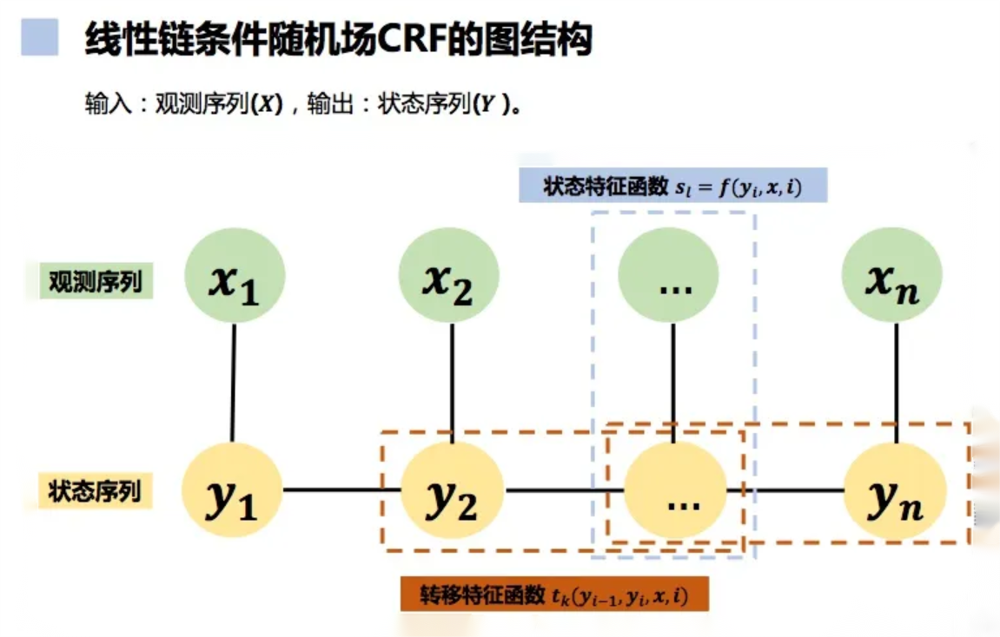

线性条件随机场公式

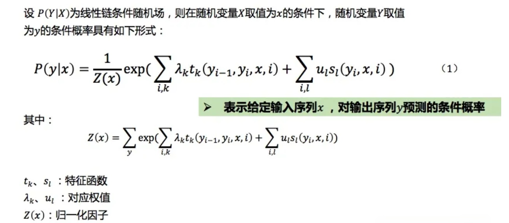

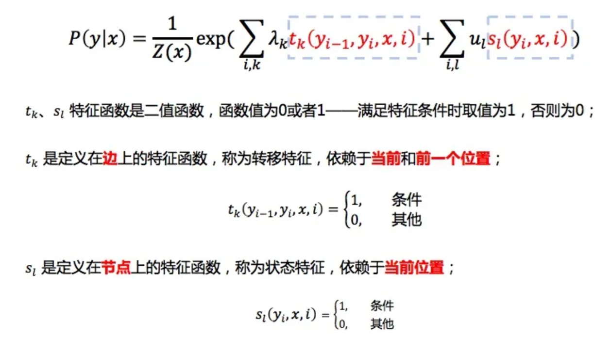

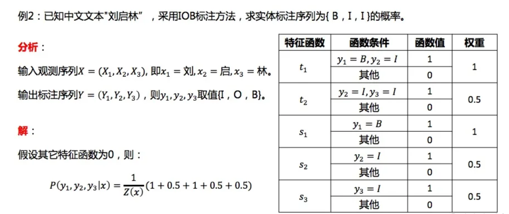

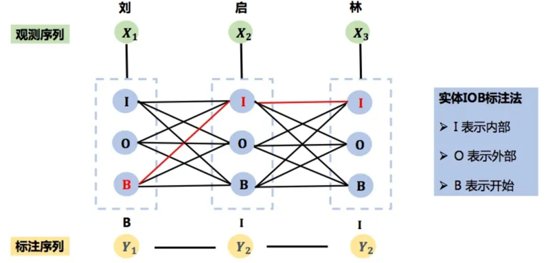

**Jieba分词库**

```python
# 当文本内容很多，不可能采用空格进行分词，可以使用jieba库。Jieba库是一个python实现的分词库，用于统计分析某一或某些给定的词语在某文件中出现的次数
# jieba库支持如下三种分词模式：
# 精确模式，试图将句子最精确地切开，适合文本分析
# 全模式，把句子中所有的可以成词的词语都扫描出来, 速度非常快，但是不能解决歧义；
# 搜索引擎模式，在精确模式的基础上，对长词再次切分，提高召回率，适合用于搜索引擎分词。
```

```python
# 全模式
import jieba
seg_list=jieba.cut("我来到北京清华大学",cut_all=True)
print("Full mode:"+"/".join(seg_list))
#【程序运行结果如下所示】
Full mode:我/来到/北京/清华/清华大学/华大/大学
```

```python
# 精确模式
import jieba
seg_list=jieba.cut("我来到北京清华大学",cut_all=False)
print("Default mode:"+"/".join(seg_list))
#【程序运行结果如下所示】
Default mode:我/来到/北京/清华大学
```

```python
# 搜索引擎模式
import jieba
seg_list=jieba.cut_for_search("我来到北京清华大学")
print("/".join(seg_list))
#【程序运行结果如下所示】
我/来到/北京/清华/华大/大学/清华大学
```

自定义词典

```python
# 方式1：词典文件
# 通过添加词典文件定义分词最小单位，文件需要有特定格式，并且为UTF-8编码。
jieba.load_userdict(file_name)
```

```python
# 自定义词典，在d:\下创建userdict.txt文件，内容遵守如下规则：一个词占一行；每一行分三部分：词语、词频（可省略）、词性（可省略），用空格隔开，顺序不可颠倒。本例的userdict.txt文件内容为：向南 3 n
import jieba
jieba.load_userdict("d:/userdict.txt")    #加载自定义词典
seg_list=jieba.cut("向南老师是Python课程讲师",cut_all=True)
print("/".join(seg_list))
#【程序运行结果】
向南/老师/是/Python/课程/讲师
```

**动态修改词频**

```python
# 调节单个词语的词频，使其能（或者不能）被分出来。 
jieba.suggest_freq(segment, tune=True)
# jieba.suggest_freq举例
import jieba
jieba.suggest_freq("向南", tune=True)
seg_list=jieba.cut("向南老师是Python课程讲师",cut_all=True)
print("/".join(seg_list))
# result
向南/老师/是/Python/课程/讲师
```

**词性标注**

```python
# 每个词语都有词性，如“向南”是名词（n），“是”是动词（v）等，jieba命令如下所示：
jieba.posseg.cut ()
# “词性标注”举例
import jieba.posseg  as pseg
words =pseg.cut("向南老师是Python课程讲师")
for word ,flag in words:
	print("%s%s"%(word,flag))
# result
向南nr
老师n
是v
Pythoneng
课程n
讲师n
```

**断词位置**

```python
# 断词位置用于返回每个分词的起始和终止位置，语法如下所示：
jieba.Tokenizer( )
# 断词位置举例
import jieba
result = jieba.tokenize('向南老师是Python课程讲师')   #返回词语在原文的起止位置
print("默认模式为：")
for tk in result:
  print("word %s\t\t start: %d \t\t end:%d" % (tk[0],tk[1],tk[2]))
# result
默认模式为：
word 向南                 start: 0                end:2
word 老师          start: 2                end:4
word 是           start: 4               end:5
word Python              start: 5                end:11
word 课程          start: 11               end:13
word 讲师          start: 13               end:15   
```

**关键词抽取**

```python
import jieba.analyse as analyse
lines ="向南老师是Python课程讲师"
keywords= analyse.extract_tags(lines, topK=20, withWeight=True, allowPOS=())
for item in keywords:
		print("%s =  %f "%(item[0],item[1]))
# 【程序运行结果】
向南 =  2.390959 
Python =  2.390959 
讲师 =  1.727597 
老师 =  1.279689 
课程 =  0.993891
```

**停用词表**

```python
# 如果只使用词频来衡量重要性，很容易过度强调在文档中经常出现而并没有包含太多与文档有关的信息的词语，如文档中的标点、空格、没有意义的字-“的，了……”等。
# 停用词表（Stop Words）将这些没有什么实际含义的功能词汇总，可在网上下载，如网址https://github.com/goto456/stopwords，命名StopWords.txt。
```

**HanLP**

```python
# 中文分词 
# 1.最短路分词；2.N-最短路分词；3.CRF分词；4.索引分词；
# 5.极速词典分词；6.用户自定义词典；7.标准分词
# 命名实体识别 
# 1.实体机构名识别；2.中国人名识别；3.音译人名识别；4.日本人名识别；5.地名识别
# 篇章理解 
# 1.关键词提取；2.自动摘要；3.短语提取
# 简繁拼音转换 
# 1.拼音转换；2.简繁转换
```

```python
pip install pyhanlp
```

------


## Python文本分类

```python
# 文本分类是指根据文本内容自动确定文本类别的过程。文本分类的研究可以追溯到上世纪六十年代，早期的文本分类主要是基于知识工程（Knowledge Engineering），通过手工定义规则对文本进行分类，这种方法费时费力，而且必须对某一领域有足够的了解，才能写出合适的规则。
# 到了上世纪九十年代，将机器学习应用到文本分类。
# 1971年，Rocchio通过用户反馈修正类权重向量，构成简单的线性分类器。
# 1979年，van Rijsbergen将准确率、召回率等相关概念引入文本分类。
# 1992年，Lewis在其论文《Representation and Learning in Information Retrieval》中系统地介绍了文本分类系统实现的各个细节，成为文本分类的经典之作。
# Yiming Yang对各种特征选择的方法，如信息增益、互信息、统计量等，进行比较研究。
# 1995年，Vipnik基于统计理论提出了支持矢量机(Support Vector Machine)方法。
# Thorsten Joachims第一次将线性核函数的支持矢量机用于文本分类，取得显著效果。
```

机器学习分类方法：

* **朴素贝叶斯模型**
* **支持向量机**

**朴素贝叶斯模型**

```python
# 朴素贝叶斯模型或朴素贝叶斯分类器(Naive Bayes Classifier ，简称NBC)发源于古典数学理论，是基于贝叶斯理论与特征条件独立假设的分类方法 ，通过单独考量每一特征被分类的条件概率，做出分类预测。
```

**条件概率**

条件概率 (conditional probability) 又称后验概率，P(A|B)是指事情A在另一个事件B已经发生条件下的发生概率，读作“在B条件下A的概率”，条件概率公式如下所示：
$$
P(A|B) = \quad {P(A∩B)\over P(B)}
$$
**朴素贝叶斯分类**

```python
# sklearn.naive_bayes模块具有3种贝叶斯分类方法，分别是:GaussianNB,MultinomialNB和BernoulliNB。
# GaussianNB是高斯分布的朴素贝叶斯。适合样本特征是正态分布的数值情况。
# MultinomialNB是多项式分布的朴素贝叶斯。适合非负离散数值特征的分类情况。
# BernoulliNB是伯努利分布的朴素贝叶斯。适合二元离散值或者很稀疏的多元离散值情况。
```

**GaussianNB**

```python
# Sklearn 提供GaussianNB用于高斯分布，具体语法如下所示：
GaussianNB(priors=True)
# 参数含义如下所示：
# m = ⌊(low + high) / 2⌋
# priors:先验概率大小。
```

```python
import numpy as np  
from sklearn.datasets import make_blobs
from sklearn.naive_bayes import GaussianNB  
import matplotlib.pyplot as plt
from sklearn.model_selection import train_test_split

X, y = make_blobs(n_samples=500, centers=5,random_state=8)
X_train,X_test,y_train,y_test=train_test_split(X,y,random_state=8)

gnb = GaussianNB()
gnb.fit(X_train, y_train)

print('模型得分：{:.3f}'.format(gnb.score(X_test, y_test)))
```

**MultinomialNB**

```python
# 多项式朴素贝叶斯假设特征由一个简单多项式分布生成，非常适用于描述出现次数或者出现次数比例的特征，例如文本分类，其特征都是指待分类文本的单词出现次数或者频次。
# Sklearn 提供MultinomialNB用于多项式分布，具体语法如下所示：
MultinomialNB(alpha=1.0, fit_prior=True, class_prior=None)
# alpha:先验平滑因子，默认等于1，当等于1时表示拉普拉斯平滑。 
# fit_prior:是否去学习类的先验概率，默认是True 
# class_prior:各个类别的先验概率，如果没有指定，模型根据数据自动学习， 每个类别的先验概率相同，等于类标记总个数N分之一。
```

**BernoulliNB**

```python
# Sklearn 提供BernoulliNB用于伯努利（贝努利）分布，伯努利分布又名“两点分布”、“二项分布”或“0-1分布”，适用于数据集中每个特征只有0和1两个数值，具体语法如下所示：
BernoulliNB(alpha=1.0, binarize=0.0, fit_prior=True, class_prior=None)
```

**sklearn朴素贝叶斯垃圾邮件分类**

```python
# 语料垃圾邮件数据spam.csv百度链接：
https://pan.baidu.com/s/1ncgjQe_FQMiRgL5aSu00Uw
# 提取码：k9po
```

```python
# 步骤1. 读取数据
# 步骤2. 语料数据划分训练集和测试集 
# 步骤3. 进行无量纲化，使用CountVectorizer将句子转化为向量
# 步骤4. 采用朴素贝叶斯算法训练预测
# 步骤5. 模型评估
```

**支持向量机**

```python
# 支持向量机（Support Vector Machine,缩写 SVM）的基本思想是在N维数据找到N-1维的超平面（hyperplane）作为分类的决策边界。确定超平面的规则是找到离超平面最近的那些点，使它们离分隔超平面的距离尽可能远。离超平面最近的实心圆和空心圆称为支持向量（support vector），其超平面的距离之和称为“间隔距离”，“间隔距离”越大，分类的准确率越高
```

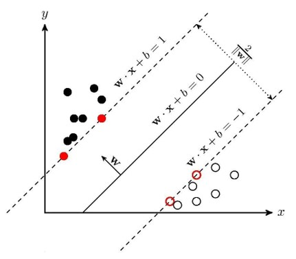

**核函数**

```python
# 核函数用于将非线性问题转化为线性问题。通过特征变换增加新的特征，使得低维度空间中的线性不可分问题变为高维度空间中的线性可分问题，从而进行升维变换。
# 支持向量机用于分类（Support Vector Classification，缩写SVC）的具体语法如下所示：
SVC(kernel)
# kernel取值有RBF（Radial Basis Function）,  Linear,  Poly等核函数，默认取值是"RBF"，即径向基核（高斯核函数），Linear是线性核函数，Poly是多项式核函数。
```

**线性核函数**

```python
# 线性核函数（Linear Kernel）是指不通过核函数进行维度提升，仅在原始维度空间中寻求线性分类边界。线性核函数的kernel参数取值为linear，如下所示：
SVC(kernel = 'linear', C)
```

**多项式核函数**

```python
# 多项式核函数（Polynomial Kernel）是指通过多项式函数增加原始样本特征的高次方幂。通过把样本原始特征进行乘方把数据投射到高维空间。
# 多项式核函数的kernel参数取值为ploy，如下所示：
SVC(kernel = 'ploy'，degree=3)
# degree: 表示选择的多项式的最高次数，默认为三次多项式。
```

**高斯核函数**

```python
# 高斯核函数（Gaussian kernel）也叫做径向基函数，是通过高斯分布函数衡量样本和样本之间的“相似度”，进而线性可分。高斯式核函数的kernel参数取值为rbf，如下所示：
model = svm.SVC(kernel='rbf', C)
```

**支持向量机对鸢尾花分类**

鸢尾花（Iris）数据集由Fisher 在1936收集整理，是一类多重变量分析的数据集。数据集包含150个数据样本，分为3类，分别是山鸢尾、变色鸢尾和维吉尼亚鸢尾

鸢尾花（Iris）数据集每类50个数据，每个数据包含花萼长度（sepal length）、花萼宽度（sepal width）、花瓣长度（petal length）、花瓣宽度（petal width）4个属性。通过鸢尾花的4个属性去预测鸢尾花卉属于属于三个种类中的哪一类，常用在分类操作。

鸢尾花使用如下命令加载数据集：

```python
from sklearn.datasets import load_iris
```

------


## Python文本聚类

**监督学习——分类和回归**

```python
# 监督学习是通过现有训练数据集进行建模，再用模型对新的数据样本进行分类或者回归分析的机器学习方法。这种学习方法类似学生通过研究问题和参考答案来学习，在掌握问题和答案之间的对应关系后，学生可以解决相似新问题。
# 监督学习是指“喂”给算法的数据提前带有正确答案。正确答案在机器学习领域被称为标签（label），需要进行标注。监督学习的“输出”不同，当算法输出的是连续值，就是回归问题（Regression）。若输出是离散值，则是分类问题（classification）。
```

**无监督学习——聚类算法**

```python
# 无监督学习又称为非监督学习，着重于发现数据本身的分布特点，是在没有训练数据集的情况下，对没有标签的数据进行分析并建立合适的模型，以便给出问题解决方案的方法。
# 与监督学习不同，无监督学习不需要对数据进行标记，没有目标，因此无法从事预测任务，而适合对数据进行分析。
```

**文本算法**

```python
# 文本聚类（Text  clustering）是将文档由原有的自然语言文字信息转化成数学信息，以高维空间点的形式展现出来，通过计算哪些点距离比较近，从而将那些点聚成一个簇，簇的中心叫做簇心。一个好的聚类要保证簇内点的距离尽量的近，但簇与簇之间的点要尽量的远。
```

**k均值聚类算法**

```python
# k均值聚类算法(k-means clustering algorithm)是通过样本之间的距离，把相似度高的样本聚成一簇（簇相似元素的集合），最后形成多个簇，将样本划分到不同的类别。
```

**以 K、M、N 为簇心聚为三类**

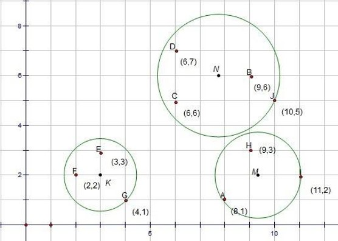

**聚类算法**

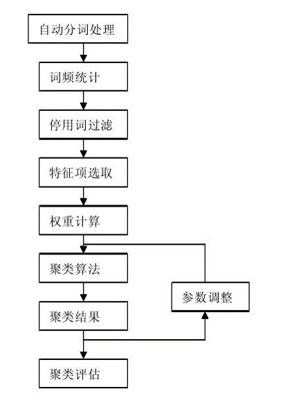

**文本聚类的过程**

```python
# 步骤1：语料清洗
# 步骤2：特征工程
# 步骤3：分词处理
# 步骤4：选择聚类算法
# 步骤5：聚类评估
```

**k-means算法步骤**

```python
# k均值聚类算法是一种迭代求解算法，其步骤如下所示：
# 步骤1：确定K值，意味着最终聚类的类别数。
# 步骤2：随机选定K个值为质心，计算每一个样本	到K个质心的距离，将样本点归到最相似的	类中，分成K个簇。簇中所有数据的均值称	为 “质心”。
# 步骤3：反复计算K个簇的质心，直到质心不再改	变，确定每个样本所属的类别以及每个类的	质心
```

**k-means算法示意图**

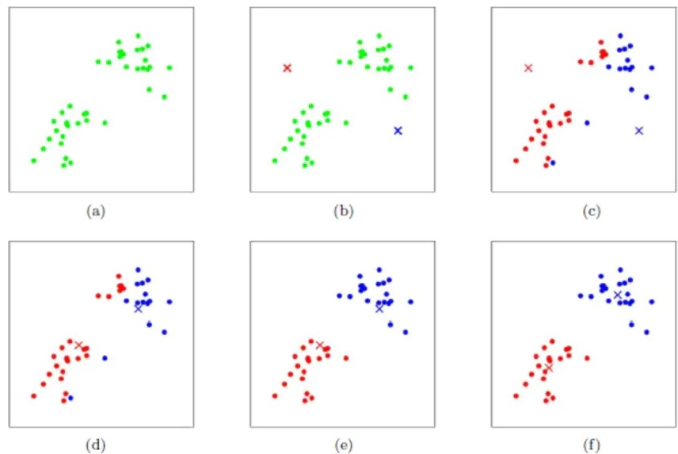

**主成分分析**

```python
# 在多变量的问题中，变量之间往往存在信息重叠。
# 通过正交变换将一组可能存在相关性的变量转换为一组线性不相关的变量，转换后的变量称为主成分。
# 多个特征中保留主成分特征，删除次要特征，保存信息不会太大损失。
```

```python
# Sklearn 提供decomposition.PCA用于主成分分析，具体语法如下所示：
PCA(n_components=n)
# 取值为小数，表示保留百分之多少的信息。
# 取值为整数，则表示减少到多少特征。
```

```python
import numpy as np  
from sklearn.decomposition import PCA  
  
# 创建一个10维的数据集  
X = np.random.rand(100, 10)  
  
# 使用PCA进行降维  
pca = PCA(n_components=2)  # 降维到2维  
X_pca = pca.fit_transform(X)  # 对数据进行降维
```

**Sklearn评估指标**

* 轮廓系数

* ARI

**ARI**

```python
# 当数据带有所属的类别信息，采用Adjusted Rand Index (ARI) 指标来评价Kmeans的性能，与分类问题中计算准确性的方法类似。
# sklearn提供了adjusted_rand_score函数计算ARI。
adjusted_rand_score (y_test,y_pred)
# 参数解释如下：
# y_true： 真实值
# y_pred： 预测值
```

```python
# 调整兰德指数ARI是一种用来评价聚类结果的指标，它是对兰德指数RI的改进，可以消除随机划分的影响。ARI的取值范围是[-1, 1]，值越大表示聚类结果和真实情况越吻合。ARI的计算公式是：
# ARI=(RI−E(RI)​)/（max(RI)−E(RI)）
# 其中，RI是兰德指数，E(RI)是兰德指数的期望值，max(RI)是兰德指数的最大值。RI的计算公式是：
# RI=(a+d​)/(a+b+c+d)
# 其中，a是在真实标签和聚类结果中都被分配在相同类簇的样本对数，b是在真实标签中被分配在相同类簇，但在聚类结果中被分配在不同类簇的样本对数，c是在真实标签中被分配在不同类簇，但在聚类结果中被分配在相同类簇的样本对数，d是在真实标签和聚类结果中都被分配在不同类簇的样本对数。
```

**轮廓系数**

```python
# 当数据没有所属类别，使用轮廓系数(Silhouette Coefficient)来度量聚类的效果。轮廓系数兼顾了聚类的凝聚度(Cohesion )和分离度(Separation)，取值范围在[-1,1]内，数值越大，聚类效果越好。
# 对于任意点 i的轮廓系数，数学表达公式如下：
S(i) = (b(i) - a(i)) / max{a(i), b(i)}
```

**kmeans算法进行英文文本聚类**

```python
# 第一步：使用pandas 的Dataframe进行数据格式化。
# 第二步：使用nltk的语料库对英文文本进行分词和去除停用词，并使用' '.join完成连接。
# 第三步：使用np.vectorizer向量化函数。
# 第四步：使用Tfidfvectorizer构造词袋模型。
# 第五步：使用cosine_similarity构造相关性矩阵。
# 第六步：使用kmeans算法进行聚类操作。
```

**kmeans算法进行中文文本聚类**

```python
# 步骤1：语料加载，采用“搜狗新闻语料库”，在附录中给出。“搜狗新闻语料库”语料库具有15个类别，数据都具有标签，适合分类算法。本例共有24000 篇，保存在sohu_train.txt数据集，最后聚成三类。
# 步骤2：分词、去停用词，再转换格式
# 步骤3：采用TF-IDF抽取词向量特征
# 步骤4：降维
# 步骤5：进行K-means 聚类
```

------


## Python情感分析

**信息抽取**

```python
# 信息抽取（Information Extraction，简称IE）是指从自然语言文本中，抽取出特定的事件或事实信息，将海量内容自动分类、提取和重构。这些信息通常包括实体（entity）、关系（relation）、事件（event）。
```

**信息**

```python
# 信息泛指人类社会传播的一切内容，指音讯、消息、通信系统传输和处理的对象。信息可以通过“信息熵”被量化。
```

**信息熵**

```py
# 信息熵是系统中信息含量的量化指标，越不确定的事物，其信息熵越大。信息熵公式如下所示：
```

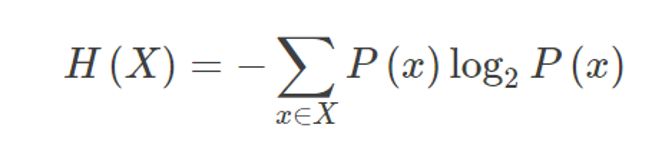

信息熵的三条性质：

```python
# 单调性：发生概率越高事件，信息熵越低。例如，“太阳从东方升起”是确定事件，没有消除任何不确定性，所以不携带任何信息量。
# 非负性：信息熵不能为负。
# 累加性：多个事件发生总的信息熵等于各个事件的信息熵之和。
```

**互信息**

互信息是指两个离散型随机变量X和Y相关程度的度量

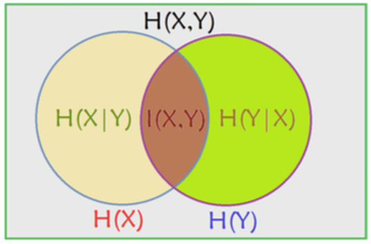

**正则表达式**

```python
# 正则表达式，又称规则表达式、常规表示法，（英语：Regular Expression，在代码中常简写为regex、regexp或RE）。
# 正则表达式是指通过事先定义好的特定字符（“元字符”）组成的“规则字符串”，对字符串进行过滤逻辑。凡是符合规则的字符串，认为“匹配”，否则，不“匹配”。通常被用来检索、替换那些符合某个模式(规则)的文本。
```

```python
# 假设要查找所有以 "@example.com" 结尾的电子邮件地址，可以使用以下正则表达式：
\b[A-Za-z0-9._%+-]mailto:+@example.com\b
#  \b 表示单词边界，确保我们匹配的是完整的电子邮件地址而不是包含电子邮件地址的更长字符串的一部分。
#  [A-Za-z0-9._%+-]+ 匹配一个或多个字母、数字、点、下划线、百分号、加号或减号，这是电子邮件地址的本地部分。
#  @example.com 匹配 "@example.com"，其中 . 表示匹配实际的点字符，而不是正则表达式中的特殊字符。
```

```python
import re
text = "Here are some email addresses: john@example.com, jane@example.org, alice@example.com, bob@gmail.com"

pattern = r'\b[A-Za-z0-9._%+-]mailto:+@example.com\b'

matches = re.findall(pattern, text)
print(matches)

# 输出将是：
['mailto:john@example.com', 'mailto:alice@example.com']
```

**命名实体**

```python
# 命名实体(named entity，缩写NE)就是人名、机构名、地名以及其他所有以名称为标识的实体，命名实体类别一般根据问题而定，常见有机构名、人名、地名等，也可以有时间、日期、数量短语等。命名实体的任务一般包括如下三个子任务：
# 1、实体名（Entity Name），包括人名、地名、机构名
# 2、时间表达式（Temporal Expressions），包括日期、时间和持续时间
# 3、数字表达式（Number Expressions）,包括钱、度量衡、百分比以及基数
```

**文本情感分析**

```python
# 文本情感分析是指用自然语言处理、文本挖掘以及计算机语言学等方法来识别和提取原素材中的主观信息。目的是为了找出文本中作者对某个实体（包括产品、服务、人、组织机构、事件、话题）的评判态度（支持或反对、喜欢或厌恶等）或情感状态（高兴、愤怒、悲伤、恐惧等）。
```

**文本情感分析的层次**

```python
# 文本情感倾向分析可以分成四个层次:
# 词语情感倾向性分析;
# 句子情感倾向性分析;
# 文档情感倾向性分析;
# 海量信息的整体倾向性预测.
```

**词语情感倾向分析**

```python
# 包括对词语极性、强度和上下文模式的分析。词语情感倾向分析目前主要有三种方法：
# (1)由已有的词典或词语知识库生成情感倾向词典。
# 该方法通过给定一组已知极性的词语集合作为种子，对于一个情感倾向未知的新词，在词典中找到与该词语义相近、并且在种子集合中出现的若干个词，根据这几个种子词的极性，对未知词的情感倾向进行推断。
# (2)无监督机器学习的方法。该方法假设已经有一些已知极性的词语作为种子词，对于一个新词，根据词语在语料库中的同现情况判断其联系紧密程度。
# 假设以“真”、“善”、“美”作为褒义种子词，“假”、“恶”、“丑”作为贬义种子词。则任意其它词语的语义倾向定义为各褒义种子词PMI（点态互信息量）之和，减去各贬义种子词PMI之和。语义倾向的正负号就可以表示词语的极性，而绝对值就代表了强度。词语A和B的PMI定义为它们在语料库中的共现概率与A、B概率之积的比值，这个值越高，就意味着A和B的相关性越大。
# (3)基于人工标注语料库的学习方法。首先对情感倾向分析语料库进行手工标注，标注的级别有文档级的情感倾向性、短语级的情感倾向性和分句级的情感倾向性。在这些语料的基础上，在大规模语料中利用词语的共现关系、搭配关系或者语义关系，判断其它词语的情感倾向性。
```

**句子情感倾向性分析**

```python
# 词语情感倾向分析的处理对象是单独的词语，而句子情感倾向性分析的处理对象则是在特定上下文中出现的语句。其任务就是对句子中的各种主观性信息进行分析和提取，包括对句子情感倾向的判断，以及从中提取出与情感倾向性论述相关联的各个要素，包括情感倾向性论述的持有者、评价对象、倾向极性、强度，甚至是论述本身的重要性等。
```

**文档情感倾向性分析**

```python
# 文档级情感分析旨在从整体上判断某个文本的情感倾向性。代表性的工作是Turney和Pang对电影评论的分类。
# Turney的方法是将文档中词的倾向性进行平均，来判断文档的倾向性。这种方法基于情感倾向性词典，不需要人工标注文本情感倾向性的训练语料。
# Pang的任务是对电影评论的数据按照倾向性分成两类，他利用人工标注了文本倾向性的训练语料，基于一元分词（把句子分成一个一个的汉字）和二元分词（把句子从头到尾每两个字组成一个词语）等特征训练分类器，通过训练的分类器实现对电影评论的倾向性分类。
```

**海量信息的整体倾向性预测**

```python
# 海量信息的整体倾向性预测的主要任务是对从不同信息源抽取出的、针对某个话题的情感倾向性信息进行集成和分析，进而挖掘出态度的倾向性和走势。
```

**中文文本情感分析例子**

```python
# 下面通过“这手机的画面极好，操作也比较流畅。不过拍照真的太烂了！系统也不好。”来阐述中文文本情感倾向分析。
# 分析句子中的情感词
# 要分析一句话是积极的还是消极的，最简单最基础的方法就是找出句子里面的情感词。出现一个积极的情感词，情感分值就加1，出现一个消极的情感词，情感分值就减1。
# 句子中就有“好”，“流畅”两个积极情感词，“烂”一个消极情感词，其中“好”出现了两次，句子的情感分值就是1+1-1+1=2。
# 分析句子中的程度词
# “好”，“流畅”和“烂”前面都有一个程度修饰词。“极好”就比“较好”或者“好”的情感更强，“太烂”也比“有点烂”情感强得多。所以需要在找到情感词后往前找一下有没有程度修饰词，并给不同的程度修饰词一个权值。比如有“极”，“无比”，“太”程度词，就把情感分值乘4；有“较”，“还算”程度词，就把情感分值乘2，有“只算”、“仅仅”这些程度词，就乘0.5了。
# 考虑到程度词，句子的情感分值就是：1*4+1*2-1*4+1=3。
# 分析句子中的感叹号
# 可以发现太烂了后面有感叹号，叹号意味着情感强烈。因此发现叹号可以为情感值加2（正面的）或减2（负面的）。
# 考虑到感叹号， 句子的情感分值就变成了：4*1+1*2-1*4-2+1=-1
# 分析句子中的否定词
# 最后面那个“好”并不是表示“好”，因为前面还有一个“不”字。所以在找到情感词的时候，需要往前找否定词。比如“不”，“不能”、“非”“否”这些词。而且还要数这些否定词出现的次数，如果是单数，情感分值就乘(1)，但如果是偶数，那情感就没有反转，保持原来的情感分值。在这句话里面，可以看出“好”前面只有一个“不”，所以“好”的情感值应该反转，乘(1)。
# 这时候，这句话的准确情感分值变为4*1+1*21*42+1*(1)= 1
# 积极和消极分开来分析
# 这句话里面有褒有贬，不能仅用一个分值来表示它的情感倾向。此外，权值的设置方式也会影响最终的情感分值。因此，对这句话恰当的处理是给出一个积极分值、一个消极分值，这样消极分值也是正数，无需使用负数了。它们同时代表了这句话的情感倾向，这时候句子的情感分值就表示为：积极分值为6，消极分值为7。
# 以分句的情感为基础进行情感分析
# 再细分一下，一条评论的情感分值是由不同的分句决定的，因此要得到一条评论的情感分值，就需要先计算出评论中每个句子的情感分值。前面列举的评论有四个分句，以分句的情感为基础进行情感分析，评论的情感分值结构变为[[4, 0], [2, 0], [0, 6], [0, 1]]，列表中的每个子列表中的两个值一个表示分句的积极分值一个表示分句的消极分值。
```

**基于情感词典方法**

基于情感词典的方法，先对文本进行分词和停用词处理等预处理，再利用先构建好的情感词典，对文本进行字符串匹配，从而挖掘正面和负面信息。


**基于LDA的方法**

```python
# LDA（Latent Dirichlet Allocation，翻译为潜在狄立克雷分配模型或隐狄利克雷分配模型）
# 是概率生成性模型的一个典型代表，也将其称为LDA主题模型，在文本挖掘领域，如文本主题识别、文本分类以及文本相似度计算方面广泛应用。
```

LDA

```python
# 生成模型是指一篇文章的每个词可通过“以一定概率选择某个主题，并从这个主题中以一定概率选择某个词语”的过程。
# “主题”就是一个文本所蕴含的中心思想，一个文本可以有一个主体，也可以有多个主题。
# 主题由关键词来体现，可以将主题看作是一种关键词集合，同一个词在不同的主题背景下，出现的概率不同。
# 如一篇文章出现“林丹”的名字，这篇文章有很大概率属于体育的主题，但也有小概率属于娱乐的主题。 
# LDA把文章看作是由词汇组合而成，通过不同的词汇概率分布来反映不同的主题。 假设现在有两篇文章《体育快讯》和《经济周报》，有三个主题“体育”，“娱乐”，“ 经济”。
# LDA认为《体育快讯》的词汇分布概率为{体育:0.7, 经济:0.2，娱乐:0.1}，而《经济周报》的词汇分布概率为{体育:0.2, 经济:0.7，娱乐:0.1 }。
# 一篇文章的主题通过不同的词汇组合概率得出。
```

**常用库文件**

* Textblob
* Snownlp
* Gensim

**Textblob**

```python
# TextBlob是一个用Python编写的开源的文本处理库，可以执行很多自然语言处理的任务。比如，词性标注、名词性成分提取、情感分析、文本翻译等。
```

```python
# 安装TextBlob
pip install -U textblob
# 语料库配置
# textblob语料库配置命令：
python -m textblob.download_corpora
```

**分句和分词**

sentences ()和words()方法

```python
from textblob import TextBlob
testimonial = TextBlob("Now I will introduce myself briefly. My name is  Yuanzhe Zhou. I was born in xi'an city， Shaannxi province. I am now a  computer teacher in Xi'an University of Posts and Telecommunications。")
print(testimonial.sentences)
print(testimonial.words)
```

**词性标注**

tags() 方法

```python
text = "Python is a high-level, general-purpose programming language."
from textblob import TextBlob
blob = TextBlob(text)
blob.tags
# 【程序运行结果】
[('Python', 'NNP'),
 ('is', 'VBZ'),
 ('a', 'DT'),
```

**情感分析**

```python
# 返回一个元组 Sentiment(polarity, subjectivity)。其中，polarity得分在[-1.0, 1.0]，靠近-1.0表示消极，靠近1.0表示积极；subjectivity得分在[0.0, 1.0]，靠近0.0表示客观，靠近1.0表示主观。textblob提供sentiment ()方法进行情感分析。
```

```python
text = "I feel sad today"
from textblob import TextBlob
blob = TextBlob(text)
blob.sentences[0].sentiment
# 【程序运行结果】
Sentiment(polarity=-0.5, subjectivity=1.0)
```

**单复数**

```python
# textblob提供singularize()将名词的复数变单数，pluralize()将名词的单数变复数。
```

```python
sentence = TextBlob('Use 4 spaces per indentation level.')
sentence.words[2].singularize()
sentence.words[-1].pluralize()
# 【程序运行结果】
'space'
'levels'
```

**过去式**

```python
# textblob提供lemmatize() 方法对单词进行词形还原和动词找原型等功能。  
```

```python
from textblob import Word
w = Word("octopi")
print(w.lemmatize()) # 默认只处理名词
w = Word("went")
print(w.lemmatize("v")) # 对动词原型处理
# 【程序运行结果】
octopus
go
```

**拼写校正**

```python
# textblob提供correct()方法进行拼写校正。
```

```python
from textblob import TextBlob
b = TextBlob("I havv goood speling!")
print(b.correct())
# 【程序运行结果】
I have good spelling!
```

**单词词频统计**

```python
# textblob提供word_counts ()方法进行单词词频的统计。
```

```python
from textblob import TextBlob
text = TextBlob("I am a boy,I am a student")
count=text.word_counts['am']
count1=text.word_counts['boy']
print(count)
print(count1)
# 【程序运行结果】
2
1
```

**snownlp**

```python
# SnowNLP是一个python写的类库，用于方便的处理中文文本内容，与TextBlob不同，没有采用NLTK支持，所有的算法都是自己实现，并且自带训练字典。
# 需要注意的是，SnowNLP处理文本为unicode编码。官方源码文档网址是https://github.com/isnowfy/snownlp。
```

```python
# SnowNLP常用于情感分析，安装命令
pip install snownlp
```

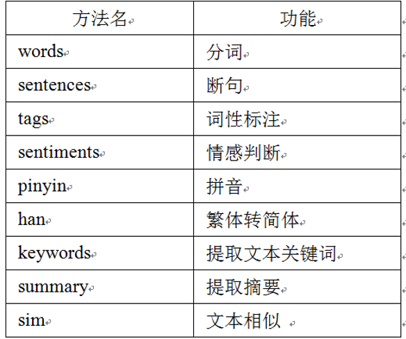

**Gensim**

```python
# Gensim（generate similarity）是一款开源的第三方Python工具包，用于抽取文档的语义主题。Gensim支持包括TF-IDF、word2vec、潜在语义分析（Latent Semantic Analysis，LSA），潜在狄利克雷分布（Latent Dirichlet Allocation，LDA）等主题模型算法，支持流式训练，并提供了诸如相似度计算，信息检索等一些常用任务的API接口。
```

------

